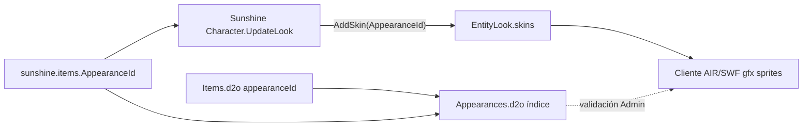

# Macro 3 / Phase 5 — Appearance Identity Audit

## Estado

| Campo | Valor |
| --- | --- |
| Fase | Macro 3 / Phase 5 |
| Tipo | Documental (read-only sobre cliente) |
| Fecha | `2026-06-03` |
| Runtime modificado | `NO` |
| Evidencia ejecutada | `ItemSpritePreviewPipeline --mode audit`, probe temporal `ReflectProbe` (no commiteado, `Infrastructure/temporal-artifacts/`) |

## Resumen ejecutivo

`AppearanceId` **no es** un identificador de PNG de inventario. En Sunshine equipa el look del personaje añadiendo un **skin** al `EntityLook`. El cliente 2.3.7 del repo valida además que el id exista como índice en `Appearances.d2o` (catálogo mínimo `Appearance` con `id` + `type`). En el pack actual, ese catálogo está **recortado** (130 entradas, ids `654–868`); ids como `458` o `1004` **no existen** y deben marcarse `APPEARANCE_UNKNOWN`.

`IconId` sigue siendo la única superficie con pipeline automático viable hoy (`bitmap*.d2p` → `by-icon/{iconId}.png`).

## Modelo de identidad visual (oficial en repo)

```txt
ItemId        → template runtime (DB + Items.d2o index)
IconId        → icono inventario (Items.d2o + bitmap/vector D2P + by-icon PNG)
AppearanceId  → skin equipable (DB + Items.d2o.appearanceId + índice Appearances.d2o)
EntityLook    → bonesId + skins[] + colors + scales + subentities (protocolo + servidor)
Breed         → look base del personaje (bones/skins por raza/sexo vía BreedManager)
Bone          → bonesId dentro de EntityLook (esqueleto animable del cliente)
Skin          → entrada en EntityLook.skins; AppearanceId de ítem se inyecta aquí al equipar
```

Regla dura (ya aplicada en Angular Admin):

```txt
ItemId != IconId != AppearanceId
```

## Casos de investigación

### `AppearanceId = 0`

| Pregunta | Respuesta |
| --- | --- |
| ¿Existe en `Appearances.d2o`? | No como índice (sentinel “sin skin equipable”) |
| ¿Dónde se almacena? | `sunshine.items.AppearanceId` / `Items.d2o` campo `appearanceId` |
| ¿Relación Bone / EntityLook? | No modifica skins al equipar; el look base sigue siendo el del breed |
| ¿Preview visual? | Solo `IconId` (inventario) |

**Evidencia:** ítem `7754` (Dofus Ocre) — DB `AppearanceId = 0`, `IconId = 23012`, preview curado por icono.

### `AppearanceId = 458`

| Pregunta | Respuesta |
| --- | --- |
| ¿Existe en `Appearances.d2o` (Client2.3.7)? | **No** (`ContainsIndex(458) == false`) |
| ¿En `Items.d2o` del pack? | No encontrado en muestra `1..20000` como id dominante |
| Hipótesis “Sombrero Jalato” | **No verificada** — ver [items-client-appearance-mapping-audit.md](../items-builder/items-client-appearance-mapping-audit.md) |
| ¿Puede mostrarse en Angular automáticamente? | No sin captura curada o pack cliente ampliado |

### `AppearanceId = 1004`

| Pregunta | Respuesta |
| --- | --- |
| ¿Existe en `Appearances.d2o`? | **No** en `Client2.3.7` |
| ¿En DB Sunshine? | Sí — ítem `12616` (ADMIN TEST) |
| Client identity | `APPEARANCE_UNKNOWN` (`AppearanceKnown = false`) |
| ¿En `Items.d2o`? | Ítem `12616` no está en cliente (`ClientKnown = false`) |
| Interpretación | Valor de prueba/admin **no alineado** con el catálogo gfx del cliente empaquetado |

### Referencia: `AppearanceId = 740` (presente en pack)

Probe D2O (read-only):

```txt
class: Appearance
fields: id=740, type=7
```

El registro D2O es **metadato**; no contiene rutas a PNG ni `EntityLook` embebido.

## Flujo `AppearanceId` → visual (cliente + servidor)



### Servidor (evidencia código)

Al reconstruir el look equipado, Sunshine hace:

```csharp
if (equippedItem.AppearanceId != 0)
    Look.AddSkin(equippedItem.AppearanceId);
```

Fuente: `Sunshine.WorldServer/Game/Actors/Characters/Character.cs` (bucle de ítems equipados).

`EntityLook` protocolo: `bonesId`, `skins`, `indexedColors`, `scales`, `subentities` — `Sunshine.Protocol/Types/game/look/EntityLook.cs`.

`Breed` aporta el look base (`EntityManager.BuildEntityLook` / `BreedManager`); el equipamiento **superpone skins**, no sustituye el bone del breed salvo efectos especiales.

### Cliente 2.3.7 (archivos)

| Archivo | Rol |
| --- | --- |
| `Client2.3.7/data/common/Items.d2o` | `appearanceId` por template |
| `Client2.3.7/data/common/Appearances.d2o` | Catálogo `Appearance` (validación índice) |
| `Client2.3.7/content/gfx/items/bitmap*.d2p` | **Iconos** (`IconId`) — no appearance equipada |
| `Client2.3.7/content/gfx/sprites/` (y packs relacionados) | Sprites animados del personaje — **no** leídos por Admin hoy |

### Admin (validación existente)

`FileSystemClientItemSourceReader`:

- Lee `Items.d2o` → `ClientAppearanceId`
- Si `DB AppearanceId > 0` → `AppearanceKnown = AppearancesD2o.ContainsIndex(appearanceId)`
- Warning `APPEARANCE_UNKNOWN` en client identity

## Flujo `Item` → `Appearance`

```txt
1. Operador define AppearanceId en sunshine.items (o hereda de referencia legacy)
2. Client identity compara DB vs Items.d2o vs Appearances.d2o
3. En juego, al equipar, servidor añade AppearanceId como skin al EntityLook del personaje
4. Cliente resuelve gfx de skin/bone desde assets empaquetados (fuera del Admin actual)
```

Los ítems con `appearanceId > 0` en `Items.d2o` del pack actual (~230 en ids `1..20000`) usan mayormente ids en la banda `654–868`. **129/227** ids distintos referenciados en `Items.d2o` tienen índice en `Appearances.d2o`; el resto son referencias huérfanas respecto al pack recortado.

## Qué **no** es `AppearanceId`

- No es `IconId` ni nombre de archivo `{iconId}.png`
- No es un `EntityLook` completo (falta bone, colores, subentidades)
- No es índice de `bitmap*.d2p`
- No es nombre de clase Tiphon en este repo (sin referencias `Tiphon` / `LookParser` en código oficial)

## Respuestas Phase 5 (checklist)

1. **¿Qué representa?** — Id de **skin equipable** + entrada opcional en catálogo `Appearance` del cliente; en runtime Sunshine se aplica como skin en `EntityLook`.
2. **¿Suficiente para generar preview?** — **No** solo con `AppearanceId`; hace falta look base (breed/sex/colores) o captura curada.
3. **¿Se necesita EntityLook?** — **Sí** para preview fiel de equipamiento; `AppearanceId` es un componente (skin).
4. **¿Angular puede renderizar algo útil?** — Sí **limitado**: PNG curado `by-appearance/{id}.png`, badges de validación, texto `AppearanceKnown`; no render animado nativo.
5. **¿Pipeline Tiphon?** — **No requerido en Admin**; Tiphon es stack cliente Flash/AIR. No hay implementación en repo; portar a Angular no es viable en Macro 3.
6. **¿Preview equipamiento viable?** — **Sí como workflow curado** (Macro 3 Phase 6); **no** como extracción automática tipo D2P iconos sin investigación gfx adicional.

## Limitaciones

- `Appearances.d2o` del workspace es pequeño (~3.6 KB, 130 índices) — no representa un cliente retail completo.
- Registros `Appearance` leídos solo exponen `id` + `type` en este pack; no hay `entityLook` embebido en D2O.
- Sin lector gfx personaje en Admin (sprites/D2P de entidades).
- Legacy Blazor resolvía `AppearanceId` por heurísticas (hash PNG, catálogo DB) — no por renderer.

## Riesgos

| Riesgo | Impacto |
| --- | --- |
| Asumir `AppearanceId` = preview inventario | UX engañosa en editor |
| Guardar ids fuera de `Appearances.d2o` | `APPEARANCE_UNKNOWN`, invisibilidad o skin roto in-game |
| Confundir skin id con índice Aparence D2O | Validación pasa pero gfx falla si el skin no está en packs sprites |
| Extracción masiva de sprites | Prohibido por reglas Macro 3 |

## Siguiente paso recomendado

**Macro 3 / Phase 6 — Preview de equipamiento (curado `by-appearance/`)** alineado con Phases 3–4 de iconos, más warnings de identidad.

Investigación de **renderer EntityLook** queda como lane separada (Macro 3 Phase 7 o macro futura), no bloqueante para cerrar Phase 5.

## Referencias

- [entitylook-relationship-map.md](./entitylook-relationship-map.md)
- [appearance-preview-feasibility-study.md](./appearance-preview-feasibility-study.md)
- [items-client-appearance-mapping-audit.md](../items-builder/items-client-appearance-mapping-audit.md)
- [sprite-preview-source-map.md](./sprite-preview-source-map.md)
