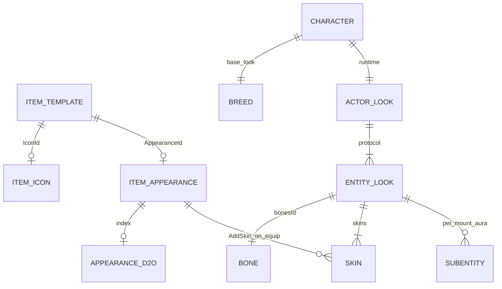

# EntityLook — Relationship Map (Appearance / Breed / Bone / Skin)

## Propósito

Mapa de relaciones verificadas en el repo oficial entre identidades de ítem y el look de actores en protocolo + WorldServer. Complementa [appearance-identity-audit-phase5.md](./appearance-identity-audit-phase5.md).

## Tipos protocolo

### `EntityLook` (`Sunshine.Protocol.Types.EntityLook`)

| Campo | Tipo | Rol visual |
| --- | --- | --- |
| `bonesId` | `short` | Esqueleto / rig (animaciones por bone) |
| `skins` | `short[]` | Capas gráficas (equipo, ceremonial, efectos) |
| `indexedColors` | `int[]` | Colores por slot (formato empaquetado ARGB) |
| `scales` | `short[]` | Escalas (monturas, efectos) |
| `subentities` | `SubEntity[]` | Looks anidados (mascota, montura, aura, etc.) |

Serialización en red: tipo id `55`.

### `SubEntity`

Vincula un `EntityLook` hijo a un punto de anclaje (`SubEntityBindingPointCategoryEnum` + índice). Usado para mascotas, conductor de montura, foreground aura.

## Cadena de transformación en servidor

```txt
Breed + sex + colors
    → BreedManager.GetLook(breedId, sex)   // string look base
    → EntityManager.GetActorLook(string)   // parse → ActorLook
    → (opcional) colores solicitados
    → EntityManager.ParseEntityLook(EntityLook)  // string persistido

Equipamiento (Character.UpdateLook)
    → para cada ítem equipado (no slot mascota):
         si AppearanceId != 0 → ActorLook.AddSkin(AppearanceId)

ActorLook.GetEntityLook()
    → EntityLook enviado al cliente (refresh look messages)
```

### Formato string look (servidor)

`EntityManager` parsea/serializa:

```txt
{bonesId}|{skins...}|{indexedColors...}|{scales...}|{subentities...}
```

Ejemplo conceptual: `{1|10,20|1;0xFF000000}` — los separadores `|` pueden colapsarse cuando faltan segmentos.

## Relación con `AppearanceId` de ítem

| Concepto | Relación |
| --- | --- |
| `ItemTemplate.AppearanceId` (DB) | Valor copiado a runtime de ítem equipado |
| `Items.d2o.appearanceId` | Metadata cliente del template |
| `Appearances.d2o` | Registro `Appearance` por **mismo id numérico** (validación Admin) |
| `EntityLook.skins` | Donde el servidor **aplica** ese id al equipar |

**Importante:** la validación `ContainsIndex(appearanceId)` en Admin comprueba el catálogo D2O, no que el skin exista en atlases gfx. El servidor asume que un id numérico válido en juego es un skin conocido del cliente.

## Relación con `Breed`

| Aspecto | Breed | AppearanceId ítem |
| --- | --- | --- |
| Define bones base | Sí | No |
| Define skins base | Sí (look inicial) | Añade skin al equipar |
| Colores | Base + overrides | No directo |
| Persistencia | `Record` personaje | Template ítem |

`EntityManager.BuildEntityLook(int breedId, bool sex, List<int> colors)` construye el look inicial antes de equipamiento.

## Relación con `Bone`

En documentación Dofus/clásico “bone” = `bonesId` de `EntityLook`. Los ítems equipables **no cambian** el bone en el flujo estándar de `Character.UpdateLook` (solo añaden skins). Efectos de combate (`ChangeSkin`, estados Pandawa, etc.) pueden manipular bone/skin puntualmente en `FightActor` / `ChangeSkin`.

## Relación con `IconId`

```txt
IconId        → UI inventario / Admin preview (2D PNG)
AppearanceId  → capa skin en EntityLook (sprite animado en mundo)
```

Sin correlación 1:1 garantizada. Dos ítems pueden compartir `IconId` y diferir en `AppearanceId`, o ambos en cero.

## Cliente 2.3.7 (fuera del código C# Admin)

```txt
Items.d2o ──appearanceId──► Appearances.d2o (metadato type)
                │
                └─► gfx/sprites + bones (runtime AIR, no en repo Admin)
```

No hay `EntityLookParser` ni `Tiphon` en el código del repo. El cliente histórico Ankama compone sprites en runtime a partir de assets empaquetados.

## Diagrama de dependencias



## Consumidores en Sunshine (muestra)

| Área | Uso de `EntityLook` |
| --- | --- |
| `GameRolePlayCharacterInformations` | Look en mapa |
| `MonsterInGroupInformations` | Look de monstruo |
| `PartyMemberInformations` | Look miembro grupo |
| `GameActionFightChangeLookMessage` | Cambio look en combate |
| NPC / Tax collector templates | String look en DB |

## Implicaciones para preview Admin

| Necesidad | Campos mínimos |
| --- | --- |
| Preview inventario | `IconId` |
| Validar equipamiento | `AppearanceId` + `Appearances.d2o` |
| Preview equipamiento fiel | `EntityLook` completo o PNG curado |
| Preview personaje | Breed, sex, colors, todos los skins equipados, subentities |

## Referencias de código

| Artefacto | Ruta |
| --- | --- |
| EntityLook | `Sunshine.Protocol/Types/game/look/EntityLook.cs` |
| ActorLook | `Sunshine.WorldServer/Game/Actors/Look/ActorLook.cs` |
| Parse / build | `Sunshine.WorldServer/Game/Actors/EntityManager.cs` |
| Equip → skin | `Sunshine.WorldServer/Game/Actors/Characters/Character.cs` |
| Client identity | `FileSystemClientItemSourceReader.cs` |

## Ver también

- [appearance-preview-feasibility-study.md](./appearance-preview-feasibility-study.md)
- [appearance-identity-audit-phase5.md](./appearance-identity-audit-phase5.md)
