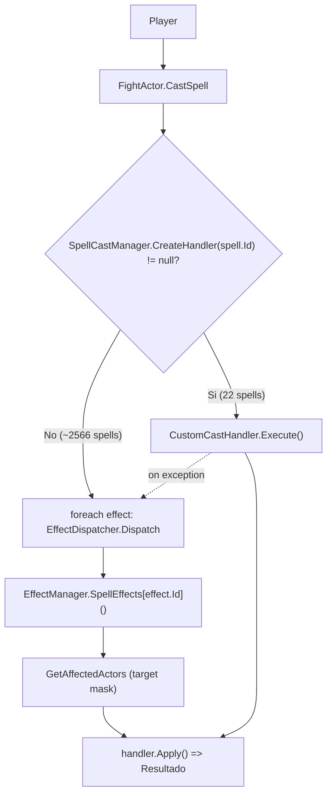

# Arquitectura de Hechizos — Auditoria de Madurez (documento para agente IA)

> Objetivo: describir la **forma real** del motor de hechizos, no sus bugs ni su historial.
> Pregunta nuclear: **¿que tan lejos estamos de que un hechizo nuevo se cree solo con datos
> (Spell + Effects + Targets + Cooldown + Range)?**
>
> Alcance: `Sunshine net11.0/Sunshine net11.0/Sunshine.WorldServer` (motor de combate de produccion).
> Metodo: conteo directo de codigo (read-only) + lectura de la ruta de ejecucion. Sin cambios de codigo.

---

## 0. TL;DR para el agente

- Motor **dual-path**: la mayoria de hechizos se resuelven por `EffectId` (generico, reutilizable);
  una minoria por `SpellId` (script propio, "escape hatch").
- **Nivel de madurez: 2.8 / 6** (mezcla SpellId + EffectId, con centralizacion alta pero sin
  motor de formula ni tests de regresion sobre el motor real).
- Routing: **~99% de las 2588 filas de hechizo** entran por `EffectId`; solo **22 registros
  `[SpellCastHandler]`** (0.85%) usan cast custom.
- El problema no es el routing: es la **metadata incompleta** (reglas inventadas en C#) y la
  **ausencia de un motor de formula** + **falta de tests sobre los handlers reales**.
- De los 22 casts custom: **8 inevitables**, **4 claramente eliminables**, **10 reducibles** con
  mejoras modestas del motor.

---

## 1. Modelo mental real del motor

Hay dos caminos de ejecucion. El punto de decision es `FightActor.CastSpell`.

### 1.1 Camino estandar (data-driven por EffectId) — el que queremos

```
Player
  -> FightActor.CastSpell(spell, cell)
  -> CanCastSpell (validacion)
  -> RollCriticalDice -> selecciona spell.Effects | spell.CriticalEffects
  -> SpellCastManager.CreateHandler(spell.Id)  => null (no hay cast custom)
  -> foreach effect:
       EffectDispatcher.Dispatch(caster, spell, effect, cell)
         -> EffectManager.SpellEffects[effect.Id]()        // factory por EffectId
         -> EffectManager.GetAffectedActors(caster, effect) // target por mascara
         -> handler.Initialize(...) -> handler.Apply()      // resultado
```

### 1.2 Camino custom (hardcoded por SpellId) — el "escape hatch"

```
Player
  -> FightActor.CastSpell(spell, cell)
  -> SpellCastManager.CreateHandler(spell.Id)  => handler concreto (22 casos)
  -> customCastHandler.Execute()   // logica propia, manipula Handlers[] / TargetType / buffs
       (si lanza excepcion -> fallback a EffectDispatcher por efecto)
```

Diagrama:



Conclusion: **el motor SI tiene la columna vertebral data-driven** (`Spell -> EffectId -> Handler
-> Target -> Result`), pero **convive con un bypass por `SpellId`** y con **fugas de `SpellId`
dentro de los handlers genericos**.

---

## 2. Clases y responsabilidades (pipeline)

| Clase | Ruta | Responsabilidad | Acoplamiento |
| --- | --- | --- | --- |
| `FightActor.CastSpell` | `Game/Actors/Fighters/FightActor.cs:743` | Orquesta el lanzamiento; decide custom vs estandar | Alto (conoce SpellId especiales: 0, Roublabot, BambooMilk, Alcohol) |
| `SpellCastManager` | `Game/Spells/Casts/SpellCastManager.cs` | Registro `Dictionary<int spellId, Type>` por reflexion; crea cast custom | Medio |
| `SpellCastHandler` | `Game/Spells/Casts/SpellCastHandler.cs` | Base de los casts custom; expone `Handlers[]`, `Execute()` | Medio |
| `EffectDispatcher` | `Game/Effects/EffectDispatcher.cs` | Resuelve un efecto: busca handler por `effect.Id`, prepara, aplica | Bajo (generico) |
| `EffectManager` | `Game/Effects/EffectManager.cs` | `Dictionary<EffectsEnum, Func<SpellEffectHandler>>`; `GetAffectedActors` (mascara de target) | Bajo |
| `SpellEffectHandler` | `Game/Effects/Spells/SpellEffectHandler.cs` | Base de los handlers de efecto; `Prepare()` + `Apply()` | Bajo |
| `EffectDamageResolver` | `Game/Effects/Spells/Damages/EffectDamageResolver.cs` | Normaliza dados (`ResolveDice`), bonus fijo, `RollAndCombine` | Bajo |
| `Damage` | `Game/Effects/Spells/Damages/Damage.cs` | Calculo real de dano (resistencias, %, etc.) — NO es un motor configurable | Medio |

Registro de handlers (ambos por reflexion al iniciar):
- Casts custom: atributo `[SpellCastHandler(spellId)]` -> `SpellCastManager.LoadHandlers()`.
- Efectos: atributo `[EffectHandler(EffectsEnum)]` -> poblado en `EffectManager.SpellEffects`.

---

## 3. Inventario verificado (conteos reales)

| Metrica | Valor | Fuente |
| --- | --- | --- |
| Filas de hechizo en BD (`spells`) | **2588** | `Parche_src_emu/sushine.sql:57450+` (`INSERT INTO spells`) |
| Entradas `Effect_*` en enum | **507** | `Sunshine.Protocol/Enums/EffectsEnum.cs` |
| Registros `[EffectHandler(...)]` (EffectId -> handler) | **~170** | `Game/Effects/Spells/**` |
| Clases handler de efecto | **~63** | `Game/Effects/Spells/**/*.cs` |
| Registros `[SpellCastHandler(...)]` (cast custom) | **22** | `Game/Spells/Casts/**` |
| Clases de buff | **12** (+`Buff.cs`) | `Game/Fights/Buffs/**` |
| Proyecto de tests | `combat-sim-lab` (motor **separado**, no el real) | `combat-sim-lab/src/CombatSim.Tests` |

Reparto de `[EffectHandler]` por familia (registros, no clases):
- Daño directo `DirectDamage` (10), `DamagePercent` (5), `HpSteal` (5), `FixedDamage` (1),
  `SacrificeDamage` (1), `PunishmentDamage` (6), `LoseHpByUsingAP` (1).
- Buffs de stats `StatsBoost` (**38**), `APBuff` (2), `MPBuff` (2), `SpellBoost` (1),
  `AddComboDamage` (1), `Sacrifice` (1), `ReduceEffectDuration` (1), `PunishmentBoost` (1).
- Debuffs de stats `SubStatsBoost` (**31**, incluye 7 robos de caracteristica), `APDebuff` (2),
  `APDebuffFix` (2), `MPDebuff` (4), `MPDebuffFix` (1), `Erosion` (1), `Debuff` (1),
  `Dispel` (1), `StealKamas` (1), `RevealsInvisible` (1), `APSteal` (2).
- Curas `Heal` (3), `SubHealPercent` (2), `RestoreHpPercent` (1).
- Invocaciones `Summon` (4), `Double` (1), `ActivateBomb` (1).
- Estados `AddState` (1), `RemoveState` (2), `Invisibility` (1), `ChangeSkin` (2).
- Escudos `Shield` (1), `ShieldPercent` (1). Armadura `DamageReduction` (2), `DamageReflect` (1).
- Movimiento `Push`/`PushBack`/`Pull`/`Carrier`/`Teleport`/`SwitchPosition`/`RepelsTo`/
  `AttractTo`/`BePulled`/`Thrower`/`Dodge` (~12).
- Marcas `TrapSpawn` (1), `GlyphSpawn` (2). Otros `Roulette`, `SpiritualLeash`, `ReducCooldown`,
  `RogueSpecialEffects` (5).

---

## 4. Respuestas a las preguntas (Q1-Q6)

### Q1 — ¿Cuantos hechizos siguen el flujo estandar (Spell -> EffectManager -> Handler -> Resultado)?

**~2566 / 2588 (~99.1%)**. Todo hechizo cuyo `spell.Id` no esta en el registro de
`SpellCastManager` cae en `EffectDispatcher.Dispatch` y se resuelve por `effect.Id`.
Matiz: "seguir el flujo estandar" no implica estar 100% parametrizado: algunos handlers
genericos contienen ramas `spell.Id` (ver Q4) que rompen la genericidad sin salir del flujo.

### Q2 — ¿Cuantos hechizos se salen (Spell -> Custom Cast -> Logica propia)?

**22 registros `[SpellCastHandler]`** (0.85% de las filas). Distintos por clase logica: ~18
(hay alias de ID: 3 para Lait de Bambou, 2 para Botte). Listado:

| SpellId | Clase | Clase Dofus |
| --- | --- | --- |
| 2006 (SacrificeDoll) | `SacrificeHandler` | Sadida |
| 2843 | `PlastronHandler` | Zobal |
| 2820 | `RoublabotDetonationHandler` | Roublard |
| 2809 | `RemissionHandler` | Roublard |
| 2811 | `ReboursHandler` | Roublard |
| 2805 | `PoudreHandler` | Roublard |
| 2815 | `KaboomHandler` | Roublard |
| 2803 | `EntourloupeHandler` | Roublard |
| 2810 | `DernierSouffleHandler` | Roublard |
| 2795 / 3177 | `BotteHandler` / `BotteAmelioreeHandler` | Roublard |
| 699 / 705 / BambooMilk | `LaitDeBambouHandler` (+2 alias) | Pandawa |
| Karcham | `KarchamHandler` | Pandawa |
| Chamrak | `ChamrakHandler` | Pandawa |
| 1999 | `CraqueHandler` | Osamodas |
| 143 | `ColereHandler` | Iop |
| 16 | `FractionHandler` | Feca |
| 42 | `ChanceHandler` | Enutrof |
| 101 | `RouletteHandler` | Ecaflip |
| 171 | `PunitiveHandler` | Cra |

### Q3 — ¿Que porcentaje de cada sistema esta centralizado?

Centralizado = existe un punto de entrada unico (handler/clase canonica) por `EffectId`.
Penaliza: ramas `spell.Id` internas, logica equivalente repartida en casts custom.

| Sistema | Centralizacion | Clase canonica | Fugas / desvios |
| --- | --- | --- | --- |
| Daño | **90%** | `DirectDamage` + `EffectDamageResolver` + `Damage` | `DirectDamage.cs:41 if (Spell.Id == 159)` (Colere) |
| Curas | **85%** | `Heal` | `Heal.cs:29 switch(spell.Id)` (192 enemigo), filtro de equipo |
| Buffs | **95%** | `StatsBoost` -> `StatsBuff` | minima |
| Debuffs | **95%** | `SubStatsBoost` -> `StatsBuff` | minima |
| Invocaciones | **80%** | `Summon` | `Summon.cs` Roublabot; muerte de invo (233) en `Kill`; metadata de limite |
| Estados | **90%** | `AddState` / `RemoveState` | estados de alcohol Pandawa resueltos por listas en C# |
| Trampas | **85%** | `TrapSpawn` + `Trigger/Trap` (reusa `EffectDispatcher`) | menor |
| Glifos | **80%** | `GlyphSpawn` + `Trigger/Glyph` | `Glyph.cs:46` lista `SPELLS_GLYPH_END_TURN` por spell.Id |

Promedio aproximado de centralizacion: **~87%**.

### Q4 — ¿Que depende de `SpellId`? (donde el motor deja de ser generico)

Fugas dentro de handlers genericos (rompen genericidad sin salir del flujo estandar):

| Ubicacion | Patron | Naturaleza |
| --- | --- | --- |
| `Effects/Spells/Damages/DirectDamage.cs:41` | `if (Spell.Id == 159)` | Comportamiento hardcoded (carga Colere) |
| `Effects/Spells/Heals/Heal.cs:29` | `switch (spell.Id)` (case 192) | Excepcion hardcoded (cura a enemigo) |
| `Effects/Spells/Others/Kill.cs` | `spellId == 233` | Comportamiento hardcoded (suicidio Sacrificada) |
| `Effects/Spells/Summon/Summon.cs:114,129` | `Spell.Id == RoublabotSpellId` | Comportamiento hardcoded |
| `Effects/Spells/Armor/DamageReduction.cs:18` | `GetAssociatedCaracteristics(Spell.Id)` | Mapeo por spell.Id |
| `Fights/Triggers/Glyph.cs:46` | `SPELLS_GLYPH_END_TURN.Contains(CastedSpell.Id)` | Lista hardcoded |

Fugas a nivel de orquestacion (`FightActor.CastSpell`):

| Ubicacion | Patron | Naturaleza |
| --- | --- | --- |
| `FightActor.cs:745,893` | `spell.Id == 0` | Arma / combate cuerpo a cuerpo (dato legitimo) |
| `FightActor.cs:761` | `spell.Id == SlaveFighter.RoublabotSpellId` | Mensaje/estado especifico |
| `FightActor.cs:1401` | `IsBambooMilkSpell` -> `BambooMilkSpellIds` | Lista de IDs |
| `FightActor.cs:1434` | `IsPandawaAlcoholActivationSpell` -> `PandawaAlcoholSpellIds` + ids de apariencia | Listas de IDs |

Usos **legitimos** de `spell.Id` (NO son deuda; es dato como clave): cooldown
(`SpellHistoryEnry.cs`), dispel por id de hechizo (`DebuffEffects.cs`, `FightActor.cs:1576`),
boost de hechizo (`SpellBuff.cs`), mensajes de log/cliente.

### Q5 — ¿Que depende de `EffectId`? (lo que queremos: reutilizable)

**~170 registros `[EffectHandler]` sobre ~63 clases**, cubriendo el grueso de las 507 entradas
`Effect_*`. Un mismo `EffectId` lo reutilizan cientos de hechizos. Ejemplos de alta reutilizacion:
`StatsBoost` (38 efectos), `SubStatsBoost` (31), `DirectDamage` (10 escuelas/variantes),
`DamagePercent` (5), `Summon` (4). Esta es la parte madura del motor: agregar un hechizo de
daño/buff/debuff/cura "normal" NO requiere tocar codigo.

### Q6 — Custom Cast Classification (resultado principal: Necesario vs Eliminable)

Criterio: ¿el cast custom existe porque el motor **no soporta** el efecto (necesario) o por
**comodidad/atajo** (eliminable)?

| Spell | Clase | Motivo | Necesario | Eliminable | Se reduciria a |
| --- | --- | --- | --- | --- | --- |
| 2843 | `PlastronHandler` | Solo cambia `TargetType = SELF\|ALLY_ALL` | No | **Si** | mascara de target en BD |
| 2815 | `KaboomHandler` | Solo cambia `TargetType = SELF\|ALLY_ALL` | No | **Si** | mascara de target en BD |
| 1999 | `CraqueHandler` | Aplica 2 efectos al target (lo que ya hace el dispatcher) | No | **Si** | nada: redundante |
| 143 | `ColereHandler` | Fallback a si mismo si no hay target | Parcial | **Si** | regla de self-target + duracion |
| 16 | `FractionHandler` | Target ALLY_ALL\|SELF + requiere aliado adyacente | Parcial | Quizas | mascara + condicion de adyacencia |
| 171 | `PunitiveHandler` | Duplica valor del buff si ya activo | Parcial | Quizas | regla de stack/refresh |
| 42 | `ChanceHandler` | Buff que dispara otro buff al terminar | Parcial | Quizas | efecto generico "trigger buff" |
| 2006 | `SacrificeHandler` | Quita 1 efecto + auto-inflige vida total (suicidio) | Parcial | Quizas | `Effect_Kill` sobre self |
| 2803 | `EntourloupeHandler` | Solo afecta bomba aliada | Parcial | Quizas | mascara "solo bombas" |
| 2795/3177 | `BotteHandler` | Push sin dano + interaccion con bombas | Parcial | Quizas | flags de push + target bomba |
| 699/705/BambooMilk | `LaitDeBambouHandler` | Reemplaza efectos de BD por "reset sobrio" central | Si (workaround) | Quizas | metadata de estado fiable |
| Karcham | `KarchamHandler` | Cargar aliado/enemigo (reglas de elegibilidad) | **Si** | No | mecanica de carga |
| Chamrak | `ChamrakHandler` | Lanzar al cargado | **Si** | No | mecanica de carga |
| 101 | `RouletteHandler` | Elige aleatoriamente 1 de N efectos | **Si** | No | meta-efecto "elegir uno" |
| 2805 | `PoudreHandler` | Estado Unmovable a bombas aliadas | **Si** | No | mecanica de bombas |
| 2811 | `ReboursHandler` | Combo + explosion diferida + check muros | **Si** | No | mecanica de bombas |
| 2809 | `RemissionHandler` | Trigger BEFORE_ATTACKED (contraataque) / teleport bomba | **Si** | No | efecto trigger + bombas |
| 2810 | `DernierSouffleHandler` | Distribucion de combo por aliado/bomba | **Si** | No | mecanica de bombas |
| 2820 | `RoublabotDetonationHandler` | Detonacion de invocacion Roublabot | **Si** | No | mecanica de invocacion |

**Tally (por registro, 22):** Eliminable=Si **4** · Quizas **10** · No (necesario) **8**.
Lectura: "tenemos 22 casts" se convierte en "**8 inevitables, 4 borrables hoy, 10 reducibles**
con features modestas del motor (mascaras de target, meta-efecto trigger, meta-efecto random,
self-target)".

---

## 5. Dimensiones de madurez (D1-D6) y puntuacion

Escala: N1 todo hardcoded por SpellId · N2 mezcla SpellId+Effects · N3 mayoria EffectId ·
N4 100% EffectId · N5 EffectId + Formula Engine · N6 fully data-driven.

| Dim | Que mide | Evidencia | Nota /6 |
| --- | --- | --- | --- |
| **D1 Routing** | % que llega al resultado por EffectId | ~99% por `EffectDispatcher`; 22 casts custom | **4.0** |
| **D2 Fugas SpellId** | ramas `spell.Id` en codigo generico | ~6 en handlers + ~4 en orquestacion, en rutas criticas (daño/cura/kill) | **2.5** |
| **D3 Centralizacion** | 1 punto de entrada por sistema | ~87% promedio (buffs/debuffs casi perfectos) | **4.0** |
| **D4 Formula Engine** | calculo central/configurable | `EffectDamageResolver` solo normaliza dados; formula real dispersa en `Damage.cs` | **2.0** |
| **D5 Tests de regresion** | red de seguridad sobre el motor real | `combat-sim-lab` prueba un motor **separado**, no los handlers de produccion | **1.5** |
| **D6 Metadata Completeness** | % ejecutable solo con BD | bulk OK; ~15-25 spells necesitan reglas inventadas (233, Roublabot, 159, alcohol, bones 842, monstruo 2877) | **3.0** |

**Nivel = promedio = (4.0 + 2.5 + 4.0 + 2.0 + 1.5 + 3.0) / 6 = 2.83 ≈ Nivel 2.8 / 6.**

Interpretacion: **N2.8** = mezcla madura de SpellId+EffectId, tirando hacia "mayoria EffectId".
La columna data-driven existe y es solida para hechizos "normales", pero tres cosas frenan el
ascenso: (1) reglas inventadas fuera de la BD (D6), (2) ausencia de motor de formula (D4),
(3) ausencia de tests sobre el motor real (D5) — esta ultima es la causa estructural de las
regresiones recurrentes.

---

## 6. Deuda tecnica detectada (con ejemplo real)

1. **Escape hatch por SpellId acoplado a la orquestacion.** `FightActor.CastSpell` conoce IDs
   especiales (`0`, Roublabot, BambooMilk, Alcohol). Cada hechizo "raro" nuevo tienta a añadir
   otra rama aqui. Acoplamiento alto en la clase mas critica.
2. **Casts custom redundantes.** `CraqueHandler` (1999) solo replica lo que el dispatcher ya hace;
   `Plastron`/`Kaboom` solo cambian la mascara de target. Son codigo que existe por falta de un
   campo de datos (mascara de target editable / multi-efecto).
3. **Metadata reemplazada por codigo.** `LaitDeBambouHandler` literalmente ignora los efectos de
   la BD y ejecuta "reset sobrio" en C# porque la data era poco fiable. Sintoma claro de D6 baja.
4. **Constantes magicas de contenido en codigo.** `KarchamHandler` referencia `BonesID == 842` y
   `Monster.Record.Id == 2877`; el alcohol Pandawa usa listas de IDs de apariencia/estado. Eso es
   contenido (datos) viviendo en el motor.
5. **Formula no centralizada.** No hay un `FormulaEngine` que tome (efecto, caster, target, crit,
   resistencias) y devuelva el resultado; `EffectDamageResolver` solo resuelve dados.
6. **Tests que no cubren el motor real.** `combat-sim-lab` valida una reimplementacion. Un cambio
   en `Heal.cs` o `Kill.cs` no rompe ningun test => regresiones llegan a produccion (historico:
   cura a enemigos, kill instantaneo de Sacrificada).

---

## 7. Road to N4 / N5 / N6 (mapa de evolucion)

Estado actual: **N2.8**. Esfuerzo: S (<2 dias), M (2-5 dias), L (>1 semana).

### Road to N4 — "100% EffectId" (objetivo: matar el escape hatch evitable)
Acciones:
- Eliminar los 4 casts `Eliminable=Si`: `Plastron`, `Kaboom`, `Craque`, `Colere`.
  Requiere: campo de **mascara de target editable** por efecto en BD (cubre Plastron/Kaboom),
  y una **regla de self-target/duracion** por datos (cubre Colere). Craque se borra sin coste. **[M]**
- Parametrizar las fugas `spell.Id` de D2: mover 159 (carga Colere), 233 (que invocacion muere),
  Roublabot y la lista de glifos a **datos del efecto** (p.ej. un campo "kill target = caster/summon"
  y "charge state"). **[M]**
- Reducir los 10 `Quizas` introduciendo 3 meta-efectos genericos: **trigger-buff** (Chance,
  Remission), **target-filter por tipo** (Entourloupe, Fraction), **stack/refresh** (Punitive). **[L]**
Obstaculos: efectos que el motor aun no modela como datos (triggers, filtros por tipo de actor).
Resultado esperado: de 22 casts a ~8-10; D1 4.0->4.7, D2 2.5->3.8.

### Road to N5 — "EffectId + Formula Engine"
Acciones:
- Extraer un `FormulaEngine` unico: entrada (efecto, caster, target, crit, escuela, buffs),
  salida (valor final). Centralizar ahi el calculo hoy disperso en `Damage.cs`/`Heal.cs`. **[L]**
- Hacer que curas, daño, escudos y robos consuman el mismo motor de formula. **[M]**
Obstaculos: dispersion actual del calculo; riesgo de cambiar balance (mitigable con D5).
Resultado esperado: D4 2.0->4.5.

### Road to N6 — "Fully Data-Driven"
Acciones:
- Extender la metadata de BD para cubrir las reglas hoy inventadas (D6): target de kill,
  estados/apariencias del alcohol Pandawa, elegibilidad de carga (sustituir `BonesID 842` /
  `monster 2877` por flags de datos), reset sobrio. **[L]**
- Añadir **tests de regresion sobre los handlers reales** (no el sim): golden tests por
  `EffectId` y por los hechizos historicamente fragiles (192, 233, summon-limit). **[M]**
Obstaculos: cambios de esquema en BD; cobertura inicial de tests.
Resultado esperado: D5 1.5->4.0, D6 3.0->5.0.

### Preguntas que este mapa permite responder despues
- **¿N2 o N3?** Hoy 2.8: data-driven en routing/centralizacion, pero frenado por D4/D5/D6.
- **¿El problema principal es SpellId?** No: el routing ya es ~99% EffectId. El problema real es
  **metadata incompleta (D6)** + **sin tests sobre el motor real (D5)** + **sin formula central (D4)**.
- **¿`EffectManager` es el cuello de botella?** No. `EffectManager`/`EffectDispatcher` son la
  parte sana y generica. El cuello esta en `FightActor.CastSpell` (orquestacion acoplada) y en la
  ausencia de un motor de formula.
- **¿Cuanto para que Sadida sea 100% data-driven?** Sadida ya usa el flujo estandar para invocar
  (`Effect_Summon`); falta parametrizar el suicidio/explosion de la Sacrificada (233) y la muerte
  de invocacion por datos. Estimacion: **M** (incluido en Road to N4) + tests de invocacion en N6.
- **¿Vale la pena seguir refactorizando?** Si para D4/D5/D6 (alto retorno: cortan regresiones).
  No es rentable perseguir "0 casts custom": 8 son mecanicas legitimas (bombas, carga, random).

---

## 8. Apendice — comandos de verificacion (read-only)

- Casts custom: buscar `\[SpellCastHandler\(` en `Game/Spells/Casts/**`.
- Handlers de efecto: buscar `\[EffectHandler\(` en `Game/Effects/Spells/**`.
- Fugas SpellId: buscar `spell\.Id ==`, `switch (spell.Id)`, `Spell.Id ==` en `WorldServer`.
- Filas de hechizo: contar `^INSERT INTO ` + "spells" en `Parche_src_emu/sushine.sql`.
- Efectos: contar `Effect_` en `Sunshine.Protocol/Enums/EffectsEnum.cs`.
