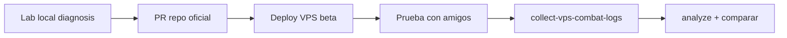

# Combat Health Lab — plan de entorno temporal

**Fecha:** 2026-06-06  
**Estado:** Phase 2 — scaffolding (scripts + README).  
**Nombre artifact:** `combat-health` — **no** repo permanente.

## Propósito

Entorno local aislado para:

```txt
- reproducir bugs de turno / IA / casts
- comparar contra emulador Rollback corregido
- generar telemetría intensiva
- validar fixes antes de PR y VPS beta
```

Los cambios definitivos van al repo oficial vía PR. El lab no es fuente de verdad.

## Ubicación

```txt
Infrastructure/artifacts/combat-health/     # scripts + README (commiteados)
Infrastructure/artifacts/combat-health/db-snapshots/   # gitignored
Infrastructure/artifacts/combat-health/logs/             # gitignored
Infrastructure/temporal-artifacts/combat-logs/           # exports (gitignored)
Infrastructure/logs/combat/                              # telemetría servidor (gitignored)
```

## Componentes

| Pieza | Fuente | Notas |
| --- | --- | --- |
| Emulador | `Sunshine.WorldServer` (build local) | Apunta a DB lab |
| DB | Snapshot VPS `sunshine` | Nunca prod para tests destructivos |
| Cliente | Copia `Client2.3.7` o backup `backups/client/*` | No modificar cliente prod del operador |
| Telemetría | `FightTelemetry` (por implementar) + analizador | Ver [combat-telemetry-plan.md](./combat-telemetry-plan.md) |
| Referencia | Rollback en `RollBlackServer/2.0.0/Rollback` | Solo lectura/comparación |

## Scripts (Phase 2)

| Script | Función |
| --- | --- |
| `run-local-combat-lab.ps1` | Valida prereqs, config lab, lanza WorldServer debug |
| `sync-vps-db-snapshot.ps1` | Dump VPS → restaurar MariaDB local lab |
| `collect-combat-logs.ps1` | Copia logs locales a `temporal-artifacts/combat-logs/local/` |
| `collect-vps-combat-logs.ps1` | SCP desde VPS → `temporal-artifacts/combat-logs/vps/` |
| `analyze-combat-telemetry.ps1` | Ejecuta `CombatTelemetryAnalyzer` sobre input |

## Flujo operador — DB lab

```txt
1. backup VPS sunshine (ya existente o nuevo)
2. sync-vps-db-snapshot.ps1 -SshKey SSH/private_key_sebas.pem
3. Configurar connection string LOCAL (appsettings.Development.local.json — gitignored)
4. Verificar que WorldServer NO apunta a 174.138.35.107 para escritura destructiva
5. run-local-combat-lab.ps1
```

### Variables de entorno sugeridas

```powershell
$env:COMBAT_LAB_DB_HOST = "127.0.0.1"
$env:COMBAT_LAB_DB_PORT = "3306"
$env:COMBAT_LAB_DB_NAME = "sunshine_lab"
$env:FIGHT_TELEMETRY_ENABLED = "true"
$env:FIGHT_TELEMETRY_FILE_ENABLED = "true"
```

## Flujo operador — sesión de prueba

```txt
1. run-local-combat-lab.ps1
2. Login con cliente copia → combate PvM (Dark Vlad / 1v1)
3. collect-combat-logs.ps1
4. analyze-combat-telemetry.ps1
5. Revisar reports en docs/combat-sanitization/reports/
6. Documentar hallazgos — NO fix sin evidencia en reporte
```

## Flujo híbrido (decisión aprobada)



### Local primero — por qué

- Romper sin afectar jugadores
- Debugger + telemetría pesada
- Comparar ramas side-by-side

### VPS beta — cuándo

- Tras PR con telemetría + fix candidato
- Con backup DB + inventario
- Logs recuperados, no committeados

## Prohibiciones

```txt
no tocar VPS primero para experimentos
no DB producción para pruebas destructivas
no copiar proyectos completos Rollback → Sunshine
no dejar artifact-combat-health como fuente final
no mezclar con Admin items/spells
no fixes sin logs
```

## Fases posteriores (recordatorio)

| Fase | Entregable |
| --- | --- |
| 3 | `fix: stabilize combat turn transition` |
| 4 | `feat: add spell cast telemetry` |
| 5 | `fix: repair summon spell handling` |

## QA bosses (Phase 3)

- Dark Vlad (107)
- Pandora
- Nomekop
- Minotoror
- 1v1 / aliado / monstruo con spell

## Handoff

Tras cada fase: actualizar `docs/handoffs/AGENT_HANDOFF.md` con:

- rama activa
- último commit
- logs generados (rutas, no contenido)
- bloqueadores
- siguiente acción exacta

## Regla 15%

Si queda ≤15% de presupuesto de sesión: solo docs + handoff + commit `docs: update agent handoff`.
