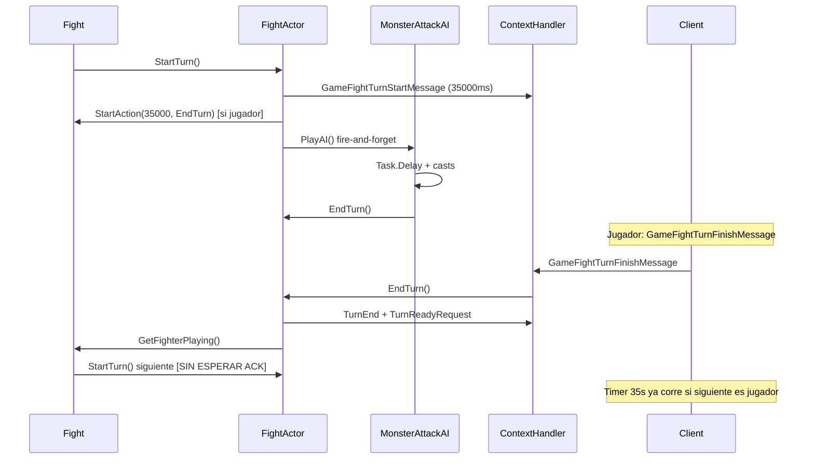
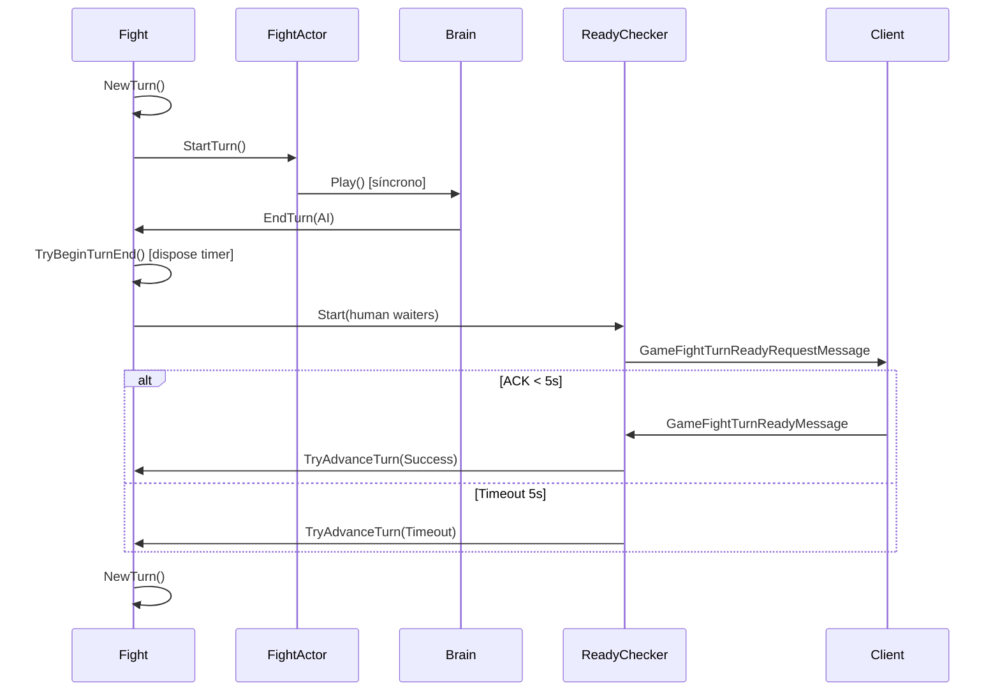

# Comparación de flujo de turnos — Sunshine vs Rollback

**Fecha:** 2026-06-06  
**Estado:** Phase 1 — baseline para Phase 3 (Turn Transition Fix).

## Resumen ejecutivo

| Aspecto | Sunshine (actual) | Rollback (referencia corregida) |
| --- | --- | --- |
| Avance de turno post-`EndTurn` | **Inmediato** (`GetFighterPlaying().StartTurn()`) | **Gated** por `ReadyChecker` (5s max) |
| `GameFightTurnReadyMessage` | Handler **vacío** | ACK avanza o completa waiters |
| Timer 35s (`TurnTime`) | `StartAction(35000,"EndTurn")` en `StartTurn` jugador | Dispuesto en primer `EndTurn`; generación anti-stale |
| IA monstruo | `PlayAIAsync` + `Task.Delay` configurable | `Brain.Play()` síncrono, sin delay artificial |
| Telemetría turno | **Ausente** | `FIGHT-TURN` con 15+ eventos |
| Rescue 35s por turno atascado | Posible si cliente no pasa turno | Corregido: ya no depende de timer rescue post-AI |

## Diagrama — Sunshine (actual)



## Diagrama — Rollback (post-fix)



## Tabla de equivalencias de términos

| Término búsqueda | Sunshine | Rollback |
| --- | --- | --- |
| `ReadyChecker` | **No existe** (solo cliente SWF) | `ReadyChecker.cs` |
| `NextTurn` | `GetFighterPlaying()` + `StartTurn()` | `NewTurn()` / `TryAdvanceTurn()` |
| `EndTurn` | `FightActor.EndTurn()` | `FightActor.EndTurn(source)` + `TryBeginTurnEnd` |
| `TimerElapsed` | `Fight.ActionElapsed("EndTurn")` | `FightTimer` + generación |
| `FightHandler` | `ContextHandler` + `ActionsHandler` | `FightHandler.cs` |
| `MonsterAI` | `MonsterAttackAI` (static) | `Brain` |
| `SpellCast` | inline en `FightActor.CastSpell` | `SpellCast.cs` |

## Secuencia detallada — `EndTurn` Sunshine

1. Validar `FighterPlaying == this`
2. Disposer timer actual
3. Triggers fin de turno (glifos/trampas)
4. Decrementar buffs
5. **`GameFightSynchronizeMessage`** (todos los fighters)
6. `GameFightTurnEndMessage`
7. `GameFightTurnReadyRequestMessage`
8. `FighterPlaying = GetFighterPlaying()` — **sin espera**
9. `FighterPlaying.StartTurn()` — **inmediato**

Puntos de riesgo para UX jugador:

- Paso 5 puede cortar animaciones en cliente
- Paso 8-9 no esperan secuencias/animaciones del paso anterior
- Si el siguiente fighter es `CharacterFighter`, paso 9 inicia timer 35s en `StartTurn` línea 340

## Secuencia detallada — `EndTurn` Rollback (post-fix)

1. `TryBeginTurnEnd(source)` — idempotente, dispone timer
2. Secuencia fin de turno + buffs
3. `ReadyChecker.Start(all CharacterFighters)`
4. Espera ACKs o timeout 5s
5. `TryAdvanceTurn("ReadyCheckerSuccess|Timeout")` — idempotente
6. `NewTurn()` — solo si guards pasan

El bug pre-fix: en paso 5, timeout llamaba `Stop()` y luego la lógica exigía `Checker.Started == true`, bloqueando avance → timer 35s en paso 1 del **siguiente** ciclo rescataba.

## Configuración de delays — solo Sunshine

| `GameConfig` key | Default | Efecto |
| --- | --- | --- |
| `MonsterTurnStartDelayMs` | 100 | Pausa antes de IA |
| `MonsterTurnEndDelayMs` | 80 | Pausa antes de `EndTurn` post-IA |
| `MonsterActionDelayMs` | 60 | Entre acciones IA |
| `MonsterMovementDelayMs` | 90 | Tras movimiento |
| `MonsterForcedMovementDelayMs` | 120 | Push/pull/teleport |

Rollback **no** usa estos delays en `Brain` — la demora visible corregida allí era hand-off, no IA.

## Casos QA planificados (Phase 3)

| Escenario | Qué medir |
| --- | --- |
| Dark Vlad (107) | Tiempo AI vs gap EndTurn→NextTurn |
| Pandora | Mismo + spells múltiples |
| Nomekop | IA + invocaciones (baseline) |
| Minotoror | Boss mechanics |
| 1v1 simple | Turno jugador sin animación enemiga activa |
| Con aliado | ReadyChecker multi-waiter |
| Monstruo con spell | Secuencias + sync |

## Criterios PASS Phase 3 (propuestos)

```txt
- Monstruo: EndTurn(AI) → NextTurn en < 6s (sin TimerElapsed 35s rescue)
- Jugador: timer 35s NO decrementa durante animación enemiga previa
- Logs: ReadyCheckerAdvanceRequested accepted tras timeout
- No regresión: combate termina normalmente
```

## Evidencia requerida antes de implementar fix

1. Logs `FIGHT-TURN` en lab local reproduciendo síntoma
2. Informe `CombatTelemetryAnalyzer` con causa `TIMER_FALLBACK` o gap anómalo
3. Comparación side-by-side con log post-fix Rollback (mismo boss)

## Referencias de logs Rollback

| Log | Patrón |
| --- | --- |
| Pre-fix | `ReadyCheckerTimeout` → **sin** `NextTurnRequested` → `TimerElapsed` ~35s |
| Post-fix | `EndTurn:AI` → `ReadyCheckerTimeout` ~5s → `ReadyCheckerAdvanceRequested accepted` → `NextTurnStarted` |

Rutas: `RollBlackServer/.../Infrastructure/logs/combat/`
