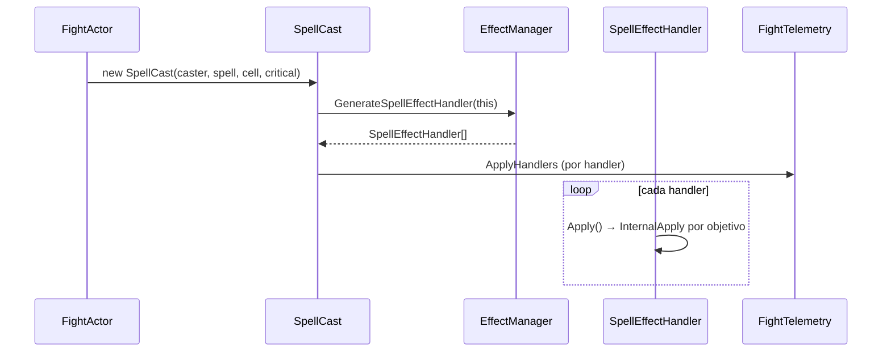
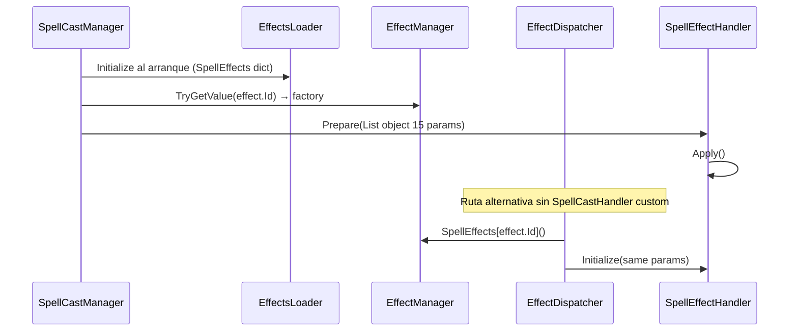

# Motor de efectos y combate — visión general

Comparativa conceptual entre **Rollback.World** (referencia) y **Sunshine.WorldServer** (actual en `c:\Dofus\2.0.0`).

## Nota sobre `FightEffects`

No existe una clase `FightEffects` en ninguno de los dos emuladores. Los “efectos diferidos” se implementan mediante:

- `Effect.Duration` / `Effect.Delay` en datos de hechizo
- Buffs con duración (`Buff`, `StateBuff`, `PunishmentBuff`, …)
- `TriggerBuff` (Rollback) / `TriggerBuff` en `Buffs/Customs` (Sunshine)
- Marcas de mapa: **glifos** y **trampas** que relanzan hechizos al activarse

---

## Flujo de lanzamiento de hechizo

### Rollback



| Pieza | Ruta (game) | Líneas aprox. |
|-------|-------------|---------------|
| Orquestación del cast | `Rollback.World/Game/Fights/SpellCast.cs` | 1–82 |
| Generación handlers | `Rollback.World/Game/Effects/EffectManager.cs` | ~319+ (`GenerateSpellEffectHandler`) |
| Base abstracta | `Rollback.World/Game/Effects/Handlers/Spells/SpellEffectHandler.cs` | 1–59 |
| Registro | Reflexión `[Identifier(EffectId)]` en constructores | `EffectManager.cs` 224–262 |

El handler recibe `(EffectBase, List<FightActor>, SpellCast, Zone)` y aplica sobre objetivos vivos con soporte de **reflejo de hechizo** en la clase base.

### Sunshine



| Pieza | Ruta (game) | Líneas aprox. |
|-------|-------------|---------------|
| Casts personalizados | `Sunshine.WorldServer/Game/Spells/Casts/SpellCastManager.cs` | 42–88 |
| Dispatch directo | `Sunshine.WorldServer/Game/Effects/EffectDispatcher.cs` | 18–43 |
| Registro al boot | `Sunshine.BaseServer/Loaders/World/Effects/EffectsLoader.cs` | 13–47 |
| Base | `Sunshine.WorldServer/Game/Effects/Spells/SpellEffectHandler.cs` | 15–98 |
| Zonas / objetivos | `Sunshine.WorldServer/Game/Effects/EffectManager.cs` | 166–207 |

**Diferencia clave:** Sunshine separa **serialización de efectos** (`EffectManager`) del **registro de handlers** (`EffectsLoader` en `Sunshine.BaseServer`). Rollback concentra dispatch, zonas y factories en un solo `EffectManager`.

---

## Effect dispatchers

| Concepto | Rollback | Sunshine |
|----------|----------|----------|
| Tabla spell handlers | `Dictionary<EffectId, Func<...SpellEffectHandler>>` | `Dictionary<EffectsEnum, Func<SpellEffectHandler>>` |
| Descubrimiento | `[Identifier]` + reflexión en `EffectManager` init | `[EffectHandler]` + `EffectsLoader` (assembly scan) |
| Punto de ejecución | `SpellCast.ApplyHandlers()` | `SpellCastHandler` + `EffectDispatcher.Dispatch()` |
| Handler sin registro | Error en generación / handler vacío | `Logger.WriteError` en `EffectDispatcher` línea 36 |

---

## Buffs y estados

### Rollback

- Base: `Game/Fights/Buffs/Buff.cs`
- Tipos: `Game/Fights/Buffs/Types/` — `TriggerBuff`, `StateBuff`, `StatBuff`, `SpellReflectionBuff`, etc.
- Creación desde handlers: `FightActor.AddTriggerBuff`, `AddBuff`, `AddStatBuff`
- Estados: `StateBuffEffectHandler`, `DispelStateEffectHandler`

### Sunshine

- Base: `Game/Fights/Buffs/Buff.cs`
- Implementaciones: `Game/Fights/Buffs/Spells/` (`PunishmentBuff`, `StateBuff`, `SacrificeBuff`, …)
- Triggers: `Game/Fights/Buffs/Customs/TriggerBuff.cs` (callbacks por `BuffTriggerType`)
- Estados: `Game/Effects/Spells/States/AddState.cs`, `RemoveState.cs`

Los mensajes al cliente usan `FightTemporaryBoostEffect`, `FightTriggeredEffect`, etc., con regla `Duration > 500 ? -1 : duration` repetida en varios buffs.

---

## Invocaciones

| Rollback | Sunshine |
|----------|----------|
| `Summons/SummonEffectHandler.cs` | `Effects/Spells/Summon/Summon.cs` |
| `SummonedMonster`, `SummonedStaticMonster` | `Actors/Fighters/SummonedMonster.cs` (+ bombas, clones) |
| `DoubleEffectHandler.cs` | `Summon/Double.cs` |

Sunshine añade `Effect_SummonBomb`, `FrigostBossMechanics.ResolveForcedSummonMonsterId`, y lógica de explosión en celda ocupada (`Summon.cs` ~54–74).

---

## Triggers de mapa (glifos / trampas)

### Rollback

- API en `Fight.cs` **518–565**: `AddGlyph`, `AddTrap`, `NotifyTriggers`, `GetAvailableTriggersFor`
- Handlers de creación: `GlyphEffectHandler`, `TrapEffectHandler`
- Tipos: `Game/Fights/Triggers/Types/Glyph.cs`, `Trap.cs`, `TriggerMark`

Activación: al entrar en celda / inicio o fin de turno según `TriggerType`.

### Sunshine

- Marcas: `Game/Fights/Triggers/Glyph.cs`, `Trap.cs`, base `MarkTrigger`
- Spawn: `Effects/Spells/Marks/GlyphSpawn.cs`, `TrapSpawn.cs`
- Movimiento: `Fight.ShouldTriggerOnMove` (**788–796** en `Fight.cs`)
- Alta de marca: `Fight.AddTrigger` (**811–823**)

Sunshine dispara glifos en **movimiento** dentro del bucle de empuje (`Push.cs` ~69–72), además del ciclo de turno.

---

## Hilos de combate y secuencias (crítico)

### Rollback — modelo explícito

En `Fight.cs`:

- `ActiveSequenceCount` / `IsSequencing` (**85–89**)
- `ReadyChecker` para avanzar turno cuando el cliente confirma secuencias (**99+**)
- `FightTelemetry` envuelve timers, placement, `SpellCast.ApplyHandlers`, IA (`Brain.Play`)

Objetivo: no cerrar turno ni saturar red mientras hay secuencias de animación activas.

### Sunshine — sin equivalente localizado

Búsqueda en `Sunshine.WorldServer`: **0** coincidencias para `ActiveSequenceCount`, `FightTelemetry`, `ReadyChecker`.

El combate depende de flujo en `Fight.cs` (1055 líneas) y timers (`EndTurn` ~1028+) sin el mismo contrato de secuencias observado en Rollback.

**Impacto probable:** hechizos con múltiples sub-acciones (empuje + glifo + muerte) pueden desincronizar cliente 2.3.7 si los mensajes se envían antes de que el cliente termine la secuencia anterior.

---

## IA de combate

| Rollback | Sunshine |
|----------|----------|
| `Game/Fights/AI/Brain.cs` | `Game/Actors/AI/AIManager.cs`, `AIDispatcher.cs` |
| `Game/Fights/AIFighter.cs` | `Game/Actors/Fighters/AIFighter.cs` |
| Telemetría `AIStart` / `AIEnd` en `FightTelemetry` | `MonsterAttackAI.cs`, tipos `Crazy`, `Rusher`, `Runner` |
| Boss scripts genéricos en Brain | `Game/Fights/Mechanics/FrigostBossMechanics.cs` |

---

## Efectos “retrasados” (veneno, castigo, robo por turnos)

| Mecanismo | Rollback | Sunshine |
|-----------|----------|----------|
| Daño por turno (robo HP con duración) | `StealHpEffectHandler` → `AddTriggerBuff(OnTurnBegin)` | `HpSteal.Apply()` instantáneo |
| Castigo por daños recibidos | `PunishmentEffectHandler` → `AfterDamaged` | `PunishmentBuff.OnDamaged` en `FightActor.InflictDamage` |
| Castigo daño directo | `PunishmentDamageEffectHandler` | `PunishmentDamage.cs` (curva % vida) |
| Pérdida PA | `LoseHPByUsingAPEffectHandler` + trigger fin turno | `LoseHpByUsingAP.cs` + `LoseHpByUsingApBuff` |

---

## Referencia rápida de archivos núcleo

```
auditoria:
ruta/rollback/Game/Effects/EffectManager.cs
ruta/actual/Sunshine net11.0/.../Game/Effects/EffectManager.cs
LINEAS: 1-523 vs 1-227

auditoria:
ruta/rollback/Game/Fights/Fight.cs
ruta/actual/.../Game/Fights/Fight.cs
LINEAS: 1-789 vs 1-1055

auditoria:
ruta/rollback/Game/Fights/SpellCast.cs
ruta/actual/.../Game/Spells/Casts/SpellCastManager.cs
LINEAS: 1-82 vs 42-88 (+ handlers custom en Game/Spells/Casts/**)
```

Módulo: **game** en todos los bloques anteriores.
