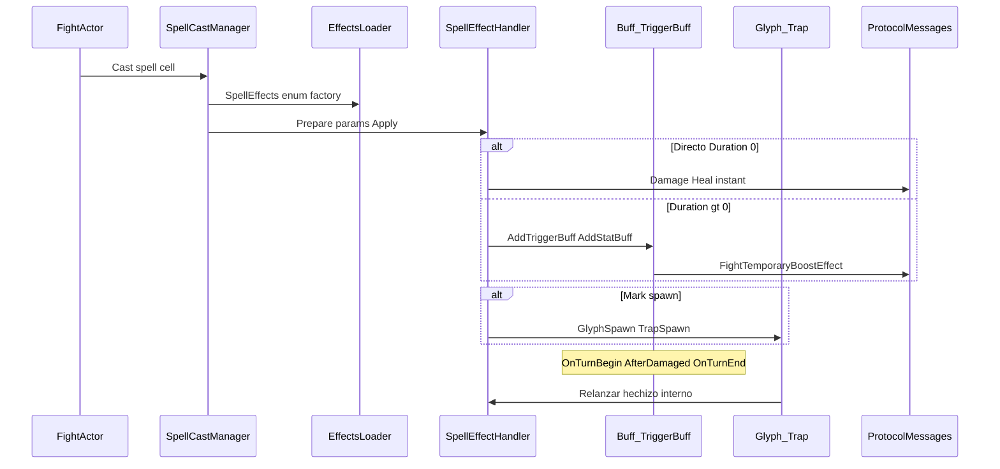

# Pipeline de ejecución de efectos

Extiende [effect-engine-overview.md](../effects-audit-phase1/effect-engine-overview.md) con foco en **dónde intervenir por capa**.

Módulo: **game** salvo nota.

## Diagrama de flujo



## Etapas del pipeline

### 1. Cast

| Sunshine | Rollback |
|----------|----------|
| `Game/Spells/Casts/SpellCastManager.cs` | `Game/Fights/SpellCast.cs` |
| Handlers custom por hechizo en `Game/Spells/Casts/**` | No equivalente |

**Capa:** orquestación por hechizo (evitar parchear un spell sin revisar si usa cast custom).

### 2. Resolución handler

| Paso | Archivo |
|------|---------|
| Boot scan | `EffectsLoader.cs` |
| Factory | `EffectManager.Instance.SpellEffects` |
| Dispatch alternativo | `EffectDispatcher.cs` |

**Capa:** registro `[EffectHandler]` — un fix en `HpSteal` arregla todos los `Effect_StealHP*`.

### 3. Apply del handler

Base: `SpellEffectHandler.Prepare()` + `Apply()`.

Patrones:

- **Directo** — daño/cura en `Apply()` (`DirectDamage`, `Heal`)
- **Buff duración** — `AddBuff`, `AddStatBuff`, `AddTriggerBuff`
- **Estado** — `AddState` → `StateBuff`
- **Marca** — `GlyphSpawn` / `TrapSpawn` → `Fight.AddTrigger`

### 4. Triggers de buff

| Trigger | Uso | Archivo |
|---------|-----|---------|
| `OnTurnBegin` | DOT veneno | `TriggerBuff.cs` — **falta en HpSteal** |
| `AfterDamaged` | Castigo Sacrógrito | `PunishmentBuff.cs` |
| `OnTurnEnd` | Pérdida PA/HP | `LoseHpByUsingAP.cs`, glifos |

**Capa:** `Fights/Buffs/Customs/TriggerBuff.cs` + punto de disparo en `FightActor` / `Fight.cs`.

### 5. Triggers de mapa

| Evento | Sunshine | Rollback |
|--------|----------|----------|
| Movimiento | `Fight.ShouldTriggerOnMove` | `NotifyTriggers` |
| Fin/inicio turno | `Glyph.cs` listas ID | `GlyphEffectHandler` |

**Capa:** `Fights/Triggers/Glyph.cs`, `Trap.cs` + handler del hechizo interno (ej. `Effect_Kill`).

### 6. Secuencias y mensajes cliente

Rollback: `ActiveSequenceCount`, `ReadyChecker`, `FightTelemetry`.

Sunshine: **sin equivalente** — riesgo transversal al enviar mensajes antes de cerrar secuencia anterior.

**Capa:** `Fight.cs` (no hechizo individual).

## Dónde corregir sin tocar Golosón / Cil / Sacrógrito

| Problema reportado | Capa pipeline | Validar también |
|--------------------|---------------|-----------------|
| Cil no hace tick | Etapa 3–4: `HpSteal` + `TriggerBuff` | Otros robo HP con duración |
| Sacrógrito desync | Etapa 4: `PunishmentBuff` | Todos `Effect_Punishment` |
| Golosón no muere | Etapa 3 + IA: `Summon` / `SummonedMonster` | Doble, bombas, sacrificadas |
| Glifo muerte | Etapa 2: registrar `Effect_Kill` | Trampas con kill interno |
| Turno colgado | Etapa 6: secuencias | Empuje + glifo en cadena |

## Referencia rápida

```text
auditoria:
ruta/rollback/Game/Fights/SpellCast.cs
ruta/actual/Game/Spells/Casts/SpellCastManager.cs
LINEAS: 1-82 vs 42-88
Módulo: game

auditoria:
ruta/rollback/Game/Fights/Buffs/Types/TriggerBuff.cs
ruta/actual/Game/Fights/Buffs/Customs/TriggerBuff.cs
LINEAS: 1-58 vs 1-80
Módulo: game
```
