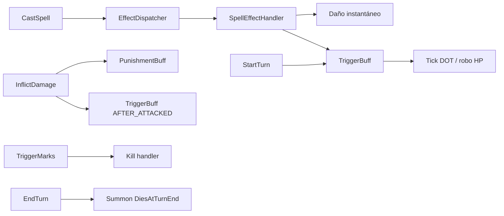

# Fase 3 — Cambios de arquitectura

## Pipeline post-fix

## Archivos tocados (por commit)

| Commit | SHA (aprox.) | Archivos |
|--------|--------------|----------|
| #0 scaffold | `c8a05af` | `docs/effects-engine-fix-phase3/*` |
| #1 DOT | `e85d26d` | `Damages/HpSteal.cs`, `FightActor.cs` |
| #2 Kill | `b0a7b5f` | `Others/Kill.cs`, `FightActor.Kill()` |
| #3 Punishment | `d7529d6` | `PunishmentBuff.cs`, `Buffs/PunishmentBoost.cs`, `FightActor.cs` |
| #4 Summons | `8b32ee9` | `Summon.cs`, `SummonedMonster.cs`, `SummonedStaticMonster.cs`, `FightActor.cs` |
| #6 Logger | `c646296` | `FightCombatLogger.cs`, `EffectDispatcher.cs`, `Fight.cs`, `ContextHandler.cs` |

## FightActor — hooks nuevos

| Método | Uso |
|--------|-----|
| `TriggerFightBuffs(BuffTriggerType, token)` | `TURN_BEGIN` en `StartTurn`; `AFTER_ATTACKED` en `InflictDamage`; `BUFF_ENDED` en `RemoveBuff` |
| `Kill(FightActor killer)` | Muerte forzada (`Effect_Kill`) |

## FightCombatLogger (solo develop-build)

| Variable | Valor |
|----------|--------|
| Env | `FIGHT_COMBAT_LOG_ENABLED=true` |
| Config | `FightCombatLogEnabled=true` en `Config.xml` |
| Salida | `/app/logs/fights/{fightId}.log` (host: `docker/logs/fights/`) |

Eventos: `CAST`, `DISPATCH`, `TRIGGER`, `DAMAGE`, `KILL`, `SUMMON_DIE`, `SOCKET`.

## Pendiente — Ola 2 (no este PR)

| Tema | Rollback ref | Notas |
|------|--------------|-------|
| Secuencias combate | `ActiveSequenceCount`, `ReadyChecker` | Turnos colgados empuje+glifo+muerte |
| Bosses Frigost | `Brain.cs` | Hooks por `MonsterId`, no por hechizo |
| Logger → develop | Integrar tras validar overhead en VPS |
