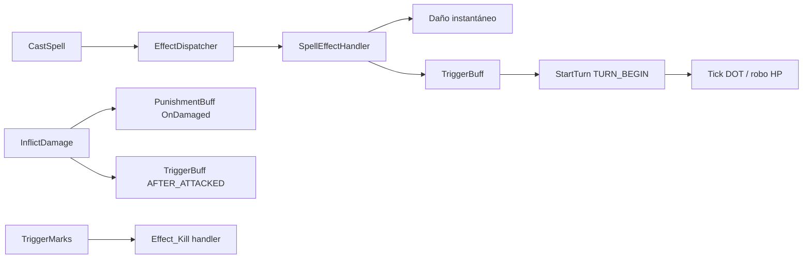

# Fase 3 — Cambios de arquitectura

> Esqueleto — completar en commit #7.

## Pipeline post-fix (diagrama)

## Archivos modificados (por commit)

| Commit | Archivos |
|--------|----------|
| #1 | `Damages/HpSteal.cs`, `FightActor.cs` (dispatch triggers) |
| #2 | `Others/Kill.cs` |
| #3 | `PunishmentBuff.cs`, `Buffs/PunishmentBoost.cs` |
| #4 | `Summon/Summon.cs`, `SummonedMonster.cs`, `SummonedStaticMonster.cs`, `FightActor.cs` |
| #6 | `Fights/Diagnostics/FightCombatLogger.cs`, hooks en dispatcher/daño/red |

## Pendiente para `develop` (no este PR)

- Port `ActiveSequenceCount` / `ReadyChecker` desde Rollback
- Integración logger ↔ secuencias de combate
- Bosses Frigost — Ola 2 si no entra en ventana
