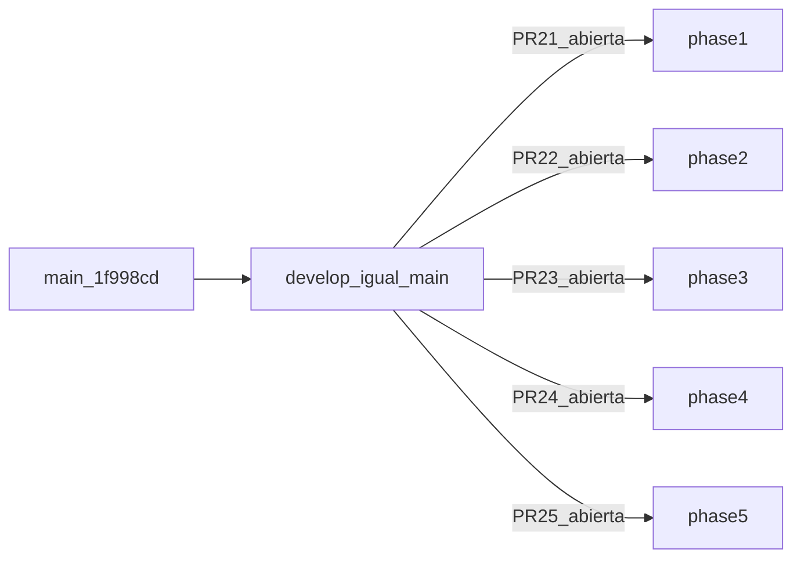

# Fase 5: Integración al servidor principal

Cierre del pipeline de reparación del motor de efectos. Tras reset de `develop`, todo el trabajo queda en **PRs abiertas** hacia `develop` — sin merge automático.

## Metadatos

| Campo | Valor |
|-------|--------|
| Duración estimada | ~2 h |
| Rama feature | `feature/effects-integration-phase5` |
| Rama integración | `develop` @ `1f998cd` (= `main`, post-reset 2026-06-05) |
| PR Fase 5 | [#25](https://github.com/dagemov/DofusLegacy2.3.7/pull/25) — **abierta** |
| Documentación | `docs/effects-integration-phase5/` |

## Política origin

| Regla | Detalle |
|-------|---------|
| PRs | Solo hacia `develop`; **permanecen abiertas** hasta merge manual |
| Merge | **Prohibido** por agente/script |
| `develop` | Recreada desde `main`; pipeline en PRs #21–#25 |
| `origin/develop-build` | Eliminada |

## PRs del pipeline (todas abiertas)

| PR | Fase | Head | Estado |
|----|------|------|--------|
| [#21](https://github.com/dagemov/DofusLegacy2.3.7/pull/21) | 1 Auditoría | `feature/effects-audit-phase1` | abierta |
| [#22](https://github.com/dagemov/DofusLegacy2.3.7/pull/22) | 2 Catálogo | `feature/effects-catalog-phase2` | abierta |
| [#23](https://github.com/dagemov/DofusLegacy2.3.7/pull/23) | 3 Motor | `feature/effects-engine-fix-phase3` | abierta |
| [#24](https://github.com/dagemov/DofusLegacy2.3.7/pull/24) | 4 Validación | `feature/effects-validation-phase4` | abierta |
| [#25](https://github.com/dagemov/DofusLegacy2.3.7/pull/25) | 5 Integración | `feature/effects-integration-phase5` | abierta |

## Índice

| Archivo | Contenido |
|---------|-----------|
| [deployment-notes.md](./deployment-notes.md) | Reset develop, PRs, compile/runtime gate |
| [regression-checklist.md](./regression-checklist.md) | Compilación, arranque, PvM, PvP, dungeons |

## Modelo de ramas (post-reset)

## Criterios de aceptación

- [x] `origin/develop` recreada desde `main`
- [x] PRs #21–#25 abiertas (`base=develop`)
- [x] PRs #19/#20 cerradas sin merge
- [x] VPS/local sincronizados a `develop` @ `1f998cd`
- [ ] Merge manual por el equipo (orden 1→5) cuando aprueben
- [ ] Regression checklist tras merge PR #23+ en VPS

## Riesgos

- VPS sin fixes Fase 3 hasta merge manual PR #23.
- Escenarios Ola 2 (bosses/empujes) documentados en Fase 4 — no bloquean apertura de PRs.
