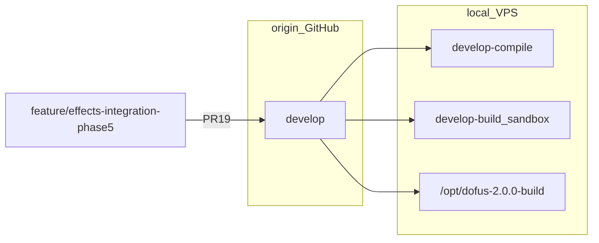

# Fase 5: Integración al servidor principal

Cierre del pipeline de reparación del motor de efectos (fases 1–4). Integración vía **PRs solo hacia `develop`** en origin; validación compile/runtime en entornos locales y VPS test.

## Metadatos

| Campo | Valor |
|-------|--------|
| Duración estimada | ~2 h |
| Rama feature | `feature/effects-integration-phase5` |
| Rama integración | `develop` @ `8750b57` (post PR #18) |
| Rama compile local | `develop-compile` |
| Sandbox runtime | `develop-build` (local) / VPS `/opt/dofus-2.0.0-build` checkout **`develop`** |
| Documentación | `docs/effects-integration-phase5/` |
| Fases previas | [Fase 1](../effects-audit-phase1/) · [Fase 2](../effects-catalog-phase2/) · [Fase 3](../effects-engine-fix-phase3/) · [Fase 4](../effects-validation-phase4/) |

## Política origin (acordada)

| Regla | Detalle |
|-------|---------|
| PRs en GitHub | **Solo hacia `develop`** (features Fases 1–5) |
| `main` | Sin PR en esta fase |
| `origin/develop-build` | **Eliminada** (2026-05-30); sandbox local/VPS sin push |
| Prod VPS `/opt/dofus-2.0.0` | Fuera de alcance Fase 5 |

## Índice

| Archivo | Contenido |
|---------|-----------|
| [deployment-notes.md](./deployment-notes.md) | Cadena PRs, higiene origin, compile/runtime gate, rollback |
| [regression-checklist.md](./regression-checklist.md) | Compilación, arranque, PvM, PvP, dungeons críticas |

## Modelo de ramas

Ver [BRANCHING.md](../BRANCHING.md).

## PRs del pipeline efectos

| PR | Rama head | Base | Estado |
|----|-----------|------|--------|
| #14 | `feature/effects-audit-phase1` | `develop` | mergeado |
| #16 | `feature/effects-catalog-phase2` | `develop` | mergeado |
| #17 | `feature/effects-engine-fix-phase3` | `develop` | mergeado |
| #18 | `feature/effects-validation-phase4` | `develop` | mergeado @ `8750b57` |
| #19 | `feature/effects-integration-phase5` | `develop` | pendiente |

## Qué queda en `develop` tras Fase 5

- **Código Fase 3:** DOT (`HpSteal`), kill (`Kill.cs`), castigos (`PunishmentBuff`), invocaciones (`SummonedStaticMonster`, `DiesAtTurnEnd`), logger (`FightCombatLogger`).
- **Docs:** fases 1–5 en `docs/`.
- **Sin** release a `main` ni deploy prod VPS en esta entrega.

## Riesgos conocidos (Ola 2)

- Bosses Frigost (`FrigostBossMechanics`) — escenarios B-01/B-03 pueden quedar PENDING/FAIL.
- Empujes / secuencias (`ActiveSequenceCount`, `ReadyChecker`) — escenarios E-01–E-04.
- No bloquean merge en `develop` si smoke A–D del [regression-checklist](./regression-checklist.md) pasa.

## Criterios de aceptación Fase 5

- [x] PRs pipeline auditadas: `base=develop`
- [x] `origin/develop-build` eliminada
- [x] PR #18 mergeado en `develop`
- [ ] Docs Fase 5 + `BRANCHING.md` actualizado
- [ ] Compile gate OK post-merge
- [ ] PR #19 → `develop`
- [ ] Regression checklist ejecutado en VPS test (checkout `develop`)

## Alcance

**Incluido:** documentación de integración, higiene de ramas origin, compile gate, checklist de regresión.

**Excluido:** PR `develop` → `main`; deploy Docker en `/opt/dofus-2.0.0`; fixes Ola 2 masivos.
