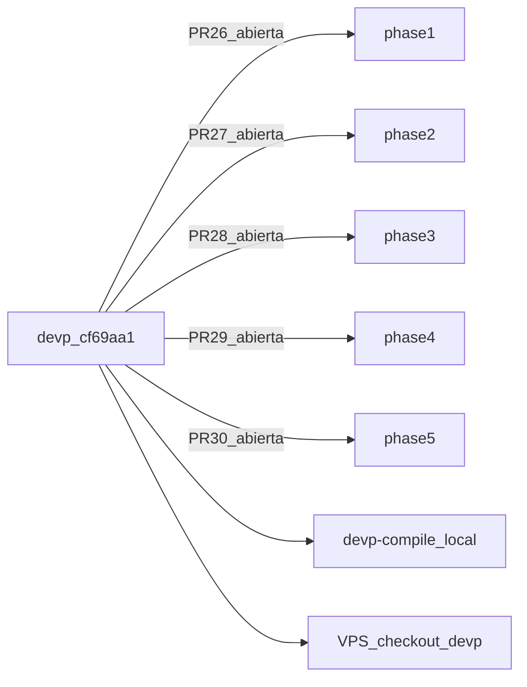

# Fase 5: Integración al servidor principal

Cierre del pipeline de reparación del motor de efectos. Tras migración a **`devp`**, todo el trabajo queda en **PRs abiertas** hacia `devp` — sin merge automático.

## Metadatos

| Campo | Valor |
|-------|--------|
| Duración estimada | ~2 h |
| Rama feature | `feature/effects-integration-phase5` |
| Rama integración | `devp` @ `cf69aa1` (items builder PR #15) |
| PR Fase 5 | #30 → **`devp`** — **abierta** |
| Documentación | `docs/effects-integration-phase5/` |

## Política origin

| Regla | Detalle |
|-------|---------|
| PRs | Solo hacia **`devp`**; **permanecen abiertas** hasta merge manual |
| Merge | **Prohibido** por agente/script |
| Cerrar PRs | **Prohibido** — permanecen abiertas hasta merge manual |
| `origin/develop` | Eliminada tras verificar PRs #26–#30 |
| `origin/develop-build` | Eliminada previamente |

## PRs del pipeline (todas abiertas → `devp`)

| PR | Fase | Head | Base |
|----|------|------|------|
| #26 | 1 Auditoría | `feature/effects-audit-phase1` | **`devp`** |
| #27 | 2 Catálogo | `feature/effects-catalog-phase2` | **`devp`** |
| #28 | 3 Motor | `feature/effects-engine-fix-phase3` | **`devp`** |
| #29 | 4 Validación | `feature/effects-validation-phase4` | **`devp`** |
| #30 | 5 Integración | `feature/effects-integration-phase5` | **`devp`** |

## Índice

| Archivo | Contenido |
|---------|-----------|
| [deployment-notes.md](./deployment-notes.md) | Migración `devp`, PRs, compile/runtime gate |
| [regression-checklist.md](./regression-checklist.md) | Compilación, arranque, PvM, PvP, dungeons |
| [../admin-commands.md](../admin-commands.md) | Comandos in-game y roles admin |

## Modelo de ramas

## Criterios de aceptación

- [x] Ramas `feature/*` recreadas desde `devp` (cherry-pick por fase)
- [x] Compile gate Fase 3 OK en `devp-compile`
- [x] `BRANCHING.md` actualizado a flujo `devp`
- [ ] PRs #26–#30 abiertas (`base=devp`)
- [ ] VPS test sincronizado a `devp`
- [ ] Merge manual por el equipo (orden 1→5) cuando aprueben
- [ ] Regression checklist tras merge PR #28+ en VPS

## Riesgos

- Conflictos cherry-pick con items builder en `devp` — resolver por capa efectos.
- Escenarios Ola 2 (bosses/empujes) documentados en Fase 4 — no bloquean apertura de PRs.
