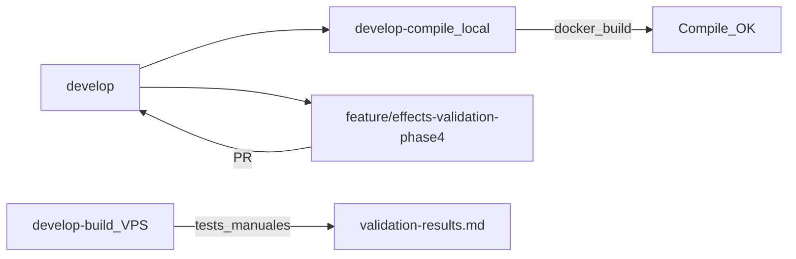

# Fase 4: Validación funcional

Escenarios de prueba in-game mapeados a **capas del motor**, evidencia Rollback y plantilla de resultados. Los tests los ejecuta el equipo en `develop-build` (Docker VPS).

## Metadatos

| Campo | Valor |
|-------|--------|
| Duración estimada | ~4 h |
| Rama feature | `feature/effects-validation-phase4` |
| Rama compile local | `develop-compile` @ `dad4332` (build OK) |
| Rama test runtime | `develop-build` (VPS) |
| Documentación | `docs/effects-validation-phase4/` |
| Fases previas | [Fase 1](../effects-audit-phase1/) · [Fase 2](../effects-catalog-phase2/) · [Fase 3](../effects-engine-fix-phase3/) |
| Integración Fase 3 | PR #17 mergeado en `develop` @ `dad4332` |

## Filosofía de corrección (obligatoria)

Ver [combat-fix-philosophy.md](../combat-fix-philosophy.md).

**Incorrecto:** arreglar Golosón, Cil o Sacrógrito directamente (hechizo/clase aislada).

**Correcto:**

1. Encontrar qué **capa del motor** provoca el fallo
2. Corregir la capa (handler, buff, trigger, secuencia)
3. Validar **todos los casos** de esa categoría

En esta fase los escenarios usan nombres de jugador solo como **casos de prueba**; la columna **Capa** en `test-scenarios.md` es la unidad de fix.

## Índice

| Archivo | Contenido |
|---------|-----------|
| [test-scenarios.md](./test-scenarios.md) | Escenarios reproducibles + hilos de código + Rollback |
| [validation-results.md](./validation-results.md) | Resultados PASS/FAIL/PENDING (completar tras tests) |

## Modelo de ramas

Ver [BRANCHING.md](../BRANCHING.md).

## Entorno de prueba

| Campo | Valor |
|-------|--------|
| VPS path | `/opt/dofus-2.0.0-build` |
| Puertos | 2450 / 5557 |
| Logger | `FIGHT_COMBAT_LOG_ENABLED=true` en `.env` |
| Logs combate | `docker/logs/fights/{fightId}.log` |

## Compile gate (`develop-compile`)

| Criterio | Estado |
|----------|--------|
| `docker compose build sunshine` | **OK** (local, 2026-06-05) |
| Registro | [20260605-develop-compile-phase4-dad4332.md](../vps-build-validation/20260605-develop-compile-phase4-dad4332.md) |

## Criterios de aceptación

- [x] Escenarios documentados por capa (no por hechizo como fix)
- [x] Hilos de código Sunshine + referencia Rollback
- [x] Compilación verificada en `develop-compile`
- [ ] Resultados in-game en `validation-results.md` (equipo / `develop-build`)
- [ ] Bosses / empujes: gaps Ola 2 documentados si FAIL

## Alcance

**Incluido:** documentación de escenarios, plantilla de resultados, compile gate.

**Excluido en esta entrega:** fixes de código masivos; si un test falla, documentar hilo y abrir commit por capa en rama posterior.

## Convención módulos

- **game** — `Sunshine.WorldServer`
- **multi** — cliente AS2 (solo si servidor correcto y persiste desync visual)
