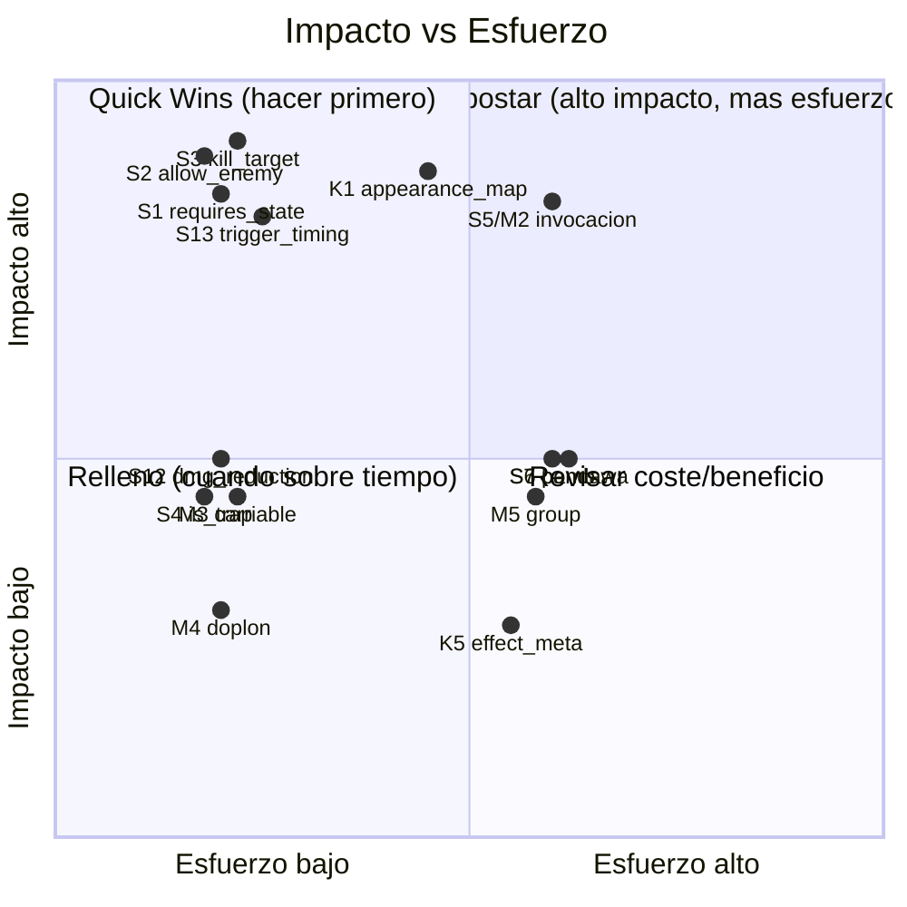

# Matriz de Prioridad — Externalizacion de Metadata (Spells)

> Clasifica los 16 casos clase A de [docs/metadata-externalization-roadmap.md](docs/metadata-externalization-roadmap.md)
> por esfuerzo x impacto x riesgo, e identifica la **combinacion minima** que lleva de **~62% a
> ~81%** data-driven sin tocar el pipeline de combate.

## Matriz esfuerzo x impacto x riesgo

| Caso | Esfuerzo | Impacto | Riesgo | Corta regresion historica |
| --- | --- | --- | --- | --- |
| S3 kill_target (233) | S | Alto | Bajo-medio | **Si** (instakill Sacrificada) |
| S2 allow_enemy_target (192) | S | Alto | Bajo | **Si** (curas a enemigos) |
| S1 requires_state/bonus (159) | S | Alto | Bajo | **Si** (Colere de Iop) |
| S13 trigger_timing (glifos) | S | Alto | Bajo | No (desbloquea mecanica) |
| K1 appearance_map | S-M | Alto | Bajo-medio | No (desbloquea mecanica) |
| S5/M2 categoria invocacion | M | Alto | Medio | No (desbloquea mecanica) |
| S12 DamageReduction->EffectId | S | Medio | Bajo | Parcial |
| S4 is_trap | S | Medio | Bajo | No |
| M3 carriable/bones | S | Medio | Bajo | No |
| M4 doplon loot | S | Bajo | Bajo | No |
| S6/K3 bomb_element | M | Medio | Medio | No |
| S7/K8/T2 pandawa_role | M | Medio | Medio | No |
| M5 group_behavior | M | Medio | Medio | No |
| K5 effect_meta (stats) | M | Bajo | Bajo | No |

---

## Cuadrantes

### Quick Wins (esfuerzo S, riesgo bajo, impacto alto/medio)
Maximo retorno inmediato; tablas aditivas, default = comportamiento actual.
- **S2** allow_enemy_target — elimina whitelist de cura 192.
- **S1** requires_state/bonus_if_state — elimina rama Colere 159.
- **S13** trigger_timing — elimina lista de glifos; **desbloquea mecanica Glifos**.
- **S12** DamageReduction por EffectId — refactor sin tabla.
- **S4** is_trap — flag simple.
- **M3** carriable + bone_blacklist — flags de monstruo simples.
- **M4** doplon — tabla espejo del diccionario.

### Alto impacto (cortan regresiones historicas o desbloquean mecanicas)
- **S3** kill_target — corta el instakill de la Sacrificada (regresion real sufrida).
- **S2** allow_enemy_target — corta curas a enemigos (regresion real sufrida).
- **S1** requires_state — corta dependencia de Colere.
- **K1** appearance_map — **desbloquea Transformaciones** como data-driven.
- **S5/M2** categoria de invocacion — **desbloquea Invocaciones** como data-driven.
- **S13** trigger_timing — **desbloquea Glifos** como data-driven.

### Riesgo bajo
S1, S2, S4, S12, M3, M4, K5 (tablas aditivas, sin tocar mecanicas sensibles; default reproduce el comportamiento actual).

### Riesgo alto (relativo — ninguno es critico)
- **S6/K3** bomb_element — la mecanica de bombas es sensible (explosion/muro/daño deben mantener paridad por elemento).
- **S7/K8/T2** pandawa_role — set acoplado (hechizos + estados + apariencias); migrar como bloque unico.
- **M5** group_behavior — afecta spawning/dificultad de grupos.
- **S5/M2** — varios puntos de uso; exige coherencia spell<->monster.

---

## Mapa de cuadrantes (impacto vs esfuerzo)

---

## Secuencia recomendada

1. **Fase 0 — infraestructura de lectura (S):** crear `effect_metadata` (vacia) y su cache; sin filas no cambia nada. Permite que S1/S2/S3/S13 sean solo "insertar fila + leer".
2. **Fase 1 — Quick Wins anti-regresion (S):** S2, S3, S1. Eliminan las ramas `spell.Id` que han causado regresiones (192, 233, 159). Riesgo bajo, default seguro.
3. **Fase 2 — desbloqueo de mecanicas (S/M):** S13 (Glifos), K1 (Transformaciones), S5/M2 (Invocaciones). **Aqui se cruza el 81%.**
4. **Fase 3 — limpieza data-driven (S):** S12, S4, M3, M4.
5. **Fase 4 — bloques acoplados (M):** S6/K3 (bombas), S7/K8/T2 (Pandawa), M5 (grupos), K5 (effect_meta). Mayor riesgo, migrar como bloques con verificacion por paridad.

Cada fase es independiente y reversible (quitar filas/flag = volver al comportamiento actual).

---

## Combinacion minima 62% -> 81%

| Pieza | Mecanica que vuelve data-driven |
| --- | --- |
| **K1** appearance_map | Transformaciones |
| **S13** trigger_timing | Glifos |
| **S3** kill_target + **S5/M2** categoria invocacion | Invocaciones |

Con estas **3 piezas** (4 cambios: appearance_map, trigger_timing, kill_target, summon category)
las mecanicas data-driven pasan de **10/16 (62,5%)** a **13/16 (81,25%)**. Todas son esfuerzo
**S/M**, riesgo **bajo-medio**, y **no tocan el pipeline de combate**.

> Recomendacion: ejecutar Fase 0 -> Fase 1 (corta regresiones con riesgo minimo) -> Fase 2
> (cruza el 81%). El resto (Fases 3-4) es mejora incremental sin urgencia.
