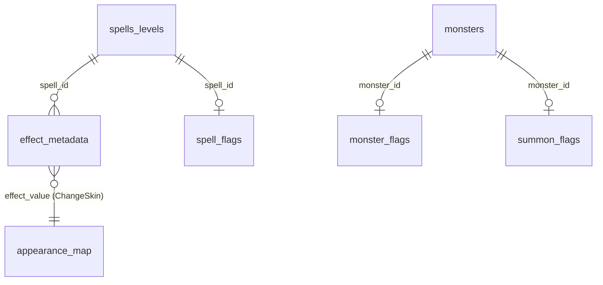

# Propuesta de Esquema de Metadata (Spells)

> Esquema futuro para externalizar a BD el conocimiento atrapado (16 casos clase A). Diseño, no
> implementacion. DDL **ilustrativo** (MySQL/MyISAM, coherente con `sushine.sql`).
>
> Principio rector: **el pipeline de combate no cambia**. Cada tabla la consume el handler que hoy
> usa una constante. La carga se engancha en los objetos existentes
> ([SpellTemplate.cs](Sunshine net11.0/Sunshine net11.0/Sunshine.MySql/Database/World/Spells/SpellTemplate.cs),
> [Effect.cs](Sunshine net11.0/Sunshine net11.0/Sunshine.WorldServer/Game/Spells/Effect.cs),
> tabla `monsters`).

## Decision de diseño: por que tabla lateral y no columnas

Los **efectos** de un hechizo se serializan en un **blob binario** (`spells_levels.Effects` ->
[Effect.cs](Sunshine net11.0/Sunshine net11.0/Sunshine.WorldServer/Game/Spells/Effect.cs)); no son
columnas. Por tanto la metadata **por efecto** (kill_target, requires_state, bonus_if_state,
allow_enemy_target, trigger_timing) NO puede ser columna de `spells_levels`. Opciones:

| Opcion | Pros | Contras | Veredicto |
| --- | --- | --- | --- |
| A) Tabla lateral `(spell_id, effect_id)` | No toca el blob ni el parser; aditivo; consultable | Join/lookup extra al cargar | **Recomendada** |
| B) Extender el blob binario | Todo junto | Cambia el (de)serializador y el cliente; alto riesgo | Descartada |
| C) Metadata global por `effect_id` | Maxima reutilizacion | No permite override por hechizo (192 vs otras curas) | Solo para clasificaciones globales (K5) |

Se adopta **A** para overrides por hechizo y **C** (`effect_meta`) para clasificaciones globales.
Las flags **por hechizo** (no por efecto) van en `spell_flags` (lateral por `spell_id`), y las de
**monstruo** en `monster_flags` (lateral por `monster_id`). `appearance_map` es tabla de catalogo.



---

## 1. appearance_map (catalogo) — caso K1

Reemplaza el `switch` de [ChangeSkin.cs:103-155](Sunshine net11.0/Sunshine net11.0/Sunshine.WorldServer/Game/Effects/Spells/States/ChangeSkin.cs).

```sql
CREATE TABLE `appearance_map` (
  `EffectValue`   INT NOT NULL,        -- valor de apariencia (667, 729, 874, 969-971, 1575/1576...)
  `BonesId`       SMALLINT NOT NULL DEFAULT -1,
  `BonesIdMounted` SMALLINT NOT NULL DEFAULT -1, -- variante cuando hay driverLook (montura)
  `Scale`         SMALLINT NOT NULL DEFAULT -1,
  `ScaleMounted`  SMALLINT NOT NULL DEFAULT -1,
  `SkinIdMale`    SMALLINT NOT NULL DEFAULT -1,
  `SkinIdFemale`  SMALLINT NOT NULL DEFAULT -1,
  `Comment`       VARCHAR(64) NULL,
  PRIMARY KEY (`EffectValue`)
) ENGINE=MyISAM DEFAULT CHARSET=utf8;
```

Filas de ejemplo (espejo del switch actual):

| EffectValue | BonesId | BonesIdMounted | Scale | SkinIdMale | SkinIdFemale | Comment |
| --- | --- | --- | --- | --- | --- | --- |
| 667 | 44 | 1084 | -1 | -1 | -1 | Pandawa Picole |
| 729 | 113 | 1068 | -1 | -1 | -1 | Xelor Momification |
| 874 | 453 | 1202 | 80/60 | -1 | -1 | Zatoishwan |
| 1575 | -1 | -1 | -1 | 1443 | 1444 | Pleutre |
| 1576 | -1 | -1 | -1 | 1449 | 1448 | Psycho |

Enganche C#: `ChangeSkin.Apply()` lee `appearance_map[EffectValue]` (cache en memoria al cargar);
si no hay fila, no transforma (igual que hoy con `return false`).

---

## 2. effect_metadata (lateral por efecto) — casos S1, S2, S3, S13 (+T1)

Override de comportamiento por `(spell_id, effect_id)`. Una fila solo existe para los pocos
hechizos que hoy tienen rama hardcodeada; el default reproduce el comportamiento generico.

```sql
CREATE TABLE `effect_metadata` (
  `SpellId`        INT NOT NULL,
  `EffectId`       INT NOT NULL,           -- EffectsEnum
  `KillTarget`     TINYINT NOT NULL DEFAULT 0,  -- 0=affected (default), 1=caster, 2=summon, 3=target
  `RequiresState`  INT NOT NULL DEFAULT 0,      -- stateId requerido para el bonus (0 = ninguno)
  `BonusIfState`   TINYINT NOT NULL DEFAULT 0,  -- 1 = aplica bonus si tiene RequiresState
  `BonusMultiplier` DECIMAL(4,2) NOT NULL DEFAULT 1.00, -- multiplicador de daño/valor (2.00 = x2)
  `GrantsStateOnCast` INT NOT NULL DEFAULT 0,   -- estado a aplicar tras castear (Colere: State_51)
  `AllowEnemyTarget` TINYINT NOT NULL DEFAULT 0,-- 1 = la cura/efecto puede afectar enemigos
  `TriggerTiming`  TINYINT NOT NULL DEFAULT 0,  -- 0=turn_begin (default), 1=turn_end (glifos)
  PRIMARY KEY (`SpellId`, `EffectId`)
) ENGINE=MyISAM DEFAULT CHARSET=utf8;
```

Filas de ejemplo:

| SpellId | EffectId | KillTarget | RequiresState | BonusIfState | BonusMultiplier | GrantsStateOnCast | AllowEnemyTarget | TriggerTiming | Resuelve |
| --- | --- | --- | --- | --- | --- | --- | --- | --- | --- |
| 159 | Effect_DamageAir | 0 | 51 | 1 | 2.00 | 51 | 0 | 0 | S1/T1 (carga Colere) |
| 192 | Effect_HealHP_108 | 0 | 0 | 0 | 1.00 | 0 | 1 | 0 | S2 (cura enemigo) |
| 233 | Effect_Kill | 1 | 0 | 0 | 1.00 | 0 | 0 | 0 | S3 (suicidio invo) |
| <glifo> | Effect_Glyph | 0 | 0 | 0 | 1.00 | 0 | 0 | 1 | S13 (timing fin de turno) |

Enganche C#:
- [DirectDamage.cs:41](Sunshine net11.0/Sunshine net11.0/Sunshine.WorldServer/Game/Effects/Spells/Damages/DirectDamage.cs): sustituye `if (Spell.Id == 159)` por lectura de `RequiresState`/`BonusIfState`/`BonusMultiplier`/`GrantsStateOnCast`.
- [Heal.cs:29](Sunshine net11.0/Sunshine net11.0/Sunshine.WorldServer/Game/Effects/Spells/Heals/Heal.cs): `AllowsEnemyHealing` lee `AllowEnemyTarget`.
- [Kill.cs:15](Sunshine net11.0/Sunshine net11.0/Sunshine.WorldServer/Game/Effects/Spells/Others/Kill.cs): `IsSacrificialDollSuicide` -> `KillTarget`.
- [Glyph.cs:46](Sunshine net11.0/Sunshine net11.0/Sunshine.WorldServer/Game/Fights/Triggers/Glyph.cs): `SPELLS_GLYPH_END_TURN` -> `TriggerTiming`.

> Las columnas `KillTarget`, `RequiresState`, `BonusIfState`, `AllowEnemyTarget`, `TriggerTiming`
> son exactamente los 5 objetos nombrados del requerimiento, agrupados en una sola tabla lateral.

---

## 3. spell_flags (lateral por hechizo) — casos S4, S6, S7 (+K8)

Flags a nivel de hechizo (no de efecto).

```sql
CREATE TABLE `spell_flags` (
  `SpellId`      INT NOT NULL,
  `IsTrap`       TINYINT NOT NULL DEFAULT 0,  -- S4
  `BombElement`  TINYINT NOT NULL DEFAULT 0,  -- S6: 0=none,1=fire,2=air,3=water
  `PandawaRole`  TINYINT NOT NULL DEFAULT 0,  -- S7/K8: 0=none,1=alcohol,2=bamboo_milk
  PRIMARY KEY (`SpellId`)
) ENGINE=MyISAM DEFAULT CHARSET=utf8;
```

Tabla auxiliar para S6 (mapeo elemento -> spells de bomba), reemplaza constantes de
[BombFighter.cs:31-43](Sunshine net11.0/Sunshine net11.0/Sunshine.WorldServer/Game/Actors/Fighters/BombFighter.cs):

```sql
CREATE TABLE `bomb_element_spells` (
  `Element`        TINYINT NOT NULL,  -- 1=fire,2=air,3=water
  `ExplosionSpell` INT NOT NULL,
  `DamageSpell`    INT NOT NULL,
  `WallSpell`      INT NOT NULL,
  PRIMARY KEY (`Element`)
) ENGINE=MyISAM DEFAULT CHARSET=utf8;
-- fire:  (1, 2822, 2823, 2825)
-- air:   (2, 2845, 2827, 2829)
-- water: (3, 2830, 2831, 2833)
```

Enganche C#: [Fight.cs:790](Sunshine net11.0/Sunshine net11.0/Sunshine.WorldServer/Game/Fights/Fight.cs)
lee `IsTrap`; [FightActor.cs:65-104](Sunshine net11.0/Sunshine net11.0/Sunshine.WorldServer/Game/Actors/Fighters/FightActor.cs)
lee `PandawaRole` en vez de las listas; bombas leen `bomb_element_spells`.

---

## 4. summon_flags (lateral por monstruo/invocacion) — casos S5, M2

```sql
CREATE TABLE `summon_flags` (
  `MonsterId`     INT NOT NULL,
  `SummonCategory` TINYINT NOT NULL DEFAULT 0, -- 0=normal,1=slave/roublabot,2=static,3=double
  `AppliesSlaveStates` TINYINT NOT NULL DEFAULT 0,
  PRIMARY KEY (`MonsterId`)
) ENGINE=MyISAM DEFAULT CHARSET=utf8;
-- roublabot: (3120, 1, 1)
```

Enganche C#: [Summon.cs:113,129](Sunshine net11.0/Sunshine net11.0/Sunshine.WorldServer/Game/Effects/Spells/Summon/Summon.cs)
y [SlaveFighter.cs](Sunshine net11.0/Sunshine net11.0/Sunshine.WorldServer/Game/Actors/Fighters/SlaveFighter.cs)
leen `SummonCategory` en vez de `RoublabotSpellId`/`RoublabotMonsterId`.

---

## 5. monster_flags (lateral por monstruo) — casos M3, M4, M5

```sql
CREATE TABLE `monster_flags` (
  `MonsterId`     INT NOT NULL,
  `Carriable`     TINYINT NOT NULL DEFAULT 1,  -- M3: 0 = no se puede cargar (2877)
  `GroupBehavior` TINYINT NOT NULL DEFAULT 0,  -- M5: comportamiento de grupo del lider
  `DoplonItemId`  INT NOT NULL DEFAULT 0,       -- M4: item doplon por monstruo
  PRIMARY KEY (`MonsterId`)
) ENGINE=MyISAM DEFAULT CHARSET=utf8;
```

Lista auxiliar de bones no-carriables (M3, `BonesID == 842`):

```sql
CREATE TABLE `bone_blacklist` ( `BonesId` SMALLINT NOT NULL PRIMARY KEY ); -- (842)
```

Enganche C#: [KarchamHandler.cs:27,33](Sunshine net11.0/Sunshine net11.0/Sunshine.WorldServer/Game/Spells/Casts/Pandawa/KarchamHandler.cs)
lee `Carriable` + `bone_blacklist`; [FightResults.cs:193](Sunshine net11.0/Sunshine net11.0/Sunshine.WorldServer/Game/Fights/Results/FightResults.cs)
lee `DoplonItemId`; [MonsterGroup.cs:148](Sunshine net11.0/Sunshine net11.0/Sunshine.WorldServer/Game/Actors/Monsters/MonsterGroup.cs)
lee `GroupBehavior`.

---

## 6. effect_meta (catalogo global por EffectId) — caso K5

Clasificaciones globales por efecto (no por hechizo). Reemplaza los `HashSet` de
[ItemEffectHandler.cs:15,47](Sunshine net11.0/Sunshine net11.0/Sunshine.WorldServer/Game/Effects/Items/ItemEffectHandler.cs).

```sql
CREATE TABLE `effect_meta` (
  `EffectId`           INT NOT NULL,
  `IgnoredForStats`    TINYINT NOT NULL DEFAULT 0,
  `NegativeForStats`   TINYINT NOT NULL DEFAULT 0,
  PRIMARY KEY (`EffectId`)
) ENGINE=MyISAM DEFAULT CHARSET=utf8;
```

---

## 7. Mapeo a clases C# (sin tocar el pipeline)

| Tabla | Clase de carga sugerida | Punto de lectura | Pipeline afectado |
| --- | --- | --- | --- |
| appearance_map | cache estatico `AppearanceMap` | `ChangeSkin.Apply()` | No |
| effect_metadata | propiedad opcional en `Spell`/lookup por `(SpellId,EffectId)` | `DirectDamage`/`Heal`/`Kill`/`Glyph` `Apply()` | No |
| spell_flags | columnas en `SpellTemplate` o cache por `SpellId` | `Fight`, `FightActor`, bombas | No |
| bomb_element_spells | cache `BombSpells` | `BombFighter` | No |
| summon_flags | cache por `MonsterId` | `Summon`, `SlaveFighter` | No |
| monster_flags | columnas en record de `monsters` o cache | `KarchamHandler`, `FightResults`, `MonsterGroup` | No |
| effect_meta | cache por `EffectId` | `ItemEffectHandler` | No |

S12 (DamageReduction) no necesita tabla: es un **refactor** de `GetAssociatedCaracteristics(Spell.Id)`
a mapeo por `EffectId` dentro del propio handler.

---

## 8. Resumen de objetos (los 9 nombrados)

| Objeto requerido | Implementacion en este esquema |
| --- | --- |
| appearance_map | tabla `appearance_map` (§1) |
| trigger_timing | columna en `effect_metadata` (§2) |
| kill_target | columna en `effect_metadata` (§2) |
| requires_state | columna en `effect_metadata` (§2) |
| bonus_if_state | columna `BonusIfState` (+`BonusMultiplier`) en `effect_metadata` (§2) |
| allow_enemy_target | columna en `effect_metadata` (§2) |
| summon_flags | tabla `summon_flags` (§4) |
| monster_flags | tabla `monster_flags` (+`bone_blacklist`) (§5) |
| spell_flags | tabla `spell_flags` (+`bomb_element_spells`) (§3) |

Tablas de apoyo adicionales: `bomb_element_spells`, `bone_blacklist`, `effect_meta`.

> Compatibilidad: todas las tablas son **aditivas**. Sin fila -> comportamiento por defecto =
> comportamiento actual. Esto permite migrar caso por caso con riesgo controlado (ver
> [docs/metadata-priority-matrix.md](docs/metadata-priority-matrix.md)).
