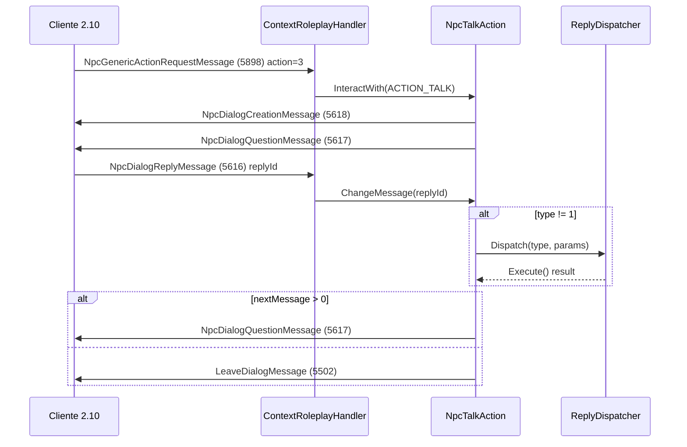

# Fase 2 — Auditoría de código servidor (oficios / professions)

**Fecha:** 2026-06-15  
**Código auditado:** `Sunshine net11.0` (WorldServer + MySql + Protocol)  
**Cliente objetivo:** Dofus 2.10

## Resumen ejecutivo

La infraestructura de diálogos NPC está implementada y cableada a los packets 2.10, pero hay **gaps críticos**: (1) diálogos sin replies cierran silenciosamente sin enviar `LeaveDialogMessage`; (2) `LearnJobReply` no notifica al cliente ni persiste inmediatamente; (3) `EnsureAutoLearnJobs` en login otorga 33 oficios automáticamente, enmascarando el flujo NPC; (4) XP de oficio solo se envía al cliente en subida de nivel, no en cada recolección.

---

## Mapa de handlers

| Área | Archivo | Clase |
|---|---|---|
| Hablar con NPC | `Handlers/Context/RolePlay/ContextRoleplayHandler.cs` | `HandleNpcGenericActionRequestMessage` (5898) |
| Seleccionar respuesta | `ContextRoleplayHandler.cs` | `HandleNpcDialogReplyMessage` (5616) |
| Cerrar diálogo (ESC) | `Handlers/Dialogs/DialogHandler.cs` | `HandleLeaveDialogRequestMessage` (5501) |
| Flujo diálogo | `Game/Actors/Npcs/Actions/NpcTalkAction.cs` | `Execute`, `ChangeMessage` |
| Dispatch acciones reply | `Game/Actors/Npcs/Replies/ReplyDispatcher.cs` | `Dispatch` |
| Aprender oficio | `Game/Actors/Npcs/Replies/LearnJobReply.cs` | `[ReplyHandler(8)]` |
| Cerrar diálogo reply | `Game/Actors/Npcs/Replies/EndDialogReply.cs` | `[ReplyHandler(0)]` |
| Registro handlers | `BaseServer/Loaders/World/Npcs/NpcsLoader.cs` | Reflection `[ReplyHandler(n)]` |
| Oficios personaje | `Game/Actors/Characters/Jobs/JobsCollection.cs` | Load, AddJob, AddExperience |
| Notificación cliente jobs | `Handlers/Characters/Jobs/JobHandler.cs` | Solo **envío** (sin handlers entrantes) |
| Comando `.oficio` | `Commands/Player/JobCommand.cs` | Aprender/especializar con sync cliente |
| Auto-learn login | `Handlers/Characters/CharacterHandler.cs` | `EnsureAutoLearnJobs` |
| Harvest | `Handlers/Interactives/InteractiveHandler.cs` + `Skills/SkillHarvest.cs` | `InteractiveUseRequestMessage` (5001) |
| Persistencia | `MySql/Database/Managers/CharacterManager.cs` | `GetCharacterJobs`, `SaveJobs` |

---

## Respuestas a las preguntas clave

### 1. ¿Qué packet recibe el servidor cuando el jugador habla con NPC?

**`NpcGenericActionRequestMessage` (ID 5898)**

```csharp
// ContextRoleplayHandler.cs — npcActionId = 3 para ACTION_TALK
[WorldHandler(5898)]
HandleNpcGenericActionRequestMessage → Npc.InteractWith((NpcActionTypeEnum)message.npcActionId, character)
```

Campos relevantes: `npcId`, `npcActionId` (3 = Talk), `npcMapId`.

**Respuesta servidor:**
- `NpcDialogCreationMessage` (5618)
- `NpcDialogQuestionMessage` (5617) — si hay replies

### 2. ¿Qué packet recibe cuando selecciona una respuesta?

**`NpcDialogReplyMessage` (ID 5616)**

```csharp
[WorldHandler(5616)]
HandleNpcDialogReplyMessage → NpcTalkAction.ChangeMessage(message.replyId)
```

### 3. ¿Qué action type usa el servidor para aprender oficio?

**Reply type `8`** → clase `LearnJobReply`  
Parámetro: `Parameters[0]` = job ID (`sbyte`), ej. `"2"` para leñador.

> Nota: `ActionsEnum.ACTION_CHARACTER_LEARN_JOB = 603` existe en protocolo pero **no se usa** en el flujo NPC.

### 4. ¿Qué action type usa para cerrar diálogo?

| Mecanismo | Type / Packet |
|---|---|
| Reply "cerrar" | **Type 0** → `EndDialogReply` |
| Sin siguiente mensaje | Auto `LeaveDialogMessage` (5502) en `NpcTalkAction` |
| ESC / botón cerrar | `LeaveDialogRequestMessage` (5501) → `SendLeaveDialogMessage` |
| Teleport, Bank, Dopeul, Cinematic | Cierran diálogo tras ejecutar acción |

**Reply type 1** = solo navegación (sin dispatch a handler).

### 5. ¿Existe handler completo o está incompleto?

| Componente | Estado | Detalle |
|---|---|---|
| Abrir diálogo / routing replies | **Completo** | `NpcTalkAction` + `ReplyDispatcher` |
| Cerrar diálogo (type 0, ESC) | **Completo** | `EndDialogReply`, `DialogHandler` |
| Aprender oficio (type 8) | **Incompleto** | Solo memoria; sin packets cliente; sin validación 3-oficios con mensaje |
| Diálogo sin replies | **Bug** | `SendNpcDialogQuestionMessage` retorna sin enviar nada si `GetDialogRepliesId.Count <= 0` |
| Tipos -1/-2/-3 | **Roto** | Sin handler → `ReplyDispatcher` retorna false → diálogo bloqueado |
| Lista oficios al login | **Ausente** | `JobHandler.SendVisibleJobDataMessage` no se llama en `EnterWorld` |
| XP incremental | **Parcial** | Solo `JobLevelUpMessage` + `JobExperienceUpdateMessage` al subir nivel |
| Harvest | **Completo** | Timer, loot, respawn, `ObjectFoundWhileRecoltingMessage` |
| `JobListedUpdateMessage` (6016) | **No implementado** | Definido en protocolo, nunca enviado |

### 6. ¿Hay logs suficientes?

**No.** Solo `ReplyDispatcher` loguea errores de tipo desconocido. Sin logging en:
- Apertura/cierre de diálogo
- Selección de reply
- LearnJob / EndDialog
- AddExperience / Harvest
- SaveJobs

→ **Fase 4** agrega logging temporal obligatorio.

### 7. ¿El servidor envía al cliente la actualización del oficio aprendido?

| Vía | Envía packets job? |
|---|---|
| NPC `LearnJobReply` (type 8) | **NO** |
| Comando `.oficio aprender` | **SÍ** — `JobDescriptionMessage`, `JobExperienceMultiUpdateMessage`, `JobCrafterDirectorySettingsMessage` |
| Taller FM (`SkillWorkshopFM`) | **SÍ** — `SendVisibleJobDataMessage` |
| Login (`EnsureAutoLearnJobs`) | **NO** — agrega en memoria sin notificar |
| Subida nivel (harvest/craft) | **SÍ** — `JobLevelUpMessage`, `JobExperienceUpdateMessage` |

**`JobListedUpdateMessage` (6016)** — el packet estándar para add/remove job en lista — **nunca se envía**.

### 8. ¿El personaje queda persistido correctamente?

| Operación | Persistencia |
|---|---|
| Load | `JobsCollection` ctor → `CharacterManager.GetCharacterJobs()` desde `characters_jobs` |
| AddJob (NPC o comando) | Solo en memoria (`List<CharacterJobRecord>`) |
| Save | `CharacterManager.Save()` → `SaveJobs()` (DELETE all + INSERT) en **logout** o world save |
| Creación personaje | `CreateCharacterJobs()` **vacío** — sin oficios iniciales |

**Riesgo:** Si el servidor crashea tras aprender oficio por NPC, el oficio se pierde.

---

## Flujo de diálogo (diagrama)



---

## Bug crítico: diálogo sin replies

```213:217:Sunshine net11.0/Sunshine net11.0/Sunshine.WorldServer/Handlers/Context/RolePlay/ContextRoleplayHandler.cs
            if (npc.GetDialogRepliesId.Count <= 0)
            {
                client.Character.Dialog = null;
                return;
            }
```

Tras `NpcDialogCreationMessage`, si el NPC no tiene replies (caso Incarnam oficios), el servidor:
1. Envía `NpcDialogCreationMessage` ✓
2. **No envía** `NpcDialogQuestionMessage` ✗
3. **No envía** `LeaveDialogMessage` ✗
4. Pone `Dialog = null` en servidor

→ Cliente queda en estado de diálogo roto.

---

## LearnJobReply — implementación actual

```16:25:Sunshine net11.0/Sunshine net11.0/Sunshine.WorldServer/Game/Actors/Npcs/Replies/LearnJobReply.cs
        public override bool Execute()
        {
            sbyte job = sbyte.Parse(Parameters[0] as string);
            if (Client.Character.Jobs.HasJob(job))
                return false;
            Client.Character.Jobs.AddJob(job);
            return true;
        }
```

**Falta:**
- `JobHandler.SendVisibleJobDataMessage` o `JobListedUpdateMessage`
- Mensaje al jugador si ya tiene 3 oficios base (`AddJob` retorna silenciosamente)
- Persistencia inmediata
- Logging

---

## EnsureAutoLearnJobs — conflicto con diseño 3+3

En `CharacterHandler` al seleccionar personaje se ejecuta `EnsureAutoLearnJobs` que agrega **33 job IDs** incluyendo todos los oficios base y especializaciones. Esto:
- Hace que NPCs de Incarnam sean cosméticos para jugadores que ya loguearon
- Oculta bugs de LearnJob durante pruebas
- No sincroniza cliente (misma lista vacía en UI hasta workshop/`.oficio`)

---

## Harvest — flujo funcional

```
InteractiveUseRequestMessage (5001)
  → InteractiveHandler
  → SkillDispatcher → SkillHarvest
  → InteractiveUsedMessage, StatedElementUpdatedMessage
  → [timer] → LootItem → ObjectFoundWhileRecoltingMessage
  → JobsCollection.AddExperience (solo packet si level-up)
```

---

## Fixes de código recomendados (post-auditoría)

| Prioridad | Fix |
|---|---|
| P0 | Enviar `LeaveDialogMessage` cuando no hay replies (o no abrir diálogo) |
| P0 | `LearnJobReply`: llamar `JobHandler.SendVisibleJobDataMessage` + `JobListedUpdateMessage` |
| P0 | Desactivar o condicionar `EnsureAutoLearnJobs` en producción |
| P1 | Handlers para tipos -1/-2/-3 (quest states) o corregir DB |
| P1 | `AddExperience`: enviar `JobExperienceUpdateMessage` en cada gain |
| P1 | `SendVisibleJobDataMessage` en login/EnterWorld |
| P2 | Save inmediato tras LearnJob |
| P2 | Alinear `runes_effects` / `runes_effect` |
