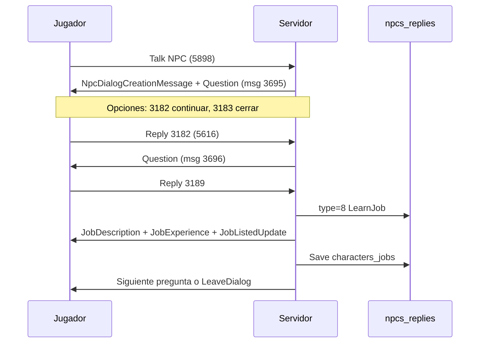

# Fase 0 — Plan P0: Fix oficios Incarnam

**Rama:** `feature/professions-p0-incarnam-fix`  
**Fecha:** 2026-06-15  
**Cliente:** Dofus 2.10

## Objetivo P0

Flujo mínimo validable:

```
NPC oficio → diálogo válido → aprender oficio → UI visible → recolectar → XP → persistir tras relog
```

## Pre-requisitos verificados

| Check | Estado | Detalle |
|---|---|---|
| Backup DB local | Manual | `docker exec sunshine-db mysqldump -usunshine -pchange-me-app sunshine > backup_pre_p0.sql` |
| Migraciones SQL repo | OK | Solo 3 migraciones en `database/migrations/`; patch P0 en `docs/professions-audit/sql/` |
| Build Sunshine | OK | `dotnet build Sunshine.csproj` sin errores |
| Logs temporales | OK | `[NpcDialog]`, `[NpcReply]`, `[NpcAction]`, `[JobLearn]`, `[Harvest]`, `[JobXp]` |

## Causa raíz (resumen)

1. **DB:** NPCs 863/881/882/883 sin `DialogRepliesIdCSV` ni `npcs_replies`.
2. **Código:** Diálogo sin replies dejaba cliente bloqueado (sin `LeaveDialogMessage`).
3. **Código:** `LearnJobReply` no notificaba cliente ni persistía inmediatamente.
4. **Código:** `EnsureAutoLearnJobs` impedía validar aprendizaje NPC → **deshabilitado temporalmente en P0** (P1: config flag).

## Job IDs confirmados (tabla `jobs`)

| Oficio | NPC | jobId | Validado DB |
|---|---|---:|:---:|
| Paysan | 863 | **28** | ✓ |
| Bûcheron | 881 | **2** | ✓ |
| Chasseur | 882 | **41** | ✓ |
| Pêcheur | 883 | **36** | ✓ |

## Fases de implementación

| Fase | Entregable | Commit |
|---|---|---|
| 0 | Este documento | — |
| 1 | Fix diálogo vacío → `AutoClose` | `fix: safely close npc dialogs without replies` |
| 2 | SQL patch Incarnam | `sql: add incarnam profession npc replies` |
| 3 | Fix `LearnJobReply` + persist + notify | `fix: notify client after learning profession from npc` |
| 4 | Doc validación manual | `docs: add p0 professions validation report` |
| 5 | Queries validación DB | `sql: add profession state validation queries` |
| 6 | PR | `fix: restore Incarnam profession learning flow` |

## Flujo de diálogo Incarnam (post-patch)



## Aplicar patch SQL local

```bash
docker exec -i sunshine-db mysql -usunshine -pchange-me-app sunshine < docs/professions-audit/sql/patch_incarnam_profession_replies.sql
```

## Rollback SQL

```bash
docker exec -i sunshine-db mysql -usunshine -pchange-me-app sunshine < docs/professions-audit/sql/restore_incarnam_profession_replies.sql
```

## Pendiente P1 (fuera de P0)

- `EnsureAutoLearnJobs` detrás de config flag
- Tipos negativos NPC 843
- Auditoría global NPCs de oficio
- Limpieza/configuración de logs temporales
