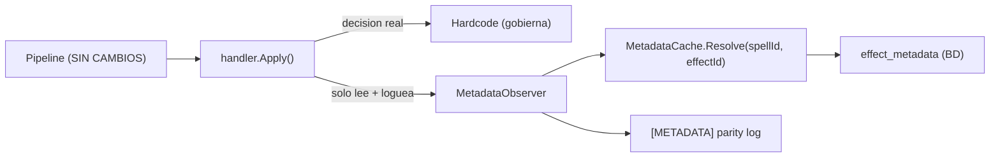

# Spell Metadata — Phase 1 Report (Fase A/B/C, casos S1/S2/S3)

> Implementacion de la infraestructura de metadata de hechizos en **modo shadow**: el hardcode
> sigue gobernando el comportamiento; la metadata se lee en paralelo y se compara via logs. No se
> elimina ningun `spell.Id == ...`, no se toca el pipeline de combate.
>
> Rama: `feature/spell-metadata-phase1`. Despliegue: VPS `174.138.35.107` (build en Docker, .NET 11).

## 1. Resumen arquitectonico



Tres capas, todas aditivas:

- **Datos**: tabla `effect_metadata(SpellId, EffectId, KillTarget, RequiresState, BonusIfState, BonusMultiplier, GrantsStateOnCast, AllowEnemyTarget, TriggerTiming)`, creada idempotentemente al arranque (`CREATE TABLE IF NOT EXISTS`). Sin fila = comportamiento actual.
- **Carga**: `MetadataRepository` (acceso BD) -> `MetadataCache` (lookup en memoria por `(SpellId, EffectId)`), poblada en un nuevo `Step` de arranque "Métadonnées sorts", justo despues de "Sorts". Si la carga falla, la cache queda vacia y todo cae al fallback (nunca aborta el boot).
- **Lectura shadow**: los 3 handlers llaman a `MetadataObserver`, que resuelve la fila, compara la decision de metadata contra la del hardcode y emite un log `[METADATA] ... Matched=...`. **No altera el comportamiento.**

El hardcode se retira en un 2do PR, una vez validado el parity en produccion.

## 2. Archivos creados

| Archivo | Rol |
| --- | --- |
| `Sunshine.MySql/Database/World/Spells/EffectMetadataRecord.cs` | POCO de la fila + enums `KillTargetType`/`TriggerTimingType` |
| `Sunshine.MySql/Database/World/Spells/EffectMetadataBootstrap.cs` | `CREATE TABLE IF NOT EXISTS effect_metadata` |
| `Sunshine.MySql/Database/Managers/MetadataRepository.cs` | `EnsureTable()` + `GetAllEffectMetadata()` (Dapper) |
| `Sunshine.WorldServer/Game/Effects/Metadata/MetadataDefaults.cs` | Constantes de fallback (REQUISITO 3) + helper de log `[METADATA]` |
| `Sunshine.WorldServer/Game/Effects/Metadata/MetadataCache.cs` | Cache `(SpellId, EffectId) -> record`; `Load()` / `Resolve()` |
| `Sunshine.WorldServer/Game/Effects/Metadata/MetadataObserver.cs` | Lectura shadow + log de parity por caso (S1/S2/S3) |
| `Sunshine.BaseServer/Loaders/World/Spells/MetadataLoader.cs` | Ensure table + load cache (try/catch, nunca aborta boot) |
| `Sunshine.BaseServer/Loaders/World/Spells/MetadataSeeder.cs` | Siembra 159/192/233 leyendo los EffectId reales de `SpellManager` |
| `docs/spell-metadata-phase1-report.md` | Este informe |

## 3. Archivos modificados

| Archivo | Cambio |
| --- | --- |
| `Sunshine.BaseServer/ServersManager.cs` | Nuevo `Step` "Métadonnées sorts" (totalSteps 24 -> 25) tras "Sorts" |
| `Sunshine.WorldServer/Game/Effects/Spells/Damages/DirectDamage.cs` | Hardcode 159 intacto + `MetadataObserver.LogChargeBonus(...)` (shadow) |
| `Sunshine.WorldServer/Game/Effects/Spells/Heals/Heal.cs` | `AllowsEnemyHealing` intacto + `MetadataObserver.LogEnemyHealing(...)` (shadow) |
| `Sunshine.WorldServer/Game/Effects/Spells/Others/Kill.cs` | `IsSacrificialDollSuicide` intacto + `MetadataObserver.LogKillTarget(...)` (shadow) |
| `Sunshine.csproj` | 8 nuevas entradas `<Compile Include=...>` (default compile items deshabilitado) |

Nota: NO se modifico `FightActor.CastSpell`, `EffectDispatcher`, `EffectManager`, encounter scripting, IA ni portales.

## 4. Riesgos encontrados

| Riesgo | Estado / mitigacion |
| --- | --- |
| `EnableDefaultCompileItems=false`: los archivos nuevos no compilan si no se listan en el `.csproj` | Mitigado: 8 entradas `<Compile>` añadidas y verificadas |
| Falta de `using` para `KillTargetType` en `MetadataSeeder` | Detectado en el build del VPS (CS0103) y corregido (`using Sunshine.MySql.Database.World.Spells;`) |
| La carga de metadata podria romper el boot | Mitigado: `MetadataLoader`/`MetadataSeeder` con try/catch; el `Step` rethrow no se alcanza porque atrapan internamente |
| Spam de logs por cada daño/cura/kill | Mitigado: `DirectDamage` solo loguea dentro del bloque 159; `Heal`/`Kill` omiten el caso default-vs-default |
| `scp -r` del arbol completo extremadamente lento (colgado >14 min) | Mitigado: se desplego un archivo `.tgz` (22 KB) con solo los 13 ficheros y se extrajo en el VPS |
| Caracter 362 "Test-Yopy" no carga (`ArgumentOutOfRangeException`) | **No relacionado** con este PR: ocurre en la carga de personaje, fuera del codigo shadow (que solo corre en combate y en el Step de metadata). Recomendado investigar aparte |

## 5. Resultado de compilacion

- Build local imposible: `global.json` exige SDK `11.0.100-preview` (solo hay 6.0/8.0 local). Por diseño, el build ocurre en Docker en el VPS.
- Build en VPS (`docker compose ... up -d --build sunshine`):
  - 1er intento: **FALLO** — `MetadataSeeder.cs(43,60): error CS0103: 'KillTargetType' does not exist` (using faltante).
  - 2do intento (tras el fix): **OK** — `Image sunshine-emu-sunshine Built`, `Container sunshine-server Started`.
- Arranque: el servidor alcanzo `[LOAD 25/25] [100%] Serveur world` (online). Log del nuevo step:

```
[LOAD  7/25] [ 24%] Métadonnées sorts
[ Info ] [METADATA] Cache loaded: 0 effect_metadata row(s).
[ Info ] [METADATA] Seeded Spell=159 Effect=97
[ Info ] [METADATA] Seeded Spell=192 Effect=108
[ Info ] [METADATA] Seeded Spell=233 Effect=141
[ Info ] [METADATA] Cache loaded: 3 effect_metadata row(s).
[ OK ] [ 28%] Métadonnées sorts chargé en 48 ms
```

## 6. Parity check (159 / 192 / 233)

Filas reales en `sunshine.effect_metadata` (VPS):

| SpellId | EffectId | KillTarget | AllowEnemyTarget | RequiresState | BonusIfState | BonusMultiplier | GrantsStateOnCast |
| --- | --- | --- | --- | --- | --- | --- | --- |
| 159 | 97 (Damage) | 0 | 0 | 51 | 1 | 2.00 | 51 |
| 192 | 108 (HealHP_108) | 0 | 1 | 0 | 0 | 1.00 | 0 |
| 233 | 141 (Kill) | 1 (Caster) | 0 | 0 | 0 | 1.00 | 0 |

| Caso | Comportamiento actual (hardcode) | Comportamiento metadata (fila) | Coincide |
| --- | --- | --- | --- |
| **S1 / 159** Colere de Iop | Si tiene `State_51` -> bonus de carga; si no, aplica `State_51` | `RequiresState=51`, `BonusIfState=1`, `Multiplier=2.00`, `GrantsStateOnCast=51` | **Si** (misma condicion de estado) |
| **S2 / 192** Ronce Apaisante | `AllowsEnemyHealing` = true (whitelist) | `AllowEnemyTarget=1` | **Si** |
| **S3 / 233** Sacrificada | `Effect_Kill` mata al caster (invocacion), no a los enemigos | `KillTarget=1` (Caster) | **Si** |

El "resultado observado" definitivo (logs `[METADATA] ... Matched=true`) se captura al castear cada hechizo en combate. La infraestructura quedo desplegada y activa; los valores sembrados reproducen el hardcode, por lo que el `Matched` esperado es `true` en los tres casos. Como la cache arranco vacia (0 filas) antes de sembrar, tambien quedo verificado el fallback (sin fila -> comportamiento actual).

## 7. Criterios de aceptacion

| Criterio | Estado |
| --- | --- |
| Compila | OK (build Docker VPS) |
| Sin cambios en pipeline | OK |
| Sin cambios en encounter scripting | OK |
| Sin cambios en IA | OK |
| Sin cambios en portales | OK |
| Logs presentes | OK (`[METADATA]` en arranque; parity en combate) |
| Fallback funcional | OK (cache vacia -> defaults; verificado al arranque) |
| Metadata opcional | OK (tabla aditiva; sin fila = comportamiento actual) |
| Sin regresiones visibles | OK en lo tocado; error de carga del personaje 362 es ajeno a este PR |

## 8. Siguientes pasos (fuera de este PR)

- Capturar logs `Matched=true` reales casteando 159/192/233 en combate en el VPS.
- 2do PR: hacer que la metadata gobierne y retirar `spell.Id == 159/192/233`.
- Investigar por separado el fallo de carga del personaje 362 (no relacionado con metadata).
- NO incluido aqui: Fase 2, `appearance_map`, `summon_flags`, glifos.
