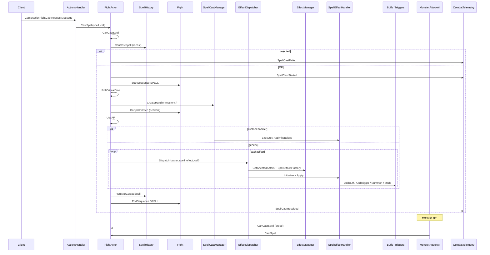

# Fase 1 — Mapa técnico del pipeline de hechizos

**Fecha:** 2026-06-16  
**Fuente:** código Sunshine.WorldServer (no inventado)  
**Base path:** `Sunshine net11.0/Sunshine net11.0/Sunshine.WorldServer/`

---

## Diagrama de flujo global



---

## 1. Recepción del cast (jugador)

| Paso | Clase / método | Archivo |
| --- | --- | --- |
| Mensaje red | `ActionsHandler` (cast request) | `Handlers/Actions/ActionsHandler.cs` |
| Entrada cast | `FightActor.CastSpell(Spell spell, short cell)` | `Game/Actors/Fighters/FightActor.cs` ~743 |
| Cierre combate | `FightActor.CastCloseCombat` vía spell.Id==0 | `CharacterFighter.cs` |

**Telemetría actual:** `CombatTelemetry.LogSpellEvent` + `FightCombatLogger.LogSpellCast*`

---

## 2. Validación pre-cast

`FightActor.CanCastSpell(spell, cell)` (~888):

| Check | Result enum | Notas |
| --- | --- | --- |
| Turno / vivo | `CANNOT_PLAY` | `IsFighterTurn()`, `IsDead()` |
| Tiene hechizo | `HAS_NOT_SPELL` | `HasSpell` |
| AP | `NOT_ENOUGH_AP` | `Stats.AP` vs `spell.Template.ApCost` |
| Bomba límite | `UNKNOWN` | `HasReachedBombPlacementLimit` |
| Celda libre/ocupada | `CELL_NOT_FREE` | `NeedFreeCell`, `NeedTakenCell` |
| Estados | `STATE_FORBIDDEN` / `STATE_REQUIRED` | `spell.StatesForbidden/Required` |
| Zona alcance | `NOT_IN_ZONE` | `GetCastZone` → Cross/Lozenge |
| Historial relanzamiento | `HISTORY_ERROR` | `SpellHistory.CanCastSpell` |

**Gaps para telemetría:**

- No hay log explícito de **LoS** (line of sight) en `CanCastSpell` — verificar si existe en otra capa o cliente-only
- No se registran AP antes/después ni estado de relanzamiento en JSONL
- `GetCastZone` no loguea celdas válidas vs celda objetivo

**Archivos relacionados:**

- `Game/Spells/SpellHistory.cs` — recast, MaxCastPerTurn
- `Game/Maps/Pathfinding/Shapes/*` — Cross, Lozenge

---

## 3. Resolución crítico y selección de efectos

Dentro de `CastSpell` (~795):

```csharp
FightSpellCastCriticalEnum spellCastCritical = RollCriticalDice(spell);
List<Effect> effects = spellCastCritical == NORMAL
    ? spell.Effects
    : spell.CriticalEffects;
```

| Componente | Archivo |
| --- | --- |
| Roll crítico | `FightActor.RollCriticalDice` |
| Lista efectos | `Spell.Effects` / `Spell.CriticalEffects` (datos BD) |

**Hipótesis Engaño crítico bajo:** rama `CriticalEffects` en BD con dados menores — telemetría debe loguear `critical=CRITICAL_HIT` + effect dice usados.

---

## 4. Cast handler custom vs genérico

| Ruta | Entrada | Archivo |
| --- | --- | --- |
| Custom | `SpellCastManager.CreateHandler(...)` | `Game/Spells/Casts/SpellCastManager.cs` |
| Registro | `[SpellCastHandler(spellId)]` | `Game/Spells/Casts/**/*.cs` |
| Ejemplo Iop | `ColereHandler` — **spellId 143** | `Game/Spells/Casts/Iop/ColereHandler.cs` |
| Fallback | `EffectDispatcher.Dispatch` por efecto | `EffectDispatcher.cs` |

**Hallazgo:** `IopsWrath` enum = **159**, pero `ColereHandler` registrado en **143**; `DirectDamage` tiene lógica hardcoded `Spell.Id == 159`. Posible doble vía inconsistente.

Sadida invocación 189: `SacrifierHandler.cs` (comentado / flujo estándar según docs).

---

## 5. Dispatch de efectos

`EffectDispatcher.Dispatch(FightActor caster, Spell spell, Effect effect, short cell, ...)`:

1. `EffectManager.Instance.SpellEffects[effect.Id]()` — factory
2. `EffectManager.GetAffectedActors(caster, effect, cell)` — objetivos
3. `spellEffect.Initialize([15 params])` — incluye DiceNum, DiceFace, Duration, Target mask, affectedActors
4. Handler no llama `Apply()` en Dispatcher — **Initialize termina en Apply vía handler**

**Telemetría:** `EffectResolved` / `EffectFailed` + `FightCombatLogger.LogEffectDispatch`

**Gap:** no se loguean `affectedActors` ids ni target mask evaluado por celda.

---

## 6. Selección de objetivos (target mask)

`EffectManager.GetAffectedActors` (~166):

| `effect.Target` | Comportamiento |
| --- | --- |
| `ALLY_ALL` | Aliados en zona |
| `ENEMY_ALL` | Enemigos en zona |
| `3840` | Cualquiera excepto caster |
| `ONLY_SELF` | Solo caster |
| **default** | **Cualquier fighter en celda** |

Zona: `Zone(effect.ZoneShape, ZoneSize, ZoneMinSize)` → celdas → `Fight.GetOneFighter(cell)`.

**Capa clave para:** Sacrificio Muñequero, Desinvocación, curas Néctar (fix Heal), Látigo (si mask = summon-only en BD pero default en código).

---

## 7. Fórmula de daño

| Etapa | Clase | Archivo |
| --- | --- | --- |
| Resolución dados | `EffectDamageResolver.ResolveDice(Effect)` | `Damages/EffectDamageResolver.cs` |
| Construcción | `new Damage(school, diceNum, diceFace, spell, caster)` | `Damages/Damage.cs` |
| Roll | `Damage.GenerateDamages()` | min/max random o Max/MinEffects |
| Aplicación | `FightActor.InflictDamage(Damage)` | Resistencias, escudo, castigo |
| % castigo | `PunishmentDamage.cs` | Daño % vida |
| Ira Iop | `DirectDamage` state 51 +80 diceNum | Hardcode spell 159 |

**Telemetría:** `FightCombatLogger.LogDamage` — amount final, school; **no** baseMin/Max ni roll intermedio.

---

## 8. Buffs y castigos

| Tipo | Creación | Tick / trigger |
| --- | --- | --- |
| Stat buff | `StatsBoost`, handlers Add* | Duración turnos |
| Castigo reactivo | `PunishmentBoost` → `PunishmentBuff` | `FightActor.InflictDamage` → `OnDamaged` |
| Sacrificio | `Sacrifice.cs` | Buff en objetivo |
| Trigger genérico | `TriggerBuff` + `BuffTriggerType` | `FightActor.TriggerFightBuffs` en StartTurn/EndTurn |
| DOT | `DamageOverTimeBuff` | Tick en trigger o buff apply |
| HOT | `HealOverTimeBuff` | Idem |

Archivos buff base: `Game/Fights/Buffs/Buff.cs`, `Customs/TriggerBuff.cs`, `Spells/PunishmentBuff.cs`.

---

## 9. Poison / ticks / delayed

Tres mecanismos distintos:

| Mecanismo | Handler | Tick |
| --- | --- | --- |
| Robo HP duración | `HpSteal` → `TriggerBuff(TURN_BEGIN)` | `OnTurnBegin` steal + heal 50% |
| Daño duración | `DirectDamage` → `DamageOverTimeBuff` | Buff tick (ver `DamageOverTimeBuff.cs`) |
| Glifo/trampa | `GlyphSpawn`/`TrapSpawn` | Activación movimiento/turno → relanzar spell interno |

Disparo turno: `FightActor.StartTurn` → `TriggerFightBuffs(BuffTriggerType.TURN_BEGIN)` (~StartTurn).

---

## 10. Glifos y trampas

| Componente | Archivo |
| --- | --- |
| Spawn | `Effects/Spells/Marks/GlyphSpawn.cs`, `TrapSpawn.cs` |
| Entidad mapa | `Fights/Triggers/Glyph.cs`, `Trap.cs`, `MarkTrigger.cs` |
| Activación movimiento | `Fight.ShouldTriggerOnMove`, `TriggerMarks` |
| Fin turno | `FightActor.EndTurn` → `TriggerMarks(TURN_END)` |

---

## 11. Invocaciones

| Paso | Método | Archivo |
| --- | --- | --- |
| Handler | `Summon.Apply()` | `Effects/Spells/Summon/Summon.cs` |
| Celda | Búsqueda celda libre adyacente | ~54–87 |
| Actor | `SummonedMonster`, `SummonedStaticMonster`, `BombFighter` | `Actors/Fighters/` |
| Slot cliente | `stats.summoner` | Fix d0450b3 |
| Muerte | `Kill.cs` spell 233, `Die()`, `DiesAtTurnEnd` | Varios |

IA muñeca Sacrificada: `SummonedMonster` + spells en template monstruo 116.

---

## 12. IA spell selection (mobs/bosses)

| Componente | Archivo | Comportamiento |
| --- | --- | --- |
| Driver | `AIFighter.PlayAIAsync` | Delay configurable |
| Ataque | `MonsterAttackAI.TryCastBestSpellAsync` | Loop enemies × spells; `CanCastSpell` probe |
| Soporte | `TryCastSupportAsync` | Self + allies |
| Telemetría | `CombatTelemetry.LogTurnEvent("AiActionSelected")` | Solo si AP bajó post-cast |
| Boss hooks | `FrigostBossMechanics` | OnTurnEnded, summon overrides |

**Gap IA:** no se loguean spells **rechazados** en el loop (solo el cast exitoso por AP delta).

Monstruos como Snifter Cell / Cil / Dragocerdo: spells vienen de **BD** (`MonsterGrade.Spells`); IA genérica no tiene script por boss salvo Frigost.

---

## 13. Secuencias de red

| Evento | Método |
| --- | --- |
| Inicio secuencia spell | `Fight.StartSequence(SEQUENCE_SPELL)` |
| Fin secuencia | `Fight.EndSequence(SEQUENCE_SPELL, ACTION_FIGHT_CAST_SPELL)` |
| Cast visible | `Fight.OnSpellCasted` → `GameActionFightSpellCastMessage` |
| Sync turno | `GameFightSynchronizeMessage` en StartTurn/EndTurn |

Rollback tiene `ActiveSequenceCount` + ReadyChecker; Sunshine **no** bloquea cast por secuencia pendiente del cliente.

---

## 14. Puntos de inyección recomendados para telemetría spell-level

Prioridad P0 (solo observación):

| # | Punto | Evento propuesto |
| --- | --- | --- |
| 1 | `CanCastSpell` return != OK | `SpellValidationFailed` con reason + context |
| 2 | `CastSpell` pre-AP / post-AP | `SpellCastContext` |
| 3 | Post `GetAffectedActors` | `EffectTargetsResolved` |
| 4 | Pre/post `GenerateDamages` | `DamageCalculated` |
| 5 | `InflictDamage` / `Heal` | enriquecer con resist + HP before/after |
| 6 | `AddBuff` / `TriggerFightBuffs` | `BuffLifecycle` |
| 7 | `Summon.Apply` branches | ya parcial SUMMON_* |
| 8 | `MonsterAttackAI` inner loop | `AiSpellProbe` rejected reason |
| 9 | `Glyph`/`Trap` activation | `MarkTriggered` |

---

## 15. Referencias cruzadas

- [PHASE_00_EXISTING_DOCS_AUDIT.md](./PHASE_00_EXISTING_DOCS_AUDIT.md)
- [PHASE_02_TELEMETRY_DESIGN.md](./PHASE_02_TELEMETRY_DESIGN.md)
- [effects-catalog-phase2/execution-pipeline.md](../effects-catalog-phase2/execution-pipeline.md)
- [combat-system-audit.md](../combat-sanitization/combat-system-audit.md)
