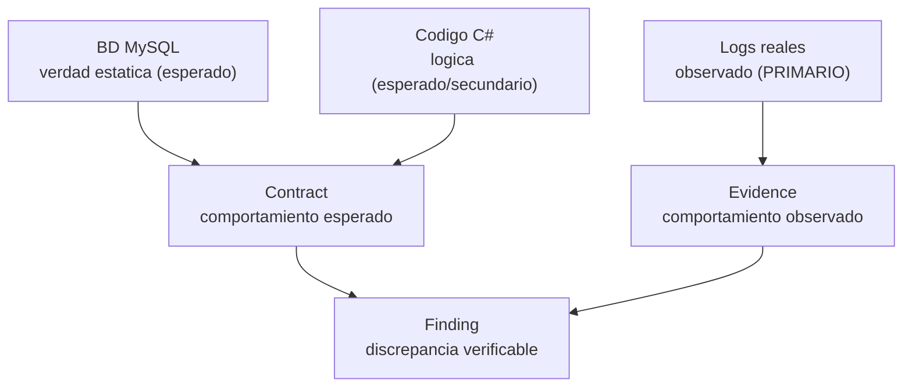

# 00 — Visión: Grafo Maestro del Emulador Sunshine

> Documento raíz. Define la premisa, los principios, el alcance y el resultado esperado del proyecto `grafo_emu/`.
> **Estado:** diseño (no implementación). No se escribe código ni se modifica MCP-2 en esta fase.

---

## 1. Premisa

El emulador Sunshine (Dofus 2.x, .NET 11) acumula conocimiento en cuatro fuentes inconexas:

1. **Código C#** — la lógica real (~1.607 archivos).
2. **Base de datos MySQL** — los datos estáticos del juego (`database/sunshine.sql`, 82 tablas).
3. **Logs reales** — el comportamiento observado en producción (FightCombatLogger ~80k líneas, telemetría JSONL ~48k casts).
4. **MCP-2** — derivados ya computados sobre las tres anteriores (5 bases SQLite).

Estas fuentes hoy solo se cruzan dentro de la cabeza de quien depura, o de forma parcial dentro de cada servidor MCP-2. **No existe un modelo unificado** que permita preguntar de forma natural "¿qué sabemos, con qué evidencia, sobre el comportamiento del hechizo 189?".

## 2. Tesis central

> **El objetivo final no es representar el mundo de Dofus, sino representar el conocimiento verificable sobre el comportamiento real del emulador.**

El mundo estático (hechizos, ítems, mapas, monstruos) es el **sustrato/medio**, no el fin. Modelar `Spell 189` o `Item 12116` solo tiene valor si permite **anclar afirmaciones verificables**: qué se *espera* que haga, qué se *observó* que hace, dónde *discrepan*, qué *causa* propuesta lo explica y qué *cambio* lo resolvió.

Por eso el grafo culmina en una **capa explícita de Conocimiento (L5)** que es el propósito de todo el sistema, no un apéndice.

## 3. Principios

| # | Principio | Implicación |
|---|-----------|-------------|
| P1 | **El conocimiento se modela primero** | Las preguntas emergen del grafo; no se diseñan MCP para preguntas predefinidas. |
| P2 | **Las preguntas emergen del grafo** | El catálogo de preguntas (doc 05) se deriva de la conectividad real, no al revés. |
| P3 | **Los MCP futuros son consumidores de solo lectura** | El grafo es la fuente de verdad; ningún MCP es dueño del conocimiento. |
| P4 | **Jerarquía de evidencia** | Logs = evidencia primaria; código = evidencia secundaria; BD = verdad estática; MCP-2 = derivados. |
| P5 | **Toda afirmación lleva procedencia y confianza** | Cada nodo y arista registra de dónde sale y cuán fiable es. |
| P6 | **Neutralidad de motor** | El modelo se expresa en NODO/ARISTA/PROPIEDAD; no se compromete con Neo4j, SQLite ni JSON hasta el roadmap. |
| P7 | **No destruir lo existente** | MCP-2 no se toca; se evalúa como feeder del grafo. |

## 4. Jerarquía de evidencia (clave del modelo)

Cuando código y logs se contradicen, **el log gana** como descripción de lo que el servidor *hace*; el código describe lo que *debería* hacer. La discrepancia es, precisamente, el conocimiento más valioso.

## 5. Alcance

### Dentro de alcance (esta fase)
- Inventario completo del conocimiento disponible y sus huecos (doc 01).
- Catálogo neutral de entidades/nodos por capa, incluida la capa de Conocimiento (doc 02).
- Catálogo de relaciones/aristas explícitas, implícitas y epistémicas (doc 03).
- Modelo de grafo agnóstico de motor con procedencia y confianza (doc 04).
- Catálogo de preguntas emergentes y análisis de conectividad (doc 05).
- Diseño (no ejecución) del plan de ingesta reutilizando MCP-2 (doc 06).
- Roadmap por fases y recomendación arquitectónica final (doc 07).
- Estrategia de reconciliación de identidades entre fuentes (doc 08).

### Fuera de alcance (esta fase)
- Implementación de Neo4j, Memgraph, GraphQL, MCP nuevos o APIs.
- Escritura de código de ingesta o consulta.
- Optimización de rendimiento.
- Modificación de los servidores MCP-2 o sus bases SQLite.

## 6. No-objetivos explícitos

1. **No** es un ORM ni un espejo 1:1 de la BD.
2. **No** es un reemplazo de MCP-2: es la capa de conocimiento que MCP-2 alimentará y consultará.
3. **No** pretende representar cada fila de `items` o `worlds_maps` como nodo desde el día 1; prioriza las entidades con valor epistémico (las que aparecen en contratos, evidencia y hallazgos).
4. **No** decide aún el motor de almacenamiento definitivo; ver doc 07.

## 7. Las cinco capas del grafo

| Capa | Nombre | Naturaleza | Fuente principal |
|------|--------|------------|------------------|
| **L1** | Datos estáticos | Mundo (esperado) | BD MySQL |
| **L2** | Código | Lógica (esperado/secundario) | C# |
| **L3** | Runtime | Comportamiento (observado) | Logs |
| **L4** | Operaciones | Cambio en el tiempo | git / deploys |
| **L5** | **Conocimiento verificable** | **Afirmaciones con evidencia (el FIN)** | Derivada de L1–L4 + MCP-2 |

L1–L4 son el sustrato. **L5 es el producto.**

## 8. Resumen de la recomendación arquitectónica

> Se detalla en [07-roadmap.md](07-roadmap.md). Resumen ejecutivo:

- **Almacén ahora: SQLite** (`grafo_emu/graph.sqlite`, tablas genéricas `nodes`/`edges`/`provenance`) porque 4 de las 5 fuentes ya son SQLite y MCP-2 usa `better-sqlite3`. Coste de adopción casi nulo.
- **Snapshot portable: JSONL** (`nodes.jsonl` / `edges.jsonl`) versionable en git, revisable en PR.
- **Definición canónica: JSON** para el catálogo de tipos de nodo/arista (esquema revisable por humanos).
- **Neo4j / Memgraph: diferir.** Adoptar solo si las consultas multi-salto superan en coste a los CTE recursivos de SQLite. El modelo neutral garantiza una migración limpia el día que haga falta.
- **MCP futuros: solo lectura.** Consultan el grafo; MCP-2 se convierte en *feeder* (escribe nodos/aristas con procedencia) y en *vista* (lee), nunca en dueño del conocimiento.

## 9. Mapa de documentos

| Doc | Contenido | Pregunta que responde |
|-----|-----------|-----------------------|
| [00-vision.md](00-vision.md) | Este documento | ¿Por qué y para qué? |
| [01-inventario-conocimiento.md](01-inventario-conocimiento.md) | Inventario de conocimiento | ¿Qué sabemos y qué nos falta? |
| [02-entidades.md](02-entidades.md) | Catálogo de nodos | ¿Qué entidades existen? |
| [03-relaciones.md](03-relaciones.md) | Catálogo de aristas | ¿Cómo se relacionan? |
| [04-modelo-grafo.md](04-modelo-grafo.md) | Modelo neutral | ¿Cómo se representa? |
| [05-preguntas-emergentes.md](05-preguntas-emergentes.md) | Preguntas emergentes | ¿Qué podemos preguntar? |
| [06-plan-ingesta.md](06-plan-ingesta.md) | Plan de ingesta | ¿Cómo se puebla? |
| [07-roadmap.md](07-roadmap.md) | Roadmap + arquitectura | ¿En qué orden y sobre qué? |
| [08-identity-resolution.md](08-identity-resolution.md) | Reconciliación de identidades | ¿Cómo sabemos que dos cosas son la misma? |

---

*Siguiente: [01-inventario-conocimiento.md](01-inventario-conocimiento.md)*
