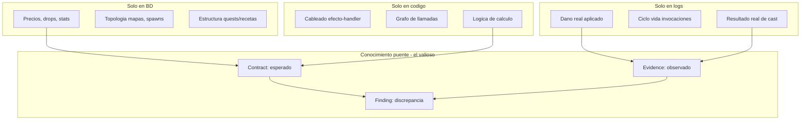

# 01 — Inventario de Conocimiento

> Responde las 8 preguntas de la Fase 1 con datos reales de las cuatro fuentes.
> Cada afirmación se basa en la inspección del repositorio (código `Sunshine net11.0/`, `database/sunshine.sql`, logs VPS, `mcp/`).

---

## Mapa de fuentes (resumen cuantitativo)

| Fuente | Ubicación | Volumen | Naturaleza |
|--------|-----------|---------|------------|
| Código C# | `Sunshine net11.0/Sunshine net11.0/` | ~1.607 archivos `.cs` | Lógica (esperado, secundario) |
| Base de datos | `database/sunshine.sql` + `database/migrations/` | 82 tablas, 0 FKs declaradas | Datos estáticos (verdad estática) |
| Logs combate | VPS `/opt/dofus-2.0.0/logs/fights/` | ~80.512 líneas, 2 fightId | Observado (primario) |
| Telemetría | VPS `/opt/dofus-2.0.0/logs/combat/` | ~48.037 casts JSONL | Observado (primario) |
| MCP-2 | `mcp/*/schema.js` + `mcp/cache/*.sqlite` | 5 bases SQLite | Derivado |

---

## Pregunta 1 — ¿Qué conocimiento existe realmente?

Cinco grandes cuerpos de conocimiento, por naturaleza:

### 1.1 Conocimiento de definición (qué *debería* existir/pasar)
- **BD**: plantillas de hechizos, efectos (en hex), ítems, monstruos, NPCs, quests, recetas, drops, precios, spawns, topología de mapas.
- **Código**: el cableado de despacho (qué clase maneja qué mensaje/efecto/comando), el grafo de llamadas, la lógica de los handlers.

### 1.2 Conocimiento de comportamiento (qué *realmente* pasa)
- **Logs**: cada `CAST`, `DISPATCH`, `DAMAGE`, `HEAL`, `SUMMON_CREATE/FAIL/DIE`, `BUFF_TICK`, `FIGHT_START/END` con timestamp, actor, hechizo, objetivo, cantidad, escuela, veredicto.

### 1.3 Conocimiento derivado (qué ya se computó)
- **data-index.sqlite**: `spells`, `spell_effects`, `contracts` (contrato esperado derivado del hex de efectos).
- **code-index.sqlite**: `types`, `methods`, `attributes`, `calls`, `pipeline_anchors`, `code_snapshots`.
- **evidence.sqlite**: `sessions`, `events`, `casts`, `cast_links`, `findings`, `dossier_spell`.

### 1.4 Conocimiento epistémico (qué *sabemos que falla y por qué*)
- **knowledge.sqlite**: `bugs` (BUG-001..004), `known_signatures`, `bug_links`.
- **eval-battery** (`mcp/test/`): casos dorados reproducibles.

### 1.5 Conocimiento operacional (qué *cambió y cuándo*)
- **deploy.sqlite**: `deploys` con fecha + commit.
- **git**: historial de commits del repo.

---

## Pregunta 2 — ¿Qué entidades existen?

Resumen (catálogo completo en [02-entidades.md](02-entidades.md)).

| Capa | Entidades principales | Conteo aprox. |
|------|----------------------|---------------|
| **L1 datos** | Spell, SpellLevel, Effect, Item, ItemSet, Recipe, Monster, MonsterGrade, Npc, NpcShop, Quest, QuestStep, QuestObjective, Job, Breed, Map, Interactive, Guild, Mount, Dungeon, Account, Character | 82 tablas → ~30 tipos de entidad |
| **L2 código** | CSharpType, Method, Enum, Attribute, MessageHandler, EffectHandler, CommandHandler, SpellCastHandler, Manager, Loader | ~1.607 archivos → tipos/métodos |
| **L3 runtime** | Fight, Session, Cast, LogEvent, Fighter | 2 fights, ~289 FIGHT_START, ~5.220 CAST |
| **L4 ops** | Deployment, Commit | n deploys registrados |
| **L5 conocimiento** | Contract, Evidence, Finding, Hypothesis, BugSignature, TestCase | 4 bugs, n findings, n signatures |

---

## Pregunta 3 — ¿Qué relaciones existen?

Resumen (catálogo completo en [03-relaciones.md](03-relaciones.md)).

### Explícitas en código (alta confianza)
- `Effect --HANDLED_BY--> EffectHandler` vía `[EffectHandler(EffectsEnum.X)]` (~70-80 bindings).
- `MessageId --HANDLED_BY--> MessageHandler` vía `[WorldHandler(id)]` (~152).
- `CommandName --HANDLED_BY--> CommandHandler` vía `[CommandHandler("x")]` (~36).
- `Spell --CAST_BY--> SpellCastHandler` vía `[SpellCastHandler(spellId)]` (~25).
- `Method --CALLS--> Method` vía `calls` (extraído por regex en code-index).
- `CSharpType --MAPS_TABLE--> DatabaseTable` vía `[Table("name")]` (~65 records).

### Implícitas en BD (confianza media-alta, sin FKs)
- `Spell --USES_EFFECT--> Effect` (hex embebido en `spells_levels.Effects`).
- `Monster --DROPS--> Item` (`monsters_drops.MonsterId/ItemId`).
- `Npc --SELLS--> Item` (`npcs_items.NpcId/Item`).
- `Quest --HAS_STEP--> QuestStep --HAS_OBJECTIVE--> QuestObjective` (CSV + columnas).
- `Monster --CASTS--> Spell` (`monsters_spells.SpellsCSV`).
- `Breed --LEARNS--> Spell` (`breeds_spells`).
- `Map --NEIGHBOUR--> Map` (`worlds_maps.*NeighbourId`).
- `WorldNpc --SPAWNS_ON--> Map`, `WorldMonster --SPAWNS_ON--> Map`.

### Epistémicas (el núcleo, derivadas)
- `Contract --DERIVED_FROM--> Spell/Effect`.
- `Evidence --EXTRACTED_FROM--> LogEvent/Cast`.
- `Finding --CONTRADICTS--> Contract` + `Finding --SUPPORTED_BY--> Evidence`.
- `Hypothesis --EXPLAINS--> Finding` + `Hypothesis --SUSPECTS--> Method`.
- `BugSignature --MATCHES--> Evidence` + `--IDENTIFIES--> Bug`.
- `TestCase --VALIDATES--> Contract/Bug` + `--EXERCISES--> Spell`.
- `Deployment --INTRODUCES/RESOLVES--> BugSignature` + `--CHANGES--> Method`.

---

## Pregunta 4 — ¿Qué relaciones faltan?

Relaciones que *deberían* existir pero no están materializadas hoy en ninguna fuente:

| Relación faltante | Por qué falta | Cómo se obtendría |
|-------------------|---------------|-------------------|
| `LogEvent.spell --OBSERVES--> Spell` validado | Los logs traen `spell=189` pero nadie cruza con BD para confirmar que existe | Join determinista en ingesta (doc 08) |
| `Cast.caster --IS--> Character/Monster` | `caster=` en log es id de combatiente efímero, no `characters.Id` | Requiere correlación intra-fight (caso duro, doc 08) |
| `EffectHandler --IMPLEMENTS--> Contract` | El contrato se deriva de BD, no se enlaza al handler que lo realiza | Puente L2↔L5 (gap conocido) |
| `Item.Effects --USES_EFFECT--> Effect` | Igual que spells: efectos en hex en `items.Effects`, sin parsear | Extender effects-parser a items |
| `Deployment --CHANGES--> Method` preciso | deploy.sqlite guarda commit, pero no el diff método-a-método | Cruce git diff ↔ code-index |
| `Hypothesis --CONFIRMED_BY--> Deployment` | No hay arista que cierre el ciclo causa→fix verificado | Derivar de comparar_deploys + findings |
| `Quest --REWARDS--> Spell/Item` | Está en CSV de `quests_steps` pero no expandido | Expandir CSV en ingesta |
| `Map --CONTAINS--> Interactive` runtime | Spawns en BD, pero sin observación de uso real | Falta telemetría de interactivos |

---

## Pregunta 5 — ¿Qué conocimiento está duplicado?

| Conocimiento | Fuente A | Fuente B | Fuente C | Riesgo |
|--------------|----------|----------|----------|--------|
| Definición de hechizos | BD `spells`/`spells_levels` | data-index `spells`/`spell_effects` | code `SpellTemplate` | data-index es copia derivada; puede quedar stale |
| Efectos de hechizo | BD hex en `Effects` | data-index `spell_effects` | EffectsEnum en código | triple representación del mismo id |
| Contrato esperado | data-index `contracts` (derivado) | — implícito en handler C# | — | el contrato vive 2 veces: derivado y codificado |
| Bugs conocidos | knowledge `bugs` | docs `*.md` (informes) | comentarios en código | divergencia narrativa |
| Pipeline de combate | code-index `pipeline_anchors` | docs `informe-logs-combate` | AGENTS.md | 3 descripciones del mismo flujo |
| Anclas de método | code-index `methods` | hardcoded en `indexer.js` PIPELINE_ANCHORS | — | lista fija puede desalinearse del código |
| Eventos de combate | logs crudos | evidence `events` | telemetría JSONL | mismo evento en 2 formatos (texto + JSONL) |

**Conclusión:** el grafo debe tratar los derivados (data-index, evidence) como **proyecciones con procedencia**, no como verdades independientes. La verdad estática es la BD; la verdad de comportamiento es el log crudo.

---

## Pregunta 6 — ¿Qué conocimiento solo existe en código?

Conocimiento que **no** está en BD ni en logs ni en MCP-2 de forma completa:

1. **El cableado de despacho efecto→handler.** Qué clase C# atiende `EffectsEnum.Effect_HealHP_81` solo se sabe leyendo `[EffectHandler(...)]`. La BD solo tiene el id de efecto; el log solo dice `effect=...`.
2. **El grafo de llamadas entre métodos.** `FightActor.CastSpell → EffectDispatcher.Dispatch → SpellEffectHandler.Apply` solo existe como estructura en el código (parcialmente en `calls`).
3. **La lógica condicional de los handlers.** El *cómo* se calcula daño/resistencia/summon (p.ej. el bug histórico de `CalculateDamageResistance` con venenos) solo vive en el cuerpo del método.
4. **El orden del pipeline de combate.** Secuencia cast→dispatch→apply→buff→tick→damage.
5. **Validaciones de cast** (`CanCastSpell`, `SpellHistory`, cooldowns) y sus códigos `SpellCastResult`.
6. **La semántica de los enums** (`EffectsEnum` ~500+ valores, `StatsEnum`, `SpellStatesEnum`).
7. **Las anclas de pipeline** (`PIPELINE_ANCHORS` en indexer.js): cast, dispatch, handler, buff_add, buff_tick, damage, summon, trigger.

---

## Pregunta 7 — ¿Qué conocimiento solo existe en BD?

Conocimiento que **no** está en código (más allá de records de mapeo) ni en logs:

1. **Valores concretos de plantillas**: stats de cada `MonsterGrade`, precio de cada `Item`, `ApCost`/`Range` de cada `SpellLevel`.
2. **Tablas de drop**: `monsters_drops` con `DropRateForGrade1..5` y `ProspectingLock`.
3. **Catálogos de tienda**: `npcs_items` (precio, item, NPC) — base de la economía v2.
4. **Topología del mundo**: `worlds_maps` (vecinos, subárea, celdas), `worlds_maps_positions` (X/Y), spawns (`worlds_npcs`, `worlds_monsters`, `worlds_interactives`, `worlds_triggers`).
5. **Estructura de quests**: pasos, objetivos, recompensas (en CSV).
6. **Recetas y oficios**: `recipes`, `jobs_harvest`, `interactives_skills`.
7. **Progresión**: `experiences` (curvas de XP), `breeds` (stats iniciales por clase).
8. **Estado persistido de jugadores**: `characters*`, `mounts`, `guilds`, `bids_house_items`, inventarios.

---

## Pregunta 8 — ¿Qué conocimiento solo existe en logs?

Conocimiento de comportamiento real que **ninguna** otra fuente tiene:

1. **Daño/curación real aplicado**: `DAMAGE amount=204 school=Water` — el número efectivo tras todas las fórmulas, críticos y resistencias.
2. **Resultado real de cada cast**: si tuvo efecto, falló (`CAST_FAIL reason=...`), o fue silencioso.
3. **Ciclo de vida real de invocaciones**: `SUMMON_CREATE` seguido (o no) de `SUMMON_DIE`/`SUMMON_FAIL` — base de BUG-001/003/004.
4. **Ticks reales de DOT/HOT**: `BUFF_TICK amount=0` (el síntoma de BUG-002, venenos sin daño).
5. **Secuencia temporal real**: orden y timing de eventos dentro de un turno, latencia, número de `handlers` ejecutados por cast.
6. **Frecuencia de observación**: cuántas veces se ha visto un hechizo, su ratio pass/fail (en `dossier_spell`).
7. **Correlación cast→efectos**: qué eventos produjo realmente un cast concreto (`cast_links`).

> **Nota de cobertura:** hoy solo hay 2 `fightId` registrados (1 y 2). El conocimiento de logs es profundo pero **estrecho**: muchos hechizos del catálogo nunca se han observado (ver entidades aisladas en doc 05).

---

## Síntesis: el mapa del conocimiento

El conocimiento de mayor valor **no está en ninguna fuente**: emerge al **cruzar** lo esperado (BD+código) con lo observado (logs). Materializar ese cruce es la misión del grafo (capa L5).

---

*Anterior: [00-vision.md](00-vision.md) · Siguiente: [02-entidades.md](02-entidades.md)*
