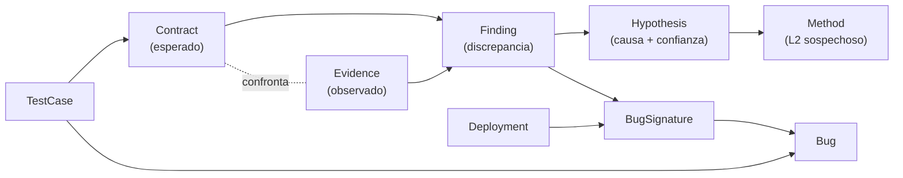

# 02 — Catálogo de Entidades (Nodos)

> Catálogo neutral de NODOS por capa. Cada tipo declara: **fuente**, **identidad canónica** (ver [08-identity-resolution.md](08-identity-resolution.md)), **propiedades clave**, **conteo aproximado** y **mapeo a MCP-2**.
> La identidad canónica usa la forma `tipo:clave` (p.ej. `spell:189`).

---

## Convenciones

- **Fuente**: `BD` | `C#` | `LOG` | `GIT` | `MCP2` | `DERIVADO`.
- **Identidad**: clave estable que hace único al nodo entre todas las fuentes.
- **Confianza de identidad**: `determinista` (id estable) | `heurística` (requiere matching).
- Los conteos son aproximados, basados en la inspección del repo (junio 2026).

---

## L1 — Capa de Datos Estáticos (mundo / esperado)

Fuente: `database/sunshine.sql` (82 tablas). Identidad determinista salvo nota.

| Nodo | Identidad | Fuente / tabla | Propiedades clave | Conteo |
|------|-----------|----------------|-------------------|--------|
| **Account** | `account:<Id>` | BD `accounts` | Username, Role, IsBanned, Vip | dinámico |
| **Character** | `character:<Id>` | BD `characters` | Name, Level, Breed, MapId, Kamas | dinámico |
| **Breed** | `breed:<Id>` | BD `breeds` | StartMap, StatsPoints*CSV | ~18 |
| **Spell** | `spell:<Spell>` | BD `spells` | Name, TypeId, SpellLevelsIdsCSV | ~? cientos |
| **SpellLevel** | `spelllevel:<rowId>` | BD `spells_levels` | SpellId(rowId), ApCost, Range, Effects(hex) | miles |
| **Effect** | `effect:<EffectsEnum>` | BD hex + C# enum | id, categoría, semántica | ~500+ enum |
| **Item** | `item:<Id>` | BD `items` | Name, TypeId, Level, Price, Effects(hex), ItemSetId | miles |
| **ItemSet** | `itemset:<Id>` | BD `items_sets` | Name, ItemsCSV, Effects | cientos |
| **Recipe** | `recipe:<rowId>` | BD `recipes` | Result, IngredientIdsCSV, Skill | miles |
| **Rune** | `rune:<Id>` | BD `runes` | Pwr, PEffect | decenas |
| **Monster** | `monster:<Id>` | BD `monsters` | Name, Race, AI, EntityLook | miles |
| **MonsterGrade** | `monstergrade:<Id>` | BD `monsters_grades` | MonsterId, Level, LifePoints, stats | miles |
| **Npc** | `npc:<Id>` | BD `npcs` | Name, HasQuest, DialogMessagesIdCSV | miles |
| **NpcShop** | `npcshop:<NpcId>:<Item>` | BD `npcs_items` | Price, Token | miles |
| **Quest** | `quest:<Id>` | BD `quests` | Name, StepIdsCSV | cientos |
| **QuestStep** | `queststep:<Id>` | BD `quests_steps` | Quest, rewards CSV, ObjectiveIdsCSV | miles |
| **QuestObjective** | `questobjective:<Id>` | BD `quests_objectives` | Step, Type, Criteria | miles |
| **Job** | `job:<Id>` | BD `jobs` | Name, Specialization, ToolIdsCSV | decenas |
| **Interactive** | `interactive:<Id>` | BD `interactives` | Name, Action | cientos |
| **InteractiveSkill** | `iaskill:<Id>` | BD `interactives_skills` | Interactive, ParentJob, item refs | cientos |
| **Map** | `map:<Id>` | BD `worlds_maps` | SubAreaId, *NeighbourId, MapType | ~decenas de miles |
| **MapPosition** | `mappos:<Id>` | BD `worlds_maps_positions` | PosX, PosY, SubArea | ~igual a maps |
| **Guild** | `guild:<Id>` | BD `guilds` | Name, Experience, SpellsCSV | dinámico |
| **Mount** | `mount:<Id>` | BD `mounts` | TemplateId, OwnerId, stats | dinámico |
| **MountTemplate** | `mounttpl:<Id>` | BD `mounts_templates` | NameId, pods, energy | decenas |
| **Dungeon** | `dungeon:<Id>` | BD `dungeons` | Map, MonstersCSV | cientos |
| **Experience** | `xplevel:<Level>` | BD `experiences` | CharacterExp, JobExp, MountExp | ~200 |
| **WorldNpcSpawn** | `worldnpc:<Id>` | BD `worlds_npcs` | Npc, Map, Cell | miles |
| **WorldMonsterSpawn** | `worldmonster:<rowId>` | BD `worlds_monsters` | MonstersCSV, SubArea | miles |

> **Casos de identidad no trivial** (ver doc 08): `SpellLevel` usa el id de fila (la columna `SpellId` NO es el spell padre); `Effect` se identifica por el valor de `EffectsEnum`, pero en BD aparece embebido en hex; `NpcShop` no tiene PK simple (clave compuesta).

---

## L2 — Capa de Código C#

Fuente: `Sunshine net11.0/Sunshine net11.0/` indexado en `code-index.sqlite`. Identidad **heurística** por defecto: el indexador actual no captura FQN (namespace), solo nombre de tipo (ver doc 08).

| Nodo | Identidad (objetivo) | Fuente | Propiedades clave | Conteo |
|------|----------------------|--------|-------------------|--------|
| **CSharpType** | `cstype:<FQN>` (hoy `cstype:<name>`) | C# / `types` | kind (class/interface/enum), file, line | ~miles |
| **Method** | `method:<type>.<name>` | C# / `methods` | type_name, line_start | ~decenas de miles |
| **Enum** | `enum:<name>` | C# / `types` kind=enum | valores | ~90 (Protocol) |
| **Attribute** | `attr:<owner>:<name>` | C# / `attributes` | name, args, line | muchos |
| **MessageHandler** | `msghandler:<msgId>` | C# `[WorldHandler(id)]` | msgId, método, clase | ~152 |
| **EffectHandler** | `effecthandler:<EffectsEnum>` | C# `[EffectHandler(X)]` | effect id(s), clase | ~54 clases / ~70-80 bindings |
| **CommandHandler** | `cmdhandler:<name>` | C# `[CommandHandler("x")]` | name, role | ~36 |
| **SpellCastHandler** | `casthandler:<spellId>` | C# `[SpellCastHandler(id)]` | spellId, clase | ~25 |
| **Manager** | `manager:<name>` | C# (`*Manager`) | dominio | ~24 |
| **Loader** | `loader:<name>` | C# (`*Loader`) | dominio cargado | ~15 |
| **PipelineAnchor** | `anchor:<paso>` | code-index `pipeline_anchors` | paso, clase, método, verificado | 8 |
| **DatabaseTable** | `table:<name>` | C# `[Table("x")]` + BD | nombre tabla | ~65 mapeadas |

> **MessageHandler / EffectHandler / CommandHandler / SpellCastHandler** son subtipos especializados de `CSharpType`/`Method` con una clave de despacho estable (el id del mensaje/efecto/comando/spell). Esa clave es justamente lo que los conecta con L1 y L3.

---

## L3 — Capa Runtime (observado)

Fuente: logs VPS, indexados en `evidence.sqlite`. Identidad determinista dentro de una sesión; **efímera entre peleas** para actores.

| Nodo | Identidad | Fuente | Propiedades clave | Conteo |
|------|-----------|--------|-------------------|--------|
| **Fight** | `fight:<fightId>` | LOG / evidence | fightId | 2 observados |
| **Session** | `session:<id>` | evidence `sessions` | fight_id, started, ended, deploy_id, build_version | n |
| **Cast** | `cast:<sessionId>:<seq>` | evidence `casts` | caster, spell, level, cell, critical, handlers, verdict | ~5.220 CAST |
| **LogEvent** | `event:<sessionId>:<seq>` | evidence `events` | event, actor, spell, target, amount, school, kind, reason | ~80k líneas |
| **Fighter** | `fighter:<fightId>:<actorId>` | LOG (derivado) | actorId efímero, rol | por pelea |

> **Fighter** es el caso duro central de identidad: `caster=378`/`actor=376` en el log es un id de combatiente **válido solo dentro de esa pelea**, no un `characters.Id` global. Su reconciliación se trata en doc 08.

---

## L4 — Capa de Operaciones

Fuente: `deploy.sqlite` + git.

| Nodo | Identidad | Fuente | Propiedades clave | Conteo |
|------|-----------|--------|-------------------|--------|
| **Deployment** | `deploy:<id>` | deploy `deploys` | fecha, commit_hash, descripcion | n |
| **Commit** | `commit:<sha>` | GIT | sha, autor, fecha, mensaje | historial |
| **CodeSnapshot** | `snapshot:<commit>:<file>` | code-index `code_snapshots` | hash, lineas_clave | por commit indexado |

---

## L5 — Capa de Conocimiento Verificable (el fin del grafo)

Fuente: derivada de L1–L4 + `evidence.sqlite` / `knowledge.sqlite` / `data-index.sqlite` / eval-battery. **Esta capa es el propósito del sistema.**

| Nodo | Identidad | Fuente / store MCP-2 | Propiedades clave | Conteo |
|------|-----------|----------------------|-------------------|--------|
| **Contract** | `contract:<spellId>:<level>` | DERIVADO / `data-index.contracts` | expected_json, fuente (derivado), spell, level | ~miles (1 por spell-level con efectos) |
| **Evidence** | `evidence:<eventId>` o `evidence:<castId>` | LOG / `evidence.events`+`casts` | qué se observó, ts, sesión, métrica | ~80k+ |
| **Finding** | `finding:<id>` | DERIVADO / `evidence.findings` | detector, severidad, confidence, resumen, spell, estado | n |
| **Hypothesis** | `hypothesis:<id>` | DERIVADO / diagnostics (confidence) | causa, sospechosos (métodos), confidence | n |
| **BugSignature** | `signature:<id>` | MCP2 / `knowledge.known_signatures` | eventos_json, metadata (spell, kind, tickAmountZero) | seed + n |
| **Bug** | `bug:<BUG-XXX>` | MCP2 / `knowledge.bugs` | titulo, sintoma, causa_raiz, archivos, fix, estado | 4 seed + n |
| **TestCase** | `testcase:<id>` | MCP2 / eval-battery (`mcp/test/`) | spell, escenario, expectativa, golden | 4 casos dorados |
| **DossierSpell** | `dossier:<spellId>` | DERIVADO / `evidence.dossier_spell` | observado, pass/fail count, detectores, handlers | 1 por spell observado |

### Semántica de cada nodo L5

- **Contract** — *lo que debería pasar*. Derivado del hex de efectos de un `SpellLevel` (ya existe en `data-index.contracts`, `fuente='derivado'`). Es la vara de medir.
- **Evidence** — *lo que pasó*. Un evento o cast observado en logs reales. Evidencia primaria, inmutable.
- **Finding** — *una discrepancia detectada*. Producida por un detector al confrontar Evidence vs Contract (o vs BugSignature). Lleva `confidence` y `severidad`.
- **Hypothesis** — *una explicación candidata* de un Finding. Señala métodos/clases sospechosas con un score de confianza (el `confidence` de diagnostics).
- **BugSignature** — *un patrón reconocible* de eventos que identifica un bug conocido (p.ej. `SUMMON_CREATE` sin `SUMMON_DIE`, o `BUFF_TICK amount=0`).
- **Bug** — *un defecto catalogado* con causa raíz y fix (BUG-001..004 ya en seed).
- **TestCase** — *un caso reproducible* que valida un contrato o la ausencia de un bug (los 4 casos dorados de eval-battery).
- **DossierSpell** — *el expediente agregado* de un hechizo: cuántas veces observado, ratio pass/fail, handlers vistos.

---

## Resumen de conteos por capa

| Capa | Tipos de nodo | Volumen de instancias |
|------|---------------|----------------------|
| L1 datos | ~29 | millones de filas → se modela selectivamente |
| L2 código | ~12 | decenas de miles de métodos/tipos |
| L3 runtime | 5 | ~80k eventos (2 fights hoy) |
| L4 ops | 3 | n deploys / historial git |
| **L5 conocimiento** | **8** | **el producto: contracts + findings + signatures + tests** |

---

## Criterio de inclusión de nodos (qué se modela primero)

No todo se materializa el día 1. Prioridad por **valor epistémico**:

1. **Prioridad alta** — todo lo que toca el eje Contract↔Evidence↔Finding: Spell, SpellLevel, Effect, EffectHandler, Cast, LogEvent, Contract, Finding, Hypothesis, BugSignature, Bug, TestCase, Deployment, Method (sospechosos).
2. **Prioridad media** — hubs de mundo con relaciones ricas: Item, Monster, Npc, Map, Quest.
3. **Prioridad baja / bajo demanda** — entidades de estado dinámico (Character, Guild, Mount) y catálogos masivos sin uso epistémico inmediato (MapPosition, spawns).

---

*Anterior: [01-inventario-conocimiento.md](01-inventario-conocimiento.md) · Siguiente: [03-relaciones.md](03-relaciones.md)*
