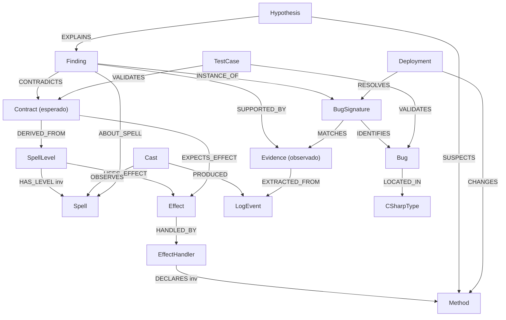

# 03 — Catálogo de Relaciones (Aristas)

> Catálogo de ARISTAS del grafo. Tres familias: **de mundo explícitas** (código), **de mundo implícitas** (BD sin FKs), y **epistémicas** (capa L5 — el núcleo).
> Cada arista declara: `origen → destino`, **etiqueta**, **método de derivación**, **confianza** y **evidencia**.

---

## Escala de confianza

| Nivel | Significado | Cuándo |
|-------|-------------|--------|
| **1.0 determinista** | Id estable a ambos lados | FK lógica id↔id, atributo de despacho |
| **0.8 alta** | Convención fuerte de nombres | `*Id` que coincide con PK de otra tabla |
| **0.6 media** | CSV expandido o nombre ambiguo | columnas `*CSV`, `SpellBreed` |
| **0.4 heurística** | Requiere matching/parsing | hex de efectos, símbolos C# sin FQN |
| **0.2 conjetural** | Inferencia débil, validar | nombre sugerente sin confirmación |

---

## A. Aristas de mundo — EXPLÍCITAS (código C#)

Derivadas de atributos y del grafo de llamadas. Confianza alta porque el binding es literal en el código.

| Origen | Etiqueta | Destino | Derivación | Confianza |
|--------|----------|---------|------------|-----------|
| Effect | `HANDLED_BY` | EffectHandler | `[EffectHandler(EffectsEnum.X)]` | 1.0 |
| MessageId | `HANDLED_BY` | MessageHandler | `[WorldHandler(id)]` | 1.0 |
| CommandName | `HANDLED_BY` | CommandHandler | `[CommandHandler("x", Role)]` | 1.0 |
| Spell | `CAST_VIA` | SpellCastHandler | `[SpellCastHandler(spellId)]` | 1.0 |
| Method | `CALLS` | Method | `calls` (regex receiver.callee) | 0.4 |
| CSharpType | `MAPS_TABLE` | DatabaseTable | `[Table("name")]` | 1.0 |
| CSharpType | `DECLARES` | Method | indexer (type_name) | 0.8 |
| CSharpType | `HAS_ATTRIBUTE` | Attribute | `attributes` | 1.0 |
| EffectHandler | `EXTENDS` | SpellEffectHandler | jerarquía de clases | 0.8 |
| PipelineAnchor | `RESOLVES_TO` | Method | `pipeline_anchors.verificado` | 1.0 si verificado |

> **Nota sobre `CALLS`:** el indexer extrae llamadas por regex `receiver.callee`, sin resolución semántica. Por eso confianza 0.4: hay falsos positivos (homónimos) y el `receiver` no está resuelto a un tipo. Útil como pista, no como verdad.

---

## B. Aristas de mundo — IMPLÍCITAS (BD MySQL, sin FKs)

La BD **no tiene FKs declaradas** (0 `FOREIGN KEY` en el dump). Todas estas aristas se infieren por convención de nombres o expandiendo columnas CSV.

### Cluster Spells / Effects
| Origen | Etiqueta | Destino | Columna fuente | Confianza |
|--------|----------|---------|----------------|-----------|
| Spell | `HAS_LEVEL` | SpellLevel | `spells.SpellLevelsIdsCSV` (CSV) | 0.6 |
| SpellLevel | `USES_EFFECT` | Effect | `spells_levels.Effects` (hex parseado) | 0.4 |
| SpellLevel | `USES_EFFECT_CRIT` | Effect | `spells_levels.CriticalEffects` (hex) | 0.4 |
| Spell | `RESTRICTED_TO` | Breed | `spells_levels.SpellBreed` | 0.6 |

### Cluster Items
| Origen | Etiqueta | Destino | Columna | Confianza |
|--------|----------|---------|---------|-----------|
| Item | `USES_EFFECT` | Effect | `items.Effects` (hex) | 0.4 |
| Item | `BELONGS_TO_SET` | ItemSet | `items.ItemSetId` | 0.8 |
| ItemSet | `CONTAINS_ITEM` | Item | `items_sets.ItemsCSV` (CSV) | 0.6 |
| Item | `CRAFTED_BY` | Recipe | `items.RecipeIdsCSV` (CSV) | 0.6 |
| Recipe | `PRODUCES` | Item | `recipes.Result` | 0.8 |
| Recipe | `REQUIRES` | Item | `recipes.IngredientIdsCSV` (CSV) | 0.6 |
| Recipe | `USES_SKILL` | InteractiveSkill | `recipes.Skill` | 0.6 |

### Cluster Monsters
| Origen | Etiqueta | Destino | Columna | Confianza |
|--------|----------|---------|---------|-----------|
| Monster | `HAS_GRADE` | MonsterGrade | `monsters_grades.MonsterId` | 0.8 |
| Monster | `DROPS` | Item | `monsters_drops.MonsterId/ItemId` | 0.8 |
| Monster | `CASTS` | Spell | `monsters_spells.SpellsCSV` (CSV) | 0.6 |
| Dungeon | `CONTAINS_MONSTER` | Monster | `dungeons.MonstersCSV` (CSV) | 0.6 |

### Cluster NPCs / Shops / Quests
| Origen | Etiqueta | Destino | Columna | Confianza |
|--------|----------|---------|---------|-----------|
| Npc | `SELLS` | Item | `npcs_items.NpcId/Item` | 0.8 |
| Npc | `HAS_ACTION` | NpcAction | `npcs_actions.NpcId` | 0.8 |
| Npc | `STARTS_QUEST` | Quest | `npcs.HasQuest` + replies | 0.4 |
| Quest | `HAS_STEP` | QuestStep | `quests.StepIdsCSV` (CSV) | 0.6 |
| QuestStep | `HAS_OBJECTIVE` | QuestObjective | `quests_steps.ObjectiveIdsCSV` (CSV) | 0.6 |
| QuestStep | `REWARDS_ITEM` | Item | `quests_steps.ItemsRewardCSV` (CSV) | 0.6 |
| QuestStep | `REWARDS_SPELL` | Spell | `quests_steps.SpellsRewardCSV` (CSV) | 0.6 |

### Cluster Breeds / Jobs
| Origen | Etiqueta | Destino | Columna | Confianza |
|--------|----------|---------|---------|-----------|
| Breed | `LEARNS` | Spell | `breeds_spells.Breed/Spell` | 0.8 |
| Job | `SPECIALIZES` | Job | `jobs.Specialization` (self-ref) | 0.6 |
| InteractiveSkill | `BELONGS_TO_JOB` | Job | `interactives_skills.ParentJob` | 0.8 |
| InteractiveSkill | `ON_INTERACTIVE` | Interactive | `interactives_skills.Interactive` | 0.8 |

### Cluster World / Maps
| Origen | Etiqueta | Destino | Columna | Confianza |
|--------|----------|---------|---------|-----------|
| Map | `NEIGHBOUR` | Map | `worlds_maps.*NeighbourId` | 0.8 |
| Map | `HAS_POSITION` | MapPosition | `worlds_maps_positions.Id` | 0.8 |
| WorldNpcSpawn | `SPAWNS_ON` | Map | `worlds_npcs.Map` | 0.8 |
| WorldNpcSpawn | `OF_NPC` | Npc | `worlds_npcs.Npc` | 0.8 |
| WorldMonsterSpawn | `SPAWNS_ON` | Map | `worlds_monsters_fix.Map` | 0.8 |
| Interactive | `PLACED_ON` | Map | `worlds_interactives.Map` | 0.8 |

### Cluster Character (estado dinámico)
| Origen | Etiqueta | Destino | Columna | Confianza |
|--------|----------|---------|---------|-----------|
| Account | `OWNS` | Character | `worlds_characters.Account/Owner` | 0.8 |
| Character | `OF_BREED` | Breed | `characters.Breed` | 0.8 |
| Character | `LOCATED_ON` | Map | `characters.MapId` | 0.8 |
| Character | `KNOWS_SPELL` | Spell | `characters_spells.Spell` | 0.8 |
| Character | `HAS_JOB` | Job | `characters_jobs.Job` | 0.8 |
| Character | `PROGRESS_QUEST` | Quest | `characters_quests.Quest` | 0.8 |

---

## C. Aristas EPISTÉMICAS (capa L5 — el núcleo del grafo)

Estas son la razón de ser del sistema: conectan lo esperado, lo observado y la causa. Toda arista lleva procedencia y confianza explícitas.

### C.1 Construcción del contrato y la evidencia

| Origen | Etiqueta | Destino | Derivación | Confianza |
|--------|----------|---------|------------|-----------|
| Contract | `DERIVED_FROM` | SpellLevel | `data-index.contracts` (parse hex) | 0.4–0.8 |
| Contract | `EXPECTS_EFFECT` | Effect | efectos esperados del contrato | 0.4 |
| Evidence | `EXTRACTED_FROM` | LogEvent | parser de logs → evidence.events | 1.0 |
| Evidence | `EXTRACTED_FROM` | Cast | evidence.casts | 1.0 |
| Cast | `OBSERVES` | Spell | `casts.spell` join BD (doc 08) | 0.8 |
| Cast | `PRODUCED` | LogEvent | `cast_links` (rol) | 0.8 |
| LogEvent | `OCCURRED_IN` | Fight | `sessions.fight_id` | 1.0 |

### C.2 El corazón: confrontar esperado vs observado

| Origen | Etiqueta | Destino | Derivación | Confianza |
|--------|----------|---------|------------|-----------|
| Finding | `CONTRADICTS` | Contract | detector: Evidence ≠ Contract | variable (`findings.confidence`) |
| Finding | `SUPPORTED_BY` | Evidence | `findings.evidencia_json` | alta |
| Finding | `ABOUT_SPELL` | Spell | `findings.spell` | 0.8 |
| Finding | `DETECTED_IN` | Session | `findings.session_id` | 1.0 |

### C.3 Explicación causal

| Origen | Etiqueta | Destino | Derivación | Confianza |
|--------|----------|---------|------------|-----------|
| Hypothesis | `EXPLAINS` | Finding | diagnostics (confidence score) | variable |
| Hypothesis | `SUSPECTS` | Method | sospechosos del dossier | 0.4–0.6 |
| Hypothesis | `SUSPECTS` | CSharpType | clases en `bugs.archivos` | 0.6 |

### C.4 Patrones y catálogo de bugs

| Origen | Etiqueta | Destino | Derivación | Confianza |
|--------|----------|---------|------------|-----------|
| BugSignature | `MATCHES` | Evidence | signature-matcher (eventos_json) | variable |
| BugSignature | `IDENTIFIES` | Bug | `known_signatures.bug_id` | 1.0 |
| Bug | `LOCATED_IN` | CSharpType | `bugs.archivos` (split) | 0.6 |
| Finding | `INSTANCE_OF` | BugSignature | `findings.signature_match` | 0.8 |

### C.5 Validación y ciclo operacional

| Origen | Etiqueta | Destino | Derivación | Confianza |
|--------|----------|---------|------------|-----------|
| TestCase | `VALIDATES` | Contract | eval-battery expectativa | 0.8 |
| TestCase | `VALIDATES` | Bug | caso dorado por bug | 1.0 |
| TestCase | `EXERCISES` | Spell | spell del caso | 1.0 |
| Deployment | `RESOLVES` | BugSignature | bug ausente tras deploy (comparar_deploys) | 0.6 |
| Deployment | `INTRODUCES` | BugSignature | bug aparece tras deploy | 0.6 |
| Deployment | `CHANGES` | Method | git diff ↔ code-index (gap, doc 01) | 0.4 |
| Deployment | `AT_COMMIT` | Commit | `deploys.commit_hash` | 1.0 |
| Session | `UNDER_DEPLOY` | Deployment | `sessions.deploy_id` | 0.8 |
| DossierSpell | `AGGREGATES` | Finding | dossier por spell | 0.8 |

---

## Diagrama del eje epistémico completo

Este subgrafo es el que permite responder la pregunta fundamental: *"¿qué sabemos, con qué evidencia y con qué confianza, sobre el comportamiento del hechizo X?"*.

---

## D. Relaciones FALTANTES o NO VALIDADAS

Aristas que deberían existir pero hoy no se pueden materializar con confianza (gaps a cerrar en el roadmap):

| Arista faltante | Bloqueante | Prioridad |
|-----------------|------------|-----------|
| `Cast --CAST_BY--> Character/Monster` | `caster` es id efímero de pelea (doc 08) | Alta |
| `EffectHandler --REALIZES--> Contract` | nada enlaza el handler con el contrato que cumple | Alta |
| `Item --USES_EFFECT--> Effect` | hex de `items.Effects` no parseado (solo spells) | Media |
| `Hypothesis --CONFIRMED_BY--> Deployment` | no se cierra el ciclo causa→fix verificado | Alta |
| `Deployment --CHANGES--> Method` preciso | falta cruce git-diff ↔ code-index | Media |
| `Quest --REWARDS--> *` expandido | CSV sin expandir en ingesta | Baja |
| `LogEvent --AT_CELL--> Cell --IN--> Map` | `cell=` en log sin enlazar a topología | Baja |
| `Monster(observado) --IS--> Monster(BD)` | `monster=` en log sin join validado | Media |

---

## E. Resumen por familia

| Familia | Nº etiquetas | Confianza típica | Rol |
|---------|--------------|------------------|-----|
| Mundo explícita (código) | ~10 | 1.0 / 0.4 (calls) | Estructura del cableado |
| Mundo implícita (BD) | ~35 | 0.6–0.8 | Topología del juego |
| **Epistémica (L5)** | **~25** | **variable + procedencia** | **Conocimiento verificable (el fin)** |

> **Principio de diseño:** las aristas epistémicas nunca se afirman sin procedencia. Un `Finding CONTRADICTS Contract` siempre apunta a la `Evidence` que lo sustenta y al detector que lo produjo, con su `confidence`. El grafo distingue *"esto es así"* (BD/código) de *"esto se observó así con confianza X"* (L5).

---

*Anterior: [02-entidades.md](02-entidades.md) · Siguiente: [04-modelo-grafo.md](04-modelo-grafo.md)*
