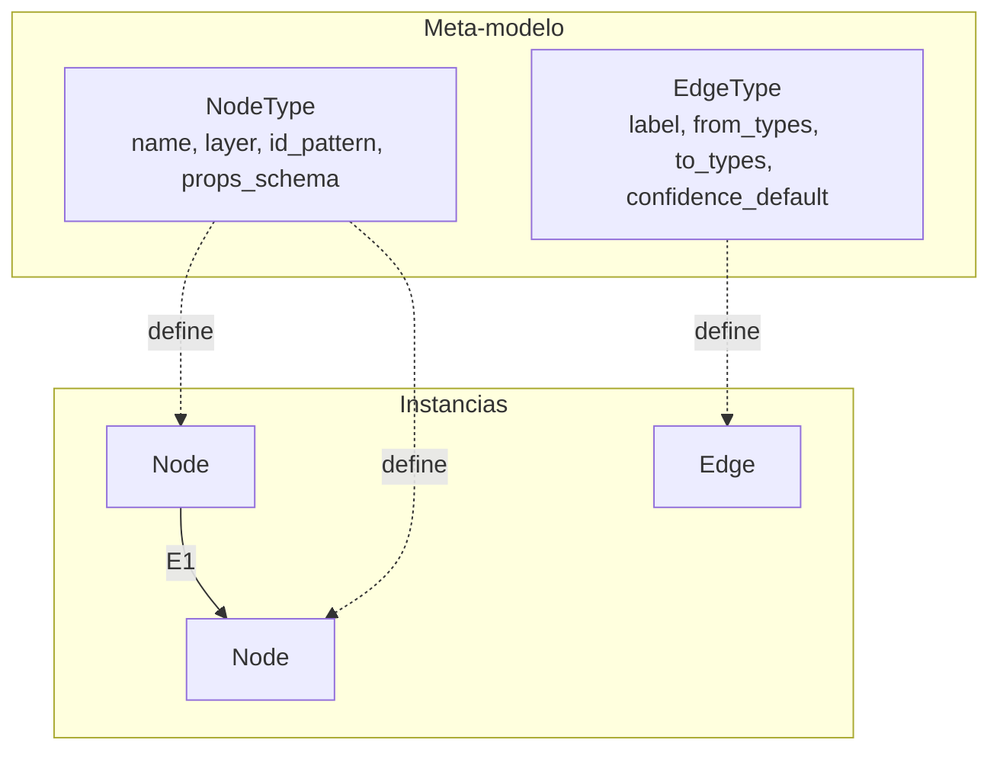

# 04 — Modelo de Grafo Neutral

> Modelo conceptual agnóstico de motor. Solo tres primitivas: **NODO**, **ARISTA**, **PROPIEDAD**.
> No se asume Neo4j, SQLite ni JSON. La resolución de identidad se detalla en [08-identity-resolution.md](08-identity-resolution.md).
> Los fragmentos JSON son **ilustrativos**, no ejecutables.

---

## 1. Las tres primitivas

### 1.1 NODO
Una entidad de cualquier capa (L1–L5). Estructura mínima:

```json
{
  "id": "spell:189",
  "type": "Spell",
  "layer": "L1",
  "props": { "name": "Sacrificada", "typeId": 4 },
  "provenance": { "source": "BD", "ref": "spells.Spell=189", "ingested_at": "2026-06-21T06:00:00Z" },
  "confidence": 1.0
}
```

### 1.2 ARISTA
Una relación dirigida y etiquetada entre dos nodos. Estructura mínima:

```json
{
  "id": "edge:finding:42:CONTRADICTS:contract:189:5",
  "from": "finding:42",
  "label": "CONTRADICTS",
  "to": "contract:189:5",
  "props": { "detector": "SUMMON_MUERTE_INSTANTANEA", "severidad": "alta" },
  "provenance": { "source": "DERIVADO", "ref": "evidence.findings.id=42", "method": "detector" },
  "confidence": 0.88
}
```

### 1.3 PROPIEDAD
Par clave-valor dentro de `props`. Tipada por convención (string, number, bool, json). No hay tabla de propiedades separada: viven embebidas en nodo/arista.

---

## 2. Atributos universales (todos los elementos)

Cada nodo y arista lleva **siempre**:

| Atributo | Tipo | Obligatorio | Significado |
|----------|------|-------------|-------------|
| `id` | string | sí | Identidad canónica `tipo:clave` (doc 08) |
| `type` / `label` | string | sí | Tipo de nodo / etiqueta de arista |
| `layer` | enum L1–L5 | sí (nodo) | Capa de pertenencia |
| `props` | objeto | sí | Propiedades específicas |
| `provenance` | objeto | sí | De dónde sale (ver §3) |
| `confidence` | float 0–1 | sí | Fiabilidad de la afirmación |

> **Regla de oro:** ningún elemento entra al grafo sin `provenance` y `confidence`. Esto es lo que distingue un grafo de conocimiento de un simple ETL.

---

## 3. Modelo de procedencia

La procedencia es de primera clase porque la tesis del proyecto es *conocimiento verificable*.

```json
"provenance": {
  "source": "LOG",                    // BD | C# | LOG | GIT | MCP2 | DERIVADO
  "ref": "fights/1.log:48213",        // referencia exacta a la fuente
  "method": "parser|attribute|csv|hex|detector|join|heuristic",
  "ingested_at": "2026-06-21T06:31:02Z",
  "deriver": "evidence.parser@v2",    // qué proceso lo creó (si DERIVADO)
  "inputs": ["event:7:120", "contract:189:5"]  // nodos de entrada (si DERIVADO)
}
```

### Niveles de procedencia
- **Primaria** (`source=LOG`): observación cruda. Inmutable. Máxima autoridad sobre *comportamiento*.
- **Estática** (`source=BD`): verdad de definición. Autoridad sobre *qué existe / qué debería*.
- **Secundaria** (`source=C#`): lógica. Autoridad sobre *cómo debería computarse*.
- **Derivada** (`source=DERIVADO`/`MCP2`): computada a partir de las anteriores; siempre cita sus `inputs`.

### Trazabilidad
Todo nodo derivado (Contract, Finding, Hypothesis) debe poder **reconstruir su cadena** hasta nodos primarios/estáticos vía `inputs`. Un `Finding` cuya cadena no llega a `Evidence` es inválido.

---

## 4. Modelo de confianza

| Aplicado a | Cómo se calcula | Ejemplo |
|------------|-----------------|---------|
| Nodo de fuente directa | 1.0 (existe en la fuente) | `spell:189` desde BD |
| Arista por id estable | 1.0 | `Effect HANDLED_BY EffectHandler` |
| Arista por convención | 0.6–0.8 | `Monster DROPS Item` |
| Arista por parsing/heurística | 0.4 | `SpellLevel USES_EFFECT Effect` (hex) |
| Finding / Hypothesis | hereda `findings.confidence` de diagnostics | 0.88 |

La fórmula de confidence de un `Finding` reutiliza la de MCP-2 diagnostics:
```
confidence = base_detector + bonus_evidencias + bonus_signature_match − ambiguedad − conflicto
```
Umbrales heredados: ≥0.85 auto-priorizable, 0.60–0.84 investigar, <0.60 needs_review.

---

## 5. Meta-modelo (esquema de tipos)



El **catálogo de tipos** (NodeType/EdgeType) se define en JSON canónico revisable (ver doc 07). Cada `NodeType` declara su `id_pattern` (la clave canónica del doc 08) y el esquema de sus props. Cada `EdgeType` declara qué tipos puede conectar y su confianza por defecto.

### Ejemplo de catálogo de tipos (ilustrativo)

```json
{
  "node_types": [
    { "name": "Spell", "layer": "L1", "id_pattern": "spell:<Spell>", "key_source": "spells.Spell" },
    { "name": "Contract", "layer": "L5", "id_pattern": "contract:<spellId>:<level>", "key_source": "data-index.contracts" },
    { "name": "Finding", "layer": "L5", "id_pattern": "finding:<id>", "key_source": "evidence.findings.id" }
  ],
  "edge_types": [
    { "label": "USES_EFFECT", "from": "SpellLevel", "to": "Effect", "confidence_default": 0.4, "method": "hex" },
    { "label": "CONTRADICTS", "from": "Finding", "to": "Contract", "confidence_default": null, "method": "detector" },
    { "label": "HANDLED_BY", "from": "Effect", "to": "EffectHandler", "confidence_default": 1.0, "method": "attribute" }
  ]
}
```

---

## 6. La capa de Conocimiento (L5) como fin del modelo

El modelo se diseña **desde L5 hacia abajo**: L1–L4 existen para que L5 tenga sustrato.

### 6.1 El patrón epistémico fundamental

```
                ┌─────────────────────────────────────────┐
                │            AFIRMACIÓN VERIFICABLE         │
                └─────────────────────────────────────────┘
   Contract (esperado) ──confronta── Evidence (observado)
            │                              │
            └──────────► Finding ◄─────────┘
                            │
                      Hypothesis (causa, confidence)
                            │
                    ┌───────┴────────┐
              BugSignature        Method (sospechoso)
                    │
                   Bug ──validado por── TestCase
                    │
              resuelto por── Deployment
```

### 6.2 Invariantes de la capa L5

1. **Un `Contract` siempre deriva de una fuente estática** (`DERIVED_FROM` SpellLevel/Effect). Nunca se inventa.
2. **Una `Evidence` siempre deriva de un log** (`EXTRACTED_FROM` LogEvent/Cast). Es inmutable.
3. **Un `Finding` siempre enlaza ambos lados**: `CONTRADICTS` un Contract y `SUPPORTED_BY` una Evidence. Sin los dos, no es un finding válido.
4. **Una `Hypothesis` siempre tiene confidence explícita** y al menos un `SUSPECTS`.
5. **Un `Deployment` es el único nodo que puede cambiar el veredicto** de un BugSignature en el tiempo (RESOLVES/INTRODUCES).

### 6.3 Ejemplo completo (BUG-002, venenos sin daño) — ilustrativo

```json
{
  "nodes": [
    { "id": "spell:196", "type": "Spell", "layer": "L1", "props": {"name":"Veneno"}, "confidence": 1.0 },
    { "id": "contract:196:5", "type": "Contract", "layer": "L5",
      "props": {"expects":"BUFF_TICK amount>0 por turno"},
      "provenance": {"source":"DERIVADO","method":"hex","inputs":["spelllevel:..."]}, "confidence": 0.6 },
    { "id": "evidence:7:842", "type": "Evidence", "layer": "L5",
      "props": {"observed":"BUFF_TICK amount=0"},
      "provenance": {"source":"LOG","ref":"fights/1.log:..."}, "confidence": 1.0 },
    { "id": "finding:12", "type": "Finding", "layer": "L5",
      "props": {"detector":"TICK_CERO","severidad":"alta"},
      "provenance": {"source":"DERIVADO","method":"detector","inputs":["contract:196:5","evidence:7:842"]},
      "confidence": 0.9 },
    { "id": "hypothesis:5", "type": "Hypothesis", "layer": "L5",
      "props": {"causa":"CalculateDamageResistance bloquea daño si isPoisoned"}, "confidence": 0.85 },
    { "id": "signature:TICK_CERO", "type": "BugSignature", "layer": "L5", "confidence": 0.9 },
    { "id": "bug:BUG-002", "type": "Bug", "layer": "L5",
      "props": {"fix":"if (isPoisoned) return damage"}, "confidence": 1.0 },
    { "id": "method:FightActor.CalculateDamageResistance", "type": "Method", "layer": "L2", "confidence": 0.6 }
  ],
  "edges": [
    { "from": "contract:196:5", "label": "DERIVED_FROM", "to": "spell:196", "confidence": 0.6 },
    { "from": "finding:12", "label": "CONTRADICTS", "to": "contract:196:5", "confidence": 0.9 },
    { "from": "finding:12", "label": "SUPPORTED_BY", "to": "evidence:7:842", "confidence": 1.0 },
    { "from": "hypothesis:5", "label": "EXPLAINS", "to": "finding:12", "confidence": 0.85 },
    { "from": "hypothesis:5", "label": "SUSPECTS", "to": "method:FightActor.CalculateDamageResistance", "confidence": 0.6 },
    { "from": "finding:12", "label": "INSTANCE_OF", "to": "signature:TICK_CERO", "confidence": 0.8 },
    { "from": "signature:TICK_CERO", "label": "IDENTIFIES", "to": "bug:BUG-002", "confidence": 1.0 }
  ]
}
```

Este subgrafo es una **afirmación verificable completa**: *"El hechizo 196 debería tickear daño>0 (contract), pero se observó amount=0 (evidence), lo que constituye el finding 12 (confianza 0.9), explicado por la hipótesis 5 que sospecha de CalculateDamageResistance, instancia del patrón TICK_CERO que identifica BUG-002"*.

---

## 7. Representación física neutral (sin comprometer motor)

El modelo lógico se proyecta a cualquiera de estas formas sin pérdida:

| Forma | Nodos | Aristas | Procedencia |
|-------|-------|---------|-------------|
| **Tablas relacionales** | tabla `nodes(id, type, layer, props_json, confidence)` | tabla `edges(from, label, to, props_json, confidence)` | tabla `provenance(element_id, source, ref, ...)` |
| **JSONL** | `nodes.jsonl` (1 nodo/línea) | `edges.jsonl` (1 arista/línea) | embebida en cada línea |
| **Grafo nativo** | vértices con label | relaciones con tipo | propiedades de relación |

El doc 07 recomienda empezar por **tablas SQLite + export JSONL**, difiriendo el grafo nativo.

---

## 8. Reglas de modelado

1. **Identidad antes que datos**: un nodo se crea con su id canónico (doc 08); si la identidad no se resuelve, va a cuarentena, no al grafo principal.
2. **Aristas no destruyen nodos**: borrar una arista nunca borra sus extremos.
3. **Derivados versionados**: Contract/Finding llevan `deriver` con versión; recomputar genera nueva versión, no sobrescribe ciega.
4. **Confianza compuesta**: la confianza de un camino es el producto (o mínimo, según consulta) de las aristas; se calcula en consulta, no se almacena precomputada.
5. **Capas explícitas**: toda consulta puede filtrar por `layer`, permitiendo ver "solo mundo" (L1–L2), "solo observado" (L3) o "solo conocimiento" (L5).

---

*Anterior: [03-relaciones.md](03-relaciones.md) · Siguiente: [05-preguntas-emergentes.md](05-preguntas-emergentes.md)*
