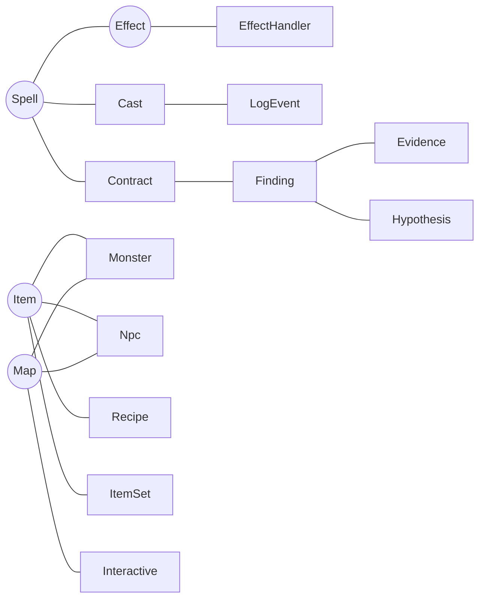
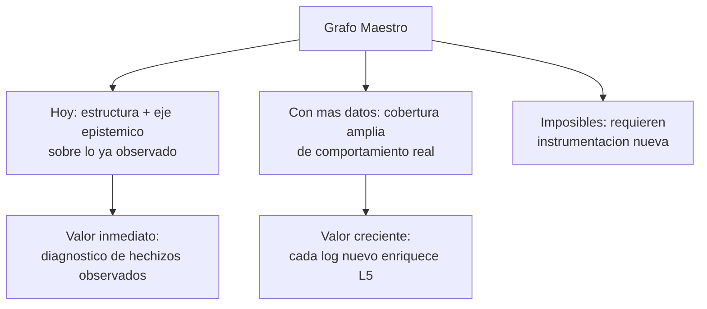

# 05 — Preguntas Emergentes

> Las preguntas **emergen del grafo**, no al revés. Este catálogo se deriva de la conectividad real de los nodos y aristas (docs 02–03).
> Clasificación: **respondibles hoy** / **requieren más datos** / **imposibles hoy**. Más análisis de centralidad y aislamiento.

---

## 1. Preguntas respondibles HOY

Con las fuentes y MCP-2 actuales, el grafo (una vez poblado) respondería sin datos nuevos:

### 1.1 Eje epistémico (el núcleo)
- ¿Qué hechizos tienen **findings abiertos** y con qué confianza? *(findings + dossier_spell)*
- ¿Qué **discrepancia** concreta tiene el hechizo 189 entre lo esperado y lo observado? *(Contract↔Evidence↔Finding)*
- ¿Qué **causa** (Hypothesis) explica un finding y qué métodos sospecha? *(Hypothesis SUSPECTS Method)*
- ¿Qué **bugs conocidos** coinciden con un patrón de eventos dado? *(BugSignature MATCHES)*
- ¿Qué **TestCase** valida el contrato del hechizo X? *(eval-battery)*
- ¿Cuántas veces se ha **observado** el hechizo X y cuál es su ratio pass/fail? *(dossier_spell)*

### 1.2 Mundo estático (BD)
- ¿Qué **ítems vende** el NPC X y a qué precio? *(Npc SELLS Item)*
- ¿Qué **monstruos dropean** el ítem X? *(Monster DROPS Item)*
- ¿Qué **efectos** declara el hechizo X según la BD? *(SpellLevel USES_EFFECT Effect)*
- ¿Qué **hechizos aprende** cada clase? *(Breed LEARNS Spell)*
- ¿Qué **mapas son vecinos** del mapa X? *(Map NEIGHBOUR Map)*
- ¿Qué **recetas producen** el ítem X y qué ingredientes piden? *(Recipe PRODUCES/REQUIRES)*

### 1.3 Código (estructura)
- ¿Qué **clase maneja** el efecto X / el mensaje Y / el comando Z? *(HANDLED_BY)*
- ¿Qué **tabla mapea** la clase record X? *(MAPS_TABLE)*
- ¿Cuáles son las **anclas del pipeline** de combate y están verificadas? *(PipelineAnchor)*

### 1.4 Operacional
- ¿Qué **deploy** estaba activo cuando se registró la sesión X? *(Session UNDER_DEPLOY Deployment)*
- ¿Qué **findings aumentaron o disminuyeron** entre dos deploys? *(comparar_deploys)*

### 1.5 Cruce de capas (el valor diferencial)
- ¿Qué hechizos están **definidos en BD pero nunca se han observado** en logs? *(Spell sin Cast OBSERVES)*
- ¿Qué efectos **tienen handler en código pero no aparecen en ningún contrato observado**? *(EffectHandler sin Evidence)*
- ¿Qué métodos son **sospechosos en múltiples hipótesis** (reincidentes)? *(Method con varios SUSPECTS)*

---

## 2. Preguntas que REQUIEREN MÁS DATOS

Respondibles solo tras ampliar cobertura (más logs, más parsing, puentes nuevos):

| Pregunta | Dato que falta | Cómo obtenerlo |
|----------|----------------|----------------|
| ¿El hechizo X se comporta igual en **todas las clases** que lo usan? | Solo 2 fights observados | Más sesiones de combate variadas |
| ¿Qué **ítems** disparan qué efectos en combate? | `items.Effects` hex sin parsear | Extender effects-parser a items |
| ¿Quién (Character real) **lanzó** este cast? | `caster` es id efímero | Correlación intra-fight + identidad (doc 08) |
| ¿Qué **monstruo concreto** (BD) actuó en la pelea? | `monster=` sin join validado | Resolver identidad Fighter→Monster |
| ¿Qué **método cambió** exactamente en el deploy que resolvió BUG-002? | falta git-diff↔code-index | Puente Deployment CHANGES Method |
| ¿El fix de una hipótesis **realmente cerró** el finding? | falta arista CONFIRMED_BY | Cruce findings pre/post deploy |
| ¿Qué **interactivos/recursos** se usan más en el mundo real? | sin telemetría de interactivos | Instrumentar recolección de oficios |
| ¿Cuál es la **distribución de daño real** del hechizo X por nivel? | muestra insuficiente | Acumular más casts por nivel |

---

## 3. Preguntas IMPOSIBLES hoy

No respondibles sin instrumentación o fuentes que no existen:

- ¿Cuál es la **experiencia del jugador** (latencia percibida, frustración)? — no hay telemetría de cliente.
- ¿Qué **decisiones de IA** tomó un monstruo y por qué? — la IA no registra su razonamiento.
- ¿Qué **rutas de mapa** recorren realmente los jugadores? — sin tracking de movimiento agregado.
- ¿Cuál es el **impacto económico** real de un cambio de precios sobre el mercado? — sin series temporales de HDV/kamas.
- ¿Qué **quests** abandonan los jugadores y dónde? — sin telemetría de progresión.
- ¿Qué **efectos visuales/animaciones** del cliente difieren del servidor? — fuera del dominio del servidor.
- ¿Por qué un bug **dejó de reproducirse** si no hubo deploy? — sin captura de estado/entorno.

---

## 4. Análisis de conectividad

### 4.1 Zonas de máxima densidad (hubs de aristas)

| Zona | Densidad | Por qué es densa |
|------|----------|------------------|
| **Eje Spell–Effect–Fight–Contract–Finding** | Muy alta | Es el corazón epistémico; converge BD+código+logs+conocimiento |
| **Hub Item** | Alta | Conecta drops, tiendas, recetas, sets, efectos, recompensas |
| **Hub Map** | Alta | Topología + spawns (npcs, monstruos, interactivos, triggers) |
| **Hub Character** | Media | Estado dinámico: spells, jobs, quests, items, mounts |
| **Cluster Quest** | Media | Steps→objectives→rewards, encadenados por CSV |

### 4.2 Entidades centrales (mayor grado / betweenness conceptual)

| Entidad | Por qué es central |
|---------|--------------------|
| **Spell** | Bisagra de las 4 capas de mundo + ancla de Contract/Evidence/Finding. La entidad más conectada del grafo. |
| **Effect** | Une definición (BD), ejecución (EffectHandler) y observación (LogEvent). |
| **Item** | Hub de economía y crafteo; máximo fan-in (drops, tiendas, recetas, recompensas). |
| **Map** | Hub espacial; todo spawn pasa por aquí. |
| **Finding** | Centro de la capa L5; conecta Contract, Evidence, Hypothesis, BugSignature. |
| **Method** | Punto de convergencia código↔causa (SUSPECTS, CHANGES, DECLARES). |

### 4.3 Entidades aisladas o poco conectadas

| Entidad | Aislamiento | Causa |
|---------|-------------|-------|
| **Mount / MountTemplate** | Casi sin aristas a L5 | Nunca observado en logs de combate |
| **House / Paddock** | Aislado de L3/L5 | Sin telemetría de uso |
| **Guild** | Solo estado estático | Sin eventos observados |
| **Dungeon** | Conecta a Monster/Map pero no a runtime | Sin logs de instancias |
| **Job / Recipe / Interactive** | Ricos en BD, nulos en logs | Sin telemetría de oficios |
| **Mayoría de Spells del catálogo** | Definidos pero sin Cast | Solo 2 fights observados → cobertura runtime mínima |
| **Account** | Periférico | Poco valor epistémico de comportamiento |

> **Hallazgo clave:** el grafo es **profundo pero estrecho** en la capa observada. La BD y el código dan amplitud (miles de hechizos/ítems/mapas), pero los logs solo iluminan un corredor minúsculo (2 peleas, ~5k casts). La estrategia (doc 06–07) debe priorizar **profundizar el eje epistémico** sobre los hechizos ya observados, y en paralelo **ampliar cobertura** de logs.

---

## 5. Preguntas meta sobre el propio grafo

El grafo también se interroga a sí mismo (gobernanza del conocimiento):

- ¿Qué porcentaje de hechizos del catálogo tiene **contrato derivado**? *(cobertura de Contract)*
- ¿Qué porcentaje tiene **al menos una evidencia**? *(cobertura observacional)*
- ¿Qué findings llevan **más tiempo abiertos** sin hipótesis confirmada?
- ¿Qué afirmaciones tienen **confianza < 0.6** y deberían revalidarse?
- ¿Qué nodos están en **cuarentena** por identidad no resuelta? (doc 08)
- ¿Qué aristas dependen de **derivados stale** (data-index desactualizado)?

---

## 6. Síntesis: el grafo como instrumento de preguntas

El diseño confirma la tesis: **las preguntas más valiosas son las de cruce de capas** (esperado vs observado), y emergen naturalmente de la conectividad del eje Spell–Effect–Contract–Evidence–Finding. Los MCP futuros (doc 07) se construirán como vistas sobre estas preguntas, sin poseer el conocimiento.

---

*Anterior: [04-modelo-grafo.md](04-modelo-grafo.md) · Siguiente: [06-plan-ingesta.md](06-plan-ingesta.md)*
