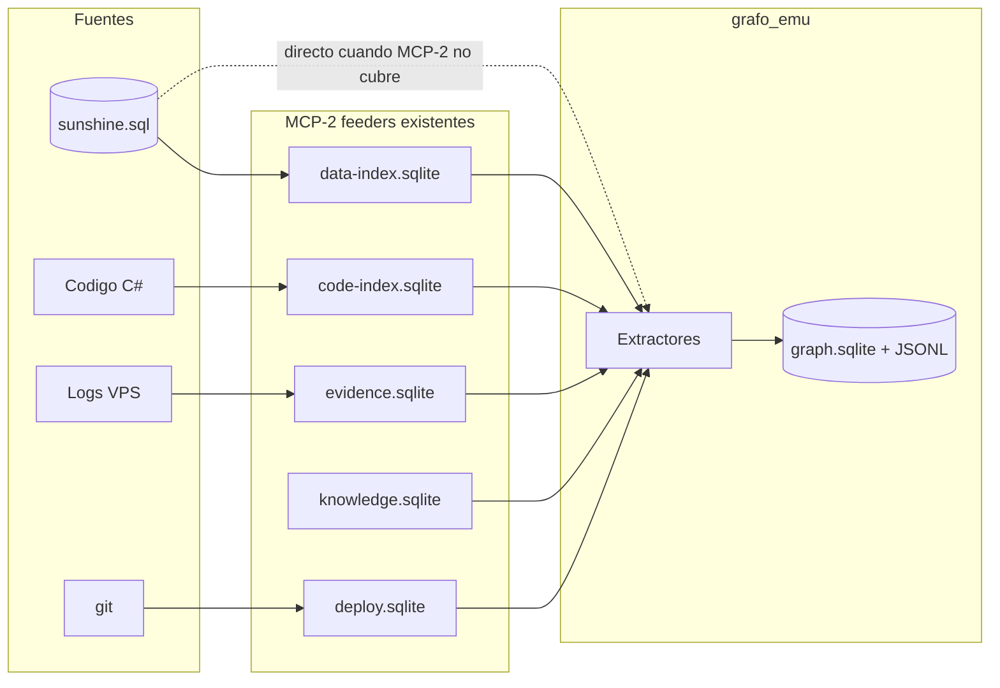
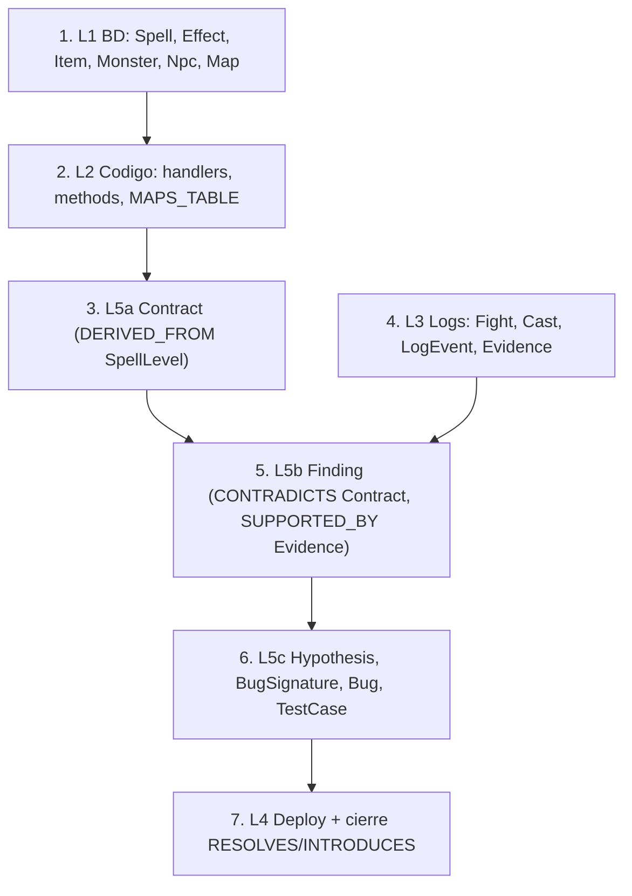

# 06 — Plan de Ingesta (diseño, no ejecución)

> Diseño de cómo se **poblaría** el grafo desde las cuatro fuentes, **reutilizando MCP-2 como feeder** (no como dueño).
> No se escribe código en esta fase. Toda identidad sigue [08-identity-resolution.md](08-identity-resolution.md); todo elemento lleva procedencia/confianza (doc 04).

---

## 1. Principio de ingesta



**Regla:** siempre que MCP-2 ya haya computado un derivado (contracts, events, findings, signatures), el extractor **lee de MCP-2**, no recomputa. Solo se va directo a la fuente cruda cuando MCP-2 no cubre ese dato (p.ej. drops, tiendas, topología de mapas, efectos de ítems).

---

## 2. Extractores por fuente

Cada extractor es un **diseño** (contrato de entrada→salida), no una implementación.

### 2.1 Extractor BD (L1)
- **Entrada:** `database/sunshine.sql` + `data-index.sqlite` (para spells/effects ya parseados).
- **Salida — nodos:** Spell, SpellLevel, Effect, Item, ItemSet, Recipe, Monster, MonsterGrade, Npc, Quest, QuestStep, Job, Breed, Map, Interactive, Dungeon.
- **Salida — aristas:** USES_EFFECT, DROPS, SELLS, BELONGS_TO_SET, PRODUCES/REQUIRES, HAS_GRADE, CASTS, LEARNS, NEIGHBOUR, HAS_STEP, HAS_OBJECTIVE, REWARDS_*.
- **Expansión CSV:** las columnas `*CSV` (StepIdsCSV, ItemsCSV, SpellsCSV, MonstersCSV…) se expanden a **multi-aristas** en ingesta, cada una con `confidence 0.6` y `method=csv`.
- **Parsing hex:** `spells_levels.Effects` / `items.Effects` → efectos vía `effects-parser.js` (reutiliza MCP-2 data-index para spells; ítems es gap a cubrir).

### 2.2 Extractor Código (L2)
- **Entrada:** `code-index.sqlite` (`types`, `methods`, `attributes`, `calls`, `pipeline_anchors`).
- **Salida — nodos:** CSharpType, Method, Enum, Attribute, MessageHandler, EffectHandler, CommandHandler, SpellCastHandler, Manager, Loader, PipelineAnchor, DatabaseTable.
- **Salida — aristas:** HANDLED_BY (de attributes `[EffectHandler]`/`[WorldHandler]`/`[CommandHandler]`/`[SpellCastHandler]`), MAPS_TABLE (`[Table]`), DECLARES, CALLS (confidence 0.4), HAS_ATTRIBUTE, RESOLVES_TO.
- **Derivación de claves de despacho:** parsear `attributes.args` para extraer el id (effect/message/command/spell) que conecta con L1/L3.

### 2.3 Extractor Logs (L3)
- **Entrada:** `evidence.sqlite` (`sessions`, `events`, `casts`, `cast_links`).
- **Salida — nodos:** Fight, Session, Cast, LogEvent, Fighter.
- **Salida — aristas:** OCCURRED_IN, PRODUCED (cast_links), OBSERVES (Cast→Spell, join BD), EXTRACTED_FROM.
- **Nunca recomputa logs crudos:** confía en el parser de MCP-2 ya validado. Si hay logs nuevos, primero corre `sync_logs`/`ingest` de MCP-2, luego el extractor lee evidence.

### 2.4 Extractor Operaciones (L4)
- **Entrada:** `deploy.sqlite` + `git log`.
- **Salida — nodos:** Deployment, Commit, CodeSnapshot.
- **Salida — aristas:** AT_COMMIT, UNDER_DEPLOY (Session→Deployment vía `sessions.deploy_id`), CHANGES (gap: requiere git-diff↔code-index).

### 2.5 Extractor Conocimiento (L5) — el más importante
- **Entradas:** `data-index.contracts`, `evidence.findings`, `evidence.dossier_spell`, `knowledge.bugs`, `knowledge.known_signatures`, eval-battery (`mcp/test/`).
- **Salida — nodos:** Contract, Evidence, Finding, Hypothesis, BugSignature, Bug, TestCase, DossierSpell.
- **Salida — aristas (el eje epistémico):** DERIVED_FROM, EXTRACTED_FROM, CONTRADICTS, SUPPORTED_BY, EXPLAINS, SUSPECTS, MATCHES, IDENTIFIES, INSTANCE_OF, VALIDATES, RESOLVES/INTRODUCES, AGGREGATES.

---

## 3. Mapeo registro → nodo/arista (tabla de ingesta)

| Origen MCP-2 / fuente | Registro | → Nodo | → Aristas generadas |
|------------------------|----------|--------|---------------------|
| `data-index.spells` | fila | `spell:<id>` + `spelllevel:<row>` | HAS_LEVEL |
| `data-index.spell_effects` | fila | `effect:<id>` | SpellLevel USES_EFFECT Effect |
| `data-index.contracts` | fila | `contract:<spell>:<level>` | Contract DERIVED_FROM SpellLevel; EXPECTS_EFFECT |
| `code-index.attributes` (EffectHandler) | fila | `effecthandler:<enum>` | Effect HANDLED_BY EffectHandler |
| `code-index.attributes` (WorldHandler) | fila | `msghandler:<id>` | MessageId HANDLED_BY MessageHandler |
| `code-index.methods` | fila | `method:<type>.<name>` | CSharpType DECLARES Method |
| `code-index.pipeline_anchors` | fila | `anchor:<paso>` | RESOLVES_TO Method |
| `evidence.events` | fila | `event:<sess>:<seq>` + `evidence:<eventId>` | OCCURRED_IN; Evidence EXTRACTED_FROM |
| `evidence.casts` | fila | `cast:<sess>:<seq>` | OBSERVES Spell; PRODUCED LogEvent |
| `evidence.findings` | fila | `finding:<id>` (+ `hypothesis` si aplica) | CONTRADICTS Contract; SUPPORTED_BY Evidence; ABOUT_SPELL |
| `evidence.dossier_spell` | fila | `dossier:<spell>` | AGGREGATES Finding |
| `knowledge.known_signatures` | fila | `signature:<id>` | IDENTIFIES Bug; MATCHES Evidence |
| `knowledge.bugs` | fila | `bug:<id>` | LOCATED_IN CSharpType (split archivos) |
| `deploy.deploys` | fila | `deploy:<id>` | AT_COMMIT Commit |
| `mcp/test` eval-battery | caso | `testcase:<id>` | VALIDATES Contract/Bug; EXERCISES Spell |
| BD `monsters_drops` (directo) | fila | (usa Monster/Item) | Monster DROPS Item |
| BD `npcs_items` (directo) | fila | (usa Npc/Item) | Npc SELLS Item |
| BD `worlds_maps` (directo) | fila | `map:<id>` | NEIGHBOUR |

---

## 4. Etiquetado de procedencia y confianza

Cada extractor **debe** estampar:

```json
"provenance": {
  "source": "<BD|C#|LOG|GIT|MCP2|DERIVADO>",
  "ref": "<tabla.pk | archivo:linea | store.tabla.id>",
  "method": "<attribute|csv|hex|join|detector|parser|heuristic>",
  "deriver": "extractor-<fuente>@v1",
  "ingested_at": "<ISO8601>",
  "inputs": ["<ids de nodos de entrada si DERIVADO>"]
}
```

Confianza por método (heredada del doc 03):
- `attribute`, `join id↔id` → 1.0
- convención `*Id` → 0.8
- `csv` → 0.6
- `hex`, `heuristic`, `calls` → 0.4
- `findings.confidence` → valor real del detector

---

## 5. Idempotencia y reconciliación

| Aspecto | Estrategia |
|---------|-----------|
| **Idempotencia** | `upsert` por `id` canónico. Reingerir la misma fuente no duplica nodos/aristas. |
| **Detección de cambios** | reutilizar `evidence.ingest_state` (mtime+size) y `code_snapshots` (hash) de MCP-2 para saber qué reingerir. |
| **Derivados versionados** | Contract/Finding llevan `deriver@version`; recomputar crea versión nueva, marca la anterior `superseded`. |
| **Identidad** | antes de insertar, resolver id canónico (doc 08); si no resuelve → cuarentena. |
| **Borrado** | nunca hard-delete; marcar `estado=stale/superseded`. Preserva trazabilidad histórica. |

---

## 6. Orden de ingesta (dependencias)



El contrato (esperado) y la evidencia (observado) deben existir **antes** de poder crear findings. Por eso L5 se ingiere en dos tiempos: contracts tras L1, findings tras L3.

---

## 7. Rol de MCP-2 en la ingesta

| Store MCP-2 | Rol en el grafo | ¿Recomputa el grafo? |
|-------------|-----------------|----------------------|
| data-index | Feeder de Contract/Effect | No: lee `contracts`/`spell_effects` |
| code-index | Feeder de L2 completo | No: lee `types/methods/attributes` |
| evidence | Feeder de L3 + Finding | No: lee `events/casts/findings` |
| knowledge | Feeder de BugSignature/Bug | No: lee `bugs/known_signatures` |
| deploy | Feeder de L4 | No: lee `deploys` |

> MCP-2 **escribe en sus propias bases como hasta ahora**; el grafo solo **lee** de ellas y proyecta a `graph.sqlite`. Así MCP-2 sigue funcionando intacto y el grafo es una capa de integración no intrusiva. Más adelante (doc 07) MCP-2 podrá además escribir directamente nodos/aristas con procedencia, convirtiéndose en feeder de primera clase.

---

## 8. Salidas de la ingesta

1. **`graph.sqlite`** — tablas `nodes`, `edges`, `provenance` (almacén operativo).
2. **`nodes.jsonl` / `edges.jsonl`** — snapshot portable, versionable en git, revisable en PR.
3. **`ingest-report.md`** — métricas: nodos/aristas por tipo, cobertura (% spells con contract, % con evidence), nodos en cuarentena, derivados stale.

---

*Anterior: [05-preguntas-emergentes.md](05-preguntas-emergentes.md) · Siguiente: [07-roadmap.md](07-roadmap.md)*
