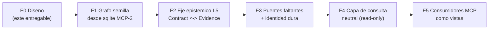
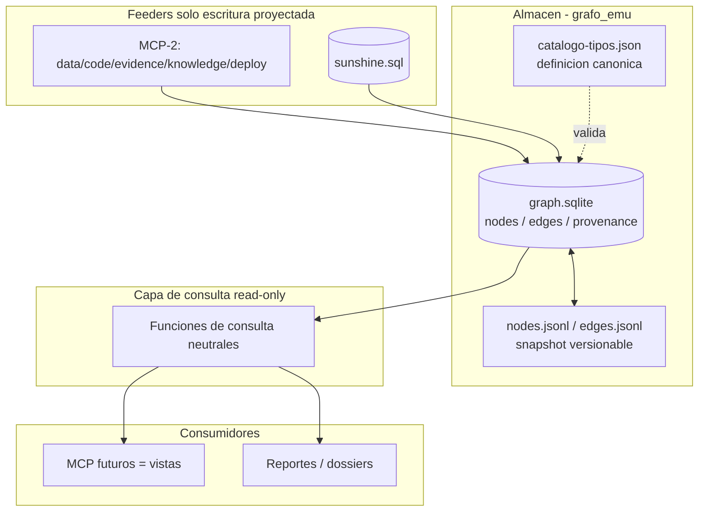
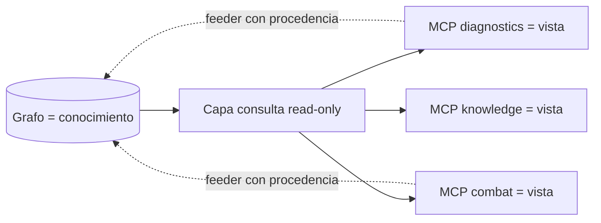

# 07 — Roadmap y Recomendación Arquitectónica

> Roadmap por fases (sin ejecutar) y la **recomendación arquitectónica final**: dónde vive el grafo, cuándo evolucionar, y cómo los MCP futuros lo consumen sin poseerlo.

---

## 1. Roadmap por fases

### F0 — Diseño *(completado con estos 9 documentos)*
- Visión, inventario, entidades, relaciones, modelo, preguntas, ingesta, identidad.
- **Salida:** carpeta `grafo_emu/` documental. Sin código.

### F1 — Grafo semilla desde MCP-2
- Definir el catálogo de tipos JSON (NodeType/EdgeType del doc 04).
- Crear `graph.sqlite` (tablas `nodes`/`edges`/`provenance`).
- Extractores de **lectura** sobre las 5 SQLite existentes (doc 06) → poblar L1 (data-index), L2 (code-index), L3 (evidence), L4 (deploy), L5 base (knowledge).
- **Salida:** grafo navegable con lo que MCP-2 ya sabe, sin recomputar nada. Export `nodes.jsonl`/`edges.jsonl`.
- **Criterio de éxito:** poder consultar "handler del efecto X", "drops del monstruo Y", "findings del hechizo Z" en un solo modelo.

### F2 — Eje epistémico L5 (el corazón)
- Materializar Contract↔Evidence↔Finding↔Hypothesis con procedencia completa.
- Conectar `data-index.contracts` (esperado) con `evidence` (observado) vía Spell.
- Reproducir los 4 bugs dorados (BUG-001..004) como subgrafos verificables completos.
- **Salida:** el grafo responde "¿qué sabemos, con qué evidencia y confianza, sobre el hechizo X?".
- **Criterio de éxito:** cada finding traza su cadena hasta Evidence y Contract.

### F3 — Puentes faltantes + identidad dura
- Cerrar las relaciones faltantes del doc 03-D:
  - `EffectHandler REALIZES Contract` (puente L2↔L5).
  - `Item USES_EFFECT Effect` (parsear hex de ítems).
  - `Deployment CHANGES Method` (git-diff↔code-index).
  - `Hypothesis CONFIRMED_BY Deployment` (cierre del ciclo).
- Implementar la reconciliación de identidad dura (doc 08): correlación Fighter→Character/Monster intra-fight.
- **Salida:** grafo con cobertura de cruce de capas y identidad resuelta o en cuarentena explícita.

### F4 — Capa de consulta neutral (solo lectura)
- Definir una API de consulta interna **agnóstica de motor** (funciones: vecinos, camino, subgrafo por spell, cobertura).
- Consultas multi-salto vía CTE recursivos sobre SQLite.
- **Salida:** capa de lectura estable que aísla a los consumidores del almacenamiento físico.

### F5 — Consumidores MCP como vistas
- Adaptar/crear MCP que **leen** la capa de consulta (no acceden a tablas crudas).
- MCP-2 se reposiciona: sus servidores diagnostics/combat/knowledge se vuelven **vistas** sobre el grafo y **feeders** (escriben nodos/aristas con procedencia).
- **Salida:** ecosistema donde el grafo es la fuente de verdad y los MCP son interfaces.

---

## 2. Recomendación arquitectónica final

### 2.1 ¿SQLite, JSON o Neo4j?

| Opción | Veredicto | Razón |
|--------|-----------|-------|
| **SQLite** | **SÍ — almacén operativo ahora** | 4 de 5 fuentes ya son SQLite; MCP-2 usa `better-sqlite3`; coste de adopción casi nulo; CTE recursivos cubren multi-salto a esta escala (~decenas de miles de nodos). |
| **JSON / JSONL** | **SÍ — definición + snapshot** | Catálogo de tipos en JSON (revisable); `nodes.jsonl`/`edges.jsonl` como snapshot portable y versionable en git/PR. |
| **Neo4j / Memgraph** | **DIFERIR** | No justificado a esta escala. Adoptar solo si: (a) consultas de camino >4 saltos se vuelven cuello de botella, o (b) el volumen de logs crece ×100. El modelo neutral (doc 04) garantiza migración limpia. |
| **GraphQL / APIs** | **NO (fuera de alcance)** | Restricción explícita del proyecto. |

### 2.2 Arquitectura recomendada

### 2.3 Por qué esta combinación
1. **SQLite como verdad operativa**: transaccional, indexable, cero infraestructura, ya dominado por el equipo.
2. **JSONL como verdad versionable**: el grafo entra en git, se revisa en PR, se difunde sin servidor.
3. **JSON canónico como contrato**: el catálogo de tipos es el "esquema" que disciplina la ingesta.
4. **Neutralidad preservada**: el modelo NODO/ARISTA/PROPIEDAD (doc 04) no depende de SQLite; migrar a Neo4j sería un export de `nodes.jsonl`/`edges.jsonl` a Cypher `LOAD`.

---

## 3. Cómo consumen los MCP futuros (sin poseer el conocimiento)

### Principio: **separación conocimiento ↔ interfaz**

| Regla | Implicación |
|-------|-------------|
| **Los MCP leen vía la capa de consulta** | Nunca tocan tablas crudas; el almacenamiento puede cambiar sin romperlos. |
| **Los MCP no almacenan conocimiento propio** | Lo que descubren (un finding, una hipótesis) se **escribe en el grafo con procedencia**, no en una base privada. |
| **El grafo es la única fuente de verdad** | Dos MCP que pregunten lo mismo obtienen la misma respuesta. |
| **MCP-2 se reposiciona** | De dueño de 5 bases aisladas → feeder+vista sobre el grafo unificado. Sus bases siguen existiendo como staging/feeder. |
| **Procedencia obligatoria al escribir** | Un MCP que aporta un nodo/arista estampa `source=MCP2`, `deriver`, `confidence`. |

### Migración no disruptiva de MCP-2
1. MCP-2 sigue funcionando igual (sus 5 SQLite intactas).
2. El grafo lee de esas SQLite (F1–F2).
3. Progresivamente, los servidores MCP-2 añaden una ruta de **lectura desde el grafo** (vista) además de su lógica actual.
4. Finalmente, el conocimiento nuevo se escribe en el grafo; las SQLite de MCP-2 quedan como caché/staging.

---

## 4. Riesgos y mitigaciones

| Riesgo | Mitigación |
|--------|-----------|
| Derivados stale (data-index desactualizado) | `provenance.deriver@version` + reingesta por hash; reportar derivados viejos. |
| Cobertura observacional mínima (2 fights) | Priorizar profundidad sobre hechizos observados; ampliar logs en paralelo. |
| Identidad efímera de Fighters | Cuarentena explícita (doc 08); no contaminar el grafo con joins dudosos. |
| Explosión de nodos (millones de filas BD) | Modelar selectivamente por valor epistémico (doc 02 §criterio de inclusión). |
| Acoplamiento accidental MCP↔almacenamiento | Capa de consulta neutral obligatoria (F4) antes de F5. |

---

## 5. Definición de "hecho" (criterios de cierre del proyecto)

- [ ] Catálogo de tipos JSON definido y validado.
- [ ] `graph.sqlite` poblado desde las 5 SQLite de MCP-2 (F1).
- [ ] Los 4 bugs dorados representados como subgrafos epistémicos completos (F2).
- [ ] Relaciones faltantes críticas cerradas o documentadas como cuarentena (F3).
- [ ] Capa de consulta read-only operativa (F4).
- [ ] Al menos un MCP consumiendo el grafo como vista (F5).
- [ ] `nodes.jsonl`/`edges.jsonl` versionados en git.

---

## 6. Resumen ejecutivo de la recomendación

> **Construir el grafo sobre SQLite + snapshots JSONL, con catálogo de tipos en JSON, reutilizando las 5 SQLite de MCP-2 como feeders de solo lectura. Diferir Neo4j hasta que las consultas multi-salto lo exijan. Los MCP futuros consumen el grafo a través de una capa de consulta de solo lectura y aportan conocimiento nuevo siempre con procedencia, de modo que el grafo —y no ningún MCP— sea el dueño único del conocimiento verificable sobre el comportamiento del emulador.**

---

*Anterior: [06-plan-ingesta.md](06-plan-ingesta.md) · Siguiente: [08-identity-resolution.md](08-identity-resolution.md)*
