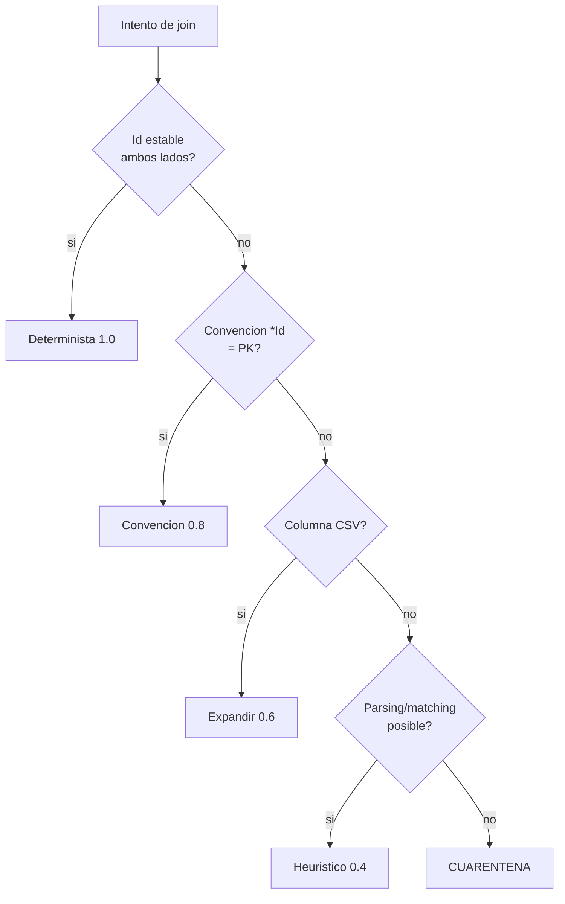
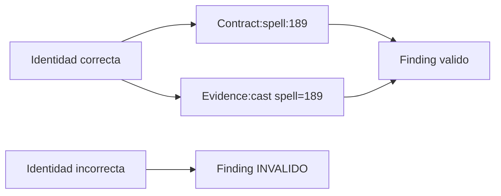

# 08 — Reconciliación de Identidades

> Documento dedicado **exclusivamente** a cómo se reconcilia la identidad de una misma entidad entre **BD**, **código C#**, **logs** y **MCP-2**.
> Es la base sobre la que se sostiene toda la capa de Conocimiento (L5): sin identidad correcta, un `Finding CONTRADICTS Contract` puede estar comparando peras con manzanas.

---

## 1. Por qué este documento es crítico

El grafo afirma cosas como *"el hechizo 189 observado en el log contradice su contrato derivado de la BD"*. Esa afirmación **solo es válida** si el `189` del log, el `189` de la BD y el handler de código son **la misma entidad**. Las cuatro fuentes usan claves distintas, formatos distintos y, en algunos casos, ids que **parecen** lo mismo pero no lo son. Reconciliar identidades es el prerrequisito de la verdad verificable.

---

## 2. Esquema de identidad canónica

Toda entidad del grafo tiene un id de la forma `tipo:clave`, con un espacio de nombres por tipo y una clave **estable** (que no cambia entre reingestas).

| Tipo de nodo | Id canónico | Clave estable | Fuente de la clave |
|--------------|-------------|---------------|--------------------|
| Spell | `spell:<Spell>` | id de hechizo | `spells.Spell` (= `spell` en logs) |
| SpellLevel | `spelllevel:<rowId>` | id de fila de nivel | `spells_levels` row id |
| Effect | `effect:<EffectsEnum>` | valor del enum | `EffectsEnum` (C#) ↔ id en hex (BD) ↔ `effect=` (log) |
| Item | `item:<Id>` | id de ítem | `items.Id` |
| Monster | `monster:<Id>` | id de plantilla | `monsters.Id` |
| Npc | `npc:<Id>` | id de NPC | `npcs.Id` |
| Map | `map:<Id>` | id de mapa | `worlds_maps.Id` (= `MapId`) |
| Quest | `quest:<Id>` | id de quest | `quests.Id` |
| Character | `character:<Id>` | id global de personaje | `characters.Id` |
| CSharpType | `cstype:<FQN>` | nombre cualificado | namespace + tipo (C#) |
| Method | `method:<FQN>.<name>` | tipo + método | code-index `methods` |
| EffectHandler | `effecthandler:<EffectsEnum>` | enum que maneja | `[EffectHandler(X)]` |
| MessageHandler | `msghandler:<msgId>` | id de mensaje | `[WorldHandler(id)]` |
| Fight | `fight:<fightId>` | id de pelea | `sessions.fight_id` (= `fight=` log) |
| Cast | `cast:<sessionId>:<seq>` | sesión + secuencia | evidence `casts` |
| LogEvent | `event:<sessionId>:<seq>` | sesión + secuencia | evidence `events` |
| Fighter | `fighter:<fightId>:<actorId>` | pelea + id efímero | `actor=`/`caster=` log **(¡efímero!)** |
| Contract | `contract:<spellId>:<level>` | spell + nivel | `data-index.contracts` |
| Finding | `finding:<id>` | autoincrement | `evidence.findings.id` |
| Bug | `bug:<BUG-XXX>` | código de bug | `knowledge.bugs.id` |
| BugSignature | `signature:<id>` | id de firma | `knowledge.known_signatures.id` |
| Deployment | `deploy:<id>` | id de deploy | `deploy.deploys.id` |
| Commit | `commit:<sha>` | sha git | git |

---

## 3. Tabla de claves de join por fuente

La misma entidad, expresada en cada fuente:

| Entidad | BD | Código C# | Logs | MCP-2 |
|---------|----|-----------|------|-------|
| **Spell** | `spells.Spell` | `SpellTemplate`, `SpellIdEnum` | `spell=189` | `data-index.spells.spell_id`, `evidence.casts.spell` |
| **Effect** | id dentro de hex en `spells_levels.Effects` | `EffectsEnum.X` | `effect=...` | `data-index.spell_effects.effect_id` |
| **EffectHandler** | — | `[EffectHandler(EffectsEnum.X)]` clase | (se infiere por `handlers=N`) | `code-index.attributes` |
| **Map** | `worlds_maps.Id` / `MapId` | `MapRecord` | `cell=` (no map directo) | — |
| **Character** | `characters.Id` | `Character` | `caster=` **(NO es characters.Id)** | `evidence.casts.caster` (efímero) |
| **Monster** | `monsters.Id` | `MonsterTemplate` | `monster=` | — |
| **Fight** | — | `Fight` | `fight=1` | `evidence.sessions.fight_id` |
| **Bug** | — | comentarios/archivos | (síntoma en eventos) | `knowledge.bugs.id` |

---

## 4. Casos duros (la razón de este documento)

### 4.1 `caster=` / `actor=` en logs ≠ `characters.Id` ⚠️ CRÍTICO
- En el log: `event=CAST caster=378 ...`. Ese `378` es un **id de combatiente (fighter) efímero**, asignado por `Fight` al entrar a la pelea. **No** es `characters.Id` ni `monsters.Id`.
- Dos peleas distintas pueden reusar `caster=378` para entidades completamente diferentes.
- **Implicación:** la arista `Cast CAST_BY Character/Monster` **no puede** materializarse por join directo. Es un caso de identidad **no resuelta** por defecto.
- **Estrategia:** identidad **scoped por pelea** (`fighter:<fightId>:<actorId>`). La resolución a entidad global requiere correlacionar eventos de entrada/sync de la pelea (quién es quién), trabajo de F3. Mientras no se resuelva → cuarentena de la arista global, pero el `Fighter` scoped sí es válido.

### 4.2 `spells_levels.SpellId` NO es el spell padre ⚠️
- La columna `spells_levels.SpellId` es el **id de la fila de nivel**, no el id del hechizo padre.
- El vínculo real está al revés: `spells.SpellLevelsIdsCSV` lista los ids de fila de niveles que pertenecen a un spell.
- **Implicación:** para ir de SpellLevel→Spell hay que **invertir el CSV**, no hacer `JOIN ON SpellId`.
- **Estrategia:** en ingesta, construir el índice inverso `rowId → spellId` expandiendo `SpellLevelsIdsCSV`. Confianza 0.6 (CSV).

### 4.3 Effect ids embebidos en hex ⚠️
- Los efectos de un hechizo/ítem no están en columnas: están **serializados en hex** dentro de `spells_levels.Effects` / `items.Effects`.
- El parser de MCP-2 (`effects-parser.js`) ya los decodifica **para spells**; para **ítems es un gap** (no parseado).
- **Implicación:** `Effect` como nodo se obtiene del enum C#, pero la arista `USES_EFFECT` depende de decodificar hex correctamente. Confianza 0.4 (parsing).
- **Estrategia:** reutilizar `parseEffectsHex` de MCP-2 para spells; extenderlo a items en F3.

### 4.4 Símbolos C# sin FQN ⚠️
- El indexer actual (`code-index/indexer.js`) captura `types.name` y `methods.type_name` por **regex**, **sin namespace**. No hay FQN.
- **Implicación:** dos clases homónimas en namespaces distintos colisionan; la identidad `cstype:<name>` es **heurística**, no determinista.
- Además, `calls` (receiver.callee) no resuelve el tipo del receiver → falsos positivos.
- **Estrategia:** identidad canónica objetivo `cstype:<FQN>`, pero hasta tener FQN: usar `cstype:<name>@<file>` como desambiguador, y marcar confianza 0.4 en aristas que dependan de resolución de tipos. Mejorar el indexer (capturar `namespace`) es tarea de F3.

### 4.5 Columnas `*CSV` multivaluadas
- `SpellsCSV`, `ItemsCSV`, `MonstersCSV`, `StepIdsCSV`, etc. empaquetan múltiples ids en un string.
- **Implicación:** una fila = muchas aristas. Riesgo de ids vacíos, espacios, formatos `id:cantidad`.
- **Estrategia:** expandir en ingesta a multi-aristas; normalizar (trim, descartar vacíos); para pares `id:qty` (recetas) separar clave de propiedad. Confianza 0.6.

### 4.6 Tablas sin PK
- ~20 tablas no tienen PK declarada (`characters_spells`, `monsters_drops`, `npcs_replies`, `spells_levels`…).
- **Implicación:** no hay clave natural única para el nodo/arista.
- **Estrategia:** construir clave compuesta determinista a partir de las columnas semánticas (p.ej. `npcshop:<NpcId>:<Item>`, `drop:<MonsterId>:<ItemId>`). Documentar la clave elegida por tabla.

### 4.7 `monster=` en log vs `monsters.Id`
- El log puede traer `monster=` con el id de plantilla, pero también ids de instancia/invocación.
- **Estrategia:** join validado contra `monsters.Id`; si no existe en BD, tratar como instancia runtime (no plantilla) → no crear arista a Monster plantilla, marcar para revisión.

---

## 5. Joins deterministas vs heurísticos

### 5.1 Deterministas (confianza 1.0) — id estable a ambos lados
- `spell` (log) ↔ `spells.Spell` (BD) ↔ `data-index.spells.spell_id`.
- `fight` (log) ↔ `sessions.fight_id`.
- `EffectsEnum` (C# atributo) ↔ `effect_id` (data-index).
- `bug_id` ↔ `known_signatures.bug_id`.
- `deploys.commit_hash` ↔ git sha.
- `findings.session_id` ↔ `sessions.id`.

### 5.2 Por convención (confianza 0.8) — `*Id` que coincide con PK
- `monsters_drops.MonsterId` → `monsters.Id`.
- `npcs_items.NpcId` → `npcs.Id`.
- `characters_*.OwnerId` → `characters.Id`.
- `worlds_npcs.Map` → `worlds_maps.Id`.

### 5.3 Por CSV (confianza 0.6) — expansión multivaluada
- `breeds_spells`, `*CSV` de quests/items/monstruos/guilds.

### 5.4 Heurísticos (confianza ≤0.4) — requieren matching/parsing
- Efectos en hex → Effect.
- Símbolos C# sin FQN → CSharpType.
- `calls` receiver.callee → Method.
- `caster` efímero → Character/Monster (**no resoluble** sin correlación intra-fight).



---

## 6. Política de fusión / dedupe

| Situación | Política |
|-----------|----------|
| Mismo id canónico desde 2 fuentes | **Fusionar** props; conservar todas las `provenance` (lista). Confianza = máx de las fuentes. |
| Props en conflicto (BD dice X, log dice Y) | **No sobrescribir**: registrar ambas con su procedencia; la divergencia es conocimiento (posible Finding). |
| Derivado recomputado | Nueva versión (`deriver@vN+1`); marcar anterior `superseded`, no borrar. |
| Dos nodos que resultan ser el mismo | **Merge** con registro de alias; preservar ambos ids como `also_known_as`. |
| Id duplicado por error de clave | Revisar regla de clave canónica; no insertar hasta corregir. |

---

## 7. Cuarentena de identidades no resueltas

Cuando una identidad **no** se puede resolver con confianza mínima, **no entra al grafo principal**: va a una zona de cuarentena.

```json
{
  "quarantine_id": "q:cast_caster:fight1:378",
  "reason": "fighter efimero no correlacionado a entidad global",
  "candidate_types": ["character", "monster", "summon"],
  "raw": { "fight": 1, "caster": 378, "spell": 189 },
  "provenance": { "source": "LOG", "ref": "fights/1.log:48213" },
  "needs": "correlacion intra-fight (eventos de entrada/sync)",
  "phase": "F3"
}
```

Reglas de cuarentena:
1. Un elemento en cuarentena **no participa** en consultas de conocimiento (no contamina findings).
2. Se reporta en `ingest-report.md` (cuántos, por qué).
3. Se intenta re-resolver en cada reingesta y cuando llegan datos nuevos (más logs, FQN del indexer mejorado).
4. La cuarentena es **explícita y auditable**: preferimos un hueco honesto a una arista falsa.

---

## 8. Identidad y la capa de Conocimiento (por qué esto sostiene L5)



- Un **Contract** se ancla a `spell:189` (BD). Una **Evidence** se ancla a `spell:189` (log). El **Finding** que los confronta solo es legítimo si ambos `189` son, con certeza, el mismo hechizo. → join determinista 5.1.
- Una **Hypothesis** que `SUSPECTS method:X` necesita que `method:X` esté correctamente identificado en código. → hoy heurístico (sin FQN); por eso las hipótesis arrastran confianza moderada.
- Un **Finding** sobre *quién* lanzó (Character) está **bloqueado** por el caso 4.1; por eso esas afirmaciones van a cuarentena en vez de afirmarse en falso.

> **Conclusión:** la calidad del conocimiento del grafo está acotada por la calidad de la resolución de identidad. Los joins deterministas (spell, fight, effect-enum, bug) habilitan el núcleo epistémico hoy; los casos duros (fighter efímero, FQN, hex de ítems) definen exactamente qué afirmaciones podemos hacer y cuáles deben esperar a F3.

---

## 9. Checklist de identidad para la ingesta

- [ ] Toda clave canónica documentada por tipo de nodo (§2).
- [ ] Índice inverso `SpellLevel.rowId → spell` construido (caso 4.2).
- [ ] Parser hex reutilizado para spells; ítems marcado como gap (caso 4.3).
- [ ] Indexer C#: FQN pendiente; usar `name@file` como desambiguador (caso 4.4).
- [ ] Expansión CSV normalizada (caso 4.5).
- [ ] Claves compuestas definidas para tablas sin PK (caso 4.6).
- [ ] `Fighter` modelado scoped por pelea; arista a entidad global en cuarentena (caso 4.1).
- [ ] Zona de cuarentena con reporte y reintento.

---

*Anterior: [07-roadmap.md](07-roadmap.md) · Volver al inicio: [00-vision.md](00-vision.md)*
