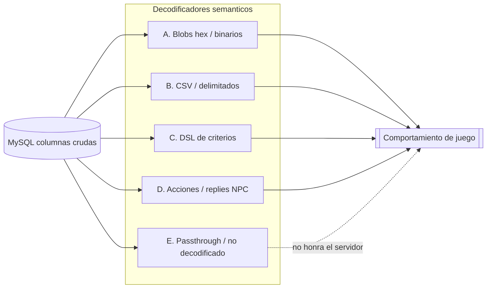

# 11 — Auditoría de Decodificadores Semánticos

> **Objetivo.** Catalogar las **reglas semánticas** de Sunshine: el código C# que transforma
> datos crudos y serializados de la base de datos (blobs hex, CSV, DSL de criterios, payloads
> de acciones) en **objetos y comportamiento de juego**. Este documento NO cataloga entidades
> (eso es `02-entidades.md`); cataloga **decodificadores** — las funciones que dan significado a
> los bytes y cadenas almacenados.
>
> **Tesis.** La BD de Sunshine no contiene "comportamiento": contiene datos codificados que solo
> cobran sentido al pasar por un decodificador concreto. Quien controla el decodificador controla
> la semántica. Por eso muchos campos están **almacenados pero no decodificados**, y algunos
> decodificadores están **rotos o contradicen el runtime** — y eso es conocimiento verificable de
> primera clase (ver `00-vision.md`, Principio 2: los logs/runtime son evidencia primaria).

## 0. Propósito y método

### 0.1 Qué es un "decodificador semántico"

Una unidad de código (clase + método) que recibe un valor crudo de una columna de la BD y
produce estructura o comportamiento: una lista de `Effect`, un grafo de diálogo, una decisión
de equipabilidad, una celda transitable, un objetivo de quest, etc. El criterio de inclusión es
que **transforme** la representación, no que simplemente la mapee 1:1 con Dapper.

### 0.2 Plantilla por decodificador (9 campos)

Cada decodificador se documenta con: **Clase C#** · **Método (ruta:líneas)** · **Tabla origen**
· **Columna origen** · **Formato esperado (ejemplo real)** · **Significado de cada token** ·
**Entidades referenciadas** · **Confianza** · **Relaciones de grafo sugeridas**.

### 0.3 Modelo de confianza (reutilizado de `04-modelo-grafo.md`)

| Nivel | Criterio |
|-------|----------|
| **Alta** | Código de lectura leído byte a byte / token a token + ejemplo real de la BD confirmado |
| **Media** | Formato inferido por enum/convención, o decodificador presente pero no validado en runtime |
| **Baja** | Passthrough al cliente, o formato deducido sin código server que lo consuma |

Convención adicional: **ALMACENADO PERO NO DECODIFICADO** se marca como hallazgo explícito.
No es ruido: es el límite real entre "lo que la BD promete" y "lo que el servidor honra".

### 0.4 Las cinco familias



### 0.5 Nota de verificación (id de efecto)

Durante la auditoría apareció una discrepancia: una lectura rápida mapeó el id `0x63` (99) a
`Effect_DamageEarth`. La verdad según `Sunshine net11.0/Sunshine net11.0/Sunshine.Protocol/Enums/EffectsEnum.cs`
es **99 = `Effect_DamageFire`** (línea 38); `Effect_DamageEarth` es 97 (línea 36). Este documento
toma `EffectsEnum.cs` como fuente de verdad y cita la línea. La anécdota es justamente el riesgo
que esta auditoría existe para acotar: **el byte no significa nada hasta que un decodificador +
un enum concretos lo interpretan**, y un mapeo descuidado produce conocimiento falso.

---

## 1. Familia A — Blobs binarios / hex

La familia más crítica: convierte longtext hexadecimal o `byte[]` en objetos `Effect` / celdas /
ObjectEffect. Todos los lectores comparten `Utils.GetHexaToByteArray` (`Sunshine.Protocol/Utils/Utils.cs:71-81`)
y `BigEndianReader` (lectura Big-Endian).

### A.1 — `EffectManager.GetEffects(string)` — formato hex Sunshine (PRIMARIO)

- **Clase C#:** `EffectManager`
- **Método:** `GetEffects(string hexa)` — `Sunshine net11.0/Sunshine net11.0/Sunshine.WorldServer/Game/Effects/EffectManager.cs:23-51`
- **Tabla origen:** `spells_levels`, `items`, `items_weapons`, y contenedores de items (ver tabla §6.2)
- **Columna origen:** `Effects`, `CriticalEffects`
- **Formato esperado (BE):** `count(2) · [ effectId(4) · diceNum(4) · diceFace(4) · value(4) · delay(4) · duration(4) · target(4) · UTF(zona) · zoneMinSize(4) · zoneSize(4) · zoneShape(4) · bool · int · int · int · bool ]`
  - Ejemplo real, `spells_levels` spell 189 nivel 941: `0002 00000063 0000000b 0000006e ...` (`sunshine.sql:64366`)
- **Significado de cada token:**
  - `count` = nº de efectos. `effectId` = valor de `EffectsEnum`. `diceNum`/`diceFace` = rango de dado (min..max) que `Effect.GenerateEffect()` resuelve a `value`. `delay`/`duration` = retardo y turnos. `target` = bitmask `SpellTargetType`. `UTF` = descripción de zona ("null zone"). `zoneMinSize`/`zoneSize` = radios. `zoneShape` = letra ASCII `SpellShapeEnum` (P=80, C=67). Los 5 campos finales se leen y se descartan.
- **Entidades referenciadas:** `EffectsEnum`, `SpellTargetType`, `SpellShapeEnum`; aguas arriba `SpellLevel`/`ItemTemplate`/`WeaponTemplate`.
- **Confianza:** **Alta** — lectura/escritura simétrica (`SetEffects` :140-163), confirmada contra hex real.
- **Relaciones de grafo:** `SpellLevel -HAS_EFFECTS-> EffectBlob`; `EffectBlob -DECODED_BY-> EffectManager.GetEffects(string)`; `EffectBlob -PRODUCES-> Effect`; `Effect -TYPED_AS-> EffectsEnum`.

> **Caveat estático≠runtime (clave).** El id `99` del ejemplo es `Effect_DamageFire` (`EffectsEnum.cs:38`),
> pero el log real de spell 189 despacha `Effect_Summon` (ver `09-vertical-slice-validation.md`). El parser
> ingenuo de MCP-2 (`mcp/data-index/effects-parser.js`) lee 6×UInt32 y se desalinea respecto a este layout
> completo (que incluye el campo UTF de zona). **`EffectManager.GetEffects` es el único decodificador fiel**;
> el de MCP-2 es una aproximación de baja confianza. Arista `effect(estático) -CONTRADICTS-> effect(runtime)`.

### A.2 — `EffectManager.GetEffects(string, isItemSet:true)` — hex anidado de panoplias

- **Clase / Método:** `EffectManager.GetEffects(string hexa, bool isItemSet)` — `EffectManager.cs:103-138`
- **Tabla / Columna:** `items_sets.Effects`
- **Formato:** `countTiers(2) · [ countEffects(2) · [ effectId(4) · value(4) · delay(4) · duration(4) · target(4) · UTF · zoneMin(4) · zoneSize(4) · shape(4) · flags ] ]` — **sin `diceNum`/`diceFace`** (construye `Effect` con dados 0/0).
  - Ejemplo: Panoplie du Bouftou empieza `0007` = 7 tiers (`sunshine.sql:8767`).
- **Significado:** un bloque de efectos por nº de piezas equipadas (tier 2, 3, …).
- **Entidades:** `ItemSet`, `EffectsEnum`, `StatsEnum`.
- **Confianza:** **Alta** — overload dedicado con layout distinto.
- **Relaciones:** `ItemSet -HAS_TIER_EFFECTS-> EffectBlob -DECODED_BY-> EffectManager.GetEffects(hex,true)`.

### A.3 — `EffectManager.GetEffects(byte[])` — fallback binario Stump/Rollback

- **Clase / Método:** `EffectManager.GetEffects(byte[] buffer)` — `EffectManager.cs:53-101`
- **Tabla / Columna:** `SpellTemplate.BinaryEffect(s)` / `BinaryCriticalEffect(s)` — usado solo si las columnas texto están vacías (`SpellManager.ResolveSpellEffects`).
- **Formato:** loop hasta EOF; `serializationId(1)` selecciona variante (case 1 = solo id; case 4 = value+diceNum+diceFace shorts; case 6 = value short); campos `id(4)`, `random(4)`, `duration(2)`, `target(2)`, `shape(1)`, `zoneSize(1)`.
- **Confianza:** **Media** — código completo y cableado, pero **las columnas `Binary*` no existen en el schema actual** (`sunshine.sql` `spells_levels` DDL 59716-59744). Decodificador inactivo hoy.
- **Relaciones:** `SpellLevel -BINARY_EFFECTS_FALLBACK-> Bytes -DECODED_BY-> EffectManager.GetEffects(byte[])`.

### A.4 — `ObjectEffectSerializer.Deserialize(string)` — ObjectEffect de items de jugador

- **Clase / Método:** `ObjectEffectSerializer.Deserialize(string hex)` — `Sunshine net11.0/Sunshine net11.0/Sunshine.WorldServer/Game/Items/ObjectEffectSerializer.cs:37-64`
- **Tabla / Columna:** `characters_items.Effects`, `account_bank_items.Effects`, `world_trashes_items.Effects`, `characters_items_merchant.Effects`, `mounts_items.SerializedEffects`
- **Formato:** `count(2) · [ typeId(2) · <deserialización polimórfica por subtipo> ]`. `typeId` selecciona la clase `ObjectEffect` vía `ProtocolTypeManager`.
- **Significado por subtipo (`actionId` = `EffectsEnum`):** 76 `ObjectEffect` (solo actionId) · 70 `ObjectEffectInteger` (+value) · 71 `ObjectEffectCreature` (+monsterFamilyId) · 72 `ObjectEffectDate` · 73 `ObjectEffectDice` (+diceNum/diceSide/diceConst) · 74 `ObjectEffectString` · 75 `ObjectEffectDuration` · 81 `ObjectEffectLadder` · 82 `ObjectEffectMinMax` (+min/max) · 179 `ObjectEffectMount`.
- **Puente parcial:** solo `ObjectEffectInteger` se promueve a `Game.Spells.Effect` (`CharacterManager.cs:209-219`). El resto queda en `RawObjectEffects`.
- **Entidades:** `ObjectEffect*`, `EffectsEnum`, `ItemTemplate` del jugador.
- **Confianza:** **Alta** para la deserialización; **Media** para cobertura semántica (solo Integer se promueve).
- **Relaciones:** `PlayerItem -HAS_RAW_EFFECTS-> ObjectEffectBlob -DECODED_BY-> ObjectEffectSerializer`; `ObjectEffectInteger -PROMOTED_TO-> Effect`.

### A.5 — `House.DeserializeEffects(string)` — formato texto colon (cofres/casas)

- **Clase / Método:** `House.DeserializeEffects(string)` — `Sunshine net11.0/Sunshine net11.0/Sunshine.WorldServer/Game/Maps/Houses/House.cs:564-610`
- **Tabla / Columna:** almacenamiento de casa/cofre (`Effects`)
- **Formato:** registros separados por `,`, campos por `:`: `id:diceNum:diceFace:value:delay:duration:target:zoneShape:zoneMinSize:zoneSize`. Ej: `118:0:0:300:0:0:0:80:0:0,126:0:0:300:...` (`sunshine.sql:1642`).
- **Confianza:** **Alta** (solo cofres de casa; distinto del hex de templates).
- **Relaciones:** `HouseItem -HAS_EFFECT-> Effect`.

### A.6 — Hex de mapas: `MapManager.GetElements` y `GetPatternCells`

- **Clase / Método:** `MapManager.GetElements(Map)` — `Sunshine net11.0/Sunshine net11.0/Sunshine.MySql/Database/Managers/MapManager.cs:148-162`; `GetPatternCells(Map, bool)` :117-146
- **Tabla / Columna:** `worlds_maps.Elements`, `worlds_maps.BlueCells`, `worlds_maps.RedCells`
- **Formato:**
  - `Elements`: pares `(cellId:short BE, elementId:uint BE)` hasta EOF. Ej: map `10748930` `013E00000235` → celda 318, elemento 565.
  - `BlueCells`/`RedCells`: `count(short) · [cellId(short)]×count` (celdas de inicio de combate por equipo).
- **Significado:** une elementos gráficos DLM a celdas; celdas de colocación de combate.
- **Entidades:** `Cell`, `Interactive` (join con `worlds_interactives.Element`), colocación de combate.
- **Confianza:** **Alta** para `Elements`; **Media** para Blue/Red (casi todo `null` en el dump → cae al fallback DLM).
- **Relaciones:** `Map -ELEMENT_AT-> Cell`; `Cell -HOSTS-> Interactive`; `Map -FIGHT_START{team}-> Cell`.

### A.7 — Geometría de celdas DLM: `DlmReader` / `DlmMap` / `DlmCellData`

Aunque el origen es un asset externo (`maps/maps0.d2p`), es el decodificador que da **significado a
las celdas** que la BD referencia, por lo que se incluye.

- **Clases / Métodos:** `DlmReader.ReadMap()` (`Sunshine.Protocol/Tools/Dlm/DlmReader.cs:71-104`, zlib si el primer byte ≠ `'M'`); `DlmMap.ReadFromStream` (`DlmMap.cs:194-306`, header + 560 celdas); `DlmCellData.ReadFromStream` (`DlmCellData.cs:117-145`)
- **Formato por celda:** `m_rawFloor(sbyte; -128=vacía)`, `LosMov(byte, bitfield)`, `Speed(byte)`, `MapChangeData(byte)`, `MoveZone(byte si v>5)`, `_arrow(4 bits si v>7)`.
- **Bitfield `LosMov`:** bit0 Walkable · bit1 Los · bit2 NonWalkableDuringFight · bit3 Red · bit4 Blue · bit5 FarmCell · bit6 Visible · bit7 NonWalkableDuringRP.
- **Significado / uso server:** Walkable/teams/farm/RP se usan (pathfinding, colocación); **`Los` y `Visible` se decodifican pero NO se validan en combate** (ver §5).
- **Confianza:** **Alta** (parsing); **Media** en semántica de `MapChangeData`/`MoveZone` (convención cliente).
- **Relaciones:** `Map -HAS_CELL-> Cell{walkable,los,red,blue,farm,...}`; `Map -NEIGHBOR{dir,offset}-> Map`.

### A.8 — Puente efecto → comportamiento (cierre de familia)

El blob decodificado no "hace" nada solo. La cadena de activación:

- `EffectsLoader.Initialize()` (`Sunshine.BaseServer/Loaders/World/Effects/EffectsLoader.cs:13-47`) reflexiona todas las clases `SpellEffectHandler` y lee su atributo `[EffectHandler(EffectsEnum.X)]`, registrando `EffectManager.SpellEffects[id] = factory`.
- `EffectDispatcher.Dispatch()` (`Sunshine.WorldServer/Game/Effects/EffectDispatcher.cs:33-40`) busca `SpellEffects[effect.Id]` y ejecuta `Apply()`. Si no hay handler → log `"Cannot dispatch the effect {id}"` (:62).
- Para stats de equipo (sin handler por efecto): `ItemEffectHandler.EffectsRelations` (`ItemEffectHandler.cs:81-173`) mapea `EffectsEnum` → `StatsEnum`.
- **Relaciones:** `Effect -COMBAT_HANDLED_BY-> SpellEffectHandler` (vía `[EffectHandler]`); `Effect -STAT_MAPPED_BY-> StatsEnum`.

---

## 2. Familia B — CSV / delimitados

Cadenas separadas por `,` (lista), `;` (grupos) y `|` (segmentos). Helper genérico:
`Extensions.ToIEnumerable<T>(string, char)` (`Sunshine.Protocol/Utils/Extensions/Extensions.cs:119-138`).
Hay ~47 columnas con formato delimitado en el schema; ~35 tienen decodificador C# real.

### B.1 — Quests (`QuestsCollection`, `QuestManager`)

| Columna | Método (ruta:líneas) | Formato / ejemplo | Tokens | Entidades | Confianza |
|---------|----------------------|-------------------|--------|-----------|-----------|
| `quests.StepIdsCSV` | `QuestsCollection.cs:117-278` | `2,3,4,5,32` | ids de paso ordenados | `quests_steps.Id` | Alta |
| `quests_steps.ObjectiveIdsCSV` | `QuestsCollection.UpdateObjective :228` | `286,178,287,179` | ids de objetivo | `quests_objectives.Id` | Alta |
| `quests_steps.ItemsRewardCSV` | `QuestsCollection.AddStepRewards :376-387` | `288,5` o `item,qty;item,qty` | `[0]`=item `[1]`=cantidad; `;`=grupos | `Item` | Alta (posible bug `items[i+i]`) |
| `quests_steps.JobsRewardCSV` | `:390-394` | lista de ids de oficio | job id | `jobs.Id` | Alta |
| `quests_steps.SpellsRewardCSV` | `:397-401` | lista de ids de hechizo | spell id | `spells.Spell` | Alta |
| `quests_objectives.ParametersCSV` | `QuestsCollection.UpdateObjective :304-312`; `QuestManager.VerifyQuest :255-262` | type-dependent | ver abajo | Map/Npc/Item/Monster | Media-Alta |

- **Clase C#:** `QuestsCollection` / `QuestManager` (`Sunshine net11.0/Sunshine net11.0/Sunshine.WorldServer/Game/Actors/Characters/Quests/`)
- **`ParametersCSV` dependiente del `Type`** (tabla `quests_objectives_types`): `Type 0` GO_TO → mapId; `Type 1` "Aller voir #1" → **Npc id**; `Type 3` "Ramener à #1: x#3 #2" → `npc,item,qty`; `Type 4` "Découvrir la carte" → mapId; `Type 6/7` → `monster,count` (pares); `Type 9` "Retourner voir" → Npc id. **El primer token es un NPC solo para ciertos tipos** — caso canónico de `08-identity-resolution.md`. Ya reflejado en `prototype/` como `INVOLVES_NPC` (conf 0.7).
- **Relaciones:** `Quest -HAS_STEP-> QuestStep`; `QuestStep -HAS_OBJECTIVE-> QuestObjective`; `QuestStep -REWARDS-> Item|Spell|Job`; `QuestObjective -TARGETS-> Map|Npc|Item|Monster`.

### B.2 — Diálogo de NPC (`Npc.ParseDialogCsv`)

- **Clase / Método:** `Npc.ParseDialogCsv` — `Sunshine net11.0/Sunshine net11.0/Sunshine.WorldServer/Game/Actors/Npcs/Npc.cs:224-254`; `GetDialogParameters` :313-344
- **Tabla / Columna:** `npcs.DialogMessagesIdCSV`, `npcs.DialogRepliesIdCSV`
- **Formato:** grupos separados por `;`, pares `messageKey,textId` por `,`. Ej (NPC 462): `336,12749;1918,12874;...`. Las replies pueden omitir la clave: `;replyKey,textId`.
- **Tokens:** `[0]` = id de estado/rama de diálogo · `[1]` = id de texto i18n (`NpcMessage`) · `[2+]` = args extra. `GetDialogParameters` interpreta `N`=nombre del personaje, `L`=nivel.
- **Entidades:** ids de mensaje de diálogo, textos i18n cliente (no map/spell).
- **Confianza:** **Alta** (parser explícito + fila real).
- **Relaciones:** `Npc -HAS_DIALOG-> DialogMessage`; `DialogMessage -HAS_REPLY-> DialogReply`.

### B.3 — EntityLook (`EntityManager.GetActorLook`)

- **Clase / Método:** `EntityManager.GetActorLook` (`Sunshine net11.0/Sunshine net11.0/Sunshine.WorldServer/.../EntityManager.cs:103-203`), `ParseCollection` :234-255, `ParseIndexedColor` :222-231
- **Tabla / Columna:** `npcs.EntityLook`, `monsters.EntityLook`, `characters.EntityLook`
- **Formato:** `{bonesId | skin1,skin2 | colorIndex=#hex,... | scale1,... | cat@bind={subLook},...}`. `|` separa tiers, `,` lista dentro del tier. Ej: `{714}` (solo huesos), `{563|||105}` (huesos 563, escala 105), `{8|||130}`.
- **Tokens:** tier1 bones (gfx) · tier2 skins (gfx) · tier3 colores indexados (`index=#RRGGBB`) · tier4 escalas · tier5 sub-entidades (`categoria@bindingIndex={look anidado}`).
- **Entidades:** gfx de huesos, gfx de skins, sub-entidades.
- **Confianza:** **Alta**.
- **Relaciones:** `Actor -LOOK_BONES-> Gfx`; `Actor -EQUIPPED_SKINS-> SkinGfx`; `Actor -HAS_SUBENTITY-> Look`.

### B.4 — Breeds (fórmulas de puntos de stat)

- **Clase / Método:** `BreedManager.GetStatsFormulas` (`BreedManager.cs:82-100`); parse en `BreedsLoader.cs:24-35`
- **Tabla / Columna:** `breeds.StatsPointsFor{Strength,Intelligence,Chance,Agility}CSV` (Vitality/Wisdom hardcoded)
- **Formato:** segmentos por `|`, cada segmento `minStat,coste`. Ej: `0,2|50,3|150,4|250,5`.
- **Tokens:** `[0]` umbral de stat, `[1]` coste por punto; el `[0]` del siguiente segmento = tope del anterior.
- **Entidades:** curvas de coste por breed (no FK).
- **Confianza:** **Alta**.
- **Relaciones:** `Breed -STAT_COST_CURVE-> {stat}`.

### B.5 — Recipes / oficios / pets

| Columna | Clase/Método | Formato | Tokens | Confianza |
|---------|--------------|---------|--------|-----------|
| `recipes.IngredientIdsCSV` + `QuantitiesCSV` | `JobManager.GetRecipe :289-294` | `473,441` + `1,1` | listas paralelas ingredient↔qty | Alta |
| `jobs_harvest.Loot` | `JobManager :230-234, 356-365` | `1,2` | min,max recursos | Alta |
| `pets_foods.FoodInformationsCSV` | `PetFoodRecord.EnsureParsed :35-52` | `id,extra;id,extra` | target food + peso; `;`=grupos | Alta |
| `items_livingobjects.SkinsCSV` | `LivingObjectRecord :44-61` | lista de gfx skins | skin gfx ids | Alta |

- **Relaciones:** `Recipe -USES_INGREDIENT{qty}-> Item`; `Job -HARVESTS{min,max}-> Resource`; `Pet -EATS-> FoodTarget`.

### B.6 — Monstruos y spawns (`MonsterManager`, `MonstersLoader`, `Monster`)

| Columna | Clase/Método | Formato | Significado | Confianza |
|---------|--------------|---------|-------------|-----------|
| `monsters_spells.SpellsCSV` | `MonsterManager.GetMonsterSpells :101-107` | `213,212` | spell ids (usa nivel máx) | Alta |
| `monsters.AI` | `Monster.ResolveAI :49-67` | `1` o `1,2` | valores `AIEnum` | Alta |
| `worlds_monsters.MonstersCSV` | `MonstersLoader :35-43` | `972,973,974,982` | candidatos de grupo aleatorio | Alta |
| `worlds_monsters_fix.MonstersCSV` + `CellsCSV` | `MonstersLoader :71-83` | `2785` + `313` | pares paralelos monstruo↔celda | Alta |

- **Relaciones:** `Monster -KNOWS_SPELL-> Spell`; `SubArea -SPAWNS-> Monster`; `FixedSpawn -AT_CELL-> Cell`.

### B.7 — Mundo: mapas, interactivos, triggers, mazmorras

| Columna | Clase/Método | Formato / ejemplo | Significado | Confianza |
|---------|--------------|-------------------|-------------|-----------|
| vecinos N/S/E/O | `ContextRoleplayHandler.HandleChangeMapMessage :88-110` | offsets de celda +532 / −532 / +13 / −13 | reubicación de celda al cambiar de mapa | Alta (código) / Media (porqué de constantes) |
| `world_maps.ParametersCSV` | `Map` / `ContextRoleplayHandler :101-105` | `targetMapId,...` | `[0]`=redirección de bug-map | Alta donde poblado |
| `world_maps_house.InterorMapsIdsCSV` | `WorldMapHouseRecord :82-86` | `59770886,...` | map ids interiores | Alta |
| `worlds_interactives.SkillsCSV` + `ParametersCSV` | `Interactive.cs:17-71` | `-1`+`394` o `159`+`28` | si skill=−1: `[0]`=celda stated, resto=obstáculos; si no: skill ids / job id | Alta |
| `worlds_triggers.ParametersCSV` | `Trigger.cs:15-19`, `TypeTeleport.cs:16-22` | `790,469,3` | mapId,cellId,direction | Alta |
| `dungeons.MonstersCSV` + `Parameters` | `Dungeon.cs:14-19` | `970,...` + `1573888,424,9` | monstruos + nextMap,nextCell,dir | Alta |

- **Relaciones:** `Map -NEIGHBOR{dir,offset}-> Map`; `Map -REDIRECTS_TO-> Map`; `Interactive -ON_ELEMENT-> Element -AT_CELL-> Cell`; `Cell -TRIGGER-> Trigger -TELEPORT_TO-> (Map,Cell)`.

### B.8 — Guilds, mounts, HDV, characters

| Columna | Clase/Método | Formato | Significado | Confianza |
|---------|--------------|---------|-------------|-----------|
| `guilds.SpellsCSV` / `SpellsLevelsCSV` | `Guild.cs:81-83` | listas paralelas | spell id ↔ nivel | Alta |
| `mounts.BehaviorsCSV` | `Mount.GetBehaviors :66-88` | `9` (legacy `8`→`9`) | ids de comportamiento de montura | Alta |
| `bids_house.Types` | `BidHouse.cs:28` | `18,72,77,...` | `ItemType` ids permitidos en sala HDV | Alta |
| `characters.Zaaps` | `Character.cs:1876-1877` | lista de map ids | zaaps desbloqueados | Alta |

---

## 3. Familia C — DSL de criterios / condiciones

Una mini-gramática booleana almacenada como string y evaluada en runtime. No existe en Sunshine
una jerarquía `CriterionManager`/`ICriterion` como en Ankama; la evaluación está concentrada en una
clase estática (items) y un stub (quests).

### C.1 — `ItemCriteriaEvaluator` (evaluador real)

- **Clase C#:** `ItemCriteriaEvaluator` (static)
- **Método:** `IsRespected(Character, string)` — `Sunshine net11.0/Sunshine net11.0/Sunshine.WorldServer/Game/Items/ItemCriteriaEvaluator.cs:14-30`; helpers `EvaluateGroup :32-46`, `EvaluateSingle :48-58`, `TryParseCriterion :60-83`, `GetCriterionValue :85-134`, `Compare :144-162`
- **Tabla / Columna:** `items.Criteria`, `items_weapons.Criteria`
- **Formato (gramática):** átomo = `clave(2 chars) + operador + entero`; `&` = AND dentro de grupo; `|` = OR entre grupos; `(...)` opcional. Ejemplos reales: `PG=10` (`sunshine.sql:2083`), `PL<50` (:2317), `CI>200&Qf=612` (:9246), `(Ps=1|Ps=0|Ps=3)&Pc=11` (:6503).
- **Claves implementadas** (`GetCriterionValue`): `PL` nivel · `PG` breed · `Cs/CS` fuerza base/total · `Ca/CA` agilidad · `Cc/CC` suerte · `Ci/CI` inteligencia · `Cv/CV` vitalidad · `Cw/CW` sabiduría · `CM` PM · `CP` PA · `Ct/CT` esquiva/placaje · `CL` vida · `CH` honor · `CD` deshonor.
- **Operadores realmente evaluados** (`Compare`): `>= <= > < = !`. El array declara también `# ~ s S e E v i X /` pero **nunca se evalúan**.
- **Entidades referenciadas:** `Character` (nivel, breed, `StatsEnum`, `Alignment`).
- **Confianza:** **Alta** (código completo + call sites: `Inventory.CanEquip :372-375`, `NpcBuySellAction :63-67`, `Npc.BuildNpcShopObjects :165`).
- **Bugs documentados:** (1) `OR` dentro de paréntesis se rompe — `IsRespected` hace el split por `|` **antes** de tocar paréntesis, así que `(Ps=1|Ps=0)&Pc=11` se parte mal. (2) átomo no parseable → `return true` (permisivo). (3) clave no soportada → `0`. La combinación hace que muchos criterios de la BD **pasen o fallen incorrectamente** sin error.
- **Relaciones:** `ItemTemplate -REQUIRES_CRITERIA-> CriteriaString`; `CriteriaString -CHECKS-> CharacterStat|Breed|Alignment`; `NpcShopItem -INHERITS_CRITERIA-> ItemTemplate`.

### C.2 — `QuestManager.ParseCriteria` (stub roto)

- **Clase / Método:** `QuestManager.ParseCriteria(string, Character)` — `Sunshine net11.0/Sunshine net11.0/Sunshine.WorldServer/Game/Actors/Characters/Quests/QuestManager.cs:91-241`
- **Tabla / Columna:** `quests_objectives.Criteria`
- **Formato esperado:** `B=<breedId>` (branch por breed), con `|`/`&`. Ej: `B=6` (`sunshine.sql:50665`).
- **Por qué está roto (confianza Alta en el defecto):** el dato es `B=6` (clave de 1 char) pero el parser toma `Substring(0,1)` como tipo y `Substring(0, IndexOf('='))` como signo → `sign="B"`; además `short.Parse("B=6")` lanza. Solo existe `case "B"`. En la práctica el branching de objetivos por breed **no funciona**.
- **Entidades:** `Character.Breed`, `QuestObjective`, `QuestStep`.
- **Confianza:** **Media** en la intención; **Alta** en que la implementación es no funcional.
- **Relaciones:** `QuestObjective -BRANCH_IF-> CriterionB`; `CriterionB -MATCHES_BREED-> Breed` (marcar `status=broken`).

### C.3 — `InventoryHandler.TryGetRequiredBreedFromItemCriteria` (escaneo parcial `PG=`)

- **Clase / Método:** `InventoryHandler.TryGetRequiredBreedFromItemCriteria` — `Sunshine net11.0/Sunshine net11.0/Sunshine.WorldServer/Handlers/Characters/Inventory/InventoryHandler.cs:414-440`
- **Tabla / Columna:** `items.Criteria` (pergaminos de hechizo)
- **Formato:** busca el substring literal `PG=` y parsea los dígitos siguientes; ignora `&`, `|` y otras claves.
- **Confianza:** **Alta** (no es el DSL completo, es un atajo).
- **Relaciones:** `ItemTemplate(pergamino) -REQUIRES_BREED-> Breed`.

### C.4 — `ObjectItemToSellInNpcShop.buyCriterion` (passthrough)

- **Clase / Campo:** `ObjectItemToSellInNpcShop.buyCriterion` — `Sunshine net11.0/Sunshine net11.0/Sunshine.Protocol/Types/game/data/items/ObjectItemToSellInNpcShop.cs:38-70`
- **Comportamiento:** el `Criteria` crudo se serializa al cliente; el servidor no lo evalúa más allá de compra/equipo.
- **Confianza:** **Alta** para passthrough; **Baja** para evaluación cliente (fuera del repo).
- **Relaciones:** `Npc -SELLS-> Item -CRITERIA-> CriteriaString -DISPLAY_RULE(cliente)-> Character`.

### C.5 — Claves ALMACENADAS PERO NO IMPLEMENTADAS server-side

Caen al `default → 0` en `GetCriterionValue` (o al passthrough). Aparecen en la BD y a menudo se
mandan al cliente, pero **Sunshine no las decodifica**:

| Clave | Ejemplo en BD | Significado vanilla (no implementado) |
|-------|---------------|----------------------------------------|
| `Pc` | `PG=6&Pc=11` | sexo/género |
| `Ps` / `PS` | `Ps=1&Pa>10` | bando de alineación / estado de prisma |
| `Pa` | `Ps=3&Pa>79` | nivel de alineación |
| `Pz` | `Pz=0&PG=12` | flag neutral / no-PvP |
| `Qf` | `Qf=714` | quest finalizada (quest id) |
| `Qa` | `Qa=439` | quest activa / paso |
| `PB` | `PL>99&(PB=609|PB=610)` | hechizo conocido (spell id) |
| `PO` | (vanilla) | nivel de oficio |

Hallazgo: estos átomos atraviesan el evaluador permisivo y **se dan por satisfechos** sin chequeo
real. Para el grafo: tratar `Criteria` como nodo string de primera clase con arista `CHECKS` solo
donde hay `case` explícito; el resto se marca `stored-not-decoded`.

---

## 4. Familia D — Acciones y respuestas de NPC

Dos pipelines distintos: el **clic inicial** (dispatch por enum del cliente) y la **rama de
diálogo** (replies con `ParametersCSV`).

### D.1 — `npcs_actions.Type` / `Parameters` — ALMACENADO PERO NO DECODIFICADO

- **Clase C#:** *(ninguna)* — no hay `SELECT FROM npcs_actions` en `Sunshine net11.0/`.
- **Tabla / Columna:** `npcs_actions(Type varchar, Parameters varchar, Priority)`
- **Ejemplo:** `('1','788','Shop','12124','0')`
- **Hallazgo:** la tabla existe (1 fila en el dump) pero **Sunshine nunca mapea el string `'Shop'` a comportamiento**. El `12124` coincide con `npcs.Token` → probable **artefacto de migración**, no leído. El despacho real lo hace el cliente enviando un `NpcActionTypeEnum` numérico en el paquete 5898.
- **Confianza:** **Alta** (grep exhaustivo).
- **Relaciones:** `Npc -HAS_ACTION?-> NpcAction` (schema-only, **conf 0.2**).

### D.2 — Dispatch real por `NpcActionTypeEnum` (paquete 5898)

- **Clase / Método:** `ContextRoleplayHandler.HandleNpcGenericActionRequestMessage` (`Sunshine net11.0/Sunshine net11.0/Sunshine.WorldServer/Handlers/Context/RolePlay/ContextRoleplayHandler.cs:170-210`) → `Npc.InteractWith(NpcActionTypeEnum)` (`Npc.cs:99-123`)
- **Entrada:** el cliente envía `npcActionId` (numérico) → cast a `NpcActionTypeEnum`.
- **Handlers implementados:** `1 ACTION_BUY_SELL → NpcBuySellAction` · `2 ACTION_EXCHANGE → NpcTradeAction` · `3 ACTION_TALK → NpcTalkAction` · `5 ACTION_SELL → NpcSellAction` (HDV) · `6 ACTION_BUY → NpcBuyAction` (HDV). **Sin handler:** 4, 7, 8, 9, 10 (pet/mount/casas/paddock) → caen.
- **Confianza:** **Alta** (switch leído).
- **Relaciones:** `Npc -DISPATCHES_ON_CLICK-> NpcActionType` (conf 1.0, origen protocolo, no BD).

> El mapeo string→enum (`'Shop'`→1, `'Talk'`→3…) solo existe en la referencia admin legacy
> (`legacy-reference/Rollback.Admin/...`). En Sunshine es **inferencia de confianza media**, no código activo.

### D.3 — Token de tienda (moneda no-kamas)

- **Clase / Método:** `NpcBuySellAction` (`Sunshine net11.0/Sunshine net11.0/Sunshine.WorldServer/Game/Actors/Npcs/Actions/NpcBuySellAction.cs:31-167`) + `Npc.ResolveShopToken` (`Npc.cs:130-134`)
- **Tabla / Columna:** `npcs.Token`, `npcs_items.Token`, catálogo en `npcs_items`
- **Significado:** primer `Token` positivo = id de item usado como moneda. Ej (NPC 788): `Token=12124`.
- **Confianza:** **Alta** (trazado por `[ShopTrace]`).
- **Relaciones:** `Npc -SELLS-> Item` (vía `npcs_items`); `Npc -USES_TOKEN-> Item{Token}`.

### D.4 — Respuestas de diálogo (`npcs_replies` + `[ReplyHandler]`)

- **Clase / Método:** `ReplyDispatcher` (`Sunshine net11.0/Sunshine net11.0/Sunshine.WorldServer/Game/Actors/Npcs/Replies/ReplyDispatcher.cs`) despacha por `Type` numérico a handlers con `[ReplyHandler(n)]`.
- **Tabla / Columna:** `npcs_replies.Type` + `npcs_replies.ParametersCSV` (+ `DialogParamsCSV`)

| Type | Handler (archivo) | Formato `ParametersCSV` | Semántica | Entidades |
|------|-------------------|--------------------------|-----------|-----------|
| 2 | `TeleportReply.cs:21` | `mapId,cellId,direction` | teleport | Map, Cell |
| 3 | `HasItemReply.cs:18-22` | `itemId:qty;itemId:qty` | comprobar/quitar items | Item |
| 4 | `CinematicReply.cs:20` | `cinematicId,...` | cinemática | — |
| 5 | `QuestReply.cs:20` | `questId,...` | iniciar quest | Quest |
| 6 | `UpdateObjectiveReply.cs:18` | `questId,stepId,objectiveId[,flag]` | completar objetivo | Quest/Step/Objective |
| 7 | `AddItemReply.cs:20` | `itemId:qty;...` | otorgar items | Item |
| 8 | `LearnJobReply.cs:17` | `jobId` | aprender oficio | Job |
| 9 | `SellItemReply.cs:20` | `itemId,qty,price` | vender desde NPC | Item |

- **Ejemplo:** `2323,328,3` (teleport), `489,1059,3529,1` (update objetivo).
- **Confianza:** **Alta** (handlers con atributo + parseo explícito).
- **Relaciones:** `NpcReply -HANDLED_BY-> {Reply}Handler`; según tipo: `NpcReply -TELEPORTS_TO-> (Map,Cell)` · `-STARTS-> Quest` · `-GRANTS-> Item` · `-TEACHES-> Job`.

> **Relación entre D.1 y D.4:** el clic abre la acción (`npcs_actions` ignorado; enum del cliente),
> y solo dentro de `ACTION_TALK` el árbol de `npcs_replies` decide ramas y efectos. Son tuberías
> separadas: una fila `'Shop'` en `npcs_actions` NO abre tienda.

---

## 5. Familia E — Almacenado pero NO decodificado / passthrough

La capa de "promesas que el servidor no honra". Crítica para no asumir falsa funcionalidad.

### E.1 — `spells.ScriptParams` / `ScriptParamsCritical` (VFX cliente)

- **Clase C#:** *(ninguna para la tabla `spells`)* — `SpellManager` solo consulta `spells_levels` (`SpellManager.cs:19-27`).
- **Formato:** pares `key:value` por comas. Ej: `animId:7,missileGfxId:20102,missileSpeed:9,targetGfxId:924`.
- **Rol:** cosmético/cliente. El combate usa `spells_levels.Effects` (hex), no `ScriptParams`.
- **Confianza:** **Alta** (cero hits de grep de `ScriptParams`/`animId`/`targetGfxId` en C#).
- **Relaciones:** `Spell -CLIENT_VFX-> ScriptParams` (capa L0 cliente, no L2 server).

### E.2 — Columnas decodificables pero ignoradas por el servidor

| Columna | Evidencia | Estado |
|---------|-----------|--------|
| `spells.SpellLevelsIdsCSV` | niveles vienen por orden de fila en `SpellsLoader`, no del CSV | no decodificado |
| `spells.ScriptId`, `ScriptIdCritical`, `UseParamCache` | sin uso C# | no decodificado |
| `npcs.ActionsIdCSV` | `NpcTemplate.cs:20` solo propiedad Dapper | no parseado |
| `npcs_messages.ParametersCSV` | cargado, nunca leído | no decodificado |
| `npcs_items.ActionId` | columna en schema, ausente en `NpcShop.cs:6-17` | no decodificado |
| `jobs.ToolIdsCSV` | almacenado, sin uso | no decodificado |
| `items_sets.ItemsCSV` | membresía vía `item.ItemSetId`, no el CSV | no decodificado |
| `quests_steps.EmotesRewardCSV` | en el modelo, no se recompensa | no decodificado |
| `interactives_skills.CraftableItemIdsCSV` | solo chequeo null/whitespace en `SkillDispatcher.cs:185` | no decodificado |

### E.3 — Campos parseados pero NO aplicados (semántica muerta)

| Campo | Parseado en | Por qué importa |
|-------|-------------|-----------------|
| `DlmCellData.Los` | `DlmCellData.cs` | la línea de visión **no se valida en combate** (sin chequeos de `.Los`) |
| `spells_levels.CastTestLos` | template | leído pero **no chequeado** en `CanCastSpell`/`CanCastCloseCombat` |
| `MapChangeData`, arrows, `MoveZone` | `DlmMap`/`DlmCellData` | el cambio de mapa usa ids de vecino + offsets fijos, no estos flags |
| metadata `worlds_maps` (`Version`, `RelativeId`, `ShadowBonus`, audio, `PresetId`) | `MapRecord` | cargada, nunca referenciada |
| `worlds_maps_positions` (`Outdoor`, `Capabilities`, `WorldMap`, `Name`) | `MapPositionRecord` | solo se usa `PosX`/`PosY` |

> Hallazgo: `CastTestLos` + `DlmCellData.Los` ambos presentes y ambos sin honrar → la LoS en
> combate es **conocimiento que la BD codifica pero el servidor no ejecuta**. Candidato de bug/feature-gap.

---

## 6. Tablas consolidadas

### 6.1 — Inventario columna → decodificador → familia → estado

| Tabla.Columna | Decodificador | Familia | Confianza | Estado |
|---------------|---------------|---------|-----------|--------|
| `spells_levels.Effects/CriticalEffects` | `EffectManager.GetEffects(string)` | A | Alta | decodificado |
| `items.Effects` / `items_weapons.Effects` | `EffectManager.GetEffects(string)` | A | Alta | decodificado |
| `items_sets.Effects` | `EffectManager.GetEffects(hex,true)` | A | Alta | decodificado |
| `characters_items.Effects` (+bank/trash/merchant) | `ObjectEffectSerializer` (+fallback) | A | Alta/Media | decodificado parcial |
| `house_chest.Effects` | `House.DeserializeEffects` | A | Alta | decodificado |
| `worlds_maps.Elements` | `MapManager.GetElements` | A | Alta | decodificado |
| `worlds_maps.Blue/RedCells` | `MapManager.GetPatternCells` | A | Media | decodificado (datos escasos) |
| (DLM) celdas | `DlmReader/DlmMap/DlmCellData` | A | Alta | decodificado |
| `quests.StepIdsCSV` | `QuestsCollection` | B | Alta | decodificado |
| `quests_steps.{Objective,Items,Jobs,Spells}RewardCSV` | `QuestsCollection.AddStepRewards` | B | Alta | decodificado |
| `quests_objectives.ParametersCSV` | `QuestsCollection`/`QuestManager` | B | Media-Alta | decodificado (type-dependent) |
| `npcs.Dialog{Messages,Replies}IdCSV` | `Npc.ParseDialogCsv` | B | Alta | decodificado |
| `*.EntityLook` | `EntityManager.GetActorLook` | B | Alta | decodificado |
| `breeds.StatsPointsFor*CSV` | `BreedsLoader`/`BreedManager` | B | Alta | decodificado |
| `recipes.IngredientIdsCSV/QuantitiesCSV` | `JobManager.GetRecipe` | B | Alta | decodificado |
| `monsters_spells.SpellsCSV` | `MonsterManager` | B | Alta | decodificado |
| `worlds_monsters(_fix).MonstersCSV/CellsCSV` | `MonstersLoader` | B | Alta | decodificado |
| `worlds_triggers.ParametersCSV` | `Trigger`/`TypeTeleport` | B | Alta | decodificado |
| `worlds_interactives.SkillsCSV/ParametersCSV` | `Interactive` | B | Alta | decodificado |
| `items.Criteria` / `items_weapons.Criteria` | `ItemCriteriaEvaluator` | C | Alta | decodificado (con bugs) |
| `quests_objectives.Criteria` | `QuestManager.ParseCriteria` | C | Media | **roto** |
| `npcs_replies.ParametersCSV` | `[ReplyHandler]` + `ReplyDispatcher` | D | Alta | decodificado |
| `npcs.Token`/`npcs_items.Token` | `Npc.ResolveShopToken` | D | Alta | decodificado |
| `npcs_actions.Type/Parameters` | *(ninguno)* | D | Alta | **no decodificado** |
| `spells.ScriptParams` | *(ninguno; cliente)* | E | Alta | **no decodificado** |
| `npcs.ActionsIdCSV`, `jobs.ToolIdsCSV`, `items_sets.ItemsCSV`, `EmotesRewardCSV` | *(ninguno)* | E | Alta | **no decodificado** |

### 6.2 — Contenedores que reusan el decodificador de efectos hex

`characters_items`, `account_bank_items`, `characters_items_merchant`, `bids_house_items`,
`taxcollectors_items`, `world_trashes_items`, `mounts_items` (`SerializedEffects`). Todos pasan por
`EffectManager.GetEffects(string)` o `ObjectEffectSerializer` según sean templates o items de jugador.

---

## 7. Relaciones para el grafo + hallazgos epistémicos

### 7.1 — Un nuevo eje de aristas: `DECODES` / `DECODED_BY`

Este catálogo introduce un tipo de relación que `03-relaciones.md` no tenía: entre una **Columna**
(o un **Blob**) y el **CSharpMethod** que la interpreta.

```
(Column|Blob) -[:DECODED_BY {confidence, status}]-> (CSharpMethod)
(CSharpMethod) -[:PRODUCES]-> (Entity|Effect|Cell|...)
```

Aristas de alta confianza sugeridas (extracto):

- `SpellLevel -HAS_EFFECTS-> EffectBlob -DECODED_BY-> EffectManager.GetEffects(string) -PRODUCES-> Effect`
- `Effect -TYPED_AS-> EffectsEnum`; `Effect -COMBAT_HANDLED_BY-> SpellEffectHandler`; `Effect -STAT_MAPPED_BY-> StatsEnum`
- `ItemTemplate -REQUIRES_CRITERIA-> CriteriaString -DECODED_BY-> ItemCriteriaEvaluator -CHECKS-> Stat|Breed|Alignment`
- `Npc -DISPATCHES_ON_CLICK-> NpcActionType`; `NpcReply -DECODED_BY-> {Reply}Handler -STARTS|GRANTS|TELEPORTS-> Quest|Item|Map`
- `Map -HAS_CELL-> Cell{walkable,los,...}`; `Map -ELEMENT_AT-> Cell -HOSTS-> Interactive`
- `Quest -HAS_STEP-> QuestStep -HAS_OBJECTIVE-> QuestObjective -TARGETS-> Map|Npc|Item|Monster`

Aristas schema-only / baja confianza (marcar `status`): `Npc -HAS_ACTION?-> NpcAction` (0.2),
`Spell -CLIENT_VFX-> ScriptParams` (cliente), `QuestObjective -BRANCH_IF-> CriterionB` (`broken`).

### 7.2 — Encaje con `prototype/`

Mismo modelo de procedencia/confianza que `prototype/nodes.jsonl` + `edges.jsonl`. Un follow-up
natural (fuera de alcance aquí) es emitir `prototype/decoders.jsonl` con nodos `Decoder`
(clase+método+líneas) y aristas `DECODES` hacia las columnas, reutilizando `traverse.mjs`.

### 7.3 — Hallazgos epistémicos (lo que solo emerge al cruzar fuentes)

1. **Estático ≠ runtime.** El parser hex ingenuo de MCP-2 contradice a `EffectManager.GetEffects` (el campo UTF de zona desalinea los offsets). Cualquier conclusión sobre efectos debe anclarse en el decodificador fiel o en logs (ver caso spell 189 en `09-vertical-slice-validation.md`).
2. **Decodificadores rotos.** `QuestManager.ParseCriteria` lanza/no funciona con el formato real `B=n`. El branching de quests por breed está muerto en el código actual.
3. **Permisividad silenciosa.** `ItemCriteriaEvaluator` devuelve `true` ante claves no soportadas o parse-fail → criterios `Qf`, `Qa`, `Ps`, `PB` se "cumplen" sin comprobarse.
4. **Artefactos de migración.** `npcs_actions` duplica `npcs.Token` pero no se lee: dato fantasma que aparenta gobernar tiendas y no lo hace.
5. **Semántica muerta.** `CastTestLos` + `DlmCellData.Los` codificadas pero nunca validadas → la LoS de combate no se aplica server-side.
6. **Dos id-spaces en una columna.** `quests_objectives.ParametersCSV[0]` es Map/Npc/Item/Monster según `Type` — el mismo slot cambia de entidad (ver `08-identity-resolution.md`).

---

## 8. Criticidad de los decodificadores (Tiers)

Catalogar no basta: con 30+ decodificadores identificados (y camino a 50), la pregunta operativa
es **¿cuáles modelo/protejo/testeo primero?**. Esta sección clasifica cada decodificador por su
impacto si **falla, se rompe en un parche, o se modela mal en el grafo**.

**Criterio de tier:**

- **Tier S — Sin él el servidor no arranca o no juega.** Su fallo es un crash o un bloqueo total de un sistema central (login, combate, inventario, tiendas). Prioridad máxima de modelado y de tests de regresión.
- **Tier A — Cambia el gameplay.** Su fallo degrada o rompe contenido (quests, spawns, crafteo, teleports) pero el servidor sigue en pie. Modelar pronto; alto valor para detectar regresiones de contenido.
- **Tier B — Datos secundarios / cosméticos / metadata.** Su fallo es visual o irrelevante para la lógica. Modelar al final.

### 8.1 — Tier S (núcleo — sin esto no hay juego)

| Decodificador | Familia | Por qué es S | Si falla |
|---------------|---------|--------------|----------|
| `EffectManager.GetEffects(string)` | A.1 | Toda definición de hechizo e item pasa por aquí | Sin combate, sin stats de equipo — servidor inútil |
| `ItemCriteriaEvaluator.IsRespected` | C.1 | Gate de equipar/comprar de todo item | Equipo arbitrario o nadie puede equipar/comprar |
| `ObjectEffectSerializer.Deserialize` | A.4 | Carga los items reales del jugador | Inventarios ilegibles → login/inventario roto |
| `ReplyDispatcher` + `[ReplyHandler]` | D.4 | Único motor de progresión por diálogo (quests, teleports, oficios) | Diálogos sin efecto → progresión bloqueada |
| `ContextRoleplayHandler` dispatch `NpcActionTypeEnum` | D.2 | Punto de entrada de TODA interacción con NPC | Ningún NPC responde al clic |
| `DlmReader/DlmMap/DlmCellData` | A.7 | Geometría de celdas: pathfinding y colocación de combate | Sin walkability → no se puede mover ni combatir |
| `Npc.ParseDialogCsv` | B.2 | Construye el árbol de diálogo que dispara D.4 | NPCs mudos |

### 8.2 — Tier A (gameplay / contenido)

| Decodificador | Familia | Por qué es A |
|---------------|---------|--------------|
| `QuestsCollection` (`StepIdsCSV`, `ObjectiveIdsCSV`, rewards) | B.1 | Define la estructura y recompensas de las quests |
| `QuestsCollection`/`QuestManager` `ParametersCSV` | B.1 | Objetivos de quest (a quién/qué/dónde) |
| `MonstersLoader` (`MonstersCSV`, `_fix` celdas) | B.6 | Spawns de monstruos: el contenido PvE del mundo |
| `MonsterManager.GetMonsterSpells` | B.6 | Qué hechizos lanzan los monstruos en combate |
| `JobManager.GetRecipe` (`IngredientIdsCSV/QuantitiesCSV`) | B.5 | Crafteo: economía y progresión de oficios |
| `JobManager` harvest (`Loot`) | B.5 | Recolección de recursos |
| `Trigger`/`TypeTeleport` (`ParametersCSV`) | B.7 | Teleports y cambios de mapa por trigger |
| `MapManager.GetElements`/`GetPatternCells` | A.6 | Interactivos en celda + colocación de equipos en combate |
| `Interactive` (`SkillsCSV`/`ParametersCSV`) | B.7 | Puertas, recolectables, statful objects |
| `EffectManager.GetEffects(hex,true)` (panoplias) | A.2 | Bonos de set: build/gameplay de end-game |
| `Dungeon` (`MonstersCSV`+`Parameters`) | B.7 | Mazmorras: salida y boss spawns |
| `BreedsLoader`/`BreedManager` (curvas de stat) | B.4 | Coste de subir características por clase |
| `Npc.ResolveShopToken` + `NpcBuySellAction` | D.3 | Economía de tiendas (moneda token) |
| `House.DeserializeEffects` | A.5 | Contenido de cofres/casas |

### 8.3 — Tier B (secundario / cosmético / metadata)

| Decodificador | Familia | Por qué es B |
|---------------|---------|--------------|
| `EntityManager.GetActorLook` (`EntityLook`) | B.3 | Apariencia visual; no afecta lógica de juego |
| `Mount.GetBehaviors` (`BehaviorsCSV`) | B.8 | Flags de comportamiento de montura |
| `PetFoodRecord` / `LivingObjectRecord` skins | B.5 | Comida de mascotas / skins de objetos vivos |
| `Guild` (`SpellsCSV`/`SpellsLevelsCSV`) | B.8 | Bonos de gremio (contenido marginal) |
| `Character.Zaaps` | B.8 | Lista de zaaps desbloqueados |
| `ObjectItemToSellInNpcShop.buyCriterion` (passthrough) | C.4 | Solo display en cliente |
| Familia E completa (`ScriptParams`, metadata de mapa, columnas no leídas) | E | No decodificado / cosmético / cliente |

### 8.4 — Casos especiales: tier "potencial" bloqueado por bug

No son ni S ni A *hoy* porque **están rotos o inactivos**; suben de tier al arreglarse. Priorizar
su modelado como `status: broken` para que el grafo no asuma funcionalidad inexistente:

| Decodificador | Tier objetivo | Estado actual |
|---------------|---------------|---------------|
| `QuestManager.ParseCriteria` (`B=n`) | A (branching de quest por breed) | **roto** (§C.2) |
| `EffectManager.GetEffects(byte[])` fallback | S (si volviera el formato Stump) | **inactivo** — columnas `Binary*` ausentes (§A.3) |
| `CastTestLos` + `DlmCellData.Los` | A (LoS en combate) | **parseado, no aplicado** (§E.3) |
| `npcs_actions.Type/Parameters` | — (artefacto) | **no decodificado**, probable basura de migración (§D.1) |

### 8.5 — Orden de modelado recomendado

1. **Tier S** primero (7 decodificadores) — son el esqueleto del grafo y los de mayor coste si se modelan mal.
2. **Tier A** después — máxima cobertura de contenido por unidad de esfuerzo.
3. **Tier B** al final — alto volumen, bajo riesgo.
4. **Transversal:** los casos §8.4 se modelan con `status` explícito *antes* de su tier objetivo, porque su valor inmediato es **evitar que el grafo afirme comportamiento que el servidor no ejecuta**.

> Regla para el grafo: añadir a cada nodo `Decoder` una propiedad `tier ∈ {S,A,B}` y `status ∈
> {ok,broken,inactive,not-decoded}`. Permite consultas como "dame los decodificadores Tier S con
> status ≠ ok" — exactamente la pregunta de priorización que motiva esta sección.
