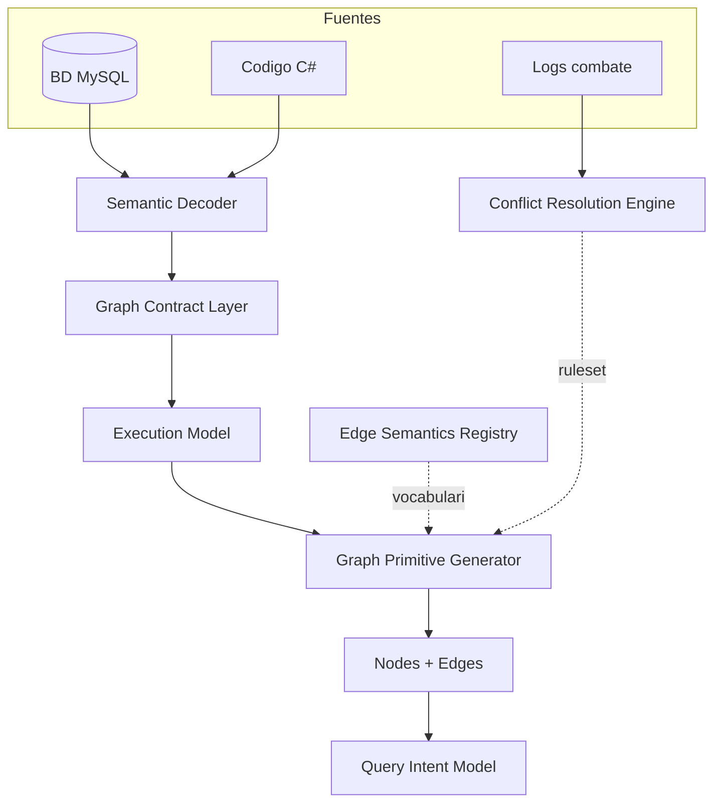
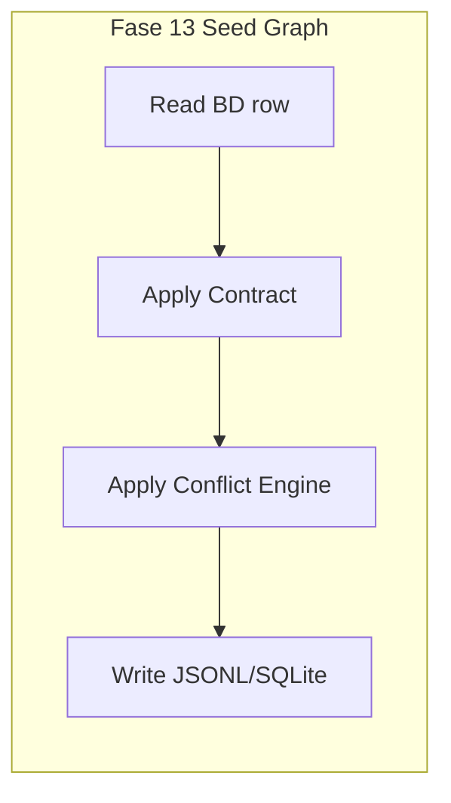

# 12 — Knowledge Extraction Model (Sunshine Grafo Emu)

> **Objetivo.** Definir el modelo formal de **cómo el emulador Sunshine transforma datos en conocimiento
> utilizable** para el grafo. Parte de los Semantic Decoders catalogados en
> [11-semantic-decoders-audit.md](11-semantic-decoders-audit.md) y los convierte en un **pre-engine de grafo**
> consistente, ejecutable en Fase 13 (Seed Graph) y consultable en Fase 14 (Query Engine).
>
> **Restricciones.** Solo diseño. No código, no MCP, no Neo4j, no ingesta masiva. Los snippets JSONL son
> ilustrativos (como en [04-modelo-grafo.md](04-modelo-grafo.md)).

---

## 0. Introduccion

### 0.1 Que es un Knowledge Extraction Model (KEM)

Un **Knowledge Extraction Model** es la capa intermedia entre las fuentes crudas (BD, código C#, logs) y el
grafo de conocimiento. Responde: *dado un valor serializado en la BD, que nodos y aristas debe producir el
grafo, con que confianza, bajo que contrato, y cuando es valido confiar en ellos?*

| Concepto | Rol |
|----------|-----|
| **Semantic Decoder** (doc 11) | Funcion C# que interpreta bytes/cadenas → objetos de juego |
| **Graph Contract** (este doc §3) | Regla declarativa reusable: slots de entrada → plantillas de nodos/aristas |
| **Graph** (doc 04) | Almacen de afirmaciones con `provenance` + `confidence` |
| **KEM** (este doc) | Sistema que conecta decoder → contract → execution → primitivas → query intent |

### 0.2 Por que el decoder solo no basta

El modelo incompleto `Decoder → Graph` rompe consistencia al escalar:

- ~30 decoders hoy, camino a 50+
- ~22k spells, miles de items/NPCs
- ~80k lineas de logs de combate

Si cada decoder "decide" su salida ad-hoc, el Seed Graph generara aristas inconsistentes (mismo `rel` con
significados distintos, confianzas arbitrarias, conflictos estatico≠runtime sin resolver).

### 0.3 Pipeline completo (5 capas + 2 transversales)

```text
BD / CODE / LOGS
      ↓
Semantic Decoder (Clase.Metodo)
      ↓
Graph Contract Layer          ← que produce, bajo que reglas
      ↓
Decoder Execution Model       ← cuando se ejecuta, que invalida
      ↓
Graph Primitive Generator     ← materializa nodos + aristas
      ↓
Nodes + Edges + provenance + edge_status + confidence
      ↓
Query Intent Model            ← puente a preguntas (Fase 14)

Transversales:
  Edge Semantics Registry     ← vocabulario global de relaciones
  Conflict Resolution Engine  ← ruleset log vs BD vs codigo
```



### 0.4 Plantilla de unidad de extraccion (9 campos)

Cada decoder **Tier S + Tier A** se documenta con:

```text
DECODER <familia.id> — <Clase.Metodo>
  contract_id: <contract:...>

1. ENTRADA      tabla(s) · columna(s) · formato · ejemplo real
2. C#           clase · metodo · archivo:lineas · flujo interno
3. SEMANTICA    significado · reglas · decisiones del codigo
4. CONTRATO     slots · edge templates · condiciones (§3)
5. EJECUCION    trigger · context · invalidation · priority (§5)
6. SALIDA GRAFO nodos + aristas (derivados del contrato)
7. TIPO REL     EXPLICITA | IMPLICITA | INTERPRETADA | OBSERVADA
8. CONFIANZA    score + confidence_rule del Edge Registry (§4)
9. CONFLICTOS   ruleset §6 → edge_status + fuente ganadora
+ JSONL ilustrativo (contract_id, edge_status)
```

### 0.5 Atributos transversales nuevos

| Atributo | Donde vive | Valores |
|----------|------------|---------|
| `contract_id` | nodo Decoder / arista DECODED_BY | `contract:effect-hex-sunshine`, ... |
| `edge_status` | arista | `VERIFIED \| OBSERVED \| SUSPECTED \| BROKEN` |
| `relation_kind` | arista | `EXPLICITA \| IMPLICITA \| INTERPRETADA \| OBSERVADA` |
| `execution_context` | nodo/arista derivado | `startup \| combat \| equip \| dialog \| passive` |

### 0.6 Conexion Fase 12 → 13 → 14

| Fase | Rol | Que usa de Fase 12 |
|------|-----|-------------------|
| **12** (este doc) | Define **como** se transforma conocimiento | Contratos, registry, execution, conflict rules |
| **13** Seed Graph | **Ejecuta** contratos masivamente | Graph Contracts como unidades de ingesta |
| **14** Query Engine | Convierte grafo en **investigacion** | Edge Registry + Query Intent Model |

---

## 1. Mapa general de decodificacion

Tabla maestra: cada fila es una unidad de extraccion. Tier segun doc 11 §8.

| ID | Decoder | Fam | Tier | contract_id | Tabla.Columna | Edge types | execution_context | estado |
|----|---------|-----|------|-------------|---------------|------------|-------------------|--------|
| A.1 | `EffectManager.GetEffects(string)` | A | S | `contract:effect-hex-sunshine` | `spells_levels.Effects`, `items.Effects`, ... | HAS_EFFECTS, DECODED_BY, TYPED_AS | startup, combat, equip | ok |
| A.2 | `EffectManager.GetEffects(hex,true)` | A | A | `contract:effect-hex-itemset` | `items_sets.Effects` | HAS_TIER_EFFECTS, DECODED_BY | startup, equip | ok |
| A.3 | `EffectManager.GetEffects(byte[])` | A | — | `contract:effect-binary-stump` | `BinaryEffects` (ausente) | HAS_EFFECTS | — | inactive |
| A.4 | `ObjectEffectSerializer.Deserialize` | A | S | `contract:object-effect-player` | `characters_items.Effects`, ... | HAS_RAW_EFFECTS, PROMOTED_TO | startup, inventory | ok |
| A.5 | `House.DeserializeEffects` | A | A | `contract:effect-colon-house` | house chest Effects | HAS_EFFECT | passive | ok |
| A.6 | `MapManager.GetElements/GetPatternCells` | A | A | `contract:map-hex-elements` | `worlds_maps.Elements`, Blue/RedCells | ELEMENT_AT, FIGHT_START | startup | ok |
| A.7 | `DlmReader/DlmMap/DlmCellData` | A | S | `contract:dlm-cell-geometry` | asset DLM + ref BD | HAS_CELL, NEIGHBOR | startup, combat, move | ok |
| B.1a | `QuestsCollection` steps/rewards | B | A | `contract:quest-structure` | `quests.StepIdsCSV`, rewards CSV | HAS_STEP, REWARDS | startup | ok |
| B.1b | `QuestsCollection/QuestManager` ParametersCSV | B | A | `contract:quest-objective-type-{n}` | `quests_objectives.ParametersCSV` | TARGETS, INVOLVES_NPC, REQUIRES_ITEM | startup | ok |
| B.2 | `Npc.ParseDialogCsv` | B | S | `contract:npc-dialog-tree` | `npcs.Dialog*IdCSV` | HAS_DIALOG, HAS_REPLY | startup, dialog | ok |
| B.3 | `EntityManager.GetActorLook` | B | B | `contract:entity-look` | `*.EntityLook` | LOOK_BONES, EQUIPPED_SKINS | startup | ok |
| B.4 | `BreedsLoader/BreedManager` | B | A | `contract:breed-stat-curve` | `breeds.StatsPointsFor*CSV` | STAT_COST_CURVE | startup | ok |
| B.5a | `JobManager.GetRecipe` | B | A | `contract:recipe-ingredients` | `recipes.*CSV` | USES_INGREDIENT | startup, craft | ok |
| B.5b | `JobManager` harvest Loot | B | A | `contract:job-harvest-loot` | `jobs_harvest.Loot` | HARVESTS | startup, harvest | ok |
| B.6 | `MonsterManager/MonstersLoader` | B | A | `contract:monster-spawn` | `worlds_monsters*.MonstersCSV` | SPAWNS, AT_CELL, KNOWS_SPELL | startup | ok |
| B.7 | `Trigger/Interactive/Dungeon` | B | A | `contract:world-interaction` | triggers, interactives, dungeons | TELEPORT_TO, HOSTS, ON_ELEMENT | startup, runtime | ok |
| B.8 | mounts/pets/guilds/zaaps | B | B | varios compactos | varios | marginal | passive | ok |
| C.1 | `ItemCriteriaEvaluator` | C | S | `contract:item-criteria-dsl` | `items.Criteria` | REQUIRES_CRITERIA, CHECKS | equip, shop | ok |
| C.2 | `QuestManager.ParseCriteria` | C | — | `contract:quest-criteria-breed` | `quests_objectives.Criteria` | BRANCH_IF | — | broken |
| C.3 | `InventoryHandler` PG= scan | C | A | `contract:scroll-breed-pg` | `items.Criteria` | REQUIRES_BREED | inventory | ok |
| C.4 | `buyCriterion` passthrough | C | B | — | protocol field | CRITERIA display | client | passthrough |
| D.1 | `npcs_actions` | D | — | — | `npcs_actions.*` | — | — | not-decoded |
| D.2 | `NpcActionTypeEnum` dispatch | D | S | `contract:npc-action-dispatch` | protocol 5898 | DISPATCHES_ON_CLICK | runtime, dialog | ok |
| D.3 | `NpcBuySellAction`/Token | D | A | `contract:npc-shop-token` | `npcs.Token`, `npcs_items` | SELLS, USES_TOKEN | runtime, shop | ok |
| D.4 | `ReplyDispatcher`+handlers | D | S | `contract:npc-reply-type-{n}` | `npcs_replies.ParametersCSV` | TELEPORTS_TO, STARTS, GRANTS, ... | dialog | ok |
| E.* | passthrough / no-decoded | E | B | — | varios | none / CLIENT_VFX | — | not-decoded |

---

## 2. Decodificadores por familia

Profundidad: **spec completa (9 campos + JSONL)** para Tier S/A; **fila compacta** para Tier B/passthrough.
Todas las aristas referencian el Edge Semantics Registry (§4); no se redefine significado inline.

### 2.1 Familia A — Hex / Binario

#### A.1 — `EffectManager.GetEffects(string)` [Tier S]

- **contract_id:** `contract:effect-hex-sunshine`
- **1. ENTRADA:** `spells_levels.Effects`, `items.Effects`, `items_weapons.Effects`, `CriticalEffects` · HEX BE · Ej: spell 189 nivel 941 `0002 00000063...` (`sunshine.sql:64366`)
- **2. C#:** `EffectManager.GetEffects(string)` — `Sunshine.WorldServer/Game/Effects/EffectManager.cs:23-51` · loop count → lee effectId, diceNum/Face, value, delay, duration, target, UTF zone, zoneMin/Size, shape, descarta 5 campos
- **3. SEMANTICA:** convierte blob en lista `Effect`; `effectId` = `EffectsEnum`; dados resueltos por `GenerateEffect()` en runtime
- **4. CONTRATO:** ver §3 `contract:effect-hex-sunshine`
- **5. EJECUCION:** trigger=startup load + spell cast + item equip · context=world load, combat, inventory · invalidation=hex layout drift, missing UTF field · priority=LOG(observed) > decoder > BD raw · freshness=static-at-load
- **6. SALIDA GRAFO:**

| Nodo | id canonico | props minimas |
|------|-------------|---------------|
| EffectBlob | `effectblob:{table}:{rowId}` | hexHead, sourceColumn |
| Effect | `effect:{EffectsEnum}` | enum, diceNum, diceFace, value |
| Decoder | `decoder:EffectManager.GetEffects` | tier=S, contract_id |

| Arista | src → dst | kind |
|--------|-----------|------|
| HAS_EFFECTS | spelllevel:{id} → effectblob:... | EXPLICITA |
| DECODED_BY | effectblob → decoder:EffectManager.GetEffects | IMPLICITA |
| TYPED_AS | effect:{id} → effect:{id} (enum node) | INTERPRETADA |

- **7. TIPO REL:** EXPLICITA (columna→blob), INTERPRETADA (id→enum)
- **8. CONFIANZA:** 1.0 si parse EffectManager confirmado; 0.4 si naive-parse (MCP-2)
- **9. CONFLICTOS:** RULE log_contradicts_bd → edge OBSERVED spell→effect(log); PARSED_EFFECT→SUSPECTED

```jsonl
{"id":"decoder:EffectManager.GetEffects","type":"Decoder","layer":"L2","props":{"class":"EffectManager","method":"GetEffects(string)","contract_id":"contract:effect-hex-sunshine","tier":"S"},"provenance":{"source":"C#","ref":"EffectManager.cs:23-51","method":"read"},"confidence":1.0}
{"id":"e:sl941:HAS_EFFECTS:eb","src":"spelllevel:941","rel":"HAS_EFFECTS","dst":"effectblob:spells_levels:64366","layer":"L1","provenance":{"source":"BD","ref":"sunshine.sql:64366","method":"hex"},"confidence":1.0,"edge_status":"SUSPECTED","relation_kind":"EXPLICITA","contract_id":"contract:effect-hex-sunshine"}
{"id":"e:eb:DECODED_BY:dec","src":"effectblob:spells_levels:64366","rel":"DECODED_BY","dst":"decoder:EffectManager.GetEffects","layer":"L2","provenance":{"source":"C#","ref":"EffectManager.cs:23-51","method":"hex"},"confidence":1.0,"contract_id":"contract:effect-hex-sunshine"}
{"id":"e:spell189:USES_EFFECT:182","src":"spell:189","rel":"USES_EFFECT","dst":"effect:182","layer":"L3","provenance":{"source":"LOG","ref":"DISPATCH spell=189 effect=Effect_Summon","method":"log-observed"},"confidence":1.0,"edge_status":"OBSERVED","relation_kind":"OBSERVADA","contract_id":"contract:effect-hex-sunshine"}
```

#### A.2 — `EffectManager.GetEffects(hex, isItemSet:true)` [Tier A]

- **contract_id:** `contract:effect-hex-itemset`
- **ENTRADA:** `items_sets.Effects` · hex anidado tiers · Ej: Panoplie Bouftou `0007...`
- **C#:** `EffectManager.cs:103-138` · sin diceNum/Face por tier
- **SALIDA:** `ItemSet -HAS_TIER_EFFECTS-> EffectBlob -DECODED_BY-> decoder` · kind=EXPLICITA · conf=1.0

#### A.3 — `EffectManager.GetEffects(byte[])` [inactive]

- **contract_id:** `contract:effect-binary-stump` · **estado:** inactive · **SALIDA:** ninguna (columnas Binary* ausentes) · marcar decoder `status:inactive`

#### A.4 — `ObjectEffectSerializer.Deserialize` [Tier S]

- **contract_id:** `contract:object-effect-player`
- **ENTRADA:** `characters_items.Effects`, bank/trash/merchant/mounts · HEX polimorfico · count + typeId + subtype
- **C#:** `ObjectEffectSerializer.cs:37-64` · ProtocolTypeManager selecciona subtipo
- **EJECUCION:** trigger=character load · context=inventory · invalidation=unknown typeId · priority=decoder > BD
- **SALIDA:** `PlayerItem -HAS_RAW_EFFECTS-> ObjectEffectBlob`; solo `ObjectEffectInteger -PROMOTED_TO-> Effect` · conf=1.0 parse, 0.7 promocion parcial

```jsonl
{"id":"e:ci:HAS_RAW_EFFECTS:oeb","src":"characteritem:{charId}:{itemId}","rel":"HAS_RAW_EFFECTS","dst":"objecteffectblob:characters_items:{rowId}","layer":"L1","provenance":{"source":"BD","ref":"characters_items.Effects","method":"hex"},"confidence":1.0,"edge_status":"VERIFIED","relation_kind":"EXPLICITA","contract_id":"contract:object-effect-player"}
```

#### A.5 — `House.DeserializeEffects` [Tier A]

- **contract_id:** `contract:effect-colon-house` · formato colon `id:diceNum:...` · `House.cs:564-610` · `HouseItem -HAS_EFFECT-> Effect` · conf=1.0

#### A.6 — `MapManager.GetElements/GetPatternCells` [Tier A]

- **contract_id:** `contract:map-hex-elements`
- **ENTRADA:** `worlds_maps.Elements`, `BlueCells`, `RedCells` · pares cellId+elementId / count+cells
- **C#:** `MapManager.cs:117-162`
- **SALIDA:** `Map -ELEMENT_AT-> Cell`, `Map -FIGHT_START{team}-> Cell` · kind=EXPLICITA · conf=1.0 Elements, 0.7 Blue/Red (datos escasos)

#### A.7 — `DlmReader/DlmMap/DlmCellData` [Tier S]

- **contract_id:** `contract:dlm-cell-geometry`
- **ENTRADA:** asset `.dlm` (zlib) · 560 celdas · bitfield LosMov
- **C#:** `DlmReader.cs:71-104`, `DlmMap.cs:194-306`, `DlmCellData.cs:117-145`
- **EJECUCION:** trigger=map load · context=movement, combat placement · invalidation=DLM version drift
- **SALIDA:** `Map -HAS_CELL-> Cell{walkable,los,red,blue,farm,...}` · Los parseado pero no aplicado en combate → edge `HAS_CELL.los` status=SUSPECTED para LoS queries

### 2.2 Familia B — CSV / Delimitados

#### B.1 — `QuestsCollection` / `QuestManager` [Tier A]

**B.1a — Estructura de quest** · **contract_id:** `contract:quest-structure`

- **ENTRADA:** `quests.StepIdsCSV`, `quests_steps.ObjectiveIdsCSV`, `ItemsRewardCSV`, `JobsRewardCSV`, `SpellsRewardCSV`
- **C#:** `QuestsCollection.cs:117-401`
- **SALIDA:** `Quest -HAS_STEP-> QuestStep`; `QuestStep -HAS_OBJECTIVE-> QuestObjective`; `QuestStep -REWARDS-> Item|Spell|Job` · kind=EXPLICITA (CSV directo) · conf=1.0 steps, 0.6 rewards (posible bug `items[i+i]`)

**B.1b — Objetivos type-dependent** · **contract_id:** `contract:quest-objective-type-{n}`

- **ENTRADA:** `quests_objectives.ParametersCSV` + `Type` · Ej Type=3: `449,306,1` (npc,item,qty)
- **C#:** `QuestsCollection.UpdateObjective :304-312`; `QuestManager.VerifyQuest :255-262`
- **SEMANTICA:** slot[0] cambia de entidad segun Type (Map/Npc/Item/Monster) — ver doc 08 §4.6
- **SALIDA por Type:**

| Type | Significado | Slots | Edges |
|------|-------------|-------|-------|
| 0 | GO_TO map | [0]=mapId | TARGETS → map |
| 1 | Aller voir NPC | [0]=npcId | INVOLVES_NPC |
| 3 | Ramener a NPC | [0]=npc, [1]=item, [2]=qty | INVOLVES_NPC, REQUIRES_ITEM |
| 6/7 | Matar monstruo | pares monster,count | TARGETS → monster |
| 9 | Retourner voir | [0]=npcId | INVOLVES_NPC |

- **CONFIANZA:** 0.7 (INTERPRETADA, type-resolve) · **CONFLICTO:** sin FK; identidad implicita

```jsonl
{"id":"e:qs3:INVOLVES_NPC:449","src":"queststep:3","rel":"INVOLVES_NPC","dst":"npc:449","layer":"L1","provenance":{"source":"BD","ref":"objectives Id=3 Type=3 params=449,306,1","method":"csv+type-resolve"},"confidence":0.7,"edge_status":"VERIFIED","relation_kind":"INTERPRETADA","contract_id":"contract:quest-objective-type-3"}
```

#### B.2 — `Npc.ParseDialogCsv` [Tier S]

- **contract_id:** `contract:npc-dialog-tree`
- **ENTRADA:** `npcs.DialogMessagesIdCSV`, `DialogRepliesIdCSV` · `;` grupos, `,` pares · Ej NPC 462
- **C#:** `Npc.cs:224-344` · tokens N=nombre, L=nivel
- **SALIDA:** `Npc -HAS_DIALOG-> DialogMessage -HAS_REPLY-> DialogReply` · kind=EXPLICITA · conf=1.0 · context=dialog

#### B.3 — `EntityManager.GetActorLook` [Tier B — compacto]

- **contract_id:** `contract:entity-look` · `{bones|skins|colors|scales|sublooks}` · salida cosmetica · `Actor -LOOK_BONES-> Gfx` · conf=1.0 · prioridad modelado baja

#### B.4 — `BreedsLoader/BreedManager` [Tier A]

- **contract_id:** `contract:breed-stat-curve` · `StatsPointsFor*CSV` · `|`-segmentos `min,coste` · `Breed -STAT_COST_CURVE-> StatCurve` · conf=1.0

#### B.5 — Recipes / harvest [Tier A]

| Decoder | contract_id | Edges | conf |
|---------|-------------|-------|------|
| `JobManager.GetRecipe` | `contract:recipe-ingredients` | Recipe -USES_INGREDIENT{qty}-> Item | 1.0 |
| `JobManager` harvest | `contract:job-harvest-loot` | Job -HARVESTS{min,max}-> Resource | 1.0 |
| PetFood/LivingObject | compacto B | Pet -EATS-> Food | 1.0 |

#### B.6 — Monstruos y spawns [Tier A]

- **contract_id:** `contract:monster-spawn`
- **ENTRADA:** `monsters_spells.SpellsCSV`, `worlds_monsters.MonstersCSV`, `_fix.MonstersCSV+CellsCSV`, `monsters.AI`
- **SALIDA:** `Monster -KNOWS_SPELL-> Spell`; `SubArea -SPAWNS-> Monster`; `FixedSpawn -AT_CELL-> Cell` · kind=EXPLICITA/IMPLICITA · conf=1.0

#### B.7 — Mundo: triggers, interactives, dungeons [Tier A]

- **contract_id:** `contract:world-interaction`
- **SALIDA:** `Cell -TRIGGER-> Trigger -TELEPORT_TO-> (Map,Cell)`; `Interactive -ON_ELEMENT-> Element -AT_CELL-> Cell`; `Dungeon -SPAWNS-> Monster` · conf=1.0

#### B.8 — Guilds, mounts, zaaps [Tier B — compacto]

| Decoder | Edges | conf |
|---------|-------|------|
| `Guild.SpellsCSV` | Guild -GRANT_SPELL-> Spell | 1.0 |
| `Mount.BehaviorsCSV` | Mount -HAS_BEHAVIOR-> BehaviorFlag | 1.0 |
| `Character.Zaaps` | Character -UNLOCKED_ZAAP-> Map | 1.0 |

### 2.3 Familia C — DSL de Criterios

#### C.1 — `ItemCriteriaEvaluator.IsRespected` [Tier S]

- **contract_id:** `contract:item-criteria-dsl`
- **ENTRADA:** `items.Criteria`, `items_weapons.Criteria` · DSL `clave+op+int`, `&` AND, `|` OR · Ej: `PG=10`, `(Ps=1|Ps=0)&Pc=11`
- **C#:** `ItemCriteriaEvaluator.cs:14-162` · claves PL, PG, Cs/Cs, Ca, Cc, Ci, Cv, Cw, CM, CP, Ct, CL, CH, CD
- **SEMANTICA:** gate equipar/comprar; atomo no parseable → `true` (permisivo); clave no soportada → `0`
- **EJECUCION:** trigger=item equip attempt, shop buy · context=inventory, npc shop · invalidation=OR dentro de parentesis roto
- **SALIDA:** `ItemTemplate -REQUIRES_CRITERIA-> CriteriaString`; `CriteriaString -CHECKS-> CharacterStat|Breed|Alignment` (solo claves con `case` explicito)
- **CONFIANZA:** 1.0 para claves implementadas; 0.3 para Pc/Ps/Qf/Qa/PB (stored-not-decoded, pasan silenciosamente)

```jsonl
{"id":"criteria:12116","type":"CriteriaString","layer":"L1","props":{"raw":"(ejemplo)","implementedKeys":["PL","PG","Cs", "..."]},"provenance":{"source":"BD","ref":"items.Criteria","method":"dsl"},"confidence":1.0}
{"id":"e:item12116:REQUIRES_CRITERIA","src":"item:12116","rel":"REQUIRES_CRITERIA","dst":"criteria:12116","layer":"L1","provenance":{"source":"BD","ref":"items.Criteria","method":"column"},"confidence":1.0,"edge_status":"VERIFIED","relation_kind":"EXPLICITA","contract_id":"contract:item-criteria-dsl"}
{"id":"e:criteria:CHECKS:PL","src":"criteria:12116","rel":"CHECKS","dst":"stat:PL","layer":"L2","provenance":{"source":"C#","ref":"ItemCriteriaEvaluator.cs:85-134","method":"dsl-eval"},"confidence":1.0,"edge_status":"VERIFIED","relation_kind":"INTERPRETADA","contract_id":"contract:item-criteria-dsl"}
```

#### C.2 — `QuestManager.ParseCriteria` [broken]

- **contract_id:** `contract:quest-criteria-breed` · **estado:** broken · **SALIDA:** ninguna edge valida · marcar `edge_status:BROKEN` · tier objetivo A al arreglar

#### C.3 — `InventoryHandler` PG= scan [Tier A — compacto]

- **contract_id:** `contract:scroll-breed-pg` · substring `PG=` · `ItemTemplate(pergamino) -REQUIRES_BREED-> Breed` · conf=1.0

#### C.4 — `buyCriterion` passthrough [Tier B]

- Sin contrato de extraccion server · solo display cliente · no generar edges de evaluacion

#### C.5 — Claves no implementadas

- Pc, Ps, Qf, Qa, PB, PO → **no** crear edge CHECKS; marcar nodo CriteriaString con `unimplementedKeys[]`

### 2.4 Familia D — NPC Actions / Replies

#### D.1 — `npcs_actions` [not-decoded]

- Tabla existe, cero SELECT en C# · **SALIDA:** nodo `DatabaseColumn` con `status:stored-not-decoded` · **no** edges DECODED_BY

#### D.2 — `NpcActionTypeEnum` dispatch [Tier S]

- **contract_id:** `contract:npc-action-dispatch`
- **ENTRADA:** paquete 5898 `npcActionId` (enum numerico, no BD)
- **C#:** `ContextRoleplayHandler.cs:170-210` → `Npc.InteractWith` · handlers 1,2,3,5,6; sin handler 4,7-10
- **SALIDA:** `Npc -DISPATCHES_ON_CLICK-> NpcActionType` · kind=EXPLICITA (protocolo) · conf=1.0
- **CONFLICTO:** `npcs_actions.Type='Shop'` no abre tienda → RULE code_contradicts_bd_unused

```jsonl
{"id":"nactiontype:1","type":"NpcActionType","layer":"L2","props":{"enum":"ACTION_BUY_SELL","handler":"NpcBuySellAction"},"provenance":{"source":"C#","ref":"Npc.cs:99-123","method":"switch"},"confidence":1.0}
{"id":"e:npc788:DISPATCHES:1","src":"npc:788","rel":"DISPATCHES_ON_CLICK","dst":"nactiontype:1","layer":"L2","provenance":{"source":"C#","ref":"ContextRoleplayHandler.cs:170-210","method":"runtime"},"confidence":1.0,"edge_status":"VERIFIED","relation_kind":"EXPLICITA","contract_id":"contract:npc-action-dispatch"}
```

#### D.3 — Shop token [Tier A]

- **contract_id:** `contract:npc-shop-token`
- **SALIDA:** `Npc -SELLS-> Item` (npcs_items); `Npc -USES_TOKEN-> Item` · conf=1.0

#### D.4 — `ReplyDispatcher` + `[ReplyHandler]` [Tier S]

- **contract_id:** `contract:npc-reply-type-{n}`
- **ENTRADA:** `npcs_replies.Type` + `ParametersCSV`
- **C#:** `ReplyDispatcher.cs` + handlers Type 2-9
- **SALIDA por Type:**

| Type | Handler | Parameters | Edges |
|------|---------|------------|-------|
| 2 | TeleportReply | map,cell,dir | TELEPORTS_TO |
| 5 | QuestReply | questId | STARTS → Quest |
| 6 | UpdateObjectiveReply | quest,step,obj | UPDATES → QuestObjective |
| 7 | AddItemReply | item:qty | GRANTS → Item |
| 8 | LearnJobReply | jobId | TEACHES → Job |

- **EJECUCION:** trigger=dialog reply click · context=dialog · conf=1.0

### 2.5 Familia E — Passthrough / No decodificados [Tier B]

Salida nula o cliente-only. Generar nodos `DatabaseColumn` + `status:stored-not-decoded`; **no** aristas de gameplay.

| Columna | contract_id | Accion grafo |
|---------|-------------|--------------|
| `spells.ScriptParams` | — | `Spell -CLIENT_VFX-> ScriptParams` (L0, conf 0.2) |
| `npcs.ActionsIdCSV` | — | column node only |
| `CastTestLos` + `DlmCellData.Los` | — | parseado, no aplicado → SUSPECTED |
| metadata `worlds_maps` | — | column node only |

---

## 3. Graph Contract Layer

Capa intermedia que **desacopla** "que significa el dato" de "como se materializa en el grafo". Sin contratos,
200 decoders produciran aristas inconsistentes en Fase 13.

### 3.1 Definicion

Un **Graph Contract** es una regla declarativa reusable que:

1. Declara **condiciones de activacion** (`when`, tabla, columnas)
2. Define **parameter slots** con semantica tipada
3. Especifica **edge templates** (rel, src pattern, dst pattern, relation_kind)
4. Fija **confidence_default** y **conflict_policy** (remite a §6)

El decoder **no decide** la salida: **ejecuta** el contrato.

### 3.2 Plantilla de contrato

```yaml
contract_id: contract:quest-objective-type-3
decoder: QuestsCollection.UpdateObjective
tier: A
trigger_type: INTERPRETADA
input:
  table: quests_objectives
  columns: [Type, ParametersCSV]
  when: Type == 3
parameter_slots:
  - index: 0  semantic: NPC_ID   target_node: "npc:{value}"
  - index: 1  semantic: ITEM_ID  target_node: "item:{value}"
  - index: 2  semantic: QTY       target_prop: quantity
produces_edges:
  - rel: INVOLVES_NPC    src: "queststep:{parentStepId}"  dst: "npc:{slot0}"  kind: INTERPRETADA
  - rel: REQUIRES_ITEM   src: "questobjective:{id}"       dst: "item:{slot1}" kind: INTERPRETADA
confidence_default: 0.7
conflict_policy: apply_ruleset_6
execution_context: startup
```

### 3.3 Catalogo de contratos (Tier S + A)

| contract_id | Decoder | Condicion | Edges producidos |
|-------------|---------|-----------|------------------|
| `contract:effect-hex-sunshine` | EffectManager.GetEffects(string) | hex no vacio | HAS_EFFECTS, DECODED_BY, TYPED_AS, USES_EFFECT |
| `contract:effect-hex-itemset` | EffectManager.GetEffects(hex,true) | items_sets | HAS_TIER_EFFECTS, DECODED_BY |
| `contract:object-effect-player` | ObjectEffectSerializer | player items | HAS_RAW_EFFECTS, PROMOTED_TO |
| `contract:effect-colon-house` | House.DeserializeEffects | house chest | HAS_EFFECT |
| `contract:map-hex-elements` | MapManager | Elements/Blue/Red | ELEMENT_AT, FIGHT_START |
| `contract:dlm-cell-geometry` | DlmReader/DlmMap | map load | HAS_CELL, NEIGHBOR |
| `contract:quest-structure` | QuestsCollection | quest CSVs | HAS_STEP, HAS_OBJECTIVE, REWARDS |
| `contract:quest-objective-type-{n}` | QuestsCollection | Type=n | TARGETS, INVOLVES_NPC, REQUIRES_ITEM |
| `contract:npc-dialog-tree` | Npc.ParseDialogCsv | dialog CSV | HAS_DIALOG, HAS_REPLY |
| `contract:breed-stat-curve` | BreedsLoader | stat CSV | STAT_COST_CURVE |
| `contract:recipe-ingredients` | JobManager.GetRecipe | recipes | USES_INGREDIENT |
| `contract:job-harvest-loot` | JobManager harvest | Loot | HARVESTS |
| `contract:monster-spawn` | MonstersLoader | spawn CSV | SPAWNS, AT_CELL, KNOWS_SPELL |
| `contract:world-interaction` | Trigger/Interactive/Dungeon | world CSV | TELEPORT_TO, HOSTS, ON_ELEMENT |
| `contract:item-criteria-dsl` | ItemCriteriaEvaluator | Criteria no vacio | REQUIRES_CRITERIA, CHECKS |
| `contract:scroll-breed-pg` | InventoryHandler | PG= substring | REQUIRES_BREED |
| `contract:npc-action-dispatch` | Npc.InteractWith | enum 5898 | DISPATCHES_ON_CLICK |
| `contract:npc-shop-token` | NpcBuySellAction | Token>0 | SELLS, USES_TOKEN |
| `contract:npc-reply-type-{n}` | ReplyDispatcher | reply Type=n | TELEPORTS_TO, STARTS, GRANTS, TEACHES, UPDATES |
| `contract:entity-look` | EntityManager.GetActorLook | EntityLook | LOOK_BONES (B) |

Contratos **parametrizados por Type** (`quest-objective-type-{n}`, `npc-reply-type-{n}`) evitan duplicar
200 reglas; Fase 13 itera `n` sobre valores observados en BD.

### 3.4 Contratos especiales (broken / inactive)

| contract_id | estado | Accion Fase 13 |
|-------------|--------|----------------|
| `contract:quest-criteria-breed` | broken | no emitir edges; nodo Decoder status=BROKEN |
| `contract:effect-binary-stump` | inactive | skip |
| (sin contrato) | not-decoded | solo DatabaseColumn node |

---

## 4. Edge Semantics Registry

Registro global: **una fila por `rel`**. Fuente unica de significado. Habilita Fase 14:
*"que edges son observados vs inferidos?"*

### 4.1 Plantilla de entrada

```yaml
rel: HAS_EFFECTS
meaning: "SpellLevel/ItemTemplate almacena blob hex decodificado a Effect"
origin_decoder: EffectManager.GetEffects(string)
origin_contract: contract:effect-hex-sunshine
relation_kind: EXPLICITA
confidence_rule: "1.0 if EffectManager layout; 0.4 if naive-parse; 0.3 on log conflict"
layer_default: L1
edge_status_on_conflict: SUSPECTED
query_tags: [combat, items, static-definition]
```

### 4.2 Registry completo (~27 rels)

| rel | meaning (resumen) | origin | kind | conf rule | on conflict |
|-----|-------------------|--------|------|-----------|-------------|
| HAS_EFFECTS | columna hex → blob efectos | A.1 | EXPLICITA | 1.0 layout / 0.4 naive | SUSPECTED |
| DECODED_BY | blob interpretado por decoder | * | IMPLICITA | 1.0 | VERIFIED |
| TYPED_AS | effect id → EffectsEnum | A.1 | INTERPRETADA | 1.0 enum match | SUSPECTED |
| USES_EFFECT | spell/item usa effect (runtime o estatico) | A.1+logs | OBSERVADA/EXPLICITA | 1.0 LOG; 0.4 BD | OBSERVED if log |
| HAS_RAW_EFFECTS | item jugador → ObjectEffect blob | A.4 | EXPLICITA | 1.0 | VERIFIED |
| PROMOTED_TO | ObjectEffectInteger → Effect | A.4 | INTERPRETADA | 0.7 | — |
| HANDLED_BY | Effect → SpellEffectHandler | C# attr | IMPLICITA | 1.0 | VERIFIED |
| COMBAT_HANDLED_BY | alias runtime HANDLED_BY | logs+C# | OBSERVADA | 0.85 | — |
| REQUIRES_CRITERIA | item → CriteriaString | C.1 | EXPLICITA | 1.0 | VERIFIED |
| CHECKS | criteria → stat/breed/alignment | C.1 | INTERPRETADA | 1.0 impl; 0.3 unimpl | SUSPECTED |
| HAS_STEP | quest → step | B.1 | EXPLICITA | 1.0 | VERIFIED |
| HAS_OBJECTIVE | step → objective | B.1 | EXPLICITA | 1.0 | VERIFIED |
| TARGETS | objective → map/monster | B.1b | INTERPRETADA | 0.7 | — |
| INVOLVES_NPC | step/obj → npc | B.1b | INTERPRETADA | 0.7 | VERIFIED |
| REQUIRES_ITEM | objective → item | B.1b | INTERPRETADA | 0.7 | — |
| REWARDS | step → item/spell/job | B.1 | EXPLICITA | 0.6 | — |
| HAS_DIALOG | npc → dialog message | B.2 | EXPLICITA | 1.0 | VERIFIED |
| HAS_REPLY | message → reply | B.2 | EXPLICITA | 1.0 | VERIFIED |
| DISPATCHES_ON_CLICK | npc → action type | D.2 | EXPLICITA | 1.0 | VERIFIED |
| SELLS | npc → item (catalog) | D.3 | EXPLICITA | 1.0 | VERIFIED |
| USES_TOKEN | npc → token item | D.3 | EXPLICITA | 1.0 | VERIFIED |
| TELEPORTS_TO | reply → map+cell | D.4 | INTERPRETADA | 1.0 | VERIFIED |
| STARTS | reply → quest | D.4 | INTERPRETADA | 1.0 | VERIFIED |
| GRANTS | reply → item | D.4 | INTERPRETADA | 1.0 | VERIFIED |
| TEACHES | reply → job | D.4 | INTERPRETADA | 1.0 | VERIFIED |
| HAS_CELL | map → cell geometry | A.7 | EXPLICITA | 1.0 walk; 0.5 los | SUSPECTED los |
| ELEMENT_AT | map → cell element | A.6 | EXPLICITA | 1.0 | VERIFIED |
| HOSTS | cell → interactive | B.7 | IMPLICITA | 0.8 | — |
| SPAWNS | area → monster | B.6 | IMPLICITA | 0.8 | VERIFIED |
| OBSERVED_IN | spell → fight/log | logs | OBSERVADA | 1.0 | OBSERVED |
| CONTRADICTS | finding/static vs observed | L5 | DERIVADO | 0.9 | — |
| VERIFIED_BY | edge → log+code+BD match | L5 | DERIVADO | 1.0 | VERIFIED |

**Regla:** decoders Tier S/A **referencian** entradas del registry; no redefinen `meaning` inline.

---

## 5. Decoder Execution Model

Define **cuando confiar** en un nodo/arista. Respuesta Fase 14: *"¿cuando confio en este nodo?"*

### 5.1 Dimensiones

| Campo | Significado |
|-------|-------------|
| `trigger` | evento que activa el decoder (startup load, spell cast, equip, dialog click) |
| `context` | subsistema (world load, combat, inventory, dialog, shop) |
| `invalidation` | que invalida la salida (schema change, layout drift, missing handler) |
| `priority` | fuente ganadora: LOG > decoder output > BD raw |
| `freshness` | static-at-load vs dynamic (player items) |

### 5.2 Tabla resumen Tier S + A

| Decoder | trigger | context | invalidation | freshness |
|---------|---------|---------|--------------|-----------|
| EffectManager.GetEffects(string) | startup; spell cast; equip | combat, inventory | hex layout drift | static |
| ObjectEffectSerializer | character load | inventory | unknown typeId | dynamic |
| ItemCriteriaEvaluator | equip; shop buy | inventory, shop | OR-in-parens bug | static |
| ReplyDispatcher | dialog reply | dialog | missing handler Type | static |
| NpcActionTypeEnum dispatch | npc click (5898) | runtime | unimplemented enum | runtime |
| DlmReader/DlmMap | map load | move, combat | DLM version | static |
| Npc.ParseDialogCsv | startup | dialog | CSV parse error | static |
| QuestsCollection objectives | startup | quest | Type unknown | static |
| MonstersLoader | startup | world PvE | CSV empty | static |

### 5.3 Ejemplos trabajados

**EffectManager:** priority=LOG(observed effect) > EffectManager parse > BD hex raw. En combate,
`USES_EFFECT` desde log (OBSERVED, conf=1.0) gana sobre `PARSED_EFFECT` desde hex (SUSPECTED, conf=0.3).

**ItemCriteriaEvaluator:** se ejecuta en equip/buy, no en startup. Criterios con claves no implementadas
producen CHECKS con conf=0.3 o ninguna edge — nunca afirmar restriccion verificada.

**ReplyDispatcher:** trigger=dialog only. Si `npcs_replies.Type=10` sin handler → edge status=BROKEN;
no inferir efecto desde ParametersCSV solo.

---

## 6. Conflict Resolution Engine

Ruleset conceptual (no codigo). Prioridad: **LOG > CODE(semantica) > BD(estructura)**.

### 6.1 Estados de arista

| edge_status | Significado |
|-------------|-------------|
| VERIFIED | BD + codigo + log coinciden (o no hay log disponible y codigo confirma) |
| OBSERVED | log runtime confirma; puede contradecir BD estatica |
| SUSPECTED | BD/codigo parseado pero log contradice o parser permisivo |
| BROKEN | decoder roto o handler ausente |

### 6.2 Ruleset

```text
RULE log_contradicts_bd:
  IF log.observed(effect_id) != bd.parsed(effect_id):
    CREATE edge USES_EFFECT spell→effect (source=LOG, status=OBSERVED, conf=1.0)
    MARK edge PARSED_EFFECT / HAS_EFFECTS→effect(static) AS SUSPECTED (conf *= 0.3)
    IF delta material: CREATE Finding CONTRADICTS (L5)

RULE code_contradicts_log:
  IF handler registered AND log shows no dispatch for effect:
    MARK decoder OUTDATED or handler BROKEN
    CREATE Hypothesis → Method

RULE code_contradicts_bd_unused:
  IF column populated AND grep(code, column)==0:
    MARK DatabaseColumn status=stored-not-decoded
    EMIT zero gameplay edges from that column

RULE decoder_broken:
  IF decoder throws on real data format (ParseCriteria B=n):
    MARK decoder status=BROKEN
    EMIT zero edges from contract

RULE all_match:
  IF bd.parsed == log.observed == code.enum:
    MARK edge_status=VERIFIED, confidence=1.0

RULE parsed_not_applied:
  IF field parsed (Los, CastTestLos) AND no runtime check in code:
    MARK edge/prop status=SUSPECTED
    TAG query_tags: [dead-semantics]
```

### 6.3 Integracion L5

Conflictos materiales generan cadena epistemica (doc 04 §6):

```text
Contract (esperado desde decoder/BD) ──CONTRADICTS── Finding ──SUPPORTED_BY── Evidence (log)
Finding ──INSTANCE_OF── BugSignature (opcional)
```

---

## 7. Catalogo formal de outputs del grafo

EdgeTypes se definen en §4 Registry. Aqui: **NodeTypes** + reglas de creacion.

### 7.1 NodeTypes estandar

| type | layer | id_pattern | key_source | props minimas |
|------|-------|------------|------------|---------------|
| Spell | L1 | `spell:<Spell>` | spells.Spell | name, typeId |
| SpellLevel | L1 | `spelllevel:<rowId>` | spells_levels row | spell, level, apCost |
| Effect | L1 | `effect:<EffectsEnum>` | EffectsEnum | enum name |
| EffectBlob | L1 | `effectblob:{table}:{rowId}` | BD row | hexHead, column |
| Item | L1 | `item:<Id>` | items.Id | name, typeId, level |
| Npc | L1 | `npc:<Id>` | npcs.Id | name |
| Quest | L1 | `quest:<Id>` | quests.Id | name |
| QuestStep | L1 | `queststep:<Id>` | quests_steps.Id | quest, name |
| QuestObjective | L1 | `questobjective:<Id>` | quests_objectives.Id | type, paramsCSV |
| Map | L1 | `map:<Id>` | worlds_maps.Id | — |
| Cell | L1 | `cell:{mapId}:{cellId}` | DLM/Elements | walkable, los, red, blue |
| Monster | L1 | `monster:<Id>` | monsters.Id | name |
| CriteriaString | L1 | `criteria:{itemId}` | items.Criteria | raw, implementedKeys |
| Decoder | L2 | `decoder:<Class>.<Method>` | C# | contract_id, tier, status |
| GraphContract | L2 | `contract:<name>` | este doc §3 | parameter_slots, edges |
| DatabaseColumn | L2 | `dbcolumn:{table}.{column}` | schema | format, status |
| CSharpType | L2 | `cstype:<FQN>` | C# | file, role |
| Fight | L3 | `fight:<fightId>` | logs | file, casts |
| LogSequence | L3 | `logseq:<spell>@fight<N>` | logs | sequence[] |
| Contract | L5 | `contract:<spellId>:<level>` | derivado | expected[] |
| Finding | L5 | `finding:<detector>@<id>` | derivado | detector, evidencia |
| Evidence | L5 | `evidence:<session>:<seq>` | logs | observed |

### 7.2 Reglas de creacion

1. **Identidad primero** (doc 08): sin id canonico resuelto → cuarentena, no grafo principal.
2. **Provenance obligatoria**: ningun nodo/arista sin `provenance` + `confidence`.
3. **Contrato obligatorio**: toda arista de extraccion lleva `contract_id` (excepto L5 derivados).
4. **Edge status obligatorio**: toda arista de extraccion lleva `edge_status` inicial (VERIFIED o SUSPECTED).
5. **Capas explicitas**: L1 mundo, L2 codigo/contratos, L3 observado, L5 conocimiento.
6. **Derivados versionados**: Contract/Finding llevan `deriver` + `inputs[]` (doc 04).

---

## 8. Pipeline conceptual

### 8.1 Graph Primitive Generator (conceptual)

Funcion **no implementada** que Fase 13 ejecutara:

```text
FOR each row in source_table:
  decoder = lookup_decoder(column)
  contract = load_contract(decoder.contract_id)
  IF contract.when NOT satisfied: SKIP
  slots = parse_input(row, contract.parameter_slots)
  edges = instantiate_templates(contract.produces_edges, slots)
  FOR each edge:
    edge.confidence = apply(confidence_rule from Registry)
    edge.edge_status = initial_status(from Execution Model)
    IF logs available: apply Conflict Ruleset §6
  EMIT nodes + edges with provenance
```

### 8.2 Flujo de datos



Inputs: BD (estructura), C# (semantica de decoders), LOGS (evidencia primaria para OBSERVED/VERIFIED).

---

## 9. Casos criticos (deep-dives)

Cada caso aplica **contrato + ruleset + edge_status**. Referencia al prototype existente
([prototype/nodes.jsonl](prototype/nodes.jsonl), [prototype/edges.jsonl](prototype/edges.jsonl)).

### 9.1 QuestObjective type-dependent decoding

**Contrato:** `contract:quest-objective-type-{n}`

**Problema:** `ParametersCSV[0]` es Map, Npc, Item o Monster segun `Type` — mismo slot, distinta entidad (doc 08).

**Aplicacion (quest 3, step 3, objective Type=3):**

```text
INPUT: Type=3, ParametersCSV="449,306,1"
CONTRACT slots: [0]=NPC_ID→449, [1]=ITEM_ID→306, [2]=QTY→1
OUTPUT:
  queststep:3 -INVOLVES_NPC-> npc:449  (INTERPRETADA, conf=0.7, VERIFIED)
  questobjective:3 -REQUIRES_ITEM-> item:306 (INTERPRETADA, conf=0.7)
```

**CONFLICTO SEMANTICO:** ninguno entre fuentes; la incertidumbre es **estructural** (sin FK). Prioridad: CODE
(type table) > BD (CSV alone). No marcar SUSPECTED salvo Type desconocido.

```jsonl
{"id":"e:qs3:INVOLVES_NPC:449","src":"queststep:3","rel":"INVOLVES_NPC","dst":"npc:449","layer":"L1","provenance":{"source":"BD","ref":"objectives Type=3 params=449,306,1","method":"csv+type-resolve"},"confidence":0.7,"edge_status":"VERIFIED","relation_kind":"INTERPRETADA","contract_id":"contract:quest-objective-type-3"}
```

### 9.2 EffectManager hex — spell 189

**Contrato:** `contract:effect-hex-sunshine`

**Problema:** hex estatico parsea effect 99 (`Effect_DamageFire`); log observa `Effect_Summon` (182).

**Ruleset aplicado:**

```text
RULE log_contradicts_bd:
  PARSED effect:99 → edge_status=SUSPECTED, conf=0.3
  LOG spell:189 → effect:182 USES_EFFECT → OBSERVED, conf=1.0
  CREATE Finding CONTRADICTS effect:99 ↔ effect:182 (conf=0.9)
PRIORITY: LOG > EffectManager layout > naive-parse MCP-2
```

**Nota:** el hex puede ser nivel incorrecto o el runtime aplica logica adicional (SacrificeHandler). El grafo
**no afirma** que el spell "deberia" hacer fuego; afirma que el log observo Summon.

```jsonl
{"id":"e:sl941:PARSED_EFFECT:99","src":"spelllevel:941","rel":"PARSED_EFFECT","dst":"effect:99","layer":"L1","provenance":{"source":"BD","ref":"hex id=0x63","method":"EffectManager"},"confidence":0.3,"edge_status":"SUSPECTED","contract_id":"contract:effect-hex-sunshine"}
{"id":"e:spell189:USES_EFFECT:182","src":"spell:189","rel":"USES_EFFECT","dst":"effect:182","layer":"L3","provenance":{"source":"LOG","ref":"DISPATCH spell=189 effect=Effect_Summon","method":"log-observed"},"confidence":1.0,"edge_status":"OBSERVED","relation_kind":"OBSERVADA","contract_id":"contract:effect-hex-sunshine"}
{"id":"e:99:CONTRADICTS:182","src":"effect:99","rel":"CONTRADICTS","dst":"effect:182","layer":"L5","provenance":{"source":"DERIVADO","ref":"RULE log_contradicts_bd","method":"reconcile"},"confidence":0.9}
```

### 9.3 Criteria DSL — permisividad silenciosa

**Contrato:** `contract:item-criteria-dsl`

**Problema:** criterio `(Ps=1|Ps=0|Ps=3)&Pc=11` — OR dentro de parentesis se rompe; Pc no implementado → devuelve 0 pero atomo fallido → `true`.

**Ruleset:**

```text
RULE decoder_broken (partial):
  OR-in-parens: mark CriteriaString status=parse-fragile
  unimplemented key (Pc, Ps): NO edge CHECKS; mark unimplementedKeys
  confidence CHECKS for implemented keys only: 1.0
PRIORITY: CODE semantics (explicit case) > BD string appearance
```

**CONFLICTO SEMANTICO:** BD **parece** restringir por sexo/alineacion; servidor **no** lo hace. Grafo debe
documentar gap, no simular CHECKS falsos.

### 9.4 NPC Action dispatch vs npcs_actions fantasma

**Contratos:** `contract:npc-action-dispatch` (real) vs ausencia para `npcs_actions` (fantasma)

**Problema:** fila `npcs_actions ('Shop','12124')` sugiere tienda; servidor ignora tabla; clic usa enum del cliente.

**Ruleset:**

```text
RULE code_contradicts_bd_unused:
  npcs_actions.* → DatabaseColumn status=stored-not-decoded
  ZERO edges from npcs_actions to NpcAction behavior

contract:npc-action-dispatch:
  Npc -DISPATCHES_ON_CLICK-> NpcActionType:1 (BUY_SELL) → VERIFIED, conf=1.0
  source=protocol+ContextRoleplayHandler, NOT npcs_actions
```

**CONFLICTO SEMANTICO:** BD artefacto de migracion vs pipeline real. Prioridad: CODE (dispatch switch) > BD row.

---

## 10. Query Intent Model (puente Fase 14)

No es un query engine. Define **intents** (preguntas investigables) y **subgraph patterns**.

### 10.1 Plantilla de intent

```yaml
intent_id: INTENT_WHY_BEHAVIOR
natural_question: "Why did spell X do Y instead of Z?"
required_nodes: [Spell, LogSequence, Effect, Finding]
subgraph_pattern: "Spell → OBSERVED_IN → LogSequence → (CONTRADICTS|USES_EFFECT) → Effect"
edge_filters:
  edge_status: [OBSERVED, SUSPECTED]
  relation_kind: [OBSERVADA, INTERPRETADA]
preferred_layer: L3
registry_tags: [combat, static-definition]
```

### 10.2 Intents de referencia

| intent_id | Pregunta ejemplo | Subgraph pattern | Edge filters |
|-----------|------------------|------------------|--------------|
| `INTENT_WHY_BEHAVIOR` | Why did spell 189 summon instead of damage? | Spell → OBSERVED_IN → LogSequence → CONTRADICTS → Effect | status=OBSERVED,SUSPECTED |
| `INTENT_UNIMPLEMENTED` | Which NPC actions are not implemented? | NpcActionType where handler=missing | status=BROKEN; kind=EXPLICITA |
| `INTENT_DECODER_CONFLICT` | Which decoders produce conflicting outputs? | Decoder → DECODED_BY → Column; Finding CONTRADICTS | status=SUSPECTED |
| `INTENT_DEAD_DATA` | What data is never used at runtime? | DatabaseColumn without DECODED_BY edge | status=stored-not-decoded |

### 10.3 Ejemplo INTENT_WHY_BEHAVIOR (spell 189)

```text
START: spell:189
TRAVERSE: OBSERVED_IN → fight:1 → logseq:189@fight1
TRAVERSE: USES_EFFECT → effect:182 (OBSERVED)
TRAVERSE: CONTRADICTS ← effect:99 (SUSPECTED from hex)
ANSWER: runtime despacho Summon; hex estatico sugiere DamageFire; conflicto documentado L5
```

Fase 14 implementara matchers sobre este pattern; Fase 12 solo lo define.

---

## 11. Reglas globales del sistema

1. **Logs > Codigo(semantica) > BD(estructura)** — comportamiento observado gana sobre definicion estatica.
2. **Codigo define semantica** — la BD almacena bytes; no interpreta sola.
3. **BD es estructura, no verdad** — columnas pobladas pueden ser ignored, broken o cliente-only.
4. **Decoders son la unica fuente de interpretacion** — sin decoder, no hay edge de gameplay.
5. **Contratos gobiernan salida** — decoders ejecutan contratos; no inventan rels ad-hoc.
6. **Registry gobierna significado** — una sola definicion por `rel`.
7. **Provenance + confidence obligatorios** — sin ellos no hay grafo de conocimiento (doc 04).
8. **Conflictos son conocimiento** — CONTRADICTS/SUSPECTED son features, no errores de ingesta.

---

## 12. Base para Seed Graph + puente Fase 13/14

### 12.1 Orden de ejecucion Fase 13

```text
1. Tier S contracts (7 decoders) — esqueleto del grafo
2. Tier A contracts (~14 decoders) — contenido gameplay
3. Apply Conflict Engine where logs exist (OBSERVED edges)
4. Tier B contracts — volumen cosmético
5. Mark broken/inactive/not-decoded explicitly
```

### 12.2 Decoders de nodos masivos

| Decoder | Volumen estimado | contract_id |
|---------|------------------|-------------|
| EffectManager.GetEffects(string) | ~22k spell levels + ~items | contract:effect-hex-sunshine |
| ObjectEffectSerializer | N x player items | contract:object-effect-player |
| QuestsCollection | ~quests x steps x objectives | contract:quest-structure + type-{n} |
| MonstersLoader | ~subareas x spawns | contract:monster-spawn |
| DlmReader | ~maps x 560 cells | contract:dlm-cell-geometry |

### 12.3 Decoders de relaciones criticas

| Decoder | Por que critico |
|---------|-----------------|
| ReplyDispatcher | unica progresion quest/teleport/job via dialogo |
| NpcActionTypeEnum dispatch | entrada toda interaccion NPC |
| ItemCriteriaEvaluator | gate economia/equipo |
| quest-objective-type-{n} | contenido PvE/Escort |

### 12.4 ~60% del grafo util

Contratos que cubren la mayoria de consultas utiles:

1. `contract:effect-hex-sunshine` + logs (combate, items)
2. `contract:quest-structure` + `quest-objective-type-{n}`
3. `contract:monster-spawn`
4. `contract:dlm-cell-geometry` + `contract:map-hex-elements`
5. `contract:npc-action-dispatch` + `contract:npc-reply-type-{n}` + `contract:npc-shop-token`

### 12.5 Puente Fase 12 → 13 → 14

| Fase | Input | Output | Usa de Fase 12 |
|------|-------|--------|----------------|
| **12** | doc 11 decoders | este KEM | — |
| **13** | BD + C# refs + logs sample | `nodes.jsonl` + `edges.jsonl` masivo | contracts, registry, ruleset, execution order |
| **14** | grafo sembrado | respuestas investigativas | intents §10, registry tags, edge_status filters |

### 12.6 Follow-up natural (fuera de alcance)

- Emitir `prototype/contracts.jsonl` con nodos `GraphContract` y edges `GOVERNS` → `Decoder`
- Extender `traverse.mjs` para filtrar por `edge_status` y `contract_id`
- Catálogo JSON revisable de Edge Registry (doc 07 vision)

---

*Anterior: [11-semantic-decoders-audit.md](11-semantic-decoders-audit.md) · Siguiente previsto: Fase 13 Seed Graph*
