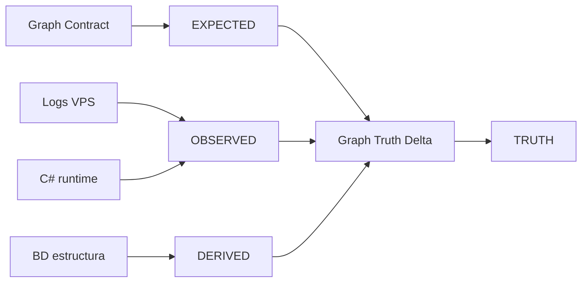
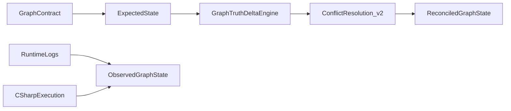

# 13 — Graph Truth and Validation Engine (Sunshine Grafo Emu)

> **Objetivo.** Extender conceptualmente el Knowledge Extraction Model de
> [12-knowledge-extraction-model.md](12-knowledge-extraction-model.md) con la **Graph Truth Layer (GTL)**:
> un modelo de validacion que compara lo que el sistema **espera** (Graph Contracts), lo que **observa**
> (logs + runtime C#), lo que **deriva** (decoders sobre BD) y reconcilia en un estado de **verdad parcial**.
>
> **Restricciones.** Solo diseno formal + reglas + JSONL ilustrativo. No codigo, no MCP, no BD nueva,
> no ejecucion real de pipelines. **No modifica** doc 11 ni doc 12; los referencia y extiende.

---

## 0. Introduccion

### 0.1 Que es la Graph Truth Layer (GTL)

| Capa | Pregunta que responde | Documento |
|------|----------------------|-----------|
| **Semantic Decoders** | Que codigo interpreta que columna? | [11-semantic-decoders-audit.md](11-semantic-decoders-audit.md) |
| **KEM / Graph Contracts** | Que nodos y aristas debe producir cada decoder? | [12-knowledge-extraction-model.md](12-knowledge-extraction-model.md) |
| **GTL (este doc)** | Es verdad lo producido? Que diverge y con que confianza? | Fase 13 |
| **Grafo** | Donde se almacenan las afirmaciones? | [04-modelo-grafo.md](04-modelo-grafo.md) |

Fase 12 define **como extraer**. Fase 13 define **como validar** la extraccion contra realidad observada
antes de que Fase 14 convierta el grafo en sistema de consulta semantica.

### 0.2 Por que la extraccion sin validacion falla

El vertical slice ([prototype/edges.jsonl](prototype/edges.jsonl)) ya demuestra el problema:

- `spelllevel:941 -PARSED_EFFECT-> effect:99` (hex estatico, conf=0.3, SUSPECTED)
- `spell:189 -USES_EFFECT-> effect:182` (log DISPATCH Summon, conf=1.0, OBSERVED)
- `effect:99 -CONTRADICTS-> effect:182` (L5)

Sin GTL, un Seed Graph masivo **multiplicaria** aristas SUSPECTED como si fueran verdad. GTL emite
**TruthDelta** explicitos y reconcilia en estado **TRUTH** con `confidence_final`.

### 0.3 Cuatro estados de verdad

```text
EXPECTED  ← Graph Contract (Fase 12 §3)
OBSERVED  ← LOGS + trazas runtime C#
DERIVED   ← Decoder sobre BD (estructura interpretada)
TRUTH     ← Delta Engine + Conflict Resolution v2 (reconciliacion final)
```



**Extension de Fase 12:** el atributo `edge_status` (VERIFIED/OBSERVED/SUSPECTED/BROKEN) se refina con
`truth_state` (EXPECTED/OBSERVED/DERIVED/TRUTH). No reemplaza doc 12; lo complementa.

### 0.4 Pipeline Fase 12 → 13 → 14

| Fase | Rol | Entregable |
|------|-----|------------|
| **12** | Extraccion formal (contratos, registry, CRE v1) | KEM |
| **13** | Validacion y reconciliacion (GTL) | Este doc |
| **14** | Consulta semantica (Queryable Semantic Graph) | Query Engine |

Doc 12 §12 anticipaba Fase 13 como "Seed Graph masivo". **Este entregable redefine Fase 13** como capa de
verdad: la ejecion masiva de contratos genera grafo EXPECTED; GTL lo valida. La ingesta fisica queda fuera
de alcance (diseno only).

### 0.5 Convenciones

- **contract_id:** prefijo `contract:` de doc 12 (ej. `contract:quest-objective-type-3`, no IDs sueltos).
- **Provenance / confidence:** heredados de doc 04 y doc 12.
- **JSONL:** ilustrativo, alineado a [prototype/](prototype/).

---

## 1. Graph Contract Execution Model (extension Fase 12 §3)

Cada contrato de doc 12 §3.3 se extiende con bloque **`contract_execution_model`**. Doc 12 no se modifica;
esta seccion define la extension formal para Fase 13.

### 1.1 Plantilla de extension

```yaml
contract_id: contract:quest-objective-type-3
decoder: QuestsCollection.UpdateObjective
contract_execution_model:
  expected:
    nodes: [QuestObjective, QuestStep, Npc, Item]
    edges: [INVOLVES_NPC, REQUIRES_ITEM]
  observed:
    sources: [LOGS, CODE, BD]
    patterns:
      - "NpcReply Type=6 UpdateObjectiveReply params=quest,step,obj"
      - "QuestManager.VerifyQuest objectiveId match"
      - "BD quests_objectives ParametersCSV Type=3"
  reconciliation_rules:
    missing_edge: { confidence_delta: -0.25, delta_type: MISSING_EDGE, severity: HIGH }
    extra_edge: { mark_truth_state: OBSERVED, delta_type: EXTRA_EDGE, severity: LOW }
    mismatch_node: { delta_type: TYPE_MISMATCH, severity: HIGH }
    semantic_drift: { confidence_delta: -0.30, delta_type: SEMANTIC_DRIFT, severity: HIGH }
```

### 1.2 Catalogo resumen (contratos Tier S + A)

| contract_id | Expected edges | Observed sources | Reglas default |
|-------------|----------------|------------------|----------------|
| `contract:effect-hex-sunshine` | HAS_EFFECTS, DECODED_BY, TYPED_AS, USES_EFFECT | CODE, LOG (DISPATCH), BD | semantic_drift on hex≠log |
| `contract:effect-hex-itemset` | HAS_TIER_EFFECTS, DECODED_BY | CODE, BD | missing_edge -0.25 |
| `contract:object-effect-player` | HAS_RAW_EFFECTS, PROMOTED_TO | CODE, BD | partial promotion |
| `contract:effect-colon-house` | HAS_EFFECT | CODE, BD | match typical |
| `contract:map-hex-elements` | ELEMENT_AT, FIGHT_START | CODE, BD | missing_edge if Blue/Red null |
| `contract:dlm-cell-geometry` | HAS_CELL, NEIGHBOR | CODE, asset | semantic_drift Los unused |
| `contract:quest-structure` | HAS_STEP, HAS_OBJECTIVE, REWARDS | BD, CODE | match typical |
| `contract:quest-objective-type-{n}` | TARGETS, INVOLVES_NPC, REQUIRES_ITEM | BD, CODE, LOG | type-resolve 0.7 |
| `contract:npc-dialog-tree` | HAS_DIALOG, HAS_REPLY | BD, CODE | match typical |
| `contract:breed-stat-curve` | STAT_COST_CURVE | BD, CODE | match typical |
| `contract:recipe-ingredients` | USES_INGREDIENT | BD, CODE | match typical |
| `contract:job-harvest-loot` | HARVESTS | BD, CODE | match typical |
| `contract:monster-spawn` | SPAWNS, AT_CELL, KNOWS_SPELL | BD, CODE | match typical |
| `contract:world-interaction` | TELEPORT_TO, HOSTS, ON_ELEMENT | BD, CODE | match typical |
| `contract:item-criteria-dsl` | REQUIRES_CRITERIA, CHECKS | CODE, BD | semantic_drift unimpl keys |
| `contract:scroll-breed-pg` | REQUIRES_BREED | CODE, BD | partial vs full DSL |
| `contract:npc-action-dispatch` | DISPATCHES_ON_CLICK | CODE (5898), LOG | extra vs npcs_actions |
| `contract:npc-shop-token` | SELLS, USES_TOKEN | CODE, BD, LOG ShopTrace | match typical |
| `contract:npc-reply-type-{n}` | TELEPORTS_TO, STARTS, GRANTS, TEACHES, UPDATES | BD, CODE, LOG | missing handler=BROKEN |
| `contract:entity-look` | LOOK_BONES | BD, CODE | low priority validation |

### 1.3 Contratos especiales (sin validacion activa)

| contract_id | estado Fase 13 | Accion GTL |
|-------------|----------------|------------|
| `contract:quest-criteria-breed` | broken | DecoderValidation=INVALID; zero TRUTH edges |
| `contract:effect-binary-stump` | inactive | skip validation |
| (sin contrato) | not-decoded | DatabaseColumn only; INTENT_DEAD_DATA |

---

## 2. Graph Truth Delta Engine

Motor formal de diferencias entre **EXPECTED**, **OBSERVED** y **DERIVED**. Emite nodos `TruthDelta` (L5).

### 2.1 Taxonomia de delta (cerrada)

| delta_type | Significado | severity tipica | confidence_delta tipico |
|------------|-------------|-----------------|-------------------------|
| MATCH | expected alineado con observed/derived | NONE | 0 |
| MISSING_NODE | nodo esperado ausente en observed | MEDIUM–HIGH | -0.20 a -0.35 |
| MISSING_EDGE | arista esperada sin par observed | HIGH | -0.25 a -0.30 |
| EXTRA_EDGE | arista observed no en contract | LOW | 0 (marca OBSERVED) |
| TYPE_MISMATCH | mismo slot, distinta entidad (doc 08) | HIGH | -0.30 |
| SEMANTIC_DRIFT | mismo tipo rel, distinto significado runtime | HIGH | -0.30 a -0.15 |

### 2.2 Plantilla nodo TruthDelta

```jsonl
{"id":"delta:contract:quest-objective-type-3:MISSING_EDGE:INVOLVES_NPC","type":"TruthDelta","layer":"L5","props":{"contract_id":"contract:quest-objective-type-3","delta_type":"MISSING_EDGE","expected_rel":"INVOLVES_NPC","expected_src":"queststep:3","expected_dst":"npc:449","observed":null,"severity":"HIGH","confidence_delta":-0.30,"source":"LOGS"},"provenance":{"source":"DERIVADO","method":"gtl-delta","inputs":["contract:quest-objective-type-3","log:quest-events"]},"confidence":0.85}
```

### 2.3 Algoritmo conceptual (no codigo)

```text
FUNCTION compute_deltas(contract_id, expected_graph, observed_graph, derived_graph):
  FOR each edge E in expected_graph WHERE E.contract_id = contract_id:
    O = find_matching_edge(observed_graph, E, join_keys=[src.id, rel, dst.type])
    D = find_matching_edge(derived_graph, E, join_keys=[src.id, rel])
    IF O matches E AND (D matches E OR D is null):
      EMIT TruthDelta(delta_type=MATCH, confidence_delta=0)
    ELIF O is null AND D matches E:
      EMIT TruthDelta(MISSING_EDGE, source=LOGS, ...)  # no runtime evidence
      APPLY reconciliation_rules.missing_edge
    ELIF O.dst != E.dst OR O.rel semantic != E.rel semantic:
      EMIT TruthDelta(TYPE_MISMATCH or SEMANTIC_DRIFT, ...)
    ELIF O exists AND E not in contract.produces_edges:
      EMIT TruthDelta(EXTRA_EDGE, mark_truth_state=OBSERVED)

  ACCUMULATE confidence_final = base_confidence + SUM(confidence_delta)
  CLAMP confidence_final to [0.0, 1.0]
  PASS deltas to Conflict Resolution Engine v2
```

### 2.4 Ejemplos trabajados (vertical slice)

#### Ejemplo A — `contract:effect-hex-sunshine` / spell 189 (SEMANTIC_DRIFT + TYPE_MISMATCH)

```text
EXPECTED (DERIVED from hex):
  spelllevel:941 -HAS_EFFECTS-> effectblob → effect:99 (Effect_DamageFire)

OBSERVED (LOG fight:1):
  spell:189 -USES_EFFECT-> effect:182 (Effect_Summon)

DELTA:
  delta_type: SEMANTIC_DRIFT + TYPE_MISMATCH
  expected_dst: effect:99
  observed_dst: effect:182
  confidence_delta: -0.30
  severity: HIGH
```

```jsonl
{"id":"delta:contract:effect-hex-sunshine:SEMANTIC_DRIFT:spell189","type":"TruthDelta","layer":"L5","props":{"contract_id":"contract:effect-hex-sunshine","delta_type":"SEMANTIC_DRIFT","expected":"effect:99 (hex parse)","observed":"effect:182 (DISPATCH Summon)","entity":"spell:189","severity":"HIGH","confidence_delta":-0.30,"source":"LOGS"},"provenance":{"source":"DERIVADO","method":"gtl-delta","inputs":["spelllevel:941","logseq:189@fight1"]},"confidence":0.9}
```

#### Ejemplo B — `contract:quest-objective-type-3` / quest 3 (MATCH)

```text
EXPECTED:
  queststep:3 -INVOLVES_NPC-> npc:449 (Type=3, params=449,306,1)

DERIVED (BD + type-resolve):
  Same edge — conf 0.7 INTERPRETADA

OBSERVED:
  No quest log in VPS sample — UNOBSERVED for runtime

DELTA:
  delta_type: MATCH (BD/code alignment)
  confidence_delta: 0
  truth_state: DERIVED verified; OBSERVED pending more logs
```

```jsonl
{"id":"delta:contract:quest-objective-type-3:MATCH:qs3-npc449","type":"TruthDelta","layer":"L5","props":{"contract_id":"contract:quest-objective-type-3","delta_type":"MATCH","expected_rel":"INVOLVES_NPC","observed":"derived-only","severity":"NONE","confidence_delta":0,"source":"BD+CODE"},"provenance":{"source":"DERIVADO","method":"gtl-delta","inputs":["queststep:3","npc:449"]},"confidence":0.7}
```

#### Ejemplo C — `contract:npc-action-dispatch` vs `npcs_actions` (EXTRA_EDGE + dead data)

```text
EXPECTED (contract):
  npc:788 -DISPATCHES_ON_CLICK-> nactiontype:1 (from enum 5898, CODE)

EXTRA (BD artefact):
  npcs_actions row ('Shop','12124') — no decoder, no runtime path

DELTA:
  delta_type: EXTRA_EDGE (BD suggests Shop via string; not in contract)
  PLUS: DatabaseColumn npcs_actions = stored-not-decoded
  severity: LOW for EXTRA; HIGH for false expectation if modeled wrong
```

```jsonl
{"id":"delta:npc-actions:EXTRA_EDGE:shop-string","type":"TruthDelta","layer":"L5","props":{"contract_id":"contract:npc-action-dispatch","delta_type":"EXTRA_EDGE","expected":null,"observed":"npcs_actions.Type=Shop (unused)","severity":"LOW","confidence_delta":0,"source":"BD"},"provenance":{"source":"DERIVADO","method":"gtl-delta","inputs":["dbcolumn:npcs_actions.Type"]},"confidence":0.95}
```

---

## 3. Edge Validation Layer (extension Fase 12 §4)

Extiende el Edge Semantics Registry (doc 12 §4) con bloque **`validation`** por `rel`. Doc 12 no se modifica.

### 3.1 Plantilla de extension

```yaml
rel: HAS_EFFECTS
origin_contract: contract:effect-hex-sunshine
validation:
  sources:
    CODE: EffectManager.GetEffects(string)
    LOG: "DISPATCH effect="
    BD: "spells_levels.Effects hex blob"
  pass_condition: "non-empty effect list + EffectManager BE layout + UTF zone field consumed"
  fail_condition: "null hex / truncated / naive-parse 6xUInt32 desalineado"
  failure_modes:
    - silent_effect_loss
    - partial_execution
    - static_runtime_mismatch
  on_fail:
    delta_type: SEMANTIC_DRIFT
    edge_status: SUSPECTED
    truth_state: DERIVED
```

### 3.2 Registry de validacion (12 rels Tier S)

| rel | pass_condition | fail_condition | failure_mode | delta_type on fail |
|-----|----------------|----------------|--------------|-------------------|
| HAS_EFFECTS | hex parse EffectManager OK | null/truncated hex | silent_effect_loss | SEMANTIC_DRIFT |
| USES_EFFECT | LOG DISPATCH matches enum | no dispatch in log | partial_execution | MISSING_EDGE |
| DECODED_BY | decoder class reachable | decoder broken/inactive | — | MISSING_EDGE |
| REQUIRES_CRITERIA | Criteria string non-empty | column empty | — | MATCH skip |
| CHECKS | key has `case` in GetCriterionValue | unimpl key (Pc, Qf) | silent_pass | SEMANTIC_DRIFT |
| DISPATCHES_ON_CLICK | handler exists for enum | enum 4,7-10 no handler | partial_execution | MISSING_EDGE |
| INVOLVES_NPC | Type table maps slot0→Npc | unknown Type | type_mismatch | TYPE_MISMATCH |
| TELEPORTS_TO | Reply Type=2 params 3-tuple | handler missing | — | MISSING_EDGE |
| STARTS | Reply Type=5 questId valid | quest id missing in BD | — | MISSING_NODE |
| HAS_CELL | DLM 560 cells walkable set | DLM missing | silent_effect_loss | MISSING_NODE |
| OBSERVED_IN | spell in fight log | never cast | unobserved | MISSING_EDGE |
| CONTRADICTS | Finding links both sides | one side missing | — | invalid Finding |

### 3.3 Ejemplo completo: HAS_EFFECTS

```yaml
rel: HAS_EFFECTS
validation:
  sources:
    CODE: EffectManager.GetEffects(string)  # EffectManager.cs:23-51
    LOG: "DISPATCH spell=N effect=Effect_*"
  pass_condition: >
    EffectManager reads count + full record including UTF zone;
    effect id maps to EffectsEnum;
    if log available: observed effect id logged OR drift documented
  fail_condition: >
    MCP-2 naive-parse (6xUInt32 only);
    hex id != log DISPATCH effect for same spell sample
  failure_modes: [silent_effect_loss, static_runtime_mismatch]
  on_fail: { delta_type: SEMANTIC_DRIFT, edge_status: SUSPECTED }
```

---

## 4. Decoder Validation Loop

Cada decoder Tier S (doc 11 §8.1) entra en ciclo de evaluacion post-GTL. Emite nodos `DecoderValidation` (L5).

### 4.1 Estados

| status | Criterio |
|--------|----------|
| VALIDATED | logs + code + BD alineados (o sin logs pero code+BD match) |
| PARTIALLY_VALIDATED | code path OK; drift o cobertura parcial de logs/BD |
| INVALID | decoder broken, inactive, o contradice logs sistematicamente |
| UNOBSERVED | sin evidencia LOG ni muestra runtime suficiente |

### 4.2 Plantilla DecoderValidation

```yaml
decoder: EffectManager.GetEffects
contract_id: contract:effect-hex-sunshine
status: PARTIALLY_VALIDATED
evidence:
  logs: true           # DISPATCH in fights/1.log
  code_path: true      # EffectManager.cs:23-51
  bd_alignment: partial  # hex parse != log for spell 189
issues:
  - "spell 189: hex id 99 vs log Effect_Summon 182"
  - "item_set branch uses distinct layout (A.2)"
confidence_delta: -0.15
truth_deltas: ["delta:contract:effect-hex-sunshine:SEMANTIC_DRIFT:spell189"]
```

```jsonl
{"id":"decval:EffectManager.GetEffects","type":"DecoderValidation","layer":"L5","props":{"decoder":"EffectManager.GetEffects(string)","contract_id":"contract:effect-hex-sunshine","status":"PARTIALLY_VALIDATED","evidence":{"logs":true,"code_path":true,"bd_alignment":"partial"},"issues":["spell 189 hex vs log"],"confidence_delta":-0.15},"provenance":{"source":"DERIVADO","method":"decoder-validation-loop","inputs":["delta:contract:effect-hex-sunshine:SEMANTIC_DRIFT:spell189"]},"confidence":0.85}
```

### 4.3 Tabla Tier S (7 decoders)

| Decoder | contract_id | status proyectado | Evidencia | issues |
|---------|-------------|-------------------|-----------|--------|
| `EffectManager.GetEffects(string)` | effect-hex-sunshine | PARTIALLY_VALIDATED | logs+code+BD | spell 189 drift |
| `ObjectEffectSerializer.Deserialize` | object-effect-player | PARTIALLY_VALIDATED | code+BD | partial PROMOTED_TO |
| `ItemCriteriaEvaluator.IsRespected` | item-criteria-dsl | PARTIALLY_VALIDATED | code+BD | unimpl keys, OR bug |
| `ReplyDispatcher` + handlers | npc-reply-type-{n} | VALIDATED | code+BD | — |
| `NpcActionTypeEnum` dispatch | npc-action-dispatch | VALIDATED | code+LOG | unimpl enums 4,7-10 |
| `DlmReader/DlmMap/DlmCellData` | dlm-cell-geometry | PARTIALLY_VALIDATED | code+asset | Los not applied |
| `Npc.ParseDialogCsv` | npc-dialog-tree | VALIDATED | code+BD | — |

Decoders Tier A notables: `QuestsCollection` PARTIALLY_VALIDATED (type-dependent); `QuestManager.ParseCriteria` INVALID (broken).

---

## 5. Conflict Resolution Engine v2

Extiende doc 12 §6 **sin modificarlo**. CRE v2 opera sobre TruthDelta y produce estado **TRUTH**.

### 5.1 Jerarquia de verdad (absoluta)

```text
1. LOGS        — runtime truth (comportamiento observado)
2. CODE        — execution logic (semantica implementada)
3. BD          — structure only (bytes almacenados)
4. CONTRACT    — expected model (mas baja prioridad)
```

Doc 12 §6 tenia LOG > CODE > BD. v2 **anade CONTRACT** como capa mas debil.

### 5.2 Modos de resolucion

| mode | Cuando aplicar | Efecto en grafo |
|------|----------------|-----------------|
| OVERRIDE | log contradice contract/BD/derived | TRUTH edge from LOG; expected→SUSPECTED |
| MERGE | coexistencia valida static + runtime | dos edges, distinto truth_state |
| RECLASSIFY_NODE | TYPE_MISMATCH resuelto via doc 08 | corregir id canonico del nodo |
| SPLIT_EDGE_SEMANTICALLY | misma entidad, dos semanticas de rel | PARSED_EFFECT vs USES_EFFECT |

### 5.3 Ruleset v2 (extension doc 12 §6.2)

```text
RULE log_contradicts_bd:          # heredada doc 12 §6.2
  APPLY mode OVERRIDE on USES_EFFECT
  MARK derived PARSED_EFFECT SUSPECTED
  EMIT Finding CONTRADICTS if material

RULE contract_contradicts_observed:
  IF contract.expected != observed:
    TRUTH ← observed (LOGS priority)
    contract edge → truth_state EXPECTED, edge_status SUSPECTED

RULE merge_static_runtime:
  IF static edge valid for equip/load AND runtime edge valid for combat:
    KEEP both: DERIVED (static) + OBSERVED (runtime)
    APPLY mode MERGE

RULE code_contradicts_bd_unused:   # heredada
  MARK DatabaseColumn stored-not-decoded
  NO TRUTH edges from column

RULE decoder_broken:               # heredada
  DecoderValidation status INVALID
  ZERO TRUTH output

RULE all_match:
  truth_state TRUTH, edge_status VERIFIED, confidence_final 1.0

RULE split_effect_semantics:
  IF SEMANTIC_DRIFT on HAS_EFFECTS/USES_EFFECT:
    APPLY SPLIT_EDGE_SEMANTICALLY
    PARSED_EFFECT (DERIVED) + USES_EFFECT (OBSERVED) both kept
```

### 5.4 Plantilla ConflictResolution

```jsonl
{"id":"conflict:C-SPELL-189-EFFECT","type":"ConflictResolution","layer":"L5","props":{"conflict_id":"C-SPELL-189-EFFECT","delta_type":"SEMANTIC_DRIFT","resolution":"SPLIT_EDGE_SEMANTICALLY","modes_applied":["OVERRIDE","MERGE"],"final_source":"LOGS","confidence_final":0.82,"truth_edges":[{"rel":"USES_EFFECT","src":"spell:189","dst":"effect:182","truth_state":"TRUTH"},{"rel":"PARSED_EFFECT","src":"spelllevel:941","dst":"effect:99","truth_state":"DERIVED","edge_status":"SUSPECTED"}]},"provenance":{"source":"DERIVADO","method":"cre-v2","inputs":["delta:contract:effect-hex-sunshine:SEMANTIC_DRIFT:spell189","logseq:189@fight1"]},"confidence":0.82}
```

```jsonl
{"id":"conflict:C-QUEST-CRITERIA-BREED","type":"ConflictResolution","layer":"L5","props":{"conflict_id":"C-QUEST-CRITERIA-BREED","resolution":"OVERRIDE","final_source":"CODE","confidence_final":0.0,"note":"ParseCriteria broken — no TRUTH edges"},"provenance":{"source":"DERIVADO","method":"cre-v2","inputs":["decval:QuestManager.ParseCriteria"]},"confidence":1.0}
```

---

## 6. Graph Truth Delta Pipeline

Pipeline conceptual que integra contratos, observacion y reconciliacion. **No se ejecuta** en Fase 13; se define para Fase 13+ ingesta futura.

### 6.1 Diagrama



### 6.2 Vistas conceptuales

| Vista | Contenido | truth_state dominante |
|-------|-----------|----------------------|
| **ExpectedState** | Salida de `contract_execution_model.expected` | EXPECTED |
| **ObservedGraphState** | Edges extraidos de logs + trazas C# runtime | OBSERVED |
| **DerivedGraphState** | Salida decoders sobre BD (subconjunto de Fase 12 GPG) | DERIVED |
| **ReconciledGraphState** | Post CRE v2; aristas con TRUTH + confidence_final | TRUTH |

No son almacenes fisicos nuevos: son **filtros** sobre el mismo grafo logico (doc 04 §7).

### 6.3 Integracion L5 (doc 04 §6)

```text
TruthDelta (SEMANTIC_DRIFT material)
  → Finding CONTRADICTS (si aplica)
  → ConflictResolution RESOLVES delta
  → Edge truth_state=TRUTH
  → GraphStabilityReport agrega metricas
  → QueryFeedbackSignal alimenta Fase 14
```

---

## 7. Graph Stability Report

Output analitico post-validacion. Nodo conceptual `GraphStabilityReport` (L5).

### 7.1 Metricas

| Metrica | Definicion | Formula conceptual |
|---------|------------|-------------------|
| `% contracts validated` | DecoderValidation=VALIDATED / Tier S+A contracts | count VALIDATED / total |
| `% edges confirmed` | edge_status VERIFIED or truth_state TRUTH | confirmed / total edges |
| `% semantic drift` | delta_type=SEMANTIC_DRIFT / total deltas | drift count / deltas |
| top unstable decoders | rank by confidence_delta (most negative) | sort decval |
| top unstable edges | rel + failure_mode frequency | group by rel |

### 7.2 Ejemplo ilustrativo (vertical slice)

Proyectado sobre spell 189/196, quest 3, npc 1053 — **numeros estimados, no medidos en produccion**.

```jsonl
{"id":"gstab:vertical-slice","type":"GraphStabilityReport","layer":"L5","props":{"scope":"vertical-slice","contracts_total":19,"contracts_validated_pct":0.42,"contracts_partial_pct":0.47,"contracts_invalid_pct":0.11,"edges_confirmed_pct":0.58,"semantic_drift_pct":0.22,"top_unstable_decoders":["EffectManager.GetEffects","ItemCriteriaEvaluator","DlmReader"],"top_unstable_edges":["HAS_EFFECTS","PARSED_EFFECT","CHECKS"],"confidence_mean":0.71},"provenance":{"source":"DERIVADO","method":"gtl-report","inputs":["decval:*","delta:*"]},"confidence":0.75}
```

Interpretacion: combate (effects) y criteria (DSL) concentran drift; quest structure y NPC dispatch estables.

---

## 8. Query Feedback Signal (puente Fase 14)

Extiende doc 12 §10 Query Intent Model con **senales de estabilidad** emitidas tras Graph Stability Report.
No es un query engine; es metadata que Fase 14 consumira.

### 8.1 Plantilla QueryFeedbackSignal

```jsonl
{"id":"qsignal:quest-resolution","type":"QueryFeedbackSignal","layer":"L5","props":{"query":"quest resolution flow","stable_contracts":["contract:quest-structure","contract:quest-objective-type-3","contract:npc-reply-type-6"],"unstable_edges":["HAS_EFFECTS","PARSED_EFFECT"],"confidence_mean":0.71,"recommended_intents":["INTENT_DECODER_CONFLICT","INTENT_WHY_BEHAVIOR"]},"provenance":{"source":"DERIVADO","method":"gtl-report","inputs":["gstab:vertical-slice"]},"confidence":0.71}
```

### 8.2 Mapeo intents doc 12 §10.2 + GTL

| intent_id (doc 12) | GTL enrichment | stable/unstable signal |
|--------------------|----------------|------------------------|
| INTENT_WHY_BEHAVIOR | TruthDelta SEMANTIC_DRIFT + ConflictResolution | unstable: HAS_EFFECTS, USES_EFFECT |
| INTENT_UNIMPLEMENTED | DecoderValidation INVALID + DatabaseColumn | stable: npc-action-dispatch |
| INTENT_DECODER_CONFLICT | TruthDelta + decval PARTIALLY_VALIDATED | confidence_mean filter |
| INTENT_DEAD_DATA | code_contradicts_bd_unused deltas | stable_contracts exclude E-family |

### 8.3 Senales adicionales (ilustrativas)

```jsonl
{"id":"qsignal:combat-effects","type":"QueryFeedbackSignal","layer":"L5","props":{"query":"spell effect behavior","stable_contracts":[],"unstable_edges":["HAS_EFFECTS","USES_EFFECT","PARSED_EFFECT"],"confidence_mean":0.55,"recommended_intents":["INTENT_WHY_BEHAVIOR","INTENT_DECODER_CONFLICT"]},"provenance":{"source":"DERIVADO","method":"gtl-report"},"confidence":0.55}
{"id":"qsignal:npc-interaction","type":"QueryFeedbackSignal","layer":"L5","props":{"query":"npc shop and dialog","stable_contracts":["contract:npc-action-dispatch","contract:npc-dialog-tree","contract:npc-shop-token"],"unstable_edges":[],"confidence_mean":0.92,"recommended_intents":["INTENT_UNIMPLEMENTED"]},"provenance":{"source":"DERIVADO","method":"gtl-report"},"confidence":0.92}
```

---

## 9. Seed Graph Validation View

Clasificacion **conceptual** del sistema post-GTL. No ingesta masiva; vista para priorizar que contratos
sembrar con confianza en fase futura.

### 9.1 Contratos confiables (VALIDATED + drift < 5%)

| contract_id | status | notas |
|-------------|--------|-------|
| `contract:npc-dialog-tree` | VALIDATED | ParseDialogCsv + BD |
| `contract:npc-action-dispatch` | VALIDATED | enum 5898, no npcs_actions |
| `contract:npc-reply-type-{2,5,6,7,8}` | VALIDATED | handlers explicitos |
| `contract:quest-structure` | VALIDATED | CSV directo |

### 9.2 Decoders estables

`ReplyDispatcher`, `Npc.ParseDialogCsv`, `Npc.InteractWith` (dispatch), `NpcBuySellAction` (con ShopTrace).

### 9.3 Edges criticos inestables

| rel | failure_mode | zona |
|-----|--------------|------|
| HAS_EFFECTS | static_runtime_mismatch | combate |
| PARSED_EFFECT | naive-parse / hex drift | combate |
| CHECKS | silent_pass unimpl keys | items/equipo |
| HAS_CELL.los | parsed_not_applied | mapas/combate LoS |

### 9.4 Zonas de drift semantico

| Zona | decoders | delta_types frecuentes |
|------|----------|------------------------|
| Combate / effects | EffectManager | SEMANTIC_DRIFT, TYPE_MISMATCH |
| Criteria DSL | ItemCriteriaEvaluator | SEMANTIC_DRIFT |
| Quest criteria breed | QuestManager.ParseCriteria | MISSING_EDGE (broken) |
| NPC actions BD | npcs_actions (none) | EXTRA_EDGE, dead data |
| Map LoS | DlmCellData | parsed_not_applied |

### 9.5 Orden de validacion (Tier S → A)

Heredado de doc 12 §12.1, reinterpretado como **orden GTL**, no ingesta:

```text
1. Validar Tier S contracts (7) — esqueleto de verdad
2. Aplicar CRE v2 donde existen logs (combate primero)
3. Validar Tier A contracts — contenido gameplay
4. Emitir GraphStabilityReport + QueryFeedbackSignals
5. Marcar broken/inactive/not-decoded antes de cualquier seed futuro
```

---

## 10. Catalogo de modelos nuevos (Fase 13)

Extiende doc 12 §7.1 (NodeTypes) y §4 (EdgeTypes). Doc 12 no se modifica.

### 10.1 NodeTypes nuevos

| type | layer | id_pattern | props minimas |
|------|-------|------------|---------------|
| TruthDelta | L5 | `delta:{contract}:{delta_type}:{key?}` | contract_id, delta_type, severity, confidence_delta, source |
| DecoderValidation | L5 | `decval:{decoder}` | status, evidence{}, issues[], confidence_delta |
| ConflictResolution | L5 | `conflict:{id}` | resolution, modes_applied[], final_source, confidence_final |
| QueryFeedbackSignal | L5 | `qsignal:{topic}` | stable_contracts[], unstable_edges[], confidence_mean |
| GraphStabilityReport | L5 | `gstab:{scope}` | metrics snapshot (pct validated, drift, tops) |

### 10.2 EdgeTypes nuevos

| rel | from → to | meaning | layer |
|-----|-----------|---------|-------|
| VALIDATES | DecoderValidation → GraphContract | decoder evidencia contrato | L5 |
| PRODUCES_DELTA | GraphContract → TruthDelta | contrato genera diff | L5 |
| RESOLVES | ConflictResolution → TruthDelta | cierre de conflicto | L5 |
| FEEDS | GraphStabilityReport → QueryFeedbackSignal | metricas → consulta | L5 |
| RECONCILES_TO | ConflictResolution → Edge | delta resuelto en arista TRUTH | L5 |

### 10.3 Atributo truth_state (extension)

Aplicar a nodos/aristas en ReconciledGraphState:

| truth_state | Cuando |
|-------------|--------|
| EXPECTED | emitido por contrato, no reconciliado |
| OBSERVED | fuente LOG o runtime trace |
| DERIVED | decoder sobre BD |
| TRUTH | post CRE v2; consultable en Fase 14 Q2 |

---

## 11. Casos criticos GTL (reconciliacion completa)

Reaplicacion de doc 12 §9 con pipeline **EXPECTED → OBSERVED → DELTA → CRE v2 → TRUTH**.

### 11.1 QuestObjective type-dependent

```text
CONTRACT: contract:quest-objective-type-3
EXPECTED: queststep:3 -INVOLVES_NPC-> npc:449; questobjective -REQUIRES_ITEM-> item:306
DERIVED:  MATCH (BD Type=3 params=449,306,1)
OBSERVED: UNOBSERVED (no quest log in sample)
DELTA:    MATCH, confidence_delta=0
TRUTH:    INVOLVES_NPC edge truth_state=DERIVED, conf=0.7, edge_status=VERIFIED
```

### 11.2 EffectManager hex — spell 189

```text
EXPECTED/DERIVED: effect:99 via hex (DERIVED, SUSPECTED)
OBSERVED:         effect:182 via DISPATCH (OBSERVED)
DELTA:            SEMANTIC_DRIFT + TYPE_MISMATCH, confidence_delta=-0.30
CRE v2:           SPLIT_EDGE_SEMANTICALLY + OVERRIDE + MERGE
TRUTH:            USES_EFFECT spell:189→182 (TRUTH, conf=0.82)
                  PARSED_EFFECT sl:941→99 (DERIVED, SUSPECTED, conf=0.3)
Finding:          CONTRADICTS effect:99 ↔ effect:182 (prototype e004)
```

### 11.3 Criteria DSL — permisividad

```text
CONTRACT: contract:item-criteria-dsl
EXPECTED: CHECKS for each atom in Criteria string
CODE:     Pc, Ps, Qf pass silently (no case)
DELTA:    SEMANTIC_DRIFT on unimplemented CHECKS
decval:   ItemCriteriaEvaluator PARTIALLY_VALIDATED, confidence_delta=-0.20
TRUTH:    CHECKS only for implemented keys; CriteriaString.unimplementedKeys[] documented
          NO false TRUTH edges for Pc/Ps restrictions
```

### 11.4 NPC dispatch vs npcs_actions

```text
CONTRACT: contract:npc-action-dispatch
BD extra: npcs_actions 'Shop' — code_contradicts_bd_unused
DELTA:    EXTRA_EDGE (BD artefact), DatabaseColumn not-decoded
CRE v2:   OVERRIDE — TRUTH from CODE dispatch only
TRUTH:    npc:788 -DISPATCHES_ON_CLICK-> nactiontype:1 (VERIFIED, conf=1.0)
          Zero edges from npcs_actions table
```

---

## 12. Puente a Fase 14 — Queryable Semantic Graph Layer

Fase 14 transforma contratos validados, deltas reconciliados y edges TRUTH en **consultas semanticas**.

### 12.1 Reframe Q1–Q4

| Q | Tema | Intent base (doc 12 §10) | Input GTL |
|---|------|--------------------------|-----------|
| **Q1** | Estado del sistema | INTENT_DECODER_CONFLICT + stability | GraphStabilityReport, decval status |
| **Q2** | Rutas funcionales | subgraphs truth_state=TRUTH only | stable_contracts from qsignal |
| **Q3** | Inconsistencias | INTENT_WHY_BEHAVIOR + INTENT_DECODER_CONFLICT | TruthDelta + ConflictResolution |
| **Q4** | Incertidumbre estructural | INTENT_DEAD_DATA + SUSPECTED edges | UNOBSERVED decval, stored-not-decoded |

### 12.2 Pipeline Fase 12 → 13 → 14 (actualizado)

| Fase | Rol | Output clave |
|------|-----|--------------|
| **12** KEM | Extraccion formal | Graph Contracts, Edge Registry, CRE v1, Query Intents |
| **13** GTL | Validacion/reconciliacion | TruthDelta, DecoderValidation, CRE v2, Stability Report, QueryFeedbackSignal |
| **14** QSG | Consulta semantica | Respuestas Q1–Q4 sobre grafo TRUTH-filtered |

### 12.3 Criterios de consultabilidad (Fase 14)

Una arista es **queryable** si:

```text
truth_state == TRUTH
AND edge_status IN (VERIFIED, OBSERVED)
AND confidence_final >= 0.60
AND NOT decval.status == INVALID for governing decoder
```

### 12.4 Follow-up fuera de alcance

- `prototype/truth-deltas.jsonl` — TruthDelta + ConflictResolution del vertical slice
- `prototype/decoder-validations.jsonl` — 7 Tier S decval nodes
- Extender `traverse.mjs` con filtros `truth_state` y `edge_status`

---

*Anterior: [12-knowledge-extraction-model.md](12-knowledge-extraction-model.md) · Siguiente previsto: Fase 14 Queryable Semantic Graph Layer*
