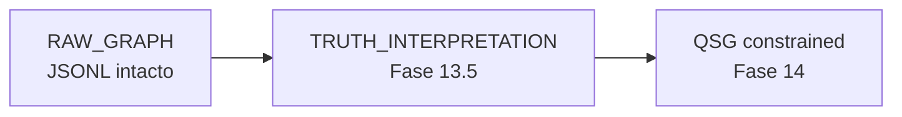

# 13.5 — TRUTH Minimal Materialization Layer (Pre-QSG Bridge)

> **Objetivo.** Introducir una capa mínima de verdad estructurada sobre el grafo existente
> (`prototype/nodes.jsonl` + `prototype/edges.jsonl`) sin reescribir el sistema, sin introducir
> nuevos motores de consulta y sin modificar la arquitectura de Fases 11–13.
>
> Esta fase **no** es diseño teórico aislado: es un **patch de materialización de verdad** con
> runtime interpretable. El grafo raw **no se modifica**.

**Runtime:** [`prototype/truth-interpret.mjs`](prototype/truth-interpret.mjs)  
**Auditoría previa:** [`15-qsg-gate-audit.md`](15-qsg-gate-audit.md)  
**Siguiente:** [`14-queryable-semantic-graph-layer.md`](14-queryable-semantic-graph-layer.md) (QSG constrained mode)

---

## §0 — PRINCIPIO FUNDAMENTAL

| Regla | Estado |
|-------|--------|
| NO se modifica el grafo (`nodes.jsonl`, `edges.jsonl`) | ✔ |
| SOLO propiedades interpretables runtime | ✔ |
| NO se eliminan aristas DERIVED | ✔ |
| NO se reescribe `traverse.mjs` | ✔ |

---

## §1 — NUEVO MODELO MÍNIMO DE VERDAD (NO INVASIVO)

Cada arista del raw graph recibe **3 atributos conceptuales en runtime** (no persistidos en JSONL).

### 1.1 `truth_state` (derivado)

| Condición | `truth_state` |
|-----------|---------------|
| `provenance.source == "LOG"` AND edge not in contradiction loser set | **TRUTH** |
| `provenance.source == "LOG"` AND edge in contradiction loser set | **OBSERVED** |
| `provenance.source == "BD"` AND no LOG on same semantic slot | **DERIVED** |
| `status` in (`disputed`, `candidate`, `ref-only`) | **UNCERTAIN** |
| Otros (`CODE`, `MCP2`, `DERIVED`, composites) | **DERIVED** |

**Extensión mínima:** fuentes distintas de BD/LOG se tratan como DERIVED salvo `status` UNCERTAIN.

### 1.2 `confidence_minimal` (calculado, no persistido)

```text
confidence_minimal =
  base_confidence                           # edge.confidence ?? 1.0
  + LOG_bonus (0.3)                         # if provenance.source == "LOG"
  - contradiction_penalty (0.4)           # if edge id in CONTRADICTS loser set
  - uncertainty_penalty (0.3)             # if status disputed/candidate/ref-only

Clamp: [0.0, 1.0]
```

### 1.3 `truth_priority_rank` (runtime)

| truth_state | rank |
|-------------|------|
| TRUTH | 1.0 |
| OBSERVED | 0.8 |
| DERIVED | 0.5 |
| UNCERTAIN | 0.2 |

QSG (Fase 14) usará este rank para ordenar paths sin reescribir datos.

---

## §2 — PATCH DE INTERPRETACIÓN DEL GRAFO (NO MODIFICACIÓN)

```text
RAW_GRAPH (nodes.jsonl + edges.jsonl)
        ↓
TRUTH_INTERPRETATION_LAYER (Fase 13.5 — truth-interpret.mjs)
        ↓
QSG constrained mode (Fase 14)
```

- **Raw graph:** 37 nodos, 44 aristas (sin cambios).
- **Interpretation layer:** lee JSONL, emite snapshot JSON; no escribe archivos.

```bash
cd grafo_emu/prototype
node truth-interpret.mjs          # resumen humano
node truth-interpret.mjs --json   # snapshot completo §6
```

---

## §3 — REGLAS DE RESOLUCIÓN DE CONFLICTOS (MÍNIMAS)

Sin nodos nuevos. Solo interpretación sobre `CONTRADICTS` existentes.

### 3.1 Contradicción explícita

Si existe arista `CONTRADICTS` enlazando efecto PARSED (BD) vs efecto USES (LOG):

```text
winner = USES_EFFECT edge (provenance.source == LOG)
loser  = PARSED_EFFECT edge → truth_state = UNCERTAIN (status=disputed)
         OR downgraded; never TRUTH
```

### 3.2 PARSED vs OBSERVED (spell vertical slice)

| Caso | log_edge | derived_edge | resolution |
|------|----------|--------------|------------|
| spell 189 | `e003` USES_EFFECT | `e002` PARSED_EFFECT | **LOG_WINS** |
| spell 196 | `e103` USES_EFFECT | `e102` PARSED_EFFECT | **LOG_WINS** |

Regla: **USES_EFFECT overrides PARSED_EFFECT** en ranking QSG.

### 3.3 BD-only domains (quest / npc / item)

Dominios sin ninguna arista `provenance.source == "LOG"`:

```text
domain_truth_state = DERIVED ONLY
flag = LOW_TRUTH_COVERAGE
```

**Observable en prototype:**

| Dominio | Aristas LOG | Flag |
|---------|-------------|------|
| spell | 5 (`e003`, `e007`, `e103`, `e104`, `e106`) | — |
| quest | 0 | LOW_TRUTH_COVERAGE |
| npc | 0 | LOW_TRUTH_COVERAGE |
| item | 0 | LOW_TRUTH_COVERAGE |

---

## §4 — MINIMAL TRUTH COVERAGE METRIC

```text
truth_coverage_minimal =
  count(edges where provenance.source == "LOG")
  / total_edges
```

**Prototype (44 aristas, 8 LOG):**

```text
truth_coverage_minimal = 8 / 44 = 0.182
```

| Valor | Estado |
|-------|--------|
| > 0.6 | QSG READY |
| 0.3 – 0.6 | PARTIAL READY |
| < 0.3 | **NOT READY** ← prototype |

La capa 13.5 **activa interpretación** aunque la métrica global sea NOT READY; QSG opera en
**constrained mode** (dominio spell con ranking real; quest/npc/item DERIVED-only flagged).

---

## §5 — MCP READINESS BRIDGE CONTRACT

MCP futuro **puede consumir** (lectura):

| Input | Origen |
|-------|--------|
| raw graph | `nodes.jsonl`, `edges.jsonl` |
| `truth_state` | derivado runtime (`truth-interpret.mjs`) |
| `confidence_minimal` | calculado runtime |
| `truth_priority_rank` | calculado runtime |

MCP **NO puede**:

- reescribir grafo
- recalcular contradicciones con reglas distintas a §3
- generar `truth_state` propio incompatible con 13.5
- inventar scoring fuera de §1.2 / §1.3

---

## §6 — OUTPUT ESPERADO (VALIDACIÓN FASE 13.5)

Generado por `node truth-interpret.mjs --json` sobre el vertical slice actual.

### 6.1 Truth snapshot

```json
{
  "truth_coverage_minimal": 0.182,
  "truth_coverage_band": "NOT_READY",
  "top_truth_domains": ["spell"],
  "low_trust_domains": ["quest", "npc", "item"],
  "conflict_pairs": [
    {
      "log_edge": "e003",
      "derived_edge": "e002",
      "resolution": "LOG_WINS"
    },
    {
      "log_edge": "e103",
      "derived_edge": "e102",
      "resolution": "LOG_WINS"
    }
  ]
}
```

### 6.2 Graph readiness report

```json
{
  "phase_13_5_status": "ACTIVE",
  "qsg_readiness": "PARTIAL",
  "truth_coverage_band": "NOT_READY",
  "blockers": [
    "no persistent truth_state",
    "no decoder validation layer",
    "no feedback signal system"
  ],
  "allowed_next_phase": "Fase 14 (QSG constrained mode)"
}
```

### 6.3 Muestra interpretación por arista (spell conflict)

| id | rel | truth_state | confidence_minimal | truth_priority_rank |
|----|-----|-------------|-------------------|---------------------|
| e002 | PARSED_EFFECT | UNCERTAIN | 0.0 | 0.2 |
| e003 | USES_EFFECT | TRUTH | 1.0 | 1.0 |
| e102 | PARSED_EFFECT | UNCERTAIN | 0.0 | 0.2 |
| e103 | USES_EFFECT | TRUTH | 1.0 | 1.0 |

Interpretación completa: salida `edge_interpretations[]` en `--json` (44 entradas).

---

## §7 — RESTRICCIONES ABSOLUTAS

- [x] NO crear nodos nuevos
- [x] NO modificar edges en JSONL
- [x] NO eliminar DERIVED
- [x] NO implementar MCP tools
- [x] NO implementar QSG ranking engine (solo ranks conceptuales §1.3)
- [x] SOLO interpretación + scoring conceptual + script runtime read-only

---

## §8 — RESULTADO ESPERADO DE ESTA FASE

| Criterio | Estado |
|----------|--------|
| El grafo sigue siendo el mismo | ✔ `nodes.jsonl` / `edges.jsonl` intactos |
| Lectura de verdad consistente | ✔ reglas §1 + §3 aplicadas en runtime |
| MCP puede consumir `truth_priority_rank` | ✔ vía `--json` snapshot |
| QSG puede construirse sin reescribir datos | ✔ constrained mode spell-first |

**Cambio vs gate audit (#15):** antes no existía capa interpretable; ahora sí — pero persistencia
GTL completa (TruthDelta, decval, qsignal) sigue **NOT PRESENT** en dataset.

---

## §9 — PRINCIPIO FINAL

> Esta fase no construye conocimiento.  
> Construye **jerarquía de credibilidad** sobre conocimiento existente.



---

*Anterior: [13-graph-truth-validation-engine.md](13-graph-truth-validation-engine.md) · Gate: [15-qsg-gate-audit.md](15-qsg-gate-audit.md) · Siguiente: [14-queryable-semantic-graph-layer.md](14-queryable-semantic-graph-layer.md)*
