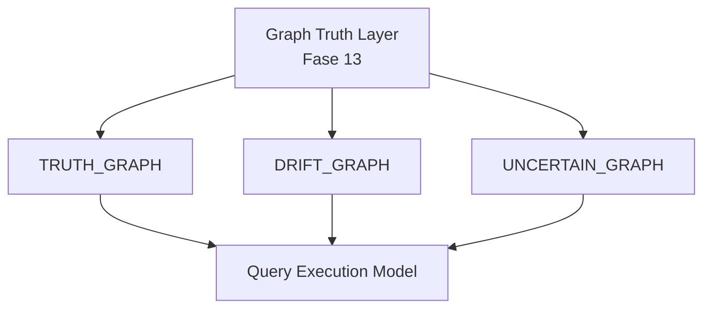
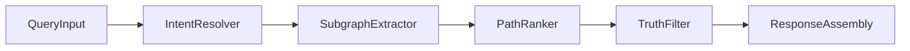
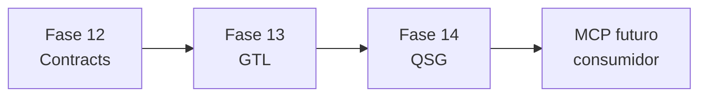

# 14 — Queryable Semantic Graph Layer (QSG)

> **Objetivo.** Convertir el stack Fase 12 (Graph Contracts) + Fase 13 (Graph Truth Layer) en un
> **sistema consultable de razonamiento sobre grafos**. Fase 14 no introduce decoders ni contratos
> nuevos; consume TRUTH, TruthDelta, DecoderValidation, QueryFeedbackSignal e intents de
> [12-knowledge-extraction-model.md](12-knowledge-extraction-model.md) §10.
>
> **Restricciones.** Solo diseno formal + modelos de consulta + reglas de ranking + JSONL ilustrativo.
> No codigo, no MCP implementado, no BD, no ingesta. **No modifica** docs 11–13.

---

## 0. Introduccion

### 0.1 Que es el Queryable Semantic Graph (QSG)

| Capa | Pregunta | Documento |
|------|----------|-----------|
| Decoders | Que codigo interpreta que dato? | [11-semantic-decoders-audit.md](11-semantic-decoders-audit.md) |
| KEM | Que nodos/aristas debe producir cada contrato? | [12-knowledge-extraction-model.md](12-knowledge-extraction-model.md) |
| GTL | Es verdad lo producido? | [13-graph-truth-validation-engine.md](13-graph-truth-validation-engine.md) |
| **QSG (este doc)** | **Que puedo preguntar y con que confianza?** | Fase 14 |
| Grafo | Donde viven las afirmaciones? | [04-modelo-grafo.md](04-modelo-grafo.md) |

Fase 14 es la capa de **consulta**: transforma el grafo reconciliado (TRUTH) en respuestas estructuradas
con paths rankeados, alternativas inciertas y puente a MCP futuro.

### 0.2 Tres vistas consultables

Extiende doc 13 §12.3 con vistas explicitas sobre el output de GTL:

| Vista | Contenido | Uso tipico |
|-------|-----------|------------|
| **TRUTH GRAPH** | aristas `truth_state=TRUTH`, post CRE v2 | Q2 rutas funcionales; respuesta por defecto |
| **DRIFT GRAPH** | TruthDelta + `SEMANTIC_DRIFT` + ConflictResolution | Q3 inconsistencias; INTENT_WHY_BEHAVIOR |
| **UNCERTAIN GRAPH** | DERIVED + UNOBSERVED + SUSPECTED | Q4 incertidumbre; INTENT_DEAD_DATA |



### 0.3 Pipeline Fase 12 → 13 → 14

| Fase | Rol | Output clave |
|------|-----|--------------|
| **12** KEM | Extraccion formal | Graph Contracts, Edge Registry, Query Intents |
| **13** GTL | Validacion/reconciliacion | TruthDelta, CRE v2, GraphStabilityReport, QueryFeedbackSignal |
| **14** QSG | Consulta semantica | QueryResponse, RankedPath, UncertaintyReport |

### 0.4 Herencia sin redefinicion

- **Intents:** `INTENT_WHY_BEHAVIOR`, `INTENT_DECODER_CONFLICT`, `INTENT_UNIMPLEMENTED`, `INTENT_DEAD_DATA` (doc 12 §10.2)
- **Preguntas Q1–Q4:** doc 13 §12.1
- **Consultabilidad:** doc 13 §12.3 (`truth_state=TRUTH`, `confidence_final>=0.60`, decval≠INVALID)
- **Atributos:** `truth_state`, `edge_status`, `confidence_final`, `contract_id` — no se redefinen

---

## 1. Query Execution Model (QEM)

Toda query sigue un pipeline de **5 etapas**:

```text
Query Input → Intent Resolver → Subgraph Extractor → Path Ranker → Truth Filter → Response Assembly
```



### 1.1 Estructura formal de query

```yaml
query:
  text: "how does spell 189 effect work"
  intent: INTENT_WHY_BEHAVIOR          # explicito o resuelto por Intent Resolver
  view: TRUTH_GRAPH                    # TRUTH_GRAPH | DRIFT_GRAPH | UNCERTAIN_GRAPH
  constraints:
    truth_state: [TRUTH, OBSERVED]
    min_confidence: 0.6
    exclude_decoder_status: [INVALID]
  scope:
    domains: [combat, effects]         # Edge Registry query_tags doc 12 §4
    seed_node: spell:189
  filter_mode: strict                  # strict | investigative | audit
```

### 1.2 Intent Resolver

Resuelve `query.text` → `intent_id` + `view` + `filter_mode`:

| Senal | Fuente | Uso |
|-------|--------|-----|
| Keywords | texto natural | "why", "conflict", "unimplemented", "unused" |
| QueryFeedbackSignal | doc 13 §8 | `recommended_intents`, `unstable_edges` |
| Q1–Q4 map | doc 13 §12.1 | fallback compuesto |

**Ejemplos de resolucion:**

| text (fragmento) | intent | view | filter_mode |
|------------------|--------|------|-------------|
| "why spell 189 summon" | INTENT_WHY_BEHAVIOR | DRIFT_GRAPH | investigative |
| "decoder conflicts effects" | INTENT_DECODER_CONFLICT | DRIFT_GRAPH | investigative |
| "npc actions not implemented" | INTENT_UNIMPLEMENTED | UNCERTAIN_GRAPH | audit |
| "data never used runtime" | INTENT_DEAD_DATA | UNCERTAIN_GRAPH | audit |
| "quest resolution flow" | Q2 compuesto | TRUTH_GRAPH | strict |

### 1.3 Etapas del pipeline

1. **Intent Resolver** — asigna intent, view, filter_mode; valida seed_node existe o cuarentena (doc 08).
2. **Subgraph Extractor** — expande desde seed segun intent pattern (§2); aplica reglas §3.
3. **Path Ranker** — puntua rutas candidatas (§4).
4. **Truth Filter** — elimina/demota edges no consultables (§5).
5. **Response Assembly** — emite QueryResponse JSON + provenance_chain (§6).

---

## 2. Intent-to-Graph Mapping (extension doc 12 §10)

Formaliza los 4 intents de doc 12 §10.2 enriquecidos con nodos GTL (doc 13). Doc 12 no se modifica.

### 2.1 Tabla maestra intent → subgrafo

| intent_id | Proposito | start_types | traverse rels | truth_state | GTL nodes |
|-----------|-----------|-------------|---------------|-------------|-----------|
| INTENT_WHY_BEHAVIOR | explicar comportamiento | Spell, Item | OBSERVED_IN, USES_EFFECT, PARSED_EFFECT, CONTRADICTS, HANDLED_BY | TRUTH, OBSERVED; DERIVED alt | TruthDelta, ConflictResolution, LogSequence |
| INTENT_DECODER_CONFLICT | drift decoder/contrato | Decoder, GraphContract | DECODED_BY, PRODUCES_DELTA, RESOLVES, CONTRADICTS | SUSPECTED, DRIFT view | TruthDelta, decval |
| INTENT_UNIMPLEMENTED | handlers/columnas ausentes | NpcActionType, DatabaseColumn | DISPATCHES_ON_CLICK; status=BROKEN | UNCERTAIN | decval INVALID |
| INTENT_DEAD_DATA | BD no usada runtime | DatabaseColumn | ausencia DECODED_BY; EXTRA_EDGE delta | stored-not-decoded | TruthDelta EXTRA_EDGE |

### 2.2 Patrones YAML formales

#### INTENT_WHY_BEHAVIOR

```yaml
intent_id: INTENT_WHY_BEHAVIOR
pattern:
  start_types: [Spell, Item]
  traverse:
    - rel: OBSERVED_IN
      filter: { truth_state: [OBSERVED, TRUTH] }
    - rel: USES_EFFECT
      filter: { truth_state: TRUTH }
      role: primary_answer
    - rel: PARSED_EFFECT
      filter: { truth_state: DERIVED }
      role: alternative_path
    - rel: CONTRADICTS
      optional: true
      layer: L5
    - rel: HANDLED_BY
      optional: true
  max_depth: 6
  preferred_layer: L3
  registry_tags: [combat, static-definition]
```

#### INTENT_DECODER_CONFLICT

```yaml
intent_id: INTENT_DECODER_CONFLICT
pattern:
  start_types: [Decoder, GraphContract]
  traverse:
    - rel: DECODED_BY
    - rel: PRODUCES_DELTA
    - rel: RESOLVES
    - rel: CONTRADICTS
  gtl_nodes: [TruthDelta, DecoderValidation, ConflictResolution]
  max_depth: 4
  view_default: DRIFT_GRAPH
```

#### INTENT_UNIMPLEMENTED

```yaml
intent_id: INTENT_UNIMPLEMENTED
pattern:
  start_types: [NpcActionType]
  traverse:
    - rel: DISPATCHES_ON_CLICK
      filter: { handler: missing, edge_status: BROKEN }
  alt_start: DatabaseColumn
  filter: { status: stored-not-decoded }
  view_default: UNCERTAIN_GRAPH
```

#### INTENT_DEAD_DATA

```yaml
intent_id: INTENT_DEAD_DATA
pattern:
  start_types: [DatabaseColumn]
  rule: no outgoing DECODED_BY edge
  gtl_delta: EXTRA_EDGE
  view_default: UNCERTAIN_GRAPH
```

### 2.3 Mapeo Q1–Q4 (doc 13 §12.1) → query compuesta

| Q | Tema | intents | view | filter_mode |
|---|------|---------|------|-------------|
| **Q1** | Estado del sistema | INTENT_DECODER_CONFLICT | DRIFT_GRAPH | investigative |
| **Q2** | Rutas funcionales | (ninguno — TRUTH only) | TRUTH_GRAPH | strict |
| **Q3** | Inconsistencias | INTENT_WHY_BEHAVIOR + INTENT_DECODER_CONFLICT | DRIFT_GRAPH | investigative |
| **Q4** | Incertidumbre estructural | INTENT_DEAD_DATA + UNOBSERVED decval | UNCERTAIN_GRAPH | audit |

**Q2** no requiere intent especifico: filtra `truth_state=TRUTH` sobre subgraph del seed.

---

## 3. Subgraph Extraction Engine

Extrae subgrafo candidato desde `seed_node` segun intent pattern y vista GTL.

### 3.1 Regla base (hereda doc 13 §12.3)

```text
INCLUDE edge e IF:
  e.truth_state IN query.constraints.truth_state
  AND e.confidence_final >= query.constraints.min_confidence
  AND governing_decoder(e).decval.status NOT IN query.constraints.exclude_decoder_status
```

### 3.2 Seleccion de vista

| view | Grafo base | Incluye adicional |
|------|------------|-------------------|
| TRUTH_GRAPH | edges truth_state=TRUTH | ConflictResolution.truth_edges |
| DRIFT_GRAPH | TRUTH + TruthDelta linked edges | SEMANTIC_DRIFT, SUSPECTED, CONTRADICTS |
| UNCERTAIN_GRAPH | DERIVED, UNOBSERVED, SUSPECTED | DatabaseColumn not-decoded, decval UNOBSERVED |

### 3.3 Expansion controlada

```text
FUNCTION EXPAND(node, depth, seen, query):
  IF depth > pattern.max_depth: RETURN
  FOR each outgoing edge e from node:
    IF e.dst in seen: CONTINUE
    IF e.truth_state == TRUTH: INCLUDE(e)
    ELIF e in ConflictResolution.truth_edges: INCLUDE(e)
    ELIF query.view == DRIFT_GRAPH AND e in drift_subgraph: INCLUDE(e); penalty += 0.4
    ELIF query.view == UNCERTAIN_GRAPH AND e.truth_state IN (DERIVED, SUSPECTED): INCLUDE(e); penalty += 0.2
    ELSE: SKIP
    EXPAND(e.dst, depth+1, seen, query)
```

### 3.4 Integracion QueryFeedbackSignal

Antes de expandir, aplicar pre-filtro doc 13 §8:

- Si `qsignal.unstable_edges` contiene rel del pattern → marcar dominio `investigative` obligatorio
- Si `qsignal.stable_contracts` cubre contract del seed → `stability_bonus` en ranker (§4)

---

## 4. Path Ranking Engine

Ordena rutas semanticas extraidas. **Critico** para respuestas multi-path (spell 189).

### 4.1 Funcion de scoring (conceptual)

```text
score(path) =
  SUM over edges in path: (confidence_final * weight(truth_state))
  + stability_bonus(path)      # +0.1 if all contracts in qsignal.stable_contracts
  - drift_penalty(path)        # -0.4 per SEMANTIC_DRIFT delta on path
  - decoder_penalty(path)      # sum abs(decval.confidence_delta) on path decoders
```

### 4.2 Tabla de pesos

| truth_state / factor | weight / penalty |
|---------------------|------------------|
| TRUTH | +1.0 (multiplier on confidence_final) |
| OBSERVED | +0.7 |
| DERIVED | +0.5 |
| EXPECTED sin validacion | excluded from ranking |
| SEMANTIC_DRIFT on path | -0.4 |
| INVALID decoder on path | -1.0 |
| stable_contract bonus | +0.1 per contract |

### 4.3 Ejemplo spell 189 (prototype + doc 13)

**Query:** `seed_node=spell:189`, intent=INTENT_WHY_BEHAVIOR, view=investigative

| Path | Nodos/rels | truth_state | conf | score approx |
|------|------------|-------------|------|--------------|
| **A (top)** | spell:189 → USES_EFFECT → effect:182 → HANDLED_BY → cstype:Summon | TRUTH/OBSERVED | 0.82–1.0 | **~2.1** |
| **B (alt)** | spell:189 → HAS_LEVEL → spelllevel:941 → PARSED_EFFECT → effect:99 | DERIVED | 0.3 | **~0.8** |
| **C (drift)** | effect:99 → CONTRADICTS → effect:182 | L5 evidence | 0.9 | no es ruta funcional; evidencia Q3 |

**Calculo Path A:**

```text
USES_EFFECT: 1.0 * 1.0 (TRUTH weight) = 1.0
HANDLED_BY:  0.8 * 0.7 (OBSERVED-like CODE) ≈ 0.56
OBSERVED_IN: 1.0 * 0.7 ≈ 0.7 (optional in path)
Total ≈ 2.1 after bonuses
```

**Calculo Path B:**

```text
PARSED_EFFECT: 0.3 * 0.5 (DERIVED) = 0.15
HAS_LEVEL: 1.0 * 0.5 = 0.5 (DERIVED context)
drift_penalty -0.4 (SEMANTIC_DRIFT on effect slot)
Total ≈ 0.8
```

Path A → `top_path`; Path B → `alternative_paths[]`.

---

## 5. Truth Filter Layer

Filtro final antes de Response Assembly. Refina doc 13 §12.3.

### 5.1 Reglas de filtro

```text
REMOVE edges WHERE:
  truth_state == EXPECTED AND no DecoderValidation AND no ConflictResolution

DEMOTE to alternative_paths (never top_path) WHERE:
  edge_status == SUSPECTED AND intent != INTENT_DECODER_CONFLICT

PROMOTE WHERE:
  same (src, semantic_slot) has OBSERVED/TRUTH and DERIVED
  → keep TRUTH as top; DERIVED as alternative (CRE v2 OVERRIDE)

EXCLUDE from Q2 (strict):
  all non-TRUTH edges regardless of score
```

### 5.2 Tres modos (query.filter_mode)

| Modo | Vista | truth_state permitidos en top_path | Uso |
|------|-------|-----------------------------------|-----|
| **strict** | TRUTH_GRAPH | TRUTH only | Q2 rutas funcionales |
| **investigative** | DRIFT_GRAPH | TRUTH + OBSERVED; DERIVED as alt | Q3 inconsistencias |
| **audit** | UNCERTAIN_GRAPH | all except EXPECTED unvalidated | Q1, Q4 auditoria |

### 5.3 Regla de respuesta final

```text
top_path MUST NOT contain ONLY EXPECTED or SUSPECTED edges
  unless intent == INTENT_DECODER_CONFLICT AND filter_mode == audit
confidence_final = confidence of highest-scored edge in top_path (min of path for conservative)
```

---

## 6. Query Response Model

Output estructurado de Response Assembly. Nodo conceptual `QueryResponse` (L5).

### 6.1 Plantilla JSON

```json
{
  "query": "spell 189 behavior",
  "intent": "INTENT_WHY_BEHAVIOR",
  "view": "TRUTH_GRAPH",
  "filter_mode": "investigative",
  "top_path": [
    {"node": "spell:189", "rel": null},
    {"node": "effect:182", "rel": "USES_EFFECT", "truth_state": "TRUTH", "confidence_final": 0.82}
  ],
  "alternative_paths": [{
    "path": [
      {"node": "spelllevel:941", "rel": "HAS_LEVEL"},
      {"node": "effect:99", "rel": "PARSED_EFFECT", "truth_state": "DERIVED", "confidence_final": 0.3}
    ],
    "score": 0.8,
    "note": "static hex parse; contradicted by runtime log"
  }],
  "conflicts_referenced": ["conflict:C-SPELL-189-EFFECT"],
  "gtl_refs": ["delta:contract:effect-hex-sunshine:SEMANTIC_DRIFT:spell189"],
  "confidence_final": 0.82,
  "truth_state": "TRUTH",
  "provenance_chain": ["logseq:189@fight1", "conflict:C-SPELL-189-EFFECT", "e003"]
}
```

### 6.2 JSONL ilustrativo — INTENT_WHY_BEHAVIOR (spell 189)

```jsonl
{"id":"qresp:why-spell189","type":"QueryResponse","layer":"L5","props":{"query":"why did spell 189 summon instead of damage","intent":"INTENT_WHY_BEHAVIOR","view":"DRIFT_GRAPH","top_path":["spell:189","USES_EFFECT","effect:182"],"alternative_paths":[{"path":["spelllevel:941","PARSED_EFFECT","effect:99"],"truth_state":"DERIVED","confidence":0.3}],"confidence_final":0.82,"truth_state":"TRUTH","answer_summary":"Runtime despacho Effect_Summon (182); hex estatico sugiere Effect_DamageFire (99); conflicto reconciliado por CRE v2 SPLIT_EDGE"},"provenance":{"source":"DERIVADO","method":"qem","inputs":["spell:189","logseq:189@fight1","conflict:C-SPELL-189-EFFECT"]},"confidence":0.82}
```

### 6.3 JSONL por intent (resumen)

| intent | seed ejemplo | top_path resumido |
|--------|--------------|-------------------|
| INTENT_DECODER_CONFLICT | decoder:EffectManager.GetEffects | decval → delta SEMANTIC_DRIFT → conflict |
| INTENT_UNIMPLEMENTED | nactiontype:4 (sin handler) | DISPATCHES_ON_CLICK status=BROKEN |
| INTENT_DEAD_DATA | dbcolumn:npcs_actions.Type | no DECODED_BY; delta EXTRA_EDGE |

---

## 7. Query Uncertainty Model

Cuando el sistema no puede responder con confianza suficiente.

### 7.1 Reglas

```text
IF max(score paths) < 0.5:
  EMIT UncertaintyReport
  primary_intent_fallback: INTENT_DEAD_DATA OR INTENT_DECODER_CONFLICT
  reason: insufficient_truth_coverage
  suggested_actions: [inspect_decoder, expand_to_DRIFT_GRAPH, expand_to_UNCERTAIN_GRAPH]

IF seed_node NOT IN graph:
  EMIT quarantine response (doc 08)
  reason: identity_unresolved

IF intent requires TRUTH AND only DERIVED paths exist:
  EMIT partial_answer: true
  uncertainty_flag: true
  top_path: best DERIVED with warning

IF decval.status == UNOBSERVED for all path decoders:
  reason: no_runtime_evidence
  suggested_action: sync_logs (future ingest, out of scope)
```

### 7.2 Tabla condicion → fallback

| Condicion | fallback intent | mensaje epistemico |
|-----------|-----------------|-------------------|
| score < 0.5 | INTENT_DECODER_CONFLICT | "No hay cobertura TRUTH suficiente" |
| solo DERIVED | INTENT_WHY_BEHAVIOR partial | "Solo definicion estatica; sin log" |
| seed ausente | — (quarantine) | "Identidad no resuelta (doc 08)" |
| INVALID decoder | INTENT_UNIMPLEMENTED | "Decoder roto; no afirmar comportamiento" |

### 7.3 Plantilla UncertaintyReport

```jsonl
{"id":"uncert:spell9999","type":"UncertaintyReport","layer":"L5","props":{"query":"spell 9999 effects","reason":"seed_node_missing","fallback_intent":"INTENT_DEAD_DATA","suggested_actions":["verify_spell_id","check_quarantine"],"confidence_final":0.0},"provenance":{"source":"DERIVADO","method":"qem-uncertainty"},"confidence":1.0}
```

---

## 8. Queryable Graph Rules

Reglas consolidadas (prompt + doc 13 §12.3 + §11 doc 13).

1. **Solo TRUTH** es respuesta final por defecto (`filter_mode=strict`).
2. **DERIVED** solo si no existe TRUTH para el mismo slot semantico (mismo src + rol de rel).
3. **OBSERVED/TRUTH** sobrescribe DERIVED (CRE v2 OVERRIDE) — no duplicar como top_path.
4. **EXPECTED** nunca es respuesta final.
5. **CONTRADICTS** y **TruthDelta** son evidencia (Q3), no rutas funcionales (Q2).
6. **QueryFeedbackSignal** pre-filtra dominios inestables antes de expandir.
7. **Provenance obligatoria** en toda QueryResponse (doc 04 regla de oro).
8. **MCP futuro** consume QueryResponse; no recomputa ranking (doc 00, doc 07 F5).

---

## 9. Bridge a MCP (diseno futuro)

Fase 14 define el contrato de herramientas MCP **sin implementarlas**. MCP es consumidor del grafo
([00-vision.md](00-vision.md), [07-roadmap.md](07-roadmap.md) F5); no posee conocimiento.

### 9.1 Tabla tool spec → QSG

| MCP tool futuro | Componente QSG | Input | Output |
|-----------------|----------------|-------|--------|
| `query_graph()` | QEM completo (§1) | query YAML §1.1 | QueryResponse JSON §6 |
| `trace_behavior()` | Path Ranker + INTENT_WHY_BEHAVIOR | `seed_node`, optional `min_confidence` | ranked paths + top_path |
| `explain_conflict()` | DRIFT GRAPH + CRE v2 | `conflict_id` or `delta_id` | ConflictResolution + TruthDelta chain |
| `inspect_decoder()` | DecoderValidation + UNCERTAIN | `decoder:` id | decval + issues + contract_id |
| `graph_stability()` | GraphStabilityReport + qsignal | `scope` (e.g. vertical-slice) | metrics + QueryFeedbackSignal[] |

### 9.2 Contrato query_graph() (especificacion)

```yaml
tool: query_graph
input_schema:
  text: string
  intent: optional enum [INTENT_WHY_BEHAVIOR, ...]
  seed_node: string
  view: optional enum [TRUTH_GRAPH, DRIFT_GRAPH, UNCERTAIN_GRAPH]
  filter_mode: optional enum [strict, investigative, audit]
output_schema:
  QueryResponse | UncertaintyReport
errors:
  - identity_unresolved (doc 08 quarantine)
  - insufficient_truth_coverage
```

### 9.3 Principio de no-duplicacion

```text
MCP tools MUST NOT:
  - re-parse hex/CSV (usar grafo TRUTH)
  - re-run CRE v2 (usar ConflictResolution nodes)
  - inventar confidence (usar confidence_final del grafo)

MCP tools MAY:
  - format QueryResponse for human/agent
  - aggregate graph_stability across scopes
  - chain trace_behavior → explain_conflict
```

---

## 10. Catalogo de modelos + ejemplos + cierre arquitectonico

### 10.1 NodeTypes nuevos (Fase 14)

| type | layer | id_pattern | props minimas |
|------|-------|------------|---------------|
| QueryRequest | L5 | `qreq:{hash}` | text, intent, constraints, scope |
| QueryResponse | L5 | `qresp:{hash}` | top_path, alternative_paths, confidence_final, truth_state |
| RankedPath | L5 | `path:{qresp}:{rank}` | nodes[], score, truth_state |
| UncertaintyReport | L5 | `uncert:{qreq}` | reason, fallback_intent, suggested_actions |

### 10.2 EdgeTypes nuevos

| rel | from → to | meaning |
|-----|-----------|---------|
| ANSWERS | QueryResponse → seed Node | respuesta ancla en entidad |
| RANKS | QueryResponse → RankedPath | orden de paths |
| FALLBACK_TO | UncertaintyReport → intent pattern | intent sugerido |
| CITES | QueryResponse → TruthDelta / ConflictResolution | evidencia GTL citada |

### 10.3 Cuatro ejemplos QEM end-to-end

#### Ejemplo 1 — Q3 / spell 189 (INTENT_WHY_BEHAVIOR)

```text
Query: "why did spell 189 summon instead of damage"
Intent Resolver → INTENT_WHY_BEHAVIOR, view=DRIFT_GRAPH, filter_mode=investigative
Subgraph Extractor → spell:189 + OBSERVED_IN + USES_EFFECT + PARSED_EFFECT + CONTRADICTS
Path Ranker → Path A score 2.1, Path B score 0.8
Truth Filter → top=USES_EFFECT→182 (TRUTH); alt=PARSED_EFFECT→99 (DERIVED)
Response → qresp:why-spell189 (§6.2)
```

#### Ejemplo 2 — Q2 / quest 3 (rutas funcionales, strict)

```text
Query: "quest 3 resolution flow", seed=quest:3
Intent Resolver → Q2 (no intent), view=TRUTH_GRAPH, filter_mode=strict
Subgraph Extractor → HAS_STEP → queststep:* → INVOLVES_NPC (truth_state=DERIVED/VERIFIED conf 0.7)
Path Ranker → path quest:3→queststep:3→npc:449 score ~1.4
Truth Filter → strict: only VERIFIED/DERIVED with conf>=0.6
Response → top_path [quest:3, HAS_STEP, queststep:3, INVOLVES_NPC, npc:449]
```

#### Ejemplo 3 — Q4 / npcs_actions (INTENT_DEAD_DATA)

```text
Query: "what npc action data is never used"
Intent Resolver → INTENT_DEAD_DATA, view=UNCERTAIN_GRAPH, filter_mode=audit
Subgraph Extractor → dbcolumn:npcs_actions.Type; no DECODED_BY
Path Ranker → single path score 0.95 (documented dead data)
Truth Filter → audit mode includes EXTRA_EDGE delta
Response → answer: npcs_actions ignored; real dispatch via contract:npc-action-dispatch
```

#### Ejemplo 4 — Q1 / system stability (INTENT_DECODER_CONFLICT + gstab)

```text
Query: "system decoder stability"
Intent Resolver → Q1, view=DRIFT_GRAPH, reads gstab:vertical-slice + qsignal:*
Subgraph Extractor → decval PARTIALLY_VALIDATED + TruthDelta SEMANTIC_DRIFT
Path Ranker → rank decoders by confidence_delta (EffectManager worst)
Response → summary: 42% validated, 22% drift, top unstable HAS_EFFECTS/PARSED_EFFECT
```

### 10.4 Cierre arquitectonico Fase 12 → 13 → 14

| Fase | Pregunta | Mecanismo | Output consultable |
|------|----------|-----------|-------------------|
| **12** | Que deberia extraerse? | Graph Contract + KEM | EXPECTED graph |
| **13** | Es verdad? | GTL + CRE v2 | TRUTH graph + deltas |
| **14** | Que puedo preguntar? | QEM + ranking + filter | QueryResponse |



### 10.5 Follow-up fuera de alcance

- Extender [prototype/traverse.mjs](prototype/traverse.mjs) con `--intent`, `--truth-state`, `--filter-mode`
- `prototype/query-responses.jsonl` — QueryResponse ilustrativos del vertical slice
- Implementacion MCP tools §9 (requiere grafo TRUTH poblado)

### 10.6 Verificacion del entregable

- [x] Secciones 0–10 completas
- [x] Docs 11–13 no modificados
- [x] QEM pipeline + mermaid
- [x] 4 intents con YAML patterns + Q1–Q4
- [x] Path ranking spell 189 Path A vs B
- [x] Truth Filter 3 modos
- [x] QueryResponse + Uncertainty JSONL
- [x] MCP bridge (5 tools, design only)
- [x] Cierre 12→13→14

---

*Anterior: [13-graph-truth-validation-engine.md](13-graph-truth-validation-engine.md) · Stack completo: 11 → 12 → 13 → 14*
