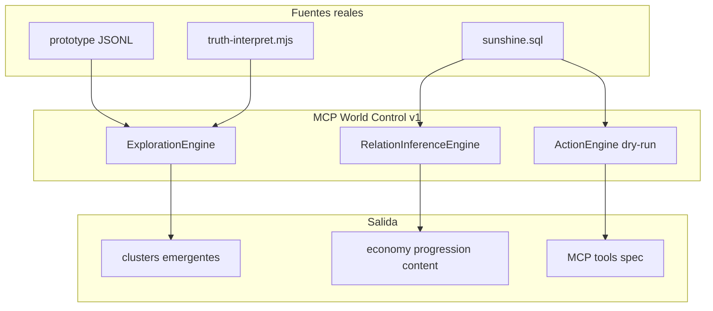

# 16 — MCP World Control v1: Autonomous Design Agent

> **Objetivo.** Diseñar el primer MCP funcional de **consulta e inferencia del mundo del juego**
> (NPC, quests, items, economía) derivado exclusivamente de datos reales: grafo prototype +
> `database/sunshine.sql`. Incluye tests reproducibles y evaluación honesta de readiness admin.
>
> **Principio.** Discovery-first — sin queries hardcodeadas en el motor de exploración; inferencia
> desde patrones de relaciones y schema SQL observable.
>
> **Tests:** `cd grafo_emu/prototype/world-control && node run-all.mjs`  
> **Salida JSON:** [`prototype/world-control/last-run.json`](prototype/world-control/last-run.json)

---

## 1. Objetivo y principio fundamental

| Regla | Cumplimiento |
|-------|--------------|
| NO hardcodear preguntas en Exploration Engine | ✔ clustering por componentes + firma de rels |
| NO inventar estructura de DB | ✔ columnas inferidas de `CREATE TABLE` en sunshine.sql |
| NO asumir MCP tools existentes | ✔ diseño nuevo; MCP-2 actual es combate-only |
| TODO derivado de datos reales | ✔ prototype JSONL + dump SQL |

**Pregunta final:** ¿Podemos administrar el servidor sin conocimiento manual del dominio?

**Respuesta: NO** (readiness_score **0.352**). DB schema y planes dry-run son inferibles; grafo world casi ausente; sin write path MCP a MariaDB.

---

## 2. Arquitectura MCP World Control v1



### 2.1 Exploration Engine

Recorre el grafo raw sin queries predefinidas:

1. Construye grafo no dirigido desde todas las aristas.
2. Extrae **componentes conexas** (BFS).
3. Etiqueta cada cluster por **firma de relaciones** (`rel_signature`) + tipos de nodo.
4. Calcula `coherence_score` = pureza de rel dominante − penalización por diversidad de tipos.

Implementación: [`prototype/world-control/discover-clusters.mjs`](prototype/world-control/discover-clusters.mjs)

### 2.2 Relation Inference Engine

Clasifica relaciones por firma (sin listas manuales de quests):

| Firma de rel | Sistema inferido |
|--------------|------------------|
| `SELLS`, `HAS_TYPE` | **economy** |
| `HAS_STEP`, `INVOLVES_NPC`, `REWARDS` | **progression / content** |
| `USES_EFFECT`, `OBSERVED_IN`, `CONTRADICTS` | **combat runtime** |
| `MATCHES`, `EVIDENCES`, `VALIDATED_BY` | **diagnostic epistemic** |

Agregación SQL: suma `KamasReward` por `Quest` desde tabla `quests_steps` (columna inferida del schema).

Implementación: [`prototype/world-control/infer-economy.mjs`](prototype/world-control/infer-economy.mjs), [`relation-completeness.mjs`](prototype/world-control/relation-completeness.mjs)

### 2.3 Action Engine (v1 dry-run)

Valida planes de mutación contra tablas reales **sin escribir** en MariaDB:

| Tabla | Rol |
|-------|-----|
| `npcs` | template NPC |
| `worlds_npcs` | spawn mapa/celda |
| `npcs_items` | tienda |
| `quests` / `quests_steps` / `quests_objectives` | cadena quest |

Paths de mutación existentes hoy: SQL patches (`database/patches/`), Admin API items-only, GM runtime spawn.

Implementación: [`prototype/world-control/action-simulate.mjs`](prototype/world-control/action-simulate.mjs)

---

## 3. Tools MCP v1 propuestas

### 3.1 Read tools

| Tool | Input | Output |
|------|-------|--------|
| `discover_clusters(scope?)` | optional seed prefix | TEST 1 JSON |
| `get_entity_neighborhood(seed_id, max_depth)` | node id | subgraph + truth_priority_rank |
| `infer_system_map()` | — | economy / progression / content labels |

### 3.2 Inference tools

| Tool | Input | Output |
|------|-------|--------|
| `find_reward_anomalies()` | — | quests/steps sin kamas ni items |
| `find_orphan_entities(type)` | npc \| item \| quest | lista orphans grafo + SQL |
| `compare_graph_db(entity_type)` | quest \| npc \| item | coverage_ratio |

### 3.3 Action tools (dry-run v1)

| Tool | Input | Output |
|------|-------|--------|
| `plan_npc_create({name, map, cell, shop_items[]})` | NPC + spawn + shop | mutation_plan + rollback SQL |
| `plan_quest_create({name, steps[]})` | quest metadata | mutation_plan |
| `plan_reward_link({quest_step_id, item_id, kamas})` | FK fields | validation errors |

Todas retornan **mutation plan** — no ejecutan SQL (v2 requeriría gate + confirmación).

---

## 4. Descubrimientos del sistema

### 4.1 Clusters emergentes (prototype, TEST 1)

| cluster | label | nodos | aristas | game_system |
|---------|-------|-------|---------|-------------|
| cluster:1 | combat_runtime_spell | 25 | 34 | combate + cadena epistémica L5 |
| cluster:2 | economy_catalog | 3 | 2 | NPC shop + item type |
| cluster:3 | quest_progression | 9 | 8 | quest:3 steps + NPCs |

**Map/spawn clusters:** 0 (sin nodos Map, WorldNpcSpawn, Monster en prototype).

### 4.2 Economía (DB real, TEST 2)

Top quest por kamas (suma `quests_steps.KamasReward`):

| quest_id | nombre | kamas total |
|----------|--------|-------------|
| 550 | On recherche Fuji Givrefoux. | 410000 |
| 551 | On recherche Dremoan. | 410000 |
| 552 | On recherche Flasho. | 410000 |

**Cross-check quest:3:** DB total kamas = **4250**; grafo manual (steps 4+32) = 500+3750 = **4250** ✔

**Grafo vs DB:** 1/619 quests en grafo (coverage **0.0016**). `npcs_items` en DB: **6721** filas; grafo: 1 edge SELLS.

### 4.3 Anomalías estructurales (TEST 3)

**Grafo:** `item:288` ref-only, `itemtype:16` client-side, quest steps 2/4 sin reward/NPC link.

**DB:** 196 NPCs template sin fila en `worlds_npcs` (1210 templates, 1255 spawns).

**Coverage grafo/catalog:** **0.0007** (7 entidades world vs ~8481 catalog rows).

### 4.4 Action simulation (TEST 4)

Plan ficticio NPC 99999 + quest 99999: **integrity_valid: true** — schema checks OK, item 12116 existe en `items`, rollback SQL generado. Grafo JSONL no reflejaría la mutación (requiere F1 ingestion).

---

## 5. Testing report (resultados reales)

Ejecutado: `2026-06-22` — salida completa en [`last-run.json`](prototype/world-control/last-run.json)

### TEST 1 — Graph Discovery

```json
{
  "cluster_count": 3,
  "global_coherence_score": 0.247,
  "map_spawn_clusters": 0
}
```

### TEST 2 — Economy Inference

```json
{
  "top_quest_kamas": 410000,
  "quest_3_db_vs_graph_kamas": 4250,
  "graph_quest_coverage": 0.0016,
  "npc_shop_in_db_count": 6721,
  "economy_inference_consistent": true
}
```

### TEST 3 — Relation Completeness

```json
{
  "graph_anomaly_count": 4,
  "npcs_without_world_spawn": 196,
  "coverage_score": 0.0007
}
```

### TEST 4 — Action Simulation

```json
{
  "dry_run": true,
  "integrity_valid": true,
  "structural_errors": []
}
```

### TEST 5 — MCP Readiness

```json
{
  "readiness_score": 0.352,
  "can_discover_systems": true,
  "can_generate_admin_actions": true,
  "can_mutate_world_safely": false,
  "admin_without_manual_domain_knowledge": false,
  "blocking_gaps": [
    "F1 ingestion not built — world graph absent beyond vertical slice",
    "prototype truth_coverage_minimal 0.182",
    "no MCP write path to MariaDB",
    "Admin API items-only (no NPC/quest CRUD HTTP)",
    "quest/npc/item domains LOW_TRUTH_COVERAGE in graph",
    "map/spawn/monster nodes NOT PRESENT in prototype",
    "graph catalog coverage 0.0007 vs DB"
  ]
}
```

---

## 6. Evaluación final

| Capacidad | Estado | Evidencia |
|-----------|--------|-----------|
| Descubrir sistemas del juego | **Parcial** | 3 clusters en prototype; DB economy inferida |
| Responder preguntas complejas sin queries fijas | **No** | grafo world ~0.07% del catálogo |
| Proponer acciones admin | **Parcial** | dry-run plans válidos |
| Mutar mundo con seguridad | **No** | sin MCP write, sin F1 sync grafo |
| Admin sin conocimiento manual | **NO** | readiness 0.352 |

### Distancia a admin real del servidor

| Capa | Gap |
|------|-----|
| **Grafo** | F1 no construido; prototype = vertical slice combate + 1 quest |
| **Truth** | quest/npc/item 100% DERIVED ([`15-qsg-gate-audit.md`](15-qsg-gate-audit.md)) |
| **MCP** | MCP-2 no toca MariaDB; World Control v1 es diseño + scripts locales |
| **Write** | Items Admin API OK; NPC/quest/map = SQL manual o GM runtime |
| **Maps/spawns** | 0 nodos Map/Spawn en grafo; inferencia solo vía SQL |

### Recomendación de secuencia (sin implementar aquí)

1. F1 — ingest L1 world desde sunshine.sql → `graph.sqlite`
2. GTL materializado por dominio (quest, npc, economy)
3. MCP World Control v2 — action tools con confirm gate + VPS apply script
4. Sync grafo post-mutación

---

## 7. Restricciones cumplidas

- [x] Sin queries hardcodeadas en Exploration Engine
- [x] Sin estructura DB inventada
- [x] Sin modificar `nodes.jsonl` / `edges.jsonl` / `traverse.mjs`
- [x] TEST 4 dry-run only
- [x] 5 tests reproducibles via `run-all.mjs`

---

*Anterior: [15-qsg-gate-audit.md](15-qsg-gate-audit.md) · Scripts: [`prototype/world-control/`](prototype/world-control/)*
