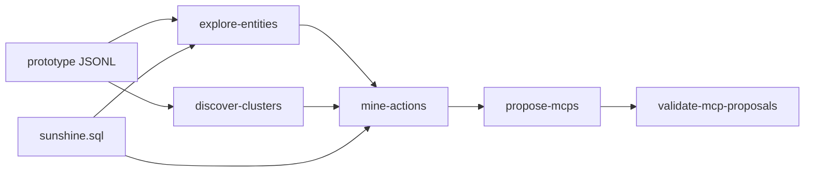

# 17 — Action Discovery Layer: MCP World Mining v1

> **Objetivo.** Extender MCP World Control v1 (doc 16) con una capa de **Action Mining**:
> descubrir acciones de administración del mundo desde patrones observables en grafo + SQL,
> agruparlas en MCPs emergentes (no diseñados a mano) y validarlas con tests reproducibles.
>
> **Principio.** Las acciones se **descubren** cuando un patrón aparece en datos reales;
> los MCPs se **proponen** agrupando acciones por `system_type` y capacidad write/read.
>
> **Pipeline:** `cd grafo_emu/prototype/world-control && node run-mining.mjs`  
> **Salida JSON:** [`prototype/world-control/mining-last-run.json`](prototype/world-control/mining-last-run.json)

---

## §0 — Fuentes de verdad

| Fuente | Ruta | Rol |
|--------|------|-----|
| Grafo prototype | `grafo_emu/prototype/nodes.jsonl` + `edges.jsonl` | 37 nodos, 44 aristas (vertical slice L1–L5) |
| Base de datos | `database/sunshine.sql` | Schema + INSERTs inferidos vía `parseTableColumns` / `parseTableInserts` |
| Truth runtime | `prototype/truth-interpret.mjs` | `truth_state` derivado (no persistente) |
| Clusters previos | `discover-clusters.mjs` (doc 16) | Reutilizado en §2 |

### Entidades NOT PRESENT en grafo

Detectadas por `explore-entities.mjs` — presentes en SQL pero **sin nodos** en prototype:

| Entidad | En grafo | En SQL |
|---------|----------|--------|
| Map | ✗ | `worlds_npcs.Map` (1255 spawns) |
| Spawn | ✗ | `worlds_npcs` |
| Monster | ✗ | (no ingerido) |
| WorldMap | ✗ | (no ingerido) |

```json
{
  "not_present_in_graph": ["Map", "Spawn", "Monster", "WorldMap"],
  "cross_source_entities": {
    "npc": { "graph": 3, "sql": 1210 },
    "quest": { "graph": 1, "sql": 619 },
    "item": { "graph": 2, "sql": 6652 },
    "spell": { "graph": 2, "sql": 2588 }
  }
}
```

**Regla:** ninguna entidad inventada — acciones SQL-only marcadas `graph_evidence: false`.

---

## §1 — Fase exploración

`explore-entities.mjs` inventaría entidades, relaciones e **operaciones implícitas** observadas.

### Entidades por tipo (grafo)

| Tipo | Count | Dominio |
|------|-------|---------|
| Spell / SpellLevel / Effect | 9 | combate |
| Npc / Item / Quest / QuestStep | 11 | mundo |
| Finding / Bug / TestCase / … | 17 | epistémico L5 |

### Relaciones world-relevantes

| Rel | Count | Implica |
|-----|-------|---------|
| `SELLS` | 1 | mutación tienda NPC |
| `HAS_TYPE` | 1 | catálogo items |
| `HAS_STEP` | 5 | flujo quest |
| `REWARDS` | 1 | recompensas |
| `INVOLVES_NPC` | 2 | NPC en objetivos |
| `USES_EFFECT` + `OBSERVED_IN` | 3 + 2 | inspección runtime spell |

### Operaciones implícitas observadas

```json
[
  { "pattern": "NPC→SELLS→ITEM", "rel": "SELLS", "count": 1, "implies": "shop price mutation via npcs_items" },
  { "pattern": "QUEST→HAS_STEP", "rel": "HAS_STEP", "count": 5, "implies": "quest flow authoring" },
  { "pattern": "SPELL→USES_EFFECT + OBSERVED_IN", "implies": "runtime spell inspection" },
  { "pattern": "SQL worlds_npcs(Npc,Map,Cell)", "sql_only": true, "row_count": 1255, "implies": "NPC world spawn placement" }
]
```

### Conteos SQL (tablas clave)

| Tabla | Rows | Columnas clave |
|-------|------|----------------|
| `npcs_items` | 6721 | NpcId, Item, Price |
| `worlds_npcs` | 1255 | Npc, Map, Cell, Direction |
| `quests_steps` | 1009 | KamasReward, ItemsRewardCSV |
| `quests_objectives` | 3385 | Step, Type, ParametersCSV |
| `items` | 6652 | TypeId |

---

## §2 — System clusters

Reutiliza `discover-clusters.mjs` + enriquecimiento de contexto mining.

```json
{
  "cluster_count": 3,
  "global_coherence": 0.247,
  "map_spawn_clusters": 0,
  "clusters": [
    {
      "cluster_id": "cluster:1",
      "label": "combat_runtime_spell",
      "node_count": 25,
      "edge_count": 34,
      "coherence_score": 0.125,
      "seed_nodes": ["spell:189", "spell:196"]
    },
    {
      "cluster_id": "cluster:2",
      "label": "economy_catalog",
      "node_count": 3,
      "edge_count": 2,
      "rel_signature": { "SELLS": 1, "HAS_TYPE": 1 },
      "coherence_score": 0.575,
      "seed_nodes": ["item:12116", "npc:1053"]
    },
    {
      "cluster_id": "cluster:3",
      "label": "quest_progression",
      "node_count": 9,
      "edge_count": 8,
      "rel_signature": { "HAS_STEP": 5, "REWARDS": 1, "INVOLVES_NPC": 2 },
      "coherence_score": 0.681,
      "seed_nodes": ["quest:3", "npc:449", "npc:488"]
    }
  ]
}
```

**Interpretación:** 3 clusters funcionales (combat, economy, quest); **0** clusters map/spawn — coherente con entidades NOT PRESENT.

---

## §3 — discovered_actions[]

Inferidas por `mine-actions.mjs` desde patrones A–G (grafo y/o SQL).

| Patrón | Path / SQL | action_name | type | confidence |
|--------|------------|-------------|------|------------|
| A | NPC→SELLS→ITEM (e201) | `modify_npc_shop` | write/sim | 0.95 |
| B | QUEST→HAS_STEP→REWARDS/INVOLVES_NPC | `create_quest_flow` | write/sim | 0.95 |
| C | ITEM→HAS_TYPE (e202) | `link_item_catalog` | read | 0.95 |
| D | SQL `worlds_npcs` | `spawn_npc_in_world` | write/sim | 0.70 |
| E | SQL `quests_steps.KamasReward` | `adjust_quest_rewards` | read/write | 0.95 |
| F | USES_EFFECT + OBSERVED_IN | `inspect_spell_runtime` | read | 0.85 |
| G | SQL `npcs_items` (6721 rows) | `audit_npc_economy` | read | 0.95 |

**Resumen mining:**

```json
{
  "action_count": 7,
  "dual_source_actions": 5,
  "sql_only_actions": 1,
  "graph_only_actions": 1
}
```

- **dual_source (5):** grafo + SQL confirman la acción → confidence 0.95
- **sql_only (1):** `spawn_npc_in_world` — sin nodos Map en grafo
- **graph_only (1):** `inspect_spell_runtime` — evidencia LOG, sin tabla SQL equivalente

Ejemplo acción dual-source (patrón A):

```json
{
  "action_name": "modify_npc_shop",
  "pattern": "A",
  "evidence_edges": ["e201"],
  "evidence_sample": [{ "npc": "npc:1053", "item": "item:12116", "price": 9750000 }],
  "required_sources": { "graph": ["SELLS"], "sql": ["npcs_items", "npcs"] }
}
```

---

## §4 — proposed_mcps[] (emergentes)

Agrupación automática en `propose-mcps.mjs` — **no** lista manual de 9 tools como doc 16 §3.



| mcp_name | system_type | actions | admin_power_level | avg_confidence |
|----------|-------------|---------|-------------------|----------------|
| `mcp_world_economy` | economy | modify_npc_shop, adjust_quest_rewards, audit_npc_economy | read + simulate | 0.95 |
| `mcp_world_content` | content | create_quest_flow, spawn_npc_in_world | simulate | 0.825 |
| `mcp_world_catalog` | catalog | link_item_catalog | read | 0.95 |
| `mcp_combat_inspect` | combat | inspect_spell_runtime | read | 0.85 |

```json
{
  "mcp_count": 4,
  "proposed_mcps": [
    {
      "mcp_name": "mcp_world_economy",
      "system_type": "economy",
      "admin_power_level": "read + simulate",
      "action_count": 3,
      "emergent": true,
      "note": "Grouped automatically from mine-actions patterns — not hand-designed tool list"
    },
    {
      "mcp_name": "mcp_world_content",
      "system_type": "content",
      "admin_power_level": "simulate",
      "action_count": 2,
      "actions": [
        { "action_name": "spawn_npc_in_world", "graph_evidence": false, "sql_evidence": true, "confidence": 0.7 }
      ]
    },
    {
      "mcp_name": "mcp_world_catalog",
      "system_type": "catalog",
      "admin_power_level": "read",
      "action_count": 1
    },
    {
      "mcp_name": "mcp_combat_inspect",
      "system_type": "combat",
      "admin_power_level": "read",
      "action_count": 1
    }
  ]
}
```

Solo se emiten MCPs cuyas acciones tienen evidencia en al menos una fuente.

---

## §5 — Tests por MCP propuesto

`validate-mcp-proposals.mjs` ejecuta TEST 1–4 por cada MCP.

| Test | Qué valida |
|------|------------|
| **TEST 1 Graph** | edges/nodos referenciados existen en prototype |
| **TEST 2 SQL** | tablas/columnas de `required_sources` en sunshine.sql |
| **TEST 3 Simulation** | dry-run vía lógica `action-simulate.mjs` (actions write/sim) |
| **TEST 4 Consistency** | conteos grafo vs SQL (reuse infer-economy / relation-completeness) |

### Resultados agregados

```json
{
  "test_results": {
    "passed": true,
    "failures": [],
    "warnings": [
      "graph SELLS=1 vs DB npcs_items=6721 (coverage 0.0001)",
      "quest graph coverage 0.0016 vs DB",
      "spawn_npc_in_world: no graph evidence (SQL-only pattern)",
      "spawn_npc_in_world: no graph Map nodes",
      "196 DB npcs without world spawn"
    ],
    "coverage": 1
  },
  "mcps_all_passed": true
}
```

### Por MCP

| MCP | passed | coverage | Warnings clave |
|-----|--------|----------|----------------|
| `mcp_world_economy` | ✔ | 1.0 | SELLS grafo vs 6721 rows DB |
| `mcp_world_content` | ✔ | 1.0 | spawn SQL-only; 196 NPCs sin spawn |
| `mcp_world_catalog` | ✔ | 1.0 | — |
| `mcp_combat_inspect` | ✔ | 1.0 | — |

**TEST 3 Simulation** (write actions): schema OK + `integrity_valid: true` para npcs, worlds_npcs, quests, quests_steps — reutiliza mutation plan de doc 16.

---

## §6 — Resumen

| Métrica | Valor |
|---------|-------|
| Clusters detectados | 3 (combat, economy, quest) |
| Map/spawn clusters | 0 |
| discovered_actions | 7 (patrones A–G) |
| proposed_mcps | 4 emergentes |
| dual_source_actions | 5 |
| sql_only_actions | 1 (`spawn_npc_in_world`) |
| test_coverage | 1.0 (tests estructurales pasan) |
| graph_db_coverage | 0.0007 |
| Top quest kamas (DB) | quest 550 — 410,000 kamas |

**Respuesta objetivo:** Admin Agent autónomo **NO** hoy. Acciones **emergentes** validables en dry-run para economía/quest/NPC spawn vía SQL.

**Relación con doc 16:**

| Aspecto | Doc 16 | Doc 17 |
|---------|--------|--------|
| Enfoque | Diseño MCP v1 + 9 tools propuestas | Action Mining → MCPs emergentes |
| Tools | Lista diseñada manualmente | Agrupación automática desde patrones |
| Tests | 5 tests globales | 4 tests × 4 MCPs |
| Write path | dry-run only | dry-run only (sin cambio) |

---

## §7 — Output final

Generado por `run-mining.mjs` el 2026-06-22:

```json
{
  "mcp_discovery_status": "partial",
  "system_understanding": 0.464,
  "admin_potential": 0.35,
  "next_gap_to_close": [
    "F1 ingest maps/spawns into graph",
    "Materialize GTL for quest/npc domains",
    "MCP write path to MariaDB (v2)",
    "Graph coverage 0.0007 → target >0.05"
  ],
  "autonomous_admin_agent": false
}
```

### Scripts del pipeline

| Script | § | Rol |
|--------|---|-----|
| [`explore-entities.mjs`](prototype/world-control/explore-entities.mjs) | 1 | Inventario grafo + SQL |
| [`discover-clusters.mjs`](prototype/world-control/discover-clusters.mjs) | 2 | Clusters (reutilizado) |
| [`mine-actions.mjs`](prototype/world-control/mine-actions.mjs) | 3 | Inferencia patrones A–G |
| [`propose-mcps.mjs`](prototype/world-control/propose-mcps.mjs) | 4 | Agrupación emergente |
| [`validate-mcp-proposals.mjs`](prototype/world-control/validate-mcp-proposals.mjs) | 5 | TEST 1–4 por MCP |
| [`run-mining.mjs`](prototype/world-control/run-mining.mjs) | — | Orquestador → `mining-last-run.json` |

---

## Verificación final

- [x] Informe MD con JSON embebidos §2–§7 (valores de `mining-last-run.json`)
- [x] Sin lista manual de MCP tools — solo MCPs **emergentes** de `propose-mcps.mjs`
- [x] Cada MCP propuesto tiene bloque test_results
- [x] `node run-mining.mjs` ejecutable
- [x] Entidades inventadas = 0 (Map/Spawn marcados NOT PRESENT en grafo, presentes en SQL)
