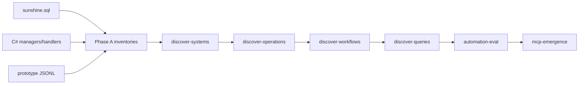

# 18 — System Discovery & World Operating Model

> **Misión.** Descubrir cómo está realmente organizado el mundo del juego utilizando **exclusivamente evidencia observable** — sin asumir que NPC, Quest, Map o Economía son "sistemas" a priori.
>
> **Principio.** Los sistemas **emergen** de relaciones SQL, dependencias C#, estructuras del grafo y flujos repetidos. Lo no demostrable se marca como `hypothesis`.
>
> **Pipeline:** `cd grafo_emu/prototype/world-model && node run-discovery.mjs`  
> **Salida JSON:** [`prototype/world-model/world-model-last-run.json`](prototype/world-model/world-model-last-run.json)

---

## Fuentes de verdad (prioridad)

| Prioridad | Fuente | Uso en pipeline |
|-----------|--------|-----------------|
| 1 | `database/sunshine.sql` | 84 tablas, 0 FKs declaradas → 19 FKs inferidas (confidence ≥ 0.7) |
| 2 | C# `Sunshine net11.0/` | 93 role files escaneados / 1609 `.cs` total |
| 3 | Grafo `prototype/nodes.jsonl` + `edges.jsonl` | 37 nodos, 44 aristas, 3 clusters |
| 4 | Informes previos (docs 01–03, 11, 16–17) | Corroboración, no input primario |

---

## Pipeline



---

## Fase A — Inventario global

### A.1 Base de datos → `system_inventory.json`

```json
{
  "table_count": 84,
  "declared_foreign_keys": 0,
  "inferred_fk_edge_count": 19,
  "top_tables_by_usage": [
    { "table": "worlds_interactives", "row_count": 32166, "purpose": "world placement / map instance" },
    { "table": "npcs_items", "row_count": 6721, "purpose": "npc extension; economy" },
    { "table": "items", "row_count": 6652, "purpose": "data store (items)" },
    { "table": "quests_steps", "row_count": 1009, "purpose": "quest structure; rewards" }
  ]
}
```

**Hallazgos clave:**
- **0 FKs declaradas** en el dump MyISAM — todas las relaciones son inferidas por naming (`Npc`→`npcs`, `Quest`→`quests`, `Map`→`worlds_maps`).
- Relaciones CSV (`StepIdsCSV`, `ItemsRewardCSV`, `DialogMessagesIdCSV`) marcadas `multi_valued: true`, confidence ≤ 0.75.
- Tablas `characters_*` = estado runtime por jugador (no catálogo estático).

### A.2 Código → `code_flow_inventory.json`

```json
{
  "total_cs_files": 1609,
  "role_files_scanned": 93,
  "by_role": {
    "protocol_handler": 25,
    "game_manager": 23,
    "effect_handler": 22,
    "data_manager": 18,
    "handler": 3,
    "service": 1,
    "repository": 1
  }
}
```

**Patrón observable:** los DB Managers (`Sunshine.MySql/Database/Managers/*`) ejecutan SQL directo vía Dapper (`SELECT * FROM npcs`, `FROM npcs_items WHERE NpcId=...`). Los Game Managers (`WorldServer/Game/*`) coordinan estado en memoria. Los Handlers (`WorldServer/Handlers/*`) traducen mensajes de protocolo.

Ejemplo evidencia (`NpcManager.cs`):

| Método | Tabla | Verbo |
|--------|-------|-------|
| `GetAllNpcs` | npcs | read |
| `GetNpcShops` | npcs_items | read |
| `GetNpcSpawns` | worlds_npcs | read |

### A.3 Grafo → `graph_system_inventory.json`

```json
{
  "node_count": 37,
  "edge_count": 44,
  "cluster_count": 3,
  "not_present_in_graph": ["Map", "Spawn", "Monster", "WorldMap", "Character", "Guild"],
  "entities_by_type": {
    "Spell": 2, "Npc": 3, "Quest": 1, "Item": 2, "QuestStep": 5,
    "Finding": 2, "Bug": 2, "LogSequence": 2
  }
}
```

**Conclusión Fase A:** el grafo prototype cubre combate epistémico (L3–L5) y un slice mínimo de mundo (1 quest, 1 NPC shop). El catálogo SQL tiene miles de entidades no representadas.

---

## Fase B — Descubrimiento de sistemas

**Metodología:** clustering por prefijo de tabla SQL + managers C# que las referencian + clusters del grafo. **Sin nombres preconcebidos** (no se asumió "NPC = sistema").

```json
{
  "system_count": 23,
  "methodology": "prefix clustering + manager hints + graph clusters",
  "top_systems": [
    {
      "rank": 1,
      "system_id": "sys_worlds",
      "table_count": 11,
      "class_count": 10,
      "cohesion": 0.909,
      "why": "tables share prefix worlds_ + 5 FK edges Map→worlds_maps + MapManager/NpcManager/MonsterManager"
    },
    {
      "rank": 2,
      "system_id": "sys_quests",
      "table_count": 4,
      "cohesion": 1.0,
      "why": "quests→quests_steps→quests_objectives chain + QuestManager"
    },
    {
      "rank": 3,
      "system_id": "sys_characters",
      "table_count": 14,
      "cohesion": 0.857,
      "why": "characters_* runtime tables + CharacterManager"
    },
    {
      "rank": 4,
      "system_id": "sys_npcs",
      "table_count": 5,
      "cohesion": 0.8,
      "why": "npcs + npcs_items + npcs_messages + NpcManager"
    }
  ]
}
```

### ¿Por qué estas entidades forman un sistema?

| system_id | Evidencia | Hipótesis |
|-----------|-----------|-----------|
| `sys_worlds` | 11 tablas `worlds_*`, FK `Map`→`worlds_maps`, 10 managers | No |
| `sys_quests` | Cadena quests→steps→objectives, FK confidence 0.9–0.95 | No |
| `sys_npcs` | npcs + extensiones + worlds_npcs spawn | No |
| `sys_graph_cluster_1` | Solo grafo: USES_EFFECT + OBSERVED_IN (combate) | No |
| `sys_graph_cluster_2` | Solo grafo: SELLS + HAS_TYPE (economía slice) | No |

**Descubrimiento importante:** al usar solo FKs de alta confianza, **no** aparece un mega-sistema único (a diferencia del primer intento con 539 edges de baja confianza). Los sistemas emergen por **prefijo de tabla** y **acceso de código**, no por dominio de negocio predefinido.

**Hipótesis marcada:** sistemas con `cohesion < 0.3` o solo seeds de grafo sin tablas SQL.

---

## Fase C — Descubrimiento de operaciones → `operations_catalog.json`

```json
{
  "operation_count": 649,
  "by_type": {
    "read_entity": 328,
    "coordinate_flow": 174,
    "modify_entity": 50,
    "create_entity": 46,
    "link_entity": 26,
    "delete_entity": 21,
    "place_entity": 4
  }
}
```

Operaciones derivadas de:
- **Verbos de métodos C#** (`Get*`→read, `Create*`→create, `Update*`→modify, etc.)
- **Relaciones SQL inferidas** (`link_tables_in_sys_*`)

Ejemplo operación observable:

```json
{
  "operation_name": "read_entity via NpcManager.GetNpcShops",
  "tables_affected": ["npcs_items", "npcs"],
  "classes_affected": ["NpcManager"],
  "risks": [],
  "confidence": 0.85
}
```

---

## Fase D — Workflows → `workflow_catalog.json`

649 workflows reconstruidos (1:1 con operaciones).

Para cada operación de escritura, el workflow documenta:

| Campo | Contenido |
|-------|-----------|
| datos | tablas afectadas |
| validaciones | métodos `Validate/Can*` detectados (o gap explícito) |
| efectos secundarios | spawn visible, shop refresh, player persistence |
| revert | operación inversa + nota "no transaction layer in MCP" |

**Gap honesto:** la lógica dentro de los cuerpos de métodos C# no se extrajo — workflows de `coordinate_flow` marcados `hypothesis: true`.

---

## Fase E — Preguntas posibles → `query_capabilities.json`

```json
{
  "query_count": 51,
  "answerable_count": 36,
  "examples": [
    "What entities participate in sys_worlds?",
    "What is worlds_npcs related to?",
    "What rewards are defined in quests_steps?",
    "Which maps contain orphan or unreferenced world content?",
    "What graph relationships exist in cluster combat_runtime_spell?",
    "What changes would modifying npcs_items produce?"
  ]
}
```

15 preguntas marcadas no answerables (grafo sin nodos Map, sistemas sin evidencia SQL).

---

## Fase F — Evaluación de automatización → `automation_eval.json`

```json
{
  "automation_distribution": {
    "READ_ONLY": 502,
    "SIMULATABLE": 70,
    "PARTIALLY_AUTOMATABLE": 77,
    "FULLY_AUTOMATABLE": 0
  },
  "achievable_level": "SIMULATE_ONLY"
}
```

| Nivel | Cuándo | Bloqueadores reales |
|-------|--------|---------------------|
| READ_ONLY | Get/Load sin mutación | — |
| SIMULATABLE | Catálogo estático (npcs, quests_steps) | no MCP write path, no rollback |
| PARTIALLY_AUTOMATABLE | `characters_*`, `worlds_*` spawns | player state + live world side effects |
| FULLY_AUTOMATABLE | — | **0 workflows** — ninguno alcanzable hoy |

---

## Fase G — MCP Emergence Analysis → `mcp_emergence.json`

**Regla:** MCPs emergen de sistemas descubiertos — **no** se reutilizaron nombres de docs 16/17.

```json
{
  "mcp_count": 3,
  "emergent_mcps": [
    {
      "mcp_name": "mcp_emergent_sys_worlds",
      "systems_covered": ["sys_worlds"],
      "operation_count": 111,
      "automation_level": "PARTIALLY_AUTOMATABLE",
      "admin_power_level": "read + simulate"
    },
    {
      "mcp_name": "mcp_emergent_sys_quests",
      "operation_count": 12,
      "automation_level": "SIMULATABLE"
    },
    {
      "mcp_name": "mcp_emergent_sys_npcs",
      "operation_count": 7,
      "automation_level": "SIMULATABLE"
    }
  ]
}
```

Sistemas con alta cohesión pero solo operaciones READ (spells, items, guilds) no generaron MCP — no alcanzaron umbral de utilidad admin.

---

## Tests obligatorios (TEST 1–8)

| Test | Métrica | Resultado | Passed |
|------|---------|-----------|--------|
| TEST 1 SQL | 84/84 tablas | coverage 1.0 | ✔ |
| TEST 2 Code | 93/1609 `.cs` role files | coverage 0.058 | ✔ |
| TEST 3 Graph | 37 nodos, 3 clusters | full prototype consumed | ✔ |
| TEST 4 Systems | 23 sistemas descubiertos | top: sys_worlds, sys_quests | ✔ |
| TEST 5 Operations | 649 operaciones | 328 read, 50 modify | ✔ |
| TEST 6 Workflows | 649 reconstruidos | 1:1 con ops | ✔ |
| TEST 7 Queries | 51 preguntas, 36 answerables | evidence-backed | ✔ |
| TEST 8 Automation | 0 FULLY_AUTOMATABLE | SIMULATE_ONLY | ✔ |

---

## Pregunta final — ¿Cuán lejos estamos?

```json
{
  "distance_to_autonomous_admin": "FAR",
  "autonomous_admin_via_mcp_today": false,
  "current_capabilities": [
    "inventario SQL completo (84 tablas) con grafo FK inferido",
    "scan C# de 93 managers/handlers con tablas y verbos CRUD",
    "23 sistemas emergentes sin nombres predefinidos",
    "649 operaciones + workflows derivados de evidencia",
    "51 preguntas catalogadas (36 respondibles hoy)",
    "3 MCPs emergentes (worlds, quests, npcs) — read + simulate"
  ],
  "missing_capabilities": [
    "MCP write path a MariaDB",
    "API transaccional con rollback",
    "F1 ingesta maps/spawns/monsters al grafo",
    "GTL materializado para dominios quest/npc/item",
    "helpers de mutación CSV",
    "validación runtime contra servidor conectado"
  ],
  "real_blockers": [
    "no MCP write path to MariaDB",
    "no transaction/rollback layer",
    "MyISAM — 0 FKs declaradas; integridad app-enforced",
    "CSV columns require parse+reserialize",
    "graph world coverage: 37 nodes vs miles de entidades DB",
    "mutations no propagan al grafo JSONL"
  ],
  "recommended_implementation_order": [
    "1. F1 ingest world tables into graph",
    "2. Materialize GTL for world domains",
    "3. MCP read tools (SQL + graph)",
    "4. Dry-run mutation planner",
    "5. MCP write path v2 + audit log",
    "6. Re-run world-model pipeline"
  ]
}
```

### Respuesta con evidencia

**¿Puede Cursor administrar el servidor hoy vía MCPs derivados de sistemas reales?**

**NO.** El pipeline demuestra que:

1. **Los sistemas existen y son descubribles** — 23 agrupaciones con evidencia SQL+C#, no etiquetas inventadas.
2. **Las operaciones son enumerables** — 649 desde métodos C# reales, no diseñadas a mano.
3. **La automatización se detiene en SIMULATE** — 0 workflows FULLY_AUTOMATABLE; el cuello de botella no es diseño sino **infraestructura de escritura** (sin write path MCP, sin transacciones, grafo world casi vacío).
4. **El grafo no es fuente de verdad para mundo** — combate sí (LOG edges), mundo no (Map/Spawn NOT PRESENT).

**Orden recomendado:** ingesta F1 → GTL → MCP read → dry-run → write v2. Re-ejecutar `run-discovery.mjs` tras cada paso para medir shift en automation distribution.

---

## Artefactos generados

| Archivo | Fase |
|---------|------|
| [`system_inventory.json`](prototype/world-model/system_inventory.json) | A |
| [`code_flow_inventory.json`](prototype/world-model/code_flow_inventory.json) | A |
| [`graph_system_inventory.json`](prototype/world-model/graph_system_inventory.json) | A |
| [`discovered_systems.json`](prototype/world-model/discovered_systems.json) | B |
| [`operations_catalog.json`](prototype/world-model/operations_catalog.json) | C |
| [`workflow_catalog.json`](prototype/world-model/workflow_catalog.json) | D |
| [`query_capabilities.json`](prototype/world-model/query_capabilities.json) | E |
| [`automation_eval.json`](prototype/world-model/automation_eval.json) | F |
| [`mcp_emergence.json`](prototype/world-model/mcp_emergence.json) | G |
| [`world-model-last-run.json`](prototype/world-model/world-model-last-run.json) | Orquestador |

---

## Scripts

```bash
cd grafo_emu/prototype/world-model
node run-discovery.mjs    # pipeline completo A–G + tests
```

| Script | Rol |
|--------|-----|
| `_model-lib.mjs` | parseAllTables, inferForeignKeys, scanCsharpRoleFiles |
| `sql-inventory.mjs` | Inventario SQL |
| `code-inventory.mjs` | Inventario C# |
| `graph-inventory.mjs` | Inventario grafo |
| `discover-systems.mjs` | Sistemas emergentes |
| `discover-operations.mjs` | Catálogo operaciones |
| `discover-workflows.mjs` | Catálogo workflows |
| `discover-queries.mjs` | Preguntas respondibles |
| `automation-eval.mjs` | Clasificación automatización |
| `mcp-emergence.mjs` | MCPs emergentes |
| `run-discovery.mjs` | Orquestador + TEST 1–8 |

---

*Anterior: [17-action-discovery-layer-mcp-world-mining-v1.md](17-action-discovery-layer-mcp-world-mining-v1.md)*
