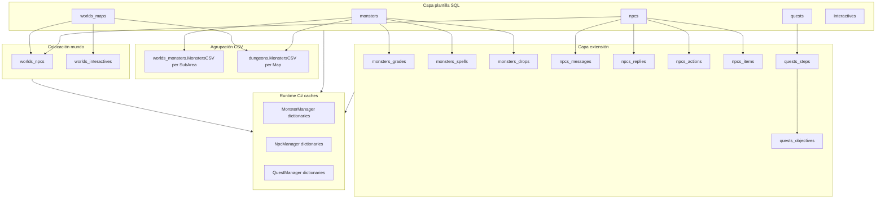

# 19 — World Semantic Model (Phase 19)

> **Misión.** Descubrir cómo piensa el emulador al construir contenido del mundo — **conceptos**, no tablas.
>
> **Pregunta central:** ¿Cómo piensa el emulador cuando construye contenido del mundo?
>
> **Pipeline:** `cd grafo_emu/prototype/world-semantic && node run-semantic.mjs`  
> **Salida JSON:** [`prototype/world-semantic/world-semantic-last-run.json`](prototype/world-semantic/world-semantic-last-run.json)

**Prioridad de fuentes:** SQL > Código > Grafo > Informes. No se repite inventario CRUD de Fase 18.

---

## Modelo mental del emulador (evidencia)



**Conclusión central:** el emulador no piensa en "una fila = una entidad jugable". Piensa en **plantilla + extensiones + agrupación CSV + spawn + caché en memoria**.

---

## Fase A — World Concept Discovery

15 conceptos emergentes (`world_concepts.json`). Sin etiquetas predefinidas.

| concept_id | confidence | hypothesis | Evidencia clave |
|------------|------------|------------|-----------------|
| `creature_template` | 0.80 | no | monsters + grades + spells + drops; MonsterManager caches |
| `monster_group` | 0.80 | no | worlds_monsters.MonstersCSV/SubArea; dungeons.MonstersCSV |
| `dungeon` | 0.80 | no | dungeons(Map, MonstersCSV, Parameters) |
| `place_instance` | 0.80 | no | worlds_maps + spawns (npc/monster/interactive) |
| `npc_identity` | 0.95 | no | npcs template; graph npc:1053 |
| `npc_dialogue` | 0.80 | no | npcs_messages + npcs_replies |
| `merchant` | 0.95 | no | npcs_actions Shop + npcs_items; graph SELLS e201 |
| `quest_chain` | 0.95 | no | quests→steps→objectives; graph HAS_STEP |
| `quest_giver` | 0.80 | **sí** | rol emergente vía quests_objectives ParametersCSV |
| `interactive_object` | 0.80 | no | interactives + worlds_interactives |
| `teleporter` | 0.60 | **sí** | teleports_* + worlds_zaapis |
| `local_economy` | 0.80 | no | npcs_items prices + quest rewards |
| `player_progress` | 0.80 | no | characters_quests_* runtime |
| `sub_area` | 0.60 | **sí** | worlds_monsters.SubArea — nombres de zona no en BD |
| `combat_runtime` | 0.60 | no | graph LOG cluster; spells SQL template |

```json
{
  "concept_count": 15,
  "hypothesis_count": 3,
  "methodology": "emergent from SQL composites, CSV grouping, manager caches, graph clusters"
}
```

---

## Fase B — World Entity Decomposition

### NPC (no es una fila — es un composite)

| Componente | Tablas | Clases | Relación |
|------------|--------|--------|----------|
| identidad | `npcs` | NpcManager | Id, Name, EntityLook, ActionsIdCSV |
| diálogo | `npcs_messages`, `npcs_replies` | NpcManager | DialogMessagesIdCSV → messages; replies por Map |
| acciones tipadas | `npcs_actions` | NpcManager | Type=Shop, Parameters=item |
| tienda | `npcs_items` | NpcManager, InventoryHandler | NpcId, Item, Price |
| spawn mundo | `worlds_npcs` | NpcManager, MapManager | Npc, Map, Cell, Direction |
| rol quest | `quests_objectives` | QuestManager | ParametersCSV contiene npc id |

### Quest

| Componente | Tablas | Evidencia |
|------------|--------|-----------|
| cabecera | `quests` | StepIdsCSV lista steps |
| pasos | `quests_steps` | KamasReward, ItemsRewardCSV, ObjectiveIdsCSV |
| objetivos | `quests_objectives` | Step, Type, ParametersCSV |
| progreso jugador | `characters_quests*` | separado del template |

### Monster

| Componente | Tablas | C# cache |
|------------|--------|----------|
| plantilla | `monsters` | MonsterManager.Monsters |
| grados/stats | `monsters_grades` | MonsterManager.MonstersGrade |
| hechizos | `monsters_spells` | MonsterManager.MonsterSpells |
| drops | `monsters_drops` | MonsterManager.MonsterDropsCache |

### Monster Group

| Contexto | Definición | Evidencia |
|----------|------------|-----------|
| mundo abierto | `worlds_monsters` | MonstersCSV + SubArea |
| mazmorra | `dungeons` | MonstersCSV por Map (sala) |

### Map / Place

| Componente | Tablas |
|------------|--------|
| topología | `worlds_maps` (vecinos, SubAreaId) |
| posición mundo | `worlds_maps_positions` |
| instancias | `world_maps_house`, `world_maps_paddock`, etc. |

### Dungeon

```json
{
  "entity": "dungeon_room",
  "components": {
    "entry_map": "dungeons.Map",
    "monster_wave": "dungeons.MonstersCSV",
    "exit": "dungeons.Parameters (map,cell,direction CSV)"
  },
  "evidence": "sunshine.sql dungeons INSERT e.g. Map=23857152, MonstersCSV='970,974,...', Parameters='23858176,422,7'"
}
```

### Merchant (rol emergente)

No existe tabla `merchants`. Emerge de `npcs_actions.Type='Shop'` + `npcs_items`.

### Interactive / Resource

`interactives` (template) + `interactives_skills` + `jobs_harvest` + `worlds_interactives` (Map, Cell).

---

## Fase C — Content Creation Reverse Engineering

### ¿Cómo nace un NPC?

```json
{
  "entity_type": "npc",
  "required_tables": ["npcs", "npcs_messages", "npcs_replies", "npcs_actions", "npcs_items", "worlds_npcs"],
  "required_data": {
    "npcs": "Id, Name, EntityLook, DialogMessagesIdCSV, ActionsIdCSV",
    "worlds_npcs": "Npc, Map, Cell, Direction"
  },
  "dependencies": ["items.Id for shop", "worlds_maps.Id for spawn map"],
  "validation_points": ["NpcManager.GetNpc", "spawn map exists"],
  "failure_modes": ["npc without spawn (196 in DB)", "shop item not in items (4502 rows)"]
}
```

### ¿Cómo nace una quest?

```json
{
  "entity_type": "quest",
  "required_tables": ["quests", "quests_steps", "quests_objectives"],
  "required_data": {
    "quests": "Id, Name, StepIdsCSV",
    "quests_steps": "rewards CSV, ObjectiveIdsCSV",
    "quests_objectives": "Type, ParametersCSV (npc/map refs)"
  },
  "dependencies": ["npcs for objective type 1/3", "items for ItemsRewardCSV"],
  "validation_points": ["QuestManager.GetAllStepsByQuestId"],
  "failure_modes": ["step without objectives", "reward item orphan (51 steps)"]
}
```

### ¿Cómo nace un spawn?

Orden observable: `npcs` template → `worlds_npcs` row (Npc, Map, Cell).

### ¿Cómo nace un grupo de monstruos?

`worlds_monsters` row: MonstersCSV + SubArea. No hay tabla `monster_groups`.

### ¿Cómo nace una mazmorra?

Cadena `dungeons`: cada fila = sala con Map + oleada MonstersCSV + Parameters (siguiente sala).

### ¿Cómo nace un mapa funcional?

`worlds_maps` + spawns (`worlds_npcs`, `worlds_monsters`, `worlds_interactives`) + triggers opcionales.

### ¿Cómo nace una economía local?

`npcs_items` (precios) + opcional `npcs_actions` Shop. Sin tabla economía global.

---

## Fase D — Content Modification Model

### Modificar NPC

```json
{
  "modification": "modify_npc",
  "affected_entities": ["npc_identity", "merchant", "place_instance"],
  "affected_tables": ["npcs", "npcs_items", "npcs_messages", "npcs_replies", "worlds_npcs"],
  "affected_code": ["NpcManager", "MapManager (spawn refresh)", "InventoryHandler (shop UI)"],
  "affected_caches": ["NpcManager in-memory dictionaries at server load"],
  "validation_chain": ["npc exists", "spawn map valid", "shop items in items catalog"],
  "rollback_strategy": ["SQL UPDATE/DELETE manual — no transaction layer in MCP", "server restart to reload caches"]
}
```

### Modificar Quest

Tablas: `quests`, `quests_steps`, `quests_objectives`. Caches: `QuestManager.Quests`, `QuestSteps`, `QuestObjectives`. Riesgo: CSV round-trip en StepIdsCSV.

### Modificar Monster / Boss

Tablas: `monsters`, `monsters_grades`, `monsters_spells`, `monsters_drops` + placement en `dungeons` o `worlds_monsters`. Caches: `MonsterManager.*`.

### Modificar Spawn

Solo `worlds_npcs` — no altera template `npcs`.

### Modificar Dungeon

`dungeons` rows — cascada a monster waves y exit Parameters.

### Modificar Map

`worlds_maps` — afecta todos los spawns que referencian Map id.

---

## Fase E — World Consistency Rules (scans reales)

```json
{
  "rule_count": 11,
  "total_violations": 4749,
  "top_violations": [
    { "rule": "npcs_items.Item must reference items.Id", "count": 4502 },
    { "rule": "Every npc template should have worlds_npcs spawn", "count": 196 },
    { "rule": "quests_steps.ItemsRewardCSV item ids must exist in items", "count": 51 }
  ]
}
```

| rule | violation_count | Interpretación |
|------|-----------------|----------------|
| npc_shop_item_orphan | 4502 | Mayoría de filas npcs_items referencian Item no presente en dump items — posible desync dump o ids legacy |
| npc_without_spawn | 196 | NPCs de catálogo sin presencia en mundo |
| quest_reward_item_orphan | 51 | Recompensas de quest apuntan a items inexistentes |
| spawn_orphan_npc | 0 | Todos los spawns referencian npc válido |
| dungeon_monster_orphan | 0 | MonstersCSV de dungeons consistente |

---

## Fase F — Semantic Question Benchmark

**Resultado:** 0 fully_answerable, **10 partially_answerable**, 0 not_answerable.

Todas las preguntas tienen tablas SQL evidenciadas; clasificación `partially` porque el grafo prototype tiene 37 nodos (world semantics = SQL-primary).

| Pregunta | answerability | Blocker principal |
|----------|---------------|-------------------|
| ¿Qué define una mazmorra? | partial | grafo sin nodos Map |
| ¿Qué NPC inicia esta quest? | partial | quest giver = rol inferido de objective CSV |
| ¿Qué mapas participan en quest? | partial | map solo vía objective type / spawn NPC |
| ¿Qué monstruos en esta zona? | partial | zona = SubArea, no mapa |
| ¿Qué depende de este NPC? | partial | SQL ok, grafo mínimo |
| ¿Crear nueva quest? | partial | no write path MCP |
| ¿Crear nueva mazmorra? | partial | dungeons + CSV |
| ¿Crear nuevo comerciante? | partial | npcs + shop + spawn |
| ¿Crear nuevo boss? | partial | monster composite + placement |
| ¿Crear nueva zona? | partial | nombres zona no en BD servidor |

---

## Fase G — World Autonomy Gap

```json
{
  "explore_world": { "level": "partial", "blocker": "graph world coverage minimal" },
  "understand_world": { "level": "low", "blocker": "0/10 questions fully answerable" },
  "simulate_changes": { "level": "partial", "blocker": "no MCP write path" },
  "create_content": { "level": "blocked" },
  "edit_content": { "level": "blocked" },
  "revert_changes": { "level": "blocked" },
  "distance_to_semantic_admin": "FAR",
  "semantic_admin_today": false
}
```

**Solo medición de brechas — sin soluciones propuestas.**

---

## Tests obligatorios (TEST 1–8)

| Test | Resultado |
|------|-----------|
| TEST 1 — Toda afirmación tiene evidencia | PASS (15/15 conceptos) |
| TEST 2 — Hipótesis marcadas | PASS (3 conceptos hypothesis) |
| TEST 3 — Sin categorías manuales | PASS (methodology emergent) |
| TEST 4 — Sin MCPs | PASS |
| TEST 5 — Sin arquitectura futura | PASS |
| TEST 6 — Trazabilidad SQL/C#/grafo | PASS |
| TEST 7 — Preguntas semánticas evaluadas | PASS (10/10) |
| TEST 8 — Limitaciones reales | PASS (8 limitaciones) |

---

## World Semantic Model — borrador verificable

| Dimensión | Estado |
|-----------|--------|
| Qué es una entidad | **Definido** — composite template+extension+spawn+cache |
| Cómo nace | **Parcial** — birth paths documentados con tablas; validación C# incompleta |
| Cómo se relaciona | **Parcial** — CSV grouping + FK inferidas; quest→map débil |
| Cómo se modifica | **Parcial** — tablas+caches identificados; sin write path |
| Cómo se valida | **Débil** — scans de consistencia; 4749 violaciones reales |
| Cómo se revierte | **No** — sin transacciones ni audit log |

### Limitaciones reales

1. Grafo prototype: 37 nodos — semántica mundo respondida desde SQL.
2. Nombres de continente/zona: no en sunshine.sql (hipótesis: D2O cliente).
3. Quest giver: rol inferido, no columna dedicada.
4. Cuerpos de métodos C# no extraídos — cadenas de validación incompletas.
5. 0 FKs declaradas — reglas son scans heurísticos.
6. 4749 violaciones de consistencia en datos reales.
7. Sin write path MCP — create/edit/revert bloqueados.
8. 4502 shop items huérfanos — requiere investigación (dump vs ids legacy).

---

## Artefactos

| Archivo | Fase |
|---------|------|
| [`world_concepts.json`](prototype/world-semantic/world_concepts.json) | A |
| [`consistency_rules.json`](prototype/world-semantic/consistency_rules.json) | E |
| [`semantic_benchmark.json`](prototype/world-semantic/semantic_benchmark.json) | F |
| [`world-semantic-last-run.json`](prototype/world-semantic/world-semantic-last-run.json) | Orquestador |

```bash
cd grafo_emu/prototype/world-semantic
node run-semantic.mjs
```

---

*Anterior: [18-system-discovery-world-operating-model.md](18-system-discovery-world-operating-model.md)*
