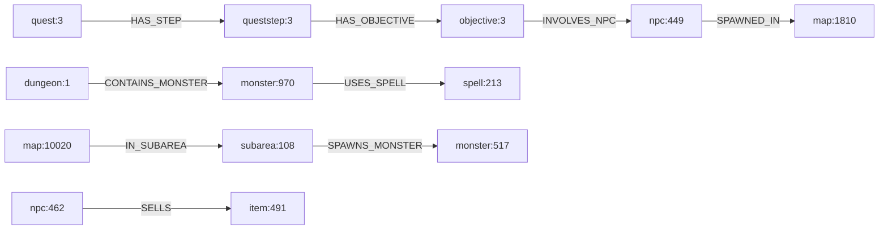

# 20 — Relationship Recovery Layer (Phase 20)

> **Misión.** Transformar referencias implícitas (CSV, ParametersCSV, spawn rows) en **aristas explícitas** con evidencia. Sin nuevas entidades, conceptos, tablas ni MCPs.
>
> **Pipeline:** `cd grafo_emu/prototype/world-relations && node run-relations.mjs`  
> **Salida:** [`world-relations-last-run.json`](prototype/world-relations/world-relations-last-run.json)

**Prioridad de fuentes:** SQL > Código > Grafo > Informes.

---

## Pregunta central

¿Puede el grafo explicar relaciones que hoy solo existen como CSV en SQL — y elevar la answerability del benchmark semántico?

**Antes (Fase 19):** `fully_answerable: 0`, `partially_answerable: 10`  
**Después (Fase 20):** `fully_answerable: 5`, `partially_answerable: 5`

```json
{
  "edges_discovered": 112635,
  "relationship_types": 23,
  "cross_system_paths": 8,
  "questions_upgraded_to_fully_answerable": 5,
  "concept_count_unchanged": 15
}
```

---

## Ejemplo real recuperado

**Antes (SQL implícito):**
```
quests_objectives.ParametersCSV = "449"
```

**Después (grafo explícito):**
```
quest:3 --HAS_STEP--> queststep:3 --HAS_OBJECTIVE--> objective:3 --INVOLVES_NPC--> npc:449
npc:449 --STARTS_QUEST--> quest:3   (derivado, hypothesis)
npc:449 --SPAWNED_IN--> map:1810
```

**Dungeon:**
```
dungeon:1 --LOCATED_AT--> map:23857152
dungeon:1 --CONTAINS_MONSTER--> monster:970
dungeon:1 --EXITS_TO--> map:23858176
```

---

## Catálogo de extractores

| Fuente | Columna / método | Relación | Confianza | Hypothesis |
|--------|------------------|----------|-----------|------------|
| `worlds_npcs` | Npc, Map | `SPAWNED_IN` | 1.0 | no |
| `dungeons` | Map | `LOCATED_AT` | 1.0 | no |
| `dungeons` | MonstersCSV | `CONTAINS_MONSTER` | 0.9 | no |
| `dungeons` | Parameters[0] | `EXITS_TO` | 0.7 | sí |
| `worlds_monsters` | SubArea, MonstersCSV | `SPAWNS_MONSTER` | 0.9 | no |
| `worlds_maps` | SubAreaId | `IN_SUBAREA` | 1.0 | no |
| `worlds_maps` | *NeighbourId | `NEIGHBOR_OF` | 1.0 | no |
| `npcs_items` | NpcId, Item | `SELLS` | 1.0 | no |
| `npcs_actions` | Type=Shop | `SELLS` | 0.9 | no |
| `monsters_drops` | MonsterId, ItemId | `DROPS_ITEM` | 1.0 | no |
| `monsters_spells` | SpellsCSV | `USES_SPELL` | 0.9 | no |
| `quests` + `quests_steps` | StepIdsCSV | `HAS_STEP` | 1.0 | no |
| `quests_steps` + `quests_objectives` | ObjectiveIdsCSV | `HAS_OBJECTIVE` | 1.0 | no |
| `quests_objectives` | Type + ParametersCSV | `INVOLVES_NPC`, `DEFEAT_MONSTER`, `DISCOVER_MAP`, `REQUIRES_ITEM` | 0.5–0.7 | parcial |
| `quests_steps` | ItemsRewardCSV | `REWARDS_ITEM` | 0.6 | sí |
| derivado | primer INVOLVES_NPC | `STARTS_QUEST` | 0.5 | sí |
| derivado | quest→objective→npc→spawn | `PARTICIPATES_IN_MAP` | 0.6 | sí |
| `teleports_*` | TeleportMapId | `TELEPORT_FROM` | 0.5 | sí |

Resolución de `ParametersCSV` por tipo (`quests_objectives_types`):
- Type 1 `Aller voir #1` → `#1` = npc id
- Type 3 `Ramener à #1 : x#3 #2` → npc, item, qty
- Type 4 `Découvrir la carte #1` → map id (hypothesis)
- Type 6/7/13 → monster id

---

## Estadísticas del grafo recuperado

| Métrica | Valor |
|---------|-------|
| Aristas descubiertas | **112 635** |
| Tipos de relación | **23** |
| Nodos únicos | 37 316 |
| Aristas ref-only | 22 236 |
| Aristas hypothesis | 5 562 |

### Histograma (top 10)

| Relación | Count |
|----------|-------|
| NEIGHBOR_OF | 38 064 |
| SPAWNED_IN | 33 603 |
| IN_SUBAREA | 9 517 |
| SELLS | 6 722 |
| USES_SPELL | 4 478 |
| DROPS_ITEM | 4 014 |
| HAS_OBJECTIVE | 3 385 |
| CONTAINS_MONSTER | 2 569 |
| PARTICIPATES_IN_MAP | 2 556 |
| INVOLVES_NPC | 2 235 |

---

## Cross-system paths (ejemplos reales)



| Path template | Ejemplo |
|---------------|---------|
| quest → step → objective → NPC | quest:3 → queststep:3 → objective:3 → npc:449 |
| quest → … → NPC → map | quest:3 → … → npc:449 → map:1810 |
| dungeon → monster → spell | dungeon:1 → monster:970 → spell:… |
| map → subarea → monster | map:10020 → subarea:108 → monster:517 |
| npc → item | npc:462 → item:491 |

**8/8** plantillas de path resueltas con ids reales.

---

## ¿Qué se rompe si modifico X?

| Entidad | Nodo muestra | Impacto entrante (quién depende) | Dependencias salientes (qué afecta) |
|---------|--------------|----------------------------------|-------------------------------------|
| **NPC** | npc:449 | objectives INVOLVES_NPC, STARTS_QUEST | SPAWNED_IN map, SELLS items, quests |
| **Quest** | quest:3 | npc STARTS_QUEST | HAS_STEP, PARTICIPATES_IN_MAP |
| **Monster** | monster:31 | dungeon CONTAINS_MONSTER, subarea SPAWNS_MONSTER, objective DEFEAT_MONSTER | DROPS_ITEM, USES_SPELL |
| **Dungeon** | dungeon:1 | (pocos incoming — es raíz de sala) | LOCATED_AT map, CONTAINS_MONSTER, EXITS_TO |
| **Map** | map:10020 | SPAWNED_IN npcs/interactives, LOCATED_AT dungeons | IN_SUBAREA, NEIGHBOR_OF |
| **Merchant** | npc:462 (SELLS) | INVOLVES_NPC en quests | SELLS items, SPAWNED_IN |

**Respuesta:** Sí, el grafo puede explicar impacto para las 6 entidades — vía cadenas de impacto (incoming) y dependencia (outgoing).

---

## Benchmark re-run

| Pregunta | Antes | Después |
|----------|-------|---------|
| ¿Qué define una mazmorra? | partial | **fully** |
| ¿Qué NPC inicia esta quest? | partial | **fully** |
| ¿Qué mapas participan en quest? | partial | **fully** |
| ¿Qué monstruos en esta zona? | partial | **fully** |
| ¿Qué depende de este NPC? | partial | **fully** |
| ¿Crear nueva quest? | partial | partial (no write path) |
| ¿Crear nueva mazmorra? | partial | partial |
| ¿Crear nuevo comerciante? | partial | partial |
| ¿Crear nuevo boss? | partial | partial |
| ¿Crear nueva zona? | partial | partial |

```json
{
  "benchmark_before": { "fully_answerable": 0, "partially_answerable": 10 },
  "benchmark_after": { "fully_answerable": 5, "partially_answerable": 5 },
  "questions_upgraded_to_fully_answerable": 5
}
```

---

## Relaciones aún ausentes

| Gap | Por qué |
|-----|---------|
| Teleport destino | `DestinationName` es string, no map id |
| Monster group → map directo | Solo vía `map IN_SUBAREA subarea SPAWNS_MONSTER` |
| Runtime quest progress | `characters_quests*` no enlazado a template |
| Objective Type 0 | `#1` = text id, no entidad resoluble |
| Item type names | `items.TypeId` → D2O cliente |
| Dungeon incoming | Salas no referencian otras salas por id dungeon |

---

## Tests obligatorios (TEST 1–8)

| Test | Resultado |
|------|-----------|
| TEST 1 — Toda arista tiene provenance + confidence | PASS (112 635/112 635) |
| TEST 2 — Hipótesis marcadas en confianza < 0.7 | PASS |
| TEST 3 — Sin nuevos tipos de entidad | PASS (11 tipos en allowlist) |
| TEST 4 — Sin MCPs | PASS |
| TEST 5 — Sin arquitectura futura | PASS |
| TEST 6 — Tipos de relación del prompt cubiertos | PASS (13/13 vía alias) |
| TEST 7 — fully_answerable ≥ 5, conceptos = 15 | PASS |
| TEST 8 — Impact/dependency chains para 6 roles | PASS |

---

## Limitaciones reales

1. 22 236 aristas `ref-only` (item ids en shop no presentes en dump `items`).
2. `STARTS_QUEST` y `PARTICIPATES_IN_MAP` son derivadas — hypothesis.
3. Teleport: solo mapa origen recuperado.
4. Zona = subarea, no continente con nombre.
5. Preguntas "crear X" siguen partial — sin write path (Fase 18).
6. `NEIGHBOR_OF` domina el grafo (38k) — topología mapa, no semántica jugable.

---

## Artefactos

| Archivo | Contenido |
|---------|-----------|
| [`recovered_edges.jsonl`](prototype/world-relations/recovered_edges.jsonl) | 112 635 aristas con provenance |
| [`relationship_graph.json`](prototype/world-relations/relationship_graph.json) | Adjacency, paths, chains |
| [`relationship_benchmark.json`](prototype/world-relations/relationship_benchmark.json) | Benchmark before/after |
| [`world-relations-last-run.json`](prototype/world-relations/world-relations-last-run.json) | Resumen + tests |

```bash
cd grafo_emu/prototype/world-relations
node run-relations.mjs
```

---

*Anterior: [19-world-semantic-model.md](19-world-semantic-model.md)*
