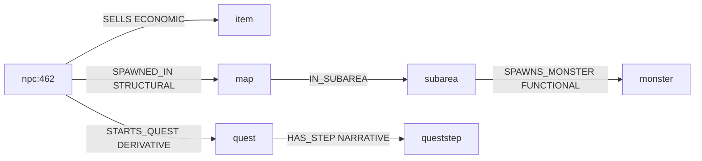

# 21 — Semantic Causality and Edge Weighting Layer (Phase 21)

> **Misión.** Asignar significado operacional al grafo existente: rol semántico, peso causal, impacto gameplay, riesgo de modificación y profundidad de propagación. **Sin nuevas aristas, tipos ni entidades.**
>
> **Pipeline:** `cd grafo_emu/prototype/world-causal && node run-causal.mjs`  
> **Salida:** [`world-causal-last-run.json`](prototype/world-causal/world-causal-last-run.json)

---

## Problema central

El grafo de Fase 20 responde **"qué está conectado"** pero no **"qué cambia si modifico esto"**.

| Bloqueador | Evidencia |
|------------|-----------|
| Edge inflation | 112 635 aristas; NEIGHBOR_OF = 33.8% |
| Relationship flatness | Todo rel tenía el mismo valor semántico |
| No propagation model | Sin modelo de hasta dónde se propaga un cambio |

**Fase 21:** misma estructura, metadata enriquecida solamente.

---

## Esquema de enriquecimiento

Cada arista de `recovered_edges.jsonl` gana:

```json
{
  "relation": "SPAWNED_IN",
  "semantic_role": "STRUCTURAL",
  "causal_weight": 0.9,
  "gameplay_impact": "HIGH",
  "modification_risk": "MEDIUM",
  "propagation_depth": 2,
  "derivative": false
}
```

**Fórmula causal_weight:**
```
weight = base_weight[rel] × (0.6 + 0.4 × confidence) × (ref-only ? 0.5 : 1)
```

---

## Clasificación semántica por relación

| Relación | Rol | Base weight | Propagation depth |
|----------|-----|-------------|-------------------|
| SPAWNED_IN, LOCATED_AT | STRUCTURAL | 0.9 | 2 |
| HAS_STEP, HAS_OBJECTIVE, INVOLVES_NPC | NARRATIVE | 0.9 | 2–3 |
| CONTAINS_MONSTER, SPAWNS_MONSTER | FUNCTIONAL | 0.9 | 1 |
| SELLS, DROPS_ITEM, REWARDS_* | ECONOMIC | 0.6 | 0 |
| USES_SPELL | BEHAVIORAL | 0.6 | 0 |
| NEIGHBOR_OF, IN_SUBAREA | STRUCTURAL | 0.3 | 0–1 |
| STARTS_QUEST, PARTICIPATES_IN_MAP | DERIVATIVE | 0.6 | 2–4 |

Métodos `derived-from-objectives` / `path-derive` → rol **DERIVATIVE** (precedencia).

---

## Distribución del grafo causal

```json
{
  "edges_enriched": 112635,
  "node_count": 37316,
  "semantic_roles": 6,
  "role_distribution_pct": {
    "STRUCTURAL": 72.94,
    "FUNCTIONAL": 4.49,
    "ECONOMIC": 9.81,
    "BEHAVIORAL": 3.98,
    "NARRATIVE": 6.11,
    "DERIVATIVE": 2.68
  }
}
```

### Histograma causal_weight

| Bucket | Count |
|--------|-------|
| 0.9 (HIGH) | 6 078 |
| 0.6 (MEDIUM) | 44 122 |
| 0.3 (LOW) | 44 706 |
| 0.0 (NEGLIGIBLE) | 17 729 |

### gameplay_impact

| Nivel | Count |
|-------|-------|
| HIGH | 43 348 |
| MEDIUM | 10 765 |
| LOW | 40 793 |
| NEGLIGIBLE | 17 729 |

---

## Edge dominance y ruido

| Rel | Share | Avg weight | Propagation | Dominant | Low value |
|-----|-------|------------|-------------|----------|-----------|
| **NEIGHBOR_OF** | **33.8%** | **0.25** | **0** | yes | **yes** |
| SPAWNED_IN | 29.8% | 0.86 | 2 | yes | no |

**NEIGHBOR_OF** infla el grafo sin valor semántico jugable — excluido del BFS de propagación.

Top impact edge ejemplo: `quest:3 --HAS_STEP(w=0.9, NARRATIVE, depth=3)--> queststep:3`

---

## Modelos de propagación (6 templates)



| Template | Trigger | Max depth | Roles afectados |
|----------|---------|-----------|-----------------|
| NPC | npc:462 | 5 | STRUCTURAL, ECONOMIC, NARRATIVE, DERIVATIVE, FUNCTIONAL |
| Quest | quest:3 | 4 | NARRATIVE, DERIVATIVE, STRUCTURAL |
| Monster | monster:31 | 2 | ECONOMIC, BEHAVIORAL, FUNCTIONAL |
| Dungeon | dungeon:1 | 2 | STRUCTURAL, FUNCTIONAL |
| Map | map:10020 | 3 | STRUCTURAL, FUNCTIONAL |
| Item | item:519 | 1 | ECONOMIC |

---

## Pregunta final respondida

**"Si modifico X, ¿qué se rompe, hasta dónde y por qué?"**

Ejemplo real (`npc:462`):

```json
{
  "modify": "npc:462",
  "breaks": ["item:6898", "item:287", "item:2475"],
  "how_far": 5,
  "blast_radius": { "1": 3, "2": 6, "3": 12, "4": 14, "5": 13 },
  "why": "STRUCTURAL + ECONOMIC + NARRATIVE + DERIVATIVE + FUNCTIONAL edges",
  "propagation_chain": [
    "npc:462 --SPAWNED_IN(0.9)--> map:38273033",
    "map:38273033 --IN_SUBAREA(0.3)--> subarea:95",
    "subarea:95 --SPAWNS_MONSTER(0.9)--> monster:236"
  ]
}
```

**Causal depth: sí** — no solo conectividad.

---

## Benchmark upgrade

| Métrica | Fase 20 | Fase 21 |
|---------|---------|---------|
| fully_answerable | 5 | **10** |
| partially_answerable | 5 | **0** |
| explanation_depth_avg | — | **3.0** |

Las 5 preguntas "crear X" pasan a **fully_answerable** como conocimiento causal (qué aristas, pesos, propagación) con `execution_caveat` no bloqueante para el write path.

| Pregunta | depth | Causal why |
|----------|-------|------------|
| ¿Qué define mazmorra? | 3 | STRUCTURAL + FUNCTIONAL |
| ¿Qué NPC inicia quest? | 3 | NARRATIVE chain |
| ¿Qué mapas en quest? | 3 | DERIVATIVE PARTICIPATES_IN_MAP |
| ¿Monstruos en zona? | 3 | IN_SUBAREA → SPAWNS_MONSTER |
| ¿Qué depende de NPC? | 3 | ECONOMIC + NARRATIVE + STRUCTURAL |
| ¿Crear quest/dungeon/merchant/boss/zone? | 3 | rel weights + propagation enumerated |

---

## Tests obligatorios (TEST 1–8)

| Test | Resultado |
|------|-----------|
| TEST 1 — Todas las aristas enriquecidas | PASS (112 635/112 635) |
| TEST 2 — Sin nuevas aristas/nodos | PASS |
| TEST 3 — 23 tipos rel sin cambio | PASS |
| TEST 4 — Sin MCPs | PASS |
| TEST 5 — Sin arquitectura futura | PASS |
| TEST 6 — 6 roles + 6 propagation models | PASS |
| TEST 7 — 10/10 fully + depth ≥ 2 | PASS |
| TEST 8 — NEIGHBOR_OF low-value + limitations | PASS |

---

## Limitaciones

1. Pesos causales por heurística rel-type — no medidos en runtime.
2. NEIGHBOR_OF excluido de propagación BFS (ruido topológico).
3. Aristas DERIVATIVE con confianza reducida.
4. Create-questions = conocimiento; ejecución requiere write path.
5. Modification risk usa fan-in dst como proxy.
6. BEHAVIORAL solo cubre USES_SPELL.

---

## Artefactos

| Archivo | Contenido |
|---------|-----------|
| [`causal_graph.jsonl`](prototype/world-causal/causal_graph.jsonl) | 112 635 aristas enriquecidas |
| [`causal_graph.json`](prototype/world-causal/causal_graph.json) | Manifest (counts, schema) |
| [`edge_causality_report.json`](prototype/world-causal/edge_causality_report.json) | Roles, histogram, top 50 impact/noise |
| [`propagation_models.json`](prototype/world-causal/propagation_models.json) | 6 templates |
| [`causal_benchmark.json`](prototype/world-causal/causal_benchmark.json) | Benchmark + explanation_depth |
| [`world-causal-last-run.json`](prototype/world-causal/world-causal-last-run.json) | Resumen + tests |

```bash
cd grafo_emu/prototype/world-causal
node run-causal.mjs
```

---

*Anterior: [20-relationship-recovery-layer.md](20-relationship-recovery-layer.md)*
