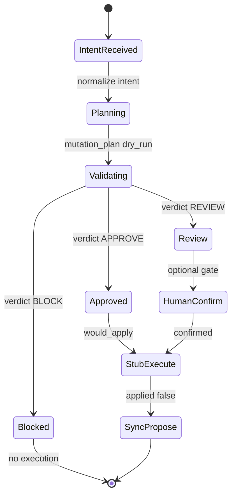
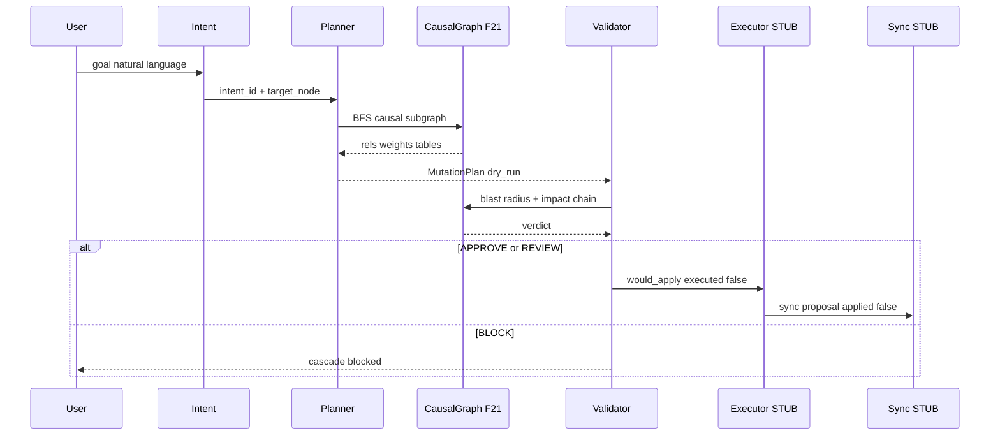

# 22 — MCP Execution Kernel v1 (MEK v1)

> **Principio de diseño:** MEK v1 no es un grafo. Es un **Deterministic Mutation Compiler for a Persistent Game World** — compila intención humana + grafo causal en planes SQL/C# validados, sin ejecutar writes en v1.
>
> **Modo:** diseño formal + simulación read-only determinística  
> **Harness:** `cd grafo_emu/prototype/mcp-execution-sim && node run-execution-sim.mjs`  
> **Salida:** [`mcp-execution-sim-last-run.json`](prototype/mcp-execution-sim/mcp-execution-sim-last-run.json)

**Base inmutable:** F19–21 (112 635 edges, 23 rel types, causal weights). NEIGHBOR_OF excluido de propagación. Zero writes, zero graph mutation.

---

## §1 — Arquitectura MEK v1

```mermaid
flowchart LR
  subgraph graph [GRAPH F19-F21]
    Edges[causal_graph.jsonl]
  end
  subgraph mek [MEK v1]
    Intent[Intent Layer]
    Planner[GraphMutationPlanner]
    Validator[CausalValidator]
    Executor[RuntimeExecutor STUB]
    Sync[SyncAdapter STUB]
  end
  subgraph runtime [RUNTIME]
    SQL[MariaDB sunshine.sql]
    CS[C# Managers]
  end
  Intent --> Planner
  Planner --> Validator
  Validator --> Executor
  Executor -.->|future| SQL
  Executor -.->|future| CS
  Sync -.->|propose only| graph
  graph --> Planner
```

| Módulo | Rol | Estado v1 |
|--------|-----|-----------|
| **Intent Layer** | Normaliza goal natural → `intent_id` + target | Implementado en catálogo |
| **GraphMutationPlanner** | Traversal causal → `MutationPlan` ordenado | Simulado |
| **CausalValidator** | Blast radius F21 → APPROVE/REVIEW/BLOCK | Simulado |
| **RuntimeExecutor** | Aplica plan a SQL/C# | **STUB** `executed:false` |
| **SyncAdapter** | Propone sync bidireccional | **STUB** `applied:false` |

---

## §2 — Flujo GRAPH → PLAN → VALIDATE → EXECUTE(STUB) → SYNC(PROPOSE)





---

## §3 — Interfaces formales

```typescript
interface MutationPlan {
  intent_id: string;
  target_node: string;
  action: "create" | "modify";
  mutation_plan: {
    order: string[];
    statements: { table: string; operation: "INSERT" | "UPDATE" }[];
    cs_manager: string;
    write_path: string;
    rollback_sketch: string;
  };
  graph_traversal: { rels_used: string[]; chain: object[] };
  dry_run: true;
  db_writes_executed: false;
  graph_mutated: false;
}

interface ValidationResult {
  target_node: string;
  detecting_system: string;
  blast_radius_total: number;
  max_modification_risk: "HIGH" | "MEDIUM" | "LOW";
  affected_roles: string[];
  what_breaks: string[];
  how_far: number;
  verdict: "APPROVE" | "REVIEW" | "BLOCK";
  why: string;
  destructive_cascade_detected: boolean;
}

interface ExecutionResult {
  would_apply: string[];
  write_path: string;
  executed: false;  // invariant v1
  reason: string;
}

interface SyncProposal {
  graph_to_runtime: { proposed: false; diff: string };
  runtime_to_graph: { proposed: true; action: string };
  applied: false;  // invariant v1
  blast_verdict: string;
}
```

| Interface | Implementación v1 |
|-----------|-------------------|
| `IGraphMutationPlanner` | [`intent-plan.mjs`](prototype/mcp-execution-sim/intent-plan.mjs) |
| `ICausalValidator` | [`causal-validate.mjs`](prototype/mcp-execution-sim/causal-validate.mjs) |
| `IRuntimeExecutor` | stub en [`run-execution-sim.mjs`](prototype/mcp-execution-sim/run-execution-sim.mjs) |
| `ISyncAdapter` | stub en [`run-execution-sim.mjs`](prototype/mcp-execution-sim/run-execution-sim.mjs) |

---

## §4 — Modelo de seguridad

### Umbrales (derivados de F21 causal weights)

| Verdict | Condición | Acción |
|---------|-----------|--------|
| **APPROVE** | blast ≤ 10 AND max_risk ≠ HIGH | Stub execute permitido |
| **REVIEW** | blast > 10 OR (weight ≥ 0.9 AND blast > 15) | Confirm gate humano (futuro) |
| **BLOCK** | max_risk = HIGH AND blast > 20 | Ejecución prohibida |

### Reglas obligatorias

| Regla | Evidencia |
|-------|-----------|
| NEIGHBOR_OF excluido de BFS | 38 064 edges (33.8%), weight 0.3, depth 0 |
| `db_writes_executed: false` siempre | TEST 4 PASS |
| `graph_mutated: false` siempre | TEST 4 PASS |
| Rollback sketch en todo plan | `rollback_sketch` por intent |
| BLOCK → Executor nunca `executed:true` | 3 intents bloqueados en sim |

### Tabla de seguridad operativa

| Métrica F21 | Valor usado en MEK |
|-------------|-------------------|
| causal_weight por hop | Real desde `causal_graph.jsonl` |
| modification_risk | HIGH si weight≥0.75 + dst fan-in≥10 |
| propagation_depth | Excluye NEIGHBOR_OF del subgraph |
| ref-only edges | weight × 0.5 (F21 rule) |

---

## §5 — Mapping GRAPH → RUNTIME

| Node | SQL tables | C# Manager | Write path hoy |
|------|------------|------------|----------------|
| `npc` | npcs, worlds_npcs, npcs_items, npcs_actions, npcs_messages, npcs_replies | NpcManager | sql_patch / GM spawn |
| `quest` | quests, quests_steps, quests_objectives | QuestManager | sql_patch |
| `queststep` | quests_steps | QuestManager | sql_patch |
| `objective` | quests_objectives | QuestManager | sql_patch |
| `monster` | monsters, monsters_grades, monsters_spells, monsters_drops | MonsterManager | sql_patch |
| `map` | worlds_maps, worlds_maps_positions, worlds_npcs, worlds_monsters, worlds_interactives | MapManager | sql_patch |
| `dungeon` | dungeons | DungeonManager | sql_patch |
| `item` | items, npcs_items, monsters_drops | InventoryHandler | admin_api_items_only |
| `spell` | spells, spells_levels, monsters_spells | SpellManager | sql_patch |
| `interactive` | interactives, worlds_interactives, interactives_skills | InteractiveManager | sql_patch |
| `subarea` | worlds_monsters, worlds_maps (derived) | MapManager | **future gap** — no tabla directa |

**Validación:** TEST 2 — todas las tablas mapeadas existen en `sunshine.sql`.

### Sync bidireccional (diseño, no implementado)

| Dirección | Mecanismo futuro |
|-----------|------------------|
| Graph → Runtime | Confirm gate → SQL patch → VPS deploy → manager reload |
| Runtime → Graph | Re-ingest `recover-edges.mjs` + `classify-edges.mjs` post-apply |

---

## §6 — Intent Catalog

### create_quest

| Campo | Valor |
|-------|-------|
| intent_id | `create_quest` |
| traversal | HAS_STEP → HAS_OBJECTIVE → INVOLVES_NPC |
| SQL plan | INSERT quests → quests_steps → quests_objectives |
| cs_manager | QuestManager |
| write_path | sql_patch |

### modify_npc

| Campo | Valor |
|-------|-------|
| intent_id | `modify_npc` |
| traversal | SPAWNED_IN, SELLS, STARTS_QUEST, INVOLVES_NPC |
| SQL plan | UPDATE npcs → worlds_npcs → npcs_items → npcs_actions |
| cs_manager | NpcManager |
| write_path | sql_patch_or_gm_spawn |

### create_merchant

| Campo | Valor |
|-------|-------|
| intent_id | `create_merchant` |
| traversal | SPAWNED_IN + SELLS + OFFERS_ACTION |
| SQL plan | INSERT npcs → worlds_npcs → npcs_items |
| cs_manager | NpcManager |
| write_path | sql_patch_or_gm_spawn |

### modify_dungeon

| Campo | Valor |
|-------|-------|
| intent_id | `modify_dungeon` |
| traversal | LOCATED_AT → CONTAINS_MONSTER → EXITS_TO |
| SQL plan | UPDATE dungeons (Map, MonstersCSV, Parameters) |
| cs_manager | DungeonManager |
| write_path | sql_patch |

Intents adicionales simulados: `modify_quest`, `modify_monster`, `modify_map`, `modify_item`.

---

## §7 — Simulación read-only (datos reales F21)

**8 intents** sobre IDs reales. **112 635 edges** consumidos. **Zero writes.**

### Verdict distribution

```json
{
  "verdict_distribution": { "BLOCK": 3, "REVIEW": 1, "APPROVE": 4 },
  "edges_consumed": 112635,
  "no_writes": true,
  "no_graph_mutation": true,
  "all_tests_passed": true
}
```

### Caso BLOCK real — modify npc:462

```json
{
  "target_node": "npc:462",
  "detecting_system": "NpcManager",
  "blast_radius_total": 48,
  "max_modification_risk": "HIGH",
  "verdict": "BLOCK",
  "why": "HIGH modification risk with blast radius > 20",
  "what_breaks": ["objective:34 --INVOLVES_NPC--> npc:462"],
  "how_far": 5,
  "executed": false
}
```

**Cadena causal detectada:** npc:462 → SPAWNED_IN → map → IN_SUBAREA → subarea → SPAWNS_MONSTER → monster → USES_SPELL → spell; npc:462 → STARTS_QUEST → quest:5 → HAS_STEP → queststep.

### Caso APPROVE real — modify monster:31

```json
{
  "target_node": "monster:31",
  "detecting_system": "MonsterManager",
  "blast_radius_total": 8,
  "verdict": "APPROVE",
  "why": "Blast radius within safe threshold",
  "chain_sample": "monster:31 --DROPS_ITEM(w=0.6)--> item:519",
  "executed": false
}
```

### Caso REVIEW real — modify dungeon:1

```json
{
  "target_node": "dungeon:1",
  "detecting_system": "DungeonManager",
  "verdict": "REVIEW",
  "why": "Moderate blast radius (15)",
  "chain_sample": "dungeon:1 --LOCATED_AT(w=0.9)--> map:23857152"
}
```

### Cadena completa npc → quest → item → map (viabilidad)

| Hop | Rel | Weight | Role |
|-----|-----|--------|------|
| npc:462 | STARTS_QUEST | 0.48 | DERIVATIVE |
| quest:5 | HAS_STEP | 0.9 | NARRATIVE |
| queststep | HAS_OBJECTIVE | 0.9 | NARRATIVE |
| objective | INVOLVES_NPC | 0.7 | NARRATIVE |
| npc:462 | SPAWNED_IN | 0.9 | STRUCTURAL |
| map:38273033 | IN_SUBAREA | 0.3 | STRUCTURAL |
| monster:31 | DROPS_ITEM | 0.6 | ECONOMIC |
| item:519 | — | — | leaf |

**Compilación determinística:** mismo input → mismo plan → mismo verdict (TEST 7 PASS).

---

## §8 — Validación F22 → F23 readiness gate

### ¿Puede este diseño pasar a F23 (first real write adapter)?

**Sí, con deuda técnica acotada.** MEK v1 no requiere rediseño para F23 — solo implementar los dos stubs.

| Gate | Estado F22 | Requisito F23 |
|------|------------|---------------|
| Intent → Plan | PASS (8/8 plans) | Mantener interfaz |
| Plan → Validate | PASS (verdicts reales) | Mantener umbrales |
| Validate → Execute | STUB | Implementar `IRuntimeExecutor` con confirm gate |
| Execute → Sync | STUB | Implementar `ISyncAdapter` post-apply re-ingest |
| Graph integrity | PASS (no mutation) | Re-ingest F20+F21 tras write |

### Deuda técnica restante

| Item | Severidad | Bloquea F23? |
|------|-----------|--------------|
| Sin MCP write path a MariaDB | Alta | Sí — F23 lo resuelve |
| C# cache reload post-write | Alta | Sí — restart o hot-reload manager |
| 22 236 ref-only edges | Media | No — warning en validator |
| MyISAM sin transacciones | Media | No — rollback manual + backup |
| Blast thresholds heurísticos | Baja | No — calibrar en F24 |

### Riesgos de producción

1. **Cache desync:** SQL cambia pero NpcManager en memoria no — jugador ve estado viejo hasta restart.
2. **Cascada no detectada:** derivative edges (STARTS_QUEST) tienen weight reducido — posible sub-detección.
3. **Confirm gate bypass:** sin gate humano, APPROVE ejecuta directo — F23 debe exigir confirm para REVIEW+.

### Gaps del sync system

| Gap | Tipo |
|-----|------|
| Runtime → Graph re-ingest automático | **future gap** |
| Audit log de mutaciones | **future gap** |
| Diff incremental edges (no full 112k re-parse) | **future gap** |
| MCP-2 world event stream | **future gap** (solo combat logs hoy) |

### Qué falta para el primer write seguro

1. **Confirm-gated `IRuntimeExecutor`:** SQL patch a `database/patches/` + VPS apply script con `--confirm` flag.
2. **Pre-write snapshot:** dump tablas afectadas antes de apply (rollback real).
3. **Post-write re-ingest:** `recover-edges.mjs` + `classify-edges.mjs` sobre dump actualizado.
4. **Server restart protocol:** documentar reload de managers afectados.

### Veredicto F23

| Criterio | Cumple |
|----------|--------|
| Simula cambio npc → quest → item → map | Sí |
| Bloquea cambios peligrosos | Sí (3 BLOCK) |
| Planes sin inconsistencias SQL | Sí (TEST 2) |
| F23 sin rediseño de F22 | Sí — stubs → implementación |

**F22 = PASS.** F23 puede comenzar con write adapter acotado a `modify_item` (admin_api path existente) como primer write real de menor blast radius.

---

## Artefactos

| Archivo | Contenido |
|---------|-----------|
| [`execution_plans.json`](prototype/mcp-execution-sim/execution_plans.json) | 8 MutationPlans |
| [`blast_radius_report.json`](prototype/mcp-execution-sim/blast_radius_report.json) | 8 ValidationResults |
| [`mcp-execution-sim-last-run.json`](prototype/mcp-execution-sim/mcp-execution-sim-last-run.json) | TEST 1–8 + summary |

```bash
cd grafo_emu/prototype/mcp-execution-sim
node run-execution-sim.mjs
```

---

*Anterior: [21-semantic-causal-layer.md](21-semantic-causal-layer.md)*
