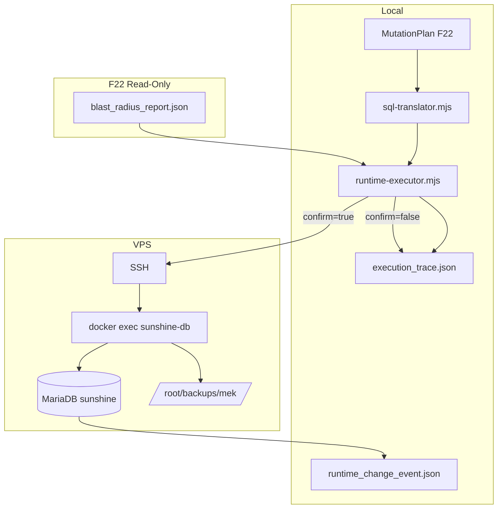
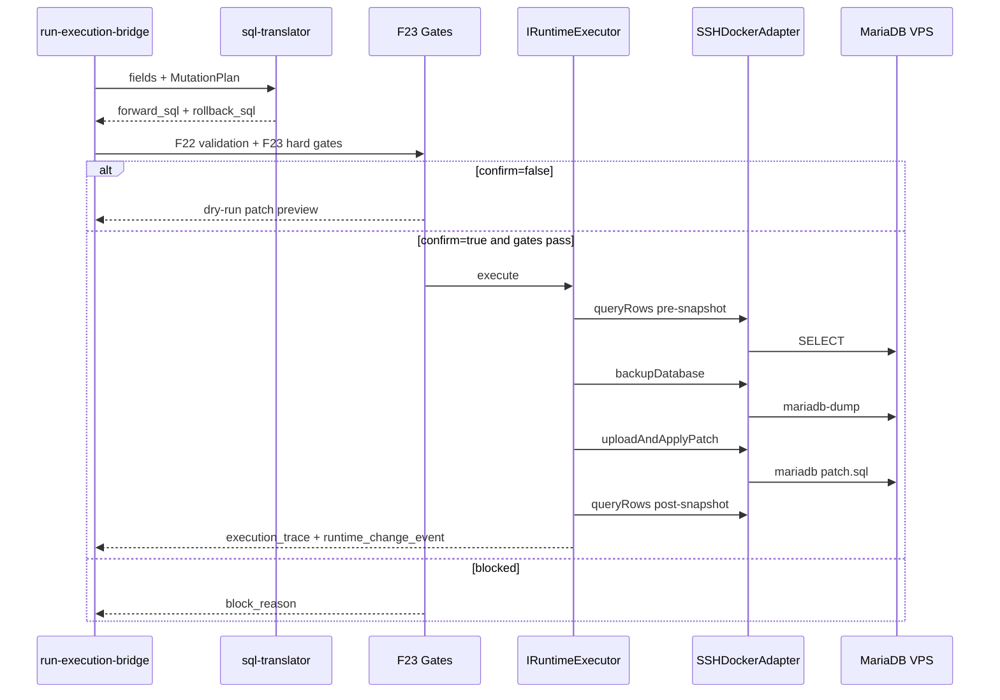

# 23 — Execution Bridge v1 (F23)

> **Principio:** MEK v1 compilaba mutaciones en dry-run. F23 es el **primer write controlado** al mundo persistente — siempre vía SSH → VPS → `docker exec` → MariaDB. Cero SQL local en el path de producción.
>
> **Harness:** `cd grafo_emu/prototype/mcp-execution-bridge && node run-execution-bridge.mjs`  
> **Salida:** [`mcp-execution-bridge-last-run.json`](prototype/mcp-execution-bridge/mcp-execution-bridge-last-run.json)

**Base inmutable:** F19–F22 sin cambios (grafo causal, intents, edge types, blast radius F22). F23 añade solo la capa de ejecución remota.

---

## §1 — Arquitectura Execution Bridge



| Módulo | Rol | Estado F23 |
|--------|-----|------------|
| **sql-translator.mjs** | `MutationPlan` + fields → SQL patch + rollback | Implementado |
| **ssh-docker-adapter.mjs** | `SSHDockerAdapter` — runSQL, backup, restore | Implementado |
| **runtime-executor.mjs** | `IRuntimeExecutor.execute(plan, confirm)` | Implementado |
| **sync-snapshot.mjs** | Post-exec SELECT → `runtime_change_event.json` | Implementado (propuesta, sin grafo) |

---

## §2 — Flujo PLAN → F23 GATE → SSH → SYNC(PROPOSE)



---

## §3 — Interfaces formales

```typescript
interface IRuntimeExecutor {
  execute(plan: MutationPlan, validation: BlastValidation, fieldChanges: FieldChange[], confirm: boolean): Promise<ExecutionResult>;
}

interface SSHDockerAdapter {
  runSQL(container: string, sql: string, label: string): Promise<{ stdout: string; stderr: string; ssh_command: string }>;
  backupDatabase(container: string, tables: string[], runId: string): Promise<{ backup_id: string; remote_path: string }>;
  restoreBackup(container: string, backupId: string): Promise<boolean>;
  queryRows(container: string, sql: string): Promise<string>;
}

interface ExecutionResult {
  success: boolean;
  dry_run: boolean;
  executed: boolean;
  blocked: boolean;
  block_reason?: string;
  rollback_available: boolean;
  patch: SqlPatch;
  trace_path: string;
}
```

Implementación: [`runtime-executor.mjs`](prototype/mcp-execution-bridge/runtime-executor.mjs), [`ssh-docker-adapter.mjs`](prototype/mcp-execution-bridge/ssh-docker-adapter.mjs).

---

## §4 — Primer dominio seguro (v1)

| Intent | Tabla | Columnas permitidas | Estado |
|--------|-------|---------------------|--------|
| `modify_item` | `items` | `Name`, `Price`, `Level`, `Weight`, `IconId` | **Ejecutable** (F22 APPROVE, blast 0) |
| `modify_npc` | `npcs` | `Name`, `EntityLook` | Traductor listo; F22 BLOCK en muestra `npc:462` |

**No permitido en v1:** quests, dungeons, map topology, CREATE intents, writes multi-tabla aunque F22 liste tablas relacionadas.

F22 puede listar `npcs_items` / `monsters_drops` en el plan de `modify_item`; F23 **ignora** esas tablas y escribe solo `items`.

---

## §5 — F23 execution safety gate (extiende F22)

Constantes en [`_bridge-lib.mjs`](prototype/mcp-execution-bridge/_bridge-lib.mjs):

| Gate | Valor |
|------|-------|
| `ALLOWED_INTENTS` | `modify_item`, `modify_npc` |
| `REQUIRE_F22_VERDICTS` | solo `APPROVE` |
| `BLOCK_RISKS` | `HIGH` |
| `MAX_BLAST_RADIUS` | `10` |
| `confirm` | obligatorio para write real |

Orden de bloqueo: intent allowlist → F22 verdict → HIGH risk → blast > 10 → translator → SSH config → confirm.

---

## §6 — SSH + Docker execution path

Patrón validado en VPS `174.138.35.107`, contenedor `sunshine-db`:

1. `scp` patch.sql → `/tmp/mek/{runId}/`
2. `docker cp` → contenedor
3. `mariadb-dump` backup en `/root/backups/mek/{runId}-pre.sql`
4. `docker exec ... mariadb < patch.sql`
5. SELECT verificación → `runtime_change_event.json`

Credenciales: `$MYSQL_ROOT_PASSWORD` desde env del contenedor (no hardcode local).

---

## §7 — Observabilidad

Cada run escribe `out/{runId}/execution_trace.json`:

```json
{
  "intent_id": "modify_item",
  "target_node": "item:519",
  "sql_commands": ["START TRANSACTION;", "UPDATE items SET Name='...' WHERE Id=519;", "COMMIT;"],
  "ssh_commands": ["ssh root@174.138.35.107 ..."],
  "docker_container": "sunshine-db",
  "success": true,
  "executed": true,
  "rollback_available": true,
  "backup_id": "20260622T061552Z-pre",
  "logs": ["gate: all F23 execution gates passed", "apply: ok"]
}
```

`runtime_change_event.json` propone re-ingesta manual Phase 20 — **sin mutar grafo**.

---

## §8 — Validación y resultados

### CLI

```bash
cd grafo_emu/prototype/mcp-execution-bridge

# Dry-run (default)
node run-execution-bridge.mjs --intent modify_item --target item:519 \
  --fields-file out/vps-test-fields.json

# Live write (SSH + --confirm obligatorio)
node run-execution-bridge.mjs --intent modify_item --target item:519 \
  --fields-file out/vps-test-fields.json --confirm
```

### TEST 1–8 (harness)

| Test | Resultado |
|------|-----------|
| T1 | Sin cambios en artefactos F19–F21 |
| T2 | Cero SSH en dry-run |
| T3 | `confirm=false` → `executed:false` + patch preview |
| T4 | HIGH risk bloqueado aunque `confirm=true` |
| T5 | quest/dungeon/map bloqueados |
| T6 | Rollback SQL con valores `before` |
| T7 | Schema `execution_trace.json` válido |
| T8 | Hash patch determinista en doble dry-run |

**all_tests_passed: true** (última ejecución local).

### VPS — primer write real

| Paso | Resultado |
|------|-----------|
| Pre-exec SELECT `item:519` | `Poudre de Perlinpainpain` |
| Apply `Name=MEK-F23-bridge-test` | `success: true`, `executed: true` |
| Rollback a nombre original | `success: true` |
| Backup remoto | `/root/backups/mek/{runId}-pre.sql` |

### Riesgos conocidos

| Riesgo | Mitigación |
|--------|------------|
| Cache C# stale tras UPDATE items | Reinicio manual `docker restart sunshine-server` si hace falta |
| `modify_npc` F22 BLOCK | No ejecutar hasta target de bajo blast |
| SSH key relativa en `mcp/.env` | `resolveSshKey()` resuelve contra repo root |
| Writes concurrentes | v1 serial, sin paralelismo |

### Non-goals (cumplidos)

- Sin UI, sin nuevos tipos MCP, sin rediseño grafo
- Sin event streaming, sin auto-sync al grafo
- Sin ejecución autónoma (`--confirm` requerido)

**F23 = PASS.** MEK v1 → Execution Bridge operativo para `modify_item` en VPS.
