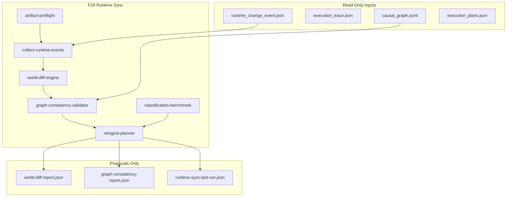
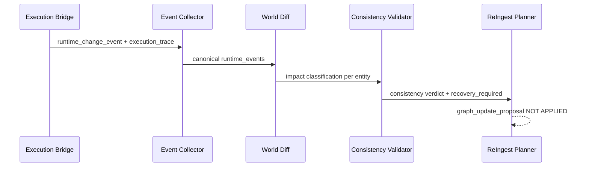

# 24 — Runtime Synchronization and World Consistency Layer (F24)

> **Principio:** F23 escribe en MariaDB pero no actualiza el grafo. F24 determina **qué cambió**, **qué quedó potencialmente desactualizado**, y **qué fases re-ejecutar** — sin auto-sync, sin mutar grafo, sin MCPs.
>
> **Harness:** `cd grafo_emu/prototype/runtime-sync && node run-runtime-sync.mjs`  
> **Salida:** [`runtime-sync-last-run.json`](prototype/runtime-sync/runtime-sync-last-run.json)

**Base inmutable:** F19–F23 sin cambios. F24 es read-only sobre artefactos existentes.

---

## §1 — Problema y arquitectura

Después de un write F23, los MCP futuros podrían razonar sobre un grafo obsoleto. F24 cierra el loop de **consistencia**, no de **sincronización automática**:



| Módulo | Rol |
|--------|-----|
| `artifact-preflight.mjs` | Verifica F21–F23 con evidencia real antes de procesar |
| `collect-runtime-events.mjs` | Escanea F23 `out/` — solo traces con `executed: true` |
| `world-diff-engine.mjs` | Clasifica impacto por tabla/columna |
| `graph-consistency-validator.mjs` | Cruza vs edges F21 del entity |
| `classification-benchmark.mjs` | Predicción npc:462 (simulado, sin runtime ficticio) |
| `reingest-planner.mjs` | Propone rerun Phase20/21 + artefactos invalidados |

---

## §2 — Flujo post-write F23



---

## §3 — Clasificación de impacto (determinística)

Derivado de [`recover-edges.mjs`](prototype/world-relations/recover-edges.mjs):

| Clase | Ejemplos | graph_requires_update | causal_recompute |
|-------|----------|----------------------|------------------|
| **metadata** | `items.Name`, `npcs.EntityLook` | false | false |
| **edge_props** | `npcs_items.Price` | true (props stale) | false |
| **structural** | FK, spawn rows, CSV ids | true | true |

Tablas estructurales: `npcs_items`, `worlds_npcs`, `monsters_drops`, `quests_*`, `worlds_maps`, etc.

---

## §4 — Escenario A: item:519 (SOURCE OF TRUTH, real F23)

Input real: [`mcp-execution-bridge/out/20260622T061552Z/runtime_change_event.json`](prototype/mcp-execution-bridge/out/20260622T061552Z/runtime_change_event.json)

Resultado F24:

```json
{
  "entity": "item:519",
  "columns_changed": ["Name"],
  "graph_requires_update": false,
  "causal_recompute_required": false,
  "recovery_required": [],
  "consistency_verdict": "CONSISTENT_TOPOLOGY"
}
```

**Por qué:** F20 referencia `item:519` por Id en `DROPS_ITEM` (15+ edges). `Name` no participa en topología del grafo.

Net tras restore (`20260622T061633Z`): `net_changed: false` — runtime volvió al estado original.

---

## §5 — Escenario B: npc:462 (CLASSIFICATION BENCHMARK, simulado)

**Restricciones cumplidas:**
- NO writes, NO fake snapshots, NO fake runtime events/traces
- Solo predicciones desde F22 `modify_npc` + subgraph F21 real

```json
{
  "entity": "npc:462",
  "mode": "simulated",
  "write_executed": false,
  "runtime_snapshot": null,
  "predicted_affected_edges": ["INVOLVES_NPC", "SELLS", "SPAWNED_IN", "STARTS_QUEST"],
  "predicted_recovery_phases": ["Phase20", "Phase21"],
  "f22_blast_radius": 48,
  "f22_verdict": "BLOCK"
}
```

Edges reales verificados en F21: `SPAWNED_IN→map:38273033`, `SELLS→item:491`, 4× `INVOLVES_NPC` inbound, `STARTS_QUEST→quest:5`.

---

## §6 — Artefactos de salida

| Archivo | Contenido |
|---------|-----------|
| `preflight-report.json` | Evidencia F21 (112635), F22 (8), F23 (2 executed events) |
| `world-diff-report.json` | Diffs reales + benchmark simulado |
| `graph-consistency-report.json` | Veredictos + reingest plan (propuesta) |
| `runtime-sync-last-run.json` | TEST 1–8 + highlights |

---

## §7 — Preflight (evidencia verificada)

| Artefacto | Evidencia |
|-----------|-----------|
| F21 `causal_graph.jsonl` | 112,635 líneas |
| F22 `execution_plans.json` | 8 planes |
| F22 `blast_radius_report.json` | 8 validaciones |
| F23 executed events | 2 runs (`20260622T061552Z`, `20260622T061633Z`) |

Si preflight falla → abort sin asumir datos.

---

## §8 — TEST 1–8 y validación

```bash
cd grafo_emu/prototype/runtime-sync
node run-runtime-sync.mjs
```

| Test | Resultado esperado |
|------|-------------------|
| T1 | Sin writes fuera de `runtime-sync/` |
| T2 | Sin mutación F19–F21 |
| T3 | Preflight OK con conteos reales |
| T4 | Detecta cambio real item:519 |
| T5 | item:519 metadata; npc:462 structural benchmark |
| T6 | item:519 `recovery: []`; npc:462 Phase20+21 |
| T7 | Hash determinista en doble run |
| T8 | `all_tests_passed: true` |

**Estado:** `all_tests_passed: true` en última ejecución.

---

## Non-goals (cumplidos)

- Sin MCPs, agentes, auto-sync, mutación de grafo, SQL, SSH
- Sin runtime ficticio en escenarios simulados

---

## Roadmap (contexto)

```
F24 Runtime Sync (esta fase)
  → F25 World Transaction Model
  → F26 MCP Tool Contract
  → F27 MCP Runtime Gateway
  → F28 MCP World Agent V1
```

F24 es la **consistency gate** que los MCP invocarán tras F23 para saber si el grafo sigue siendo confiable.
