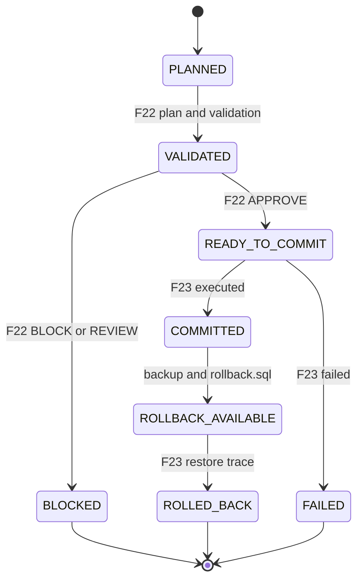
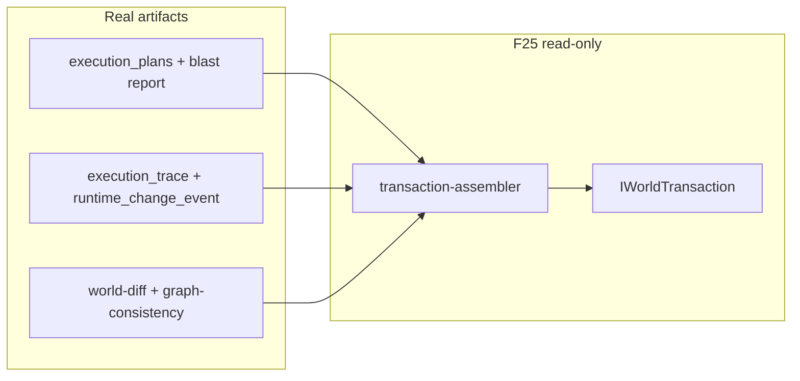

# 25 — World Transaction Model v1 (F25)

> **Principio:** F22–F24 son capas separadas. F25 las unifica en **una unidad transaccional** — `IWorldTransaction` — que representa "una operación de modificación del mundo". Simulación read-only; sin MCPs, sin writes, sin mutación de grafo.
>
> **Harness:** `cd grafo_emu/prototype/world-transaction && node run-world-transaction.mjs`  
> **Salida:** [`world-transaction-last-run.json`](prototype/world-transaction/world-transaction-last-run.json)

**Base inmutable:** F19–F24 sin cambios. F25 solo ensambla artefactos existentes.

---

## §1 — Problema

Pipeline actual fragmentado:

```
GRAPH → F22 MEK → F23 Execution Bridge → F24 Runtime Sync
```

Los MCP futuros **no deben** llamar F23 o F24 directamente. Deben operar a través de **World Transaction**.

---

## §2 — Arquitectura





| Módulo | Rol |
|--------|-----|
| `_txn-lib.mjs` | Estados, loaders read-only, helpers lifecycle |
| `artifact-preflight.mjs` | Verifica F22 + F23 + F24 antes de ensamblar |
| `transaction-assembler.mjs` | Construye `IWorldTransaction` Cases A–D |
| `run-world-transaction.mjs` | Orquestador + TEST 1–8 |

---

## §3 — IWorldTransaction

```typescript
interface IWorldTransaction {
  transaction_id: string;
  intent_id: string;
  target_node: string;
  lifecycle: {
    current_state: WorldTransactionState;
    history: { state: string; at: string; reason: string }[];
  };
  validation: { verdict: string; blast_radius_total: number };
  execution: { executed: boolean; run_id?: string; trace_ref?: string } | null;
  consistency: { verdict: string; recovery_required: string[] } | null;
  reingest_proposal: { invalidated_artifacts: object[]; rerun_commands: object[] } | null;
  commit_model: "confirm_gated_f23";
  rollback_model: "f23_backup_plus_rollback_sql";
}
```

Estados requeridos: `PLANNED`, `VALIDATED`, `BLOCKED`, `READY_TO_COMMIT`, `COMMITTED`, `ROLLBACK_AVAILABLE`, `ROLLED_BACK`, `FAILED`.

---

## §4 — Transaction flow

```
Intent
  → MutationPlan (F22)
  → Validation (F22)
  → Execution (F23) — solo si APPROVE
  → Consistency Check (F24)
  → Re-ingest Proposal (F24)
```

F25 **replay** de artefactos reales — no invoca SSH, SQL ni re-ingest.

---

## §5 — Casos obligatorios

### CASE A — `modify_item` / `item:519` (real)

| Campo | Valor |
|-------|-------|
| F22 | APPROVE, blast 0 |
| F23 | run `20260622T061552Z`, executed, rollback_available |
| F24 | CONSISTENT_TOPOLOGY |
| Estados | COMMITTED, ROLLBACK_AVAILABLE |

### CASE B — `modify_npc` / `npc:462` (real F22, sin ejecución)

| Campo | Valor |
|-------|-------|
| F22 | BLOCK, blast_radius=48 |
| F23 | null |
| Estado | BLOCKED |

### CASE C — Rollback (real F23 restore)

| Campo | Valor |
|-------|-------|
| Parent | txn-item519-commit |
| F23 | run `20260622T061633Z` |
| F24 net | net_changed: false |
| Estado | ROLLED_BACK |

### CASE D — Re-ingest proposal (F24 benchmark, sin F23 ficticio)

| Campo | Valor |
|-------|-------|
| Entity | npc:462 |
| F22 | BLOCK — no execution |
| F24 | simulated_benchmark on npcs_items |
| recovery | Phase20, Phase21 |
| execution | null (no fake traces) |

---

## §6 — Artefactos

| Archivo | Contenido |
|---------|-----------|
| `preflight-report.json` | Evidencia F22/F23/F24 |
| `world-transactions.json` | 4 transacciones Cases A–D |
| `world-transaction-last-run.json` | TEST 1–8 + case summary |

---

## §7 — TEST 1–8

```bash
cd grafo_emu/prototype/world-transaction
node run-world-transaction.mjs
```

| Test | Assertion |
|------|-----------|
| T1 | Sin writes fuera de `world-transaction/` |
| T2 | Sin mutación F19–F21 |
| T3 | Preflight F22 + F23 + F24 OK |
| T4 | CASE A: COMMITTED + ROLLBACK_AVAILABLE + CONSISTENT_TOPOLOGY |
| T5 | CASE B: BLOCKED blast 48 |
| T6 | CASE C: ROLLED_BACK net unchanged |
| T7 | CASE D: reingest Phase20+21 sin F23 ficticio |
| T8 | Hash determinista; all_tests_passed |

**Estado:** `all_tests_passed: true`

---

## §8 — F25 → F26 Readiness

**Pregunta:** ¿Pueden los MCP futuros operar exclusivamente a través de World Transactions sin llamar F23 o F24 directamente?

**Respuesta: Sí — con evidencia del harness.**

| Evidencia | Implicación para MCP |
|-----------|---------------------|
| `IWorldTransaction` bundle plan + validation + execution refs + consistency + reingest | Superficie MCP = `beginTransaction()` / `getTransaction()` — no SSH/SQL |
| CASE A replay real F23+F24 | Commit + rollback + consistency addressables por `transaction_id` |
| CASE B BLOCK antes de F23 | MCP nunca necesita F23 para intents bloqueados |
| CASE C rollback como child txn | MCP rollback = txn hijo referenciando parent backup |
| CASE D reingest proposal sin auto-sync | MCP recibe propuesta; decisión humana/automation en F27+ |
| F25 no modifica F22/F23/F24 | F26 Tool Contract envuelve interfaces estables |

**F26 definirá** tools (`modifyItem`, `modifyNpc`, etc.) que mapean 1:1 a factories de `IWorldTransaction` — sin exposición directa de F23/F24.

---

## Non-goals (cumplidos)

- Sin MCPs, agentes, APIs, colas, event buses
- Sin writes de producción, sin mutación de grafo
- Sin redesign de F22, F23, F24

---

## Roadmap

```
F25 World Transaction (esta fase)
  → F26 MCP Tool Contract
  → F27 MCP Runtime Gateway
  → F28 MCP World Agent V1
```

---

*Anterior: [24-runtime-synchronization-layer.md](24-runtime-synchronization-layer.md)*
