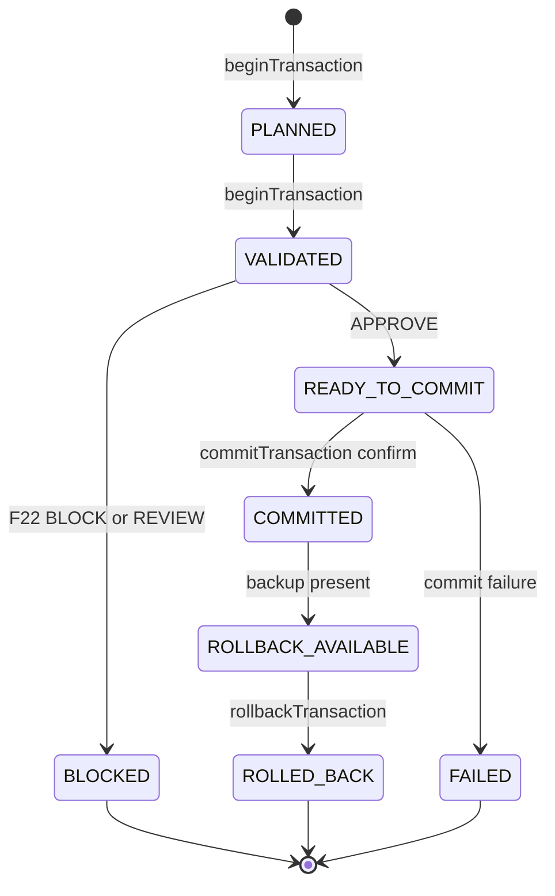
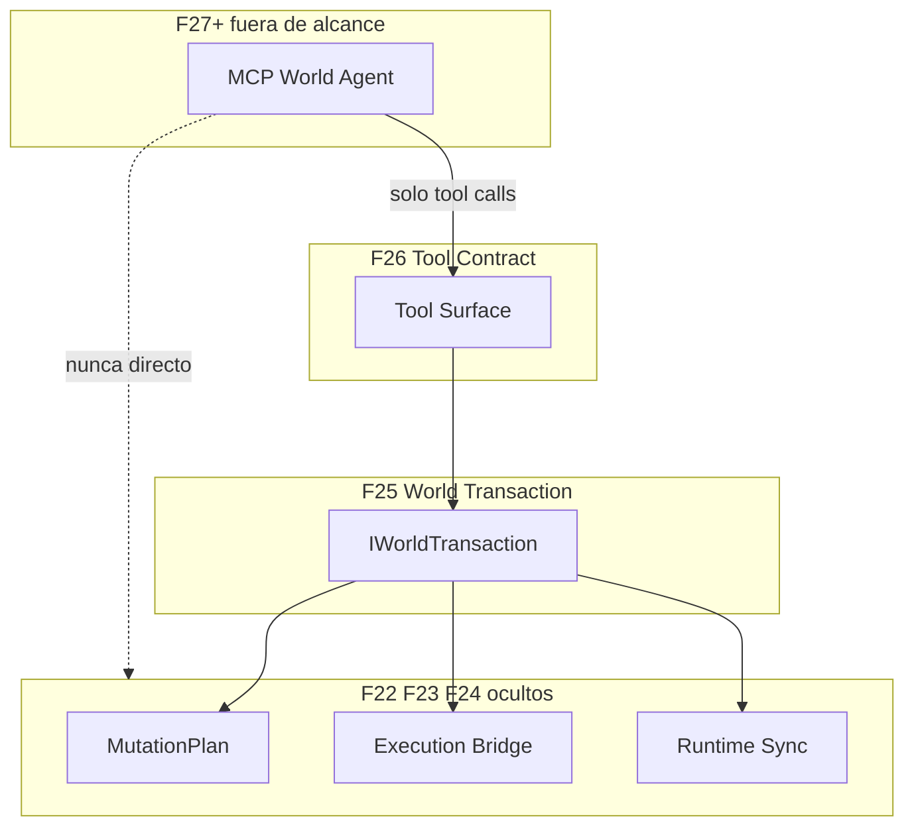

# 26 — MCP Tool Contract v1 (F26)

> **Principio:** F26 define la **superficie estable de herramientas** que los MCP futuros usarán para modificar el mundo **sin conocer F22/F23/F24**. Solo diseño + validación read-only; sin servidor MCP, sin transporte, sin gateway, sin agentes.
>
> **Harness:** `cd grafo_emu/prototype/mcp-tool-contract && node run-contract-validation.mjs`  
> **Salida:** [`mcp-tool-contract-last-run.json`](prototype/mcp-tool-contract/mcp-tool-contract-last-run.json)

**Base inmutable:** F19–F25 sin cambios. F26 solo proyecta `world-transactions.json` y valida representabilidad.

---

## §1 — Tool Surface

Ocho herramientas derivadas del ciclo de vida F25 (no asumidas):

| Tool | Propósito | Respaldo F25 |
|------|-----------|--------------|
| `beginTransaction` | Crear + validar intent contra target | PLANNED → VALIDATED/BLOCKED |
| `explainImpact` | Blast radius + consistencia sin commit | F22 validation + F24 consistency |
| `getTransaction` | Vista read-only completa | cualquier estado |
| `listTransactions` | Enumerar transacciones, filtrar por estado | cualquier estado |
| `commitTransaction` | Commit con confirm gate | VALIDATED/READY_TO_COMMIT → COMMITTED/FAILED |
| `rollbackTransaction` | Crear hijo rollback vinculado | ROLLBACK_AVAILABLE → ROLLED_BACK |
| `getReingestProposal` | Propuesta re-ingest tras cambio estructural | `reingest_proposal` (CASE D) |
| `getTransactionConsistency` | Veredicto F24 para txn committed | bloque `consistency` (CASE A) |

`listPendingTransactions` se expresa como `listTransactions({ state: "READY_TO_COMMIT" })` — sin tool separada.

---

## §2 — Input Contract

Los inputs **nunca** incluyen SQL, SSH, contenedores ni rutas de archivo — solo intent, target, fields y confirm:

```typescript
beginTransaction(input: {
  intent_id: "modify_item" | "modify_npc" | string;
  target_node: string;
  fields?: Record<string, string | number>;
}): TransactionView | ContractError

explainImpact(input: { transaction_id: string } | { intent_id: string; target_node: string }): ImpactView | ContractError
getTransaction(input: { transaction_id: string }): TransactionView | ContractError
listTransactions(input?: { state?: WorldTransactionState }): TransactionSummary[]
commitTransaction(input: { transaction_id: string; confirm: true }): TransactionView | ContractError
rollbackTransaction(input: { transaction_id: string }): TransactionView | ContractError
getReingestProposal(input: { transaction_id: string }): ReingestProposalView | ContractError
getTransactionConsistency(input: { transaction_id: string }): ConsistencyView | ContractError
```

Especificación machine-readable: [`tool-contract.json`](prototype/mcp-tool-contract/tool-contract.json).

---

## §3 — Output Contract

`projectTransaction()` en `_contract-lib.mjs` elimina internals F22/F23/F24:

```typescript
interface TransactionView {
  transaction_id: string;
  intent_id: string;
  target_node: string;
  state: WorldTransactionState;
  validation: {
    verdict: "APPROVE" | "REVIEW" | "BLOCK";
    blast_radius: number;
    modification_risk: "LOW" | "MEDIUM" | "HIGH";
  };
  consistency: {
    verdict: "CONSISTENT_TOPOLOGY" | "PROPS_STALE" | "TOPOLOGY_STALE";
    recovery_required: string[];
  } | null;
  rollback_available: boolean;
  reingest_required: boolean;
  parent_transaction_id: string | null;
}
```

**Campos eliminados:** `mutation_plan_ref`, `execution.trace_ref/event_ref/backup_id/rollback_sql_ref/run_id`, `commit_model`, `rollback_model`.

---

## §4 — Error Contract

Ocho códigos normalizados mapeados desde F22/F23/F24/F25:

| Error code | Origen | Caso ejemplo |
|------------|--------|--------------|
| `BLOCKED_BY_BLAST_RADIUS` | F22 BLOCK, blast > threshold | CASE B (48) |
| `BLOCKED_BY_MODIFICATION_RISK` | F22 `max_modification_risk = HIGH` | CASE B |
| `REQUIRES_HUMAN_CONFIRMATION` | F23 confirm gate | commit sin `confirm:true` |
| `VALIDATION_REVIEW_REQUIRED` | F22 REVIEW (F23 requiere APPROVE) | planes REVIEW |
| `TRANSACTION_NOT_FOUND` | `transaction_id` desconocido | id inválido |
| `INVALID_STATE_TRANSITION` | tool en estado incorrecto | commit en BLOCKED |
| `ROLLBACK_NOT_AVAILABLE` | sin `ROLLBACK_AVAILABLE` / backup | rollback prematuro |
| `REINGEST_REQUIRED` | F24 `TOPOLOGY_STALE` + recovery | CASE D |

`ContractError = { error_code: string; message: string; transaction_id?: string }`.

---

## §5 — Permission Model

Diseño only — sin enforcement de auth en F26:

| Rol | Tools permitidas |
|-----|------------------|
| `reader` | `getTransaction`, `listTransactions`, `explainImpact`, `getReingestProposal`, `getTransactionConsistency` |
| `planner` | reader + `beginTransaction` |
| `operator` | planner + `commitTransaction` (requiere `confirm:true`) |
| `rollback_operator` | `rollbackTransaction` + reader |

La ejecución de re-ingest **no** es un permiso aquí — solo propuesta hasta F27+.

---

## §6 — Lifecycle Mapping



Cada uno de los 8 estados F25 es observable vía al menos una tool (TEST 6).

---

## §7 — Compatibility Matrix

| Capa | Llama | Nunca toca |
|------|-------|------------|
| MCP (F27+) | tools F26 únicamente | F22, F23, F24, F25 internals |
| F26 contract | proyecta `IWorldTransaction` | SSH/SQL/docker |
| F25 | lee artefactos F22/F23/F24 | — |
| F22/F23/F24 | dominios propios | — |



---

## §8 — Harness y casos reales

### Paquete

| Archivo | Rol |
|---------|-----|
| `_contract-lib.mjs` | `TOOL_SURFACE`, `ERROR_CODES`, `PERMISSION_MODEL`, `STATE_TOOL_MATRIX`, `projectTransaction()` |
| `artifact-preflight.mjs` | Verifica F21–F25; emite `preflight-report.json` |
| `contract-validate.mjs` | Mapea CASE A–D → secuencias tool-call; emite `case-representation-report.json` + `tool-contract.json` |
| `run-contract-validation.mjs` | Orquestador + TEST 1–8 → `mcp-tool-contract-last-run.json` |

### Mapeo CASE A–D (datos F25 reales)

| Case | transaction_id | Secuencia tools | Resultado |
|------|----------------|-----------------|-----------|
| A | `txn-item519-commit` | begin → commit(confirm) → getConsistency | COMMITTED, `rollback_available:true`, CONSISTENT_TOPOLOGY |
| B | `txn-npc462-blocked` | begin → commit | BLOCKED, `BLOCKED_BY_BLAST_RADIUS` (blast 48) |
| C | `txn-item519-rollback` | rollback(parent) | ROLLED_BACK, `parent_transaction_id` set |
| D | `txn-npc462-reingest-proposal` | explainImpact → getReingestProposal | TOPOLOGY_STALE, Phase20+Phase21, sin F23 fake |

### TEST 1–8

| Test | Aserción |
|------|----------|
| T1 | Preflight F21–F25 presente |
| T2 | CASE A representable (commit + rollback_available + consistent) |
| T3 | CASE B representable (`BLOCKED_BY_BLAST_RADIUS`, sin execution expuesta) |
| T4 | CASE C representable (rollback child, ROLLED_BACK) |
| T5 | CASE D representable (reingest Phase20+Phase21) |
| T6 | 8 estados F25 mapeados a tools |
| T7 | Cada razón F22/F23 bloquea → error code normalizado |
| T8 | `all_tests_passed=true`; hash determinista estable |

**Última ejecución:** `all_tests_passed: true`, `determinism_hash: 43db0c8a04a37f10`.

---

## F26 Readiness Report

### ¿Puede un MCP operar usando solo este contrato?

**Sí.** Los 4 casos reales F25 son representables exclusivamente vía las 8 tools. Evidencia: [`case-representation-report.json`](prototype/mcp-tool-contract/case-representation-report.json) — `all_representable: true`, `no_forbidden_exposure: true` en cada caso.

### ¿Qué información extra necesitaría?

Solo el **catálogo de intents** + allowlist de targets/fields (ya en F22/F23), expuesto como metadata del contrato. Nada de internals F22/F23/F24.

### ¿Qué nunca debe exponerse?

- SSH / credenciales
- SQL text / rollback SQL paths
- Docker / contenedores
- `backup_id`, `trace_ref`, `event_ref`
- `causal_graph.jsonl` internals
- `mutation_plan_ref` y planes crudos

### F27 / F28 readiness

| Fase | Puede construirse sin modificar F26 |
|------|--------------------------------------|
| **F27** MCP Runtime Gateway | Sí — wrap de tools F26 en JSON-RPC/stdio/REST |
| **F28** MCP World Agent v1 | Sí — agente usa solo la superficie F26 |

---

## Non-goals (F26)

- Sin servidor MCP, JSON-RPC, transporte, REST API
- Sin gateway runtime, agentes, auth enforcement
- Sin writes, mutación de grafo ni ejecución F23

**Éxito:** MCP puede trabajar con F26 solo; F26 oculta F22/F23/F24; F27/F28 construibles sin tocar F26.
