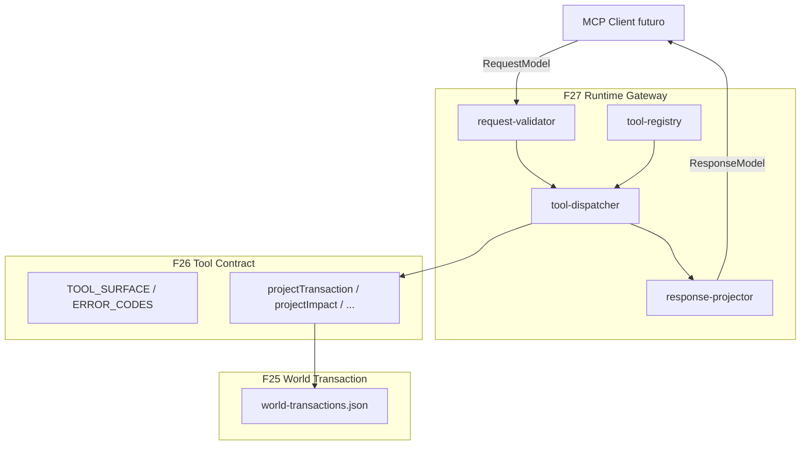

# 27 — MCP Runtime Gateway v1 (F27)

> **Principio:** F27 es **solo adaptación**. Expone el MCP Tool Contract (F26) como superficie invocable mediante `RequestModel` → validación → dispatch → proyección → `ResponseModel`. Sin servidor, sin transporte, sin lógica de negocio nueva, sin writes.
>
> **Harness:** `cd grafo_emu/prototype/mcp-runtime-gateway && node run-gateway-validation.mjs`  
> **Salida:** [`mcp-runtime-gateway-last-run.json`](prototype/mcp-runtime-gateway/mcp-runtime-gateway-last-run.json)

**Base inmutable:** F19–F26 sin cambios. F27 importa F26 directamente (sin duplicar tools ni error codes).

---

## §1 — Arquitectura



Cadena pública del mundo:

```
Gateway → Tool Contract → World Transaction
```

---

## §2 — Request Model

```typescript
interface RequestModel {
  request_id: string;
  tool_name: string;
  arguments: object;
  caller_role: "reader" | "planner" | "operator" | "rollback_operator";
  timestamp: string;
}
```

Validaciones (sin lógica de negocio nueva):

- Tool existe en registry (sourced from F26 `TOOL_SURFACE`)
- Argumentos requeridos presentes
- `caller_role` permitido según F26 `PERMISSION_MODEL`

Rechazos de request normalizados a `INVALID_STATE_TRANSITION` (uno de los 8 error codes F26).

---

## §3 — Response Model

```typescript
interface ResponseModel {
  request_id: string;
  success: boolean;
  result: TransactionView | ImpactView | ConsistencyView | ReingestProposalView | TransactionView[] | null;
  error: { error_code: string; message: string; transaction_id?: string } | null;
}
```

`result` proviene exclusivamente de proyecciones F26. `response-projector.mjs` re-ejecuta `assertNoForbiddenExposure` en cada respuesta.

---

## §4 — Error Model

Solo los **8 error codes F26**:

| Code | Uso en gateway |
|------|----------------|
| `BLOCKED_BY_BLAST_RADIUS` | commit en txn bloqueada (CASE B) |
| `BLOCKED_BY_MODIFICATION_RISK` | commit con riesgo HIGH |
| `REQUIRES_HUMAN_CONFIRMATION` | commit sin `confirm:true` |
| `VALIDATION_REVIEW_REQUIRED` | commit con verdict REVIEW |
| `TRANSACTION_NOT_FOUND` | txn desconocida |
| `INVALID_STATE_TRANSITION` | tool/role/schema inválido; consistencia no disponible |
| `ROLLBACK_NOT_AVAILABLE` | sin hijo rollback |
| `REINGEST_REQUIRED` | sin propuesta reingest |

No se crean códigos nuevos.

---

## §5 — Tool Registry

[`tool-registry.mjs`](prototype/mcp-runtime-gateway/tool-registry.mjs) itera F26 `TOOL_SURFACE` — **no duplica definiciones**.

| Tool | output_type | roles permitidos |
|------|-------------|------------------|
| `beginTransaction` | TransactionView | planner, operator |
| `explainImpact` | ImpactView | reader, planner, operator, rollback_operator |
| `getTransaction` | TransactionView | todos |
| `listTransactions` | TransactionView[] | todos |
| `commitTransaction` | TransactionView | operator |
| `rollbackTransaction` | TransactionView | rollback_operator |
| `getReingestProposal` | ReingestProposalView | reader, planner, operator, rollback_operator |
| `getTransactionConsistency` | ConsistencyView | reader, planner, operator, rollback_operator |

`assertExactlyEight()` garantiza registry === F26 surface.

---

## §6 — Dispatch Flow

1. `validateRequest(request, registry)` — schema + role
2. Handler delega a proyección F26 sobre bundle F25 (read-only replay)
3. `projectGatewayResponse(request, result)` — envuelve en `ResponseModel`

Handlers **no** crean ni mutan transacciones. `beginTransaction` resuelve txn F25 existente por `intent_id` + `target_node`.

---

## §7 — Case Replay (artefactos F25 reales)

| Case | transaction_id | Secuencia gateway | Resultado |
|------|----------------|-------------------|-----------|
| A | `txn-item519-commit` | begin → explain → commit(confirm) → consistency → get | ROLLBACK_AVAILABLE, CONSISTENT_TOPOLOGY |
| B | `txn-npc462-blocked` | begin → commit(confirm) | `BLOCKED_BY_BLAST_RADIUS`, blast 48 |
| C | `txn-item519-rollback` | rollback(parent) | ROLLED_BACK, parent linked |
| D | `txn-npc462-reingest-proposal` | explain → getReingestProposal | Phase20+Phase21, TOPOLOGY_STALE |

Evidencia: [`case-replay-report.json`](prototype/mcp-runtime-gateway/case-replay-report.json).

---

## §8 — Harness y TEST 1-8

| Archivo | Rol |
|---------|-----|
| `_gateway-lib.mjs` | Re-export F26; Request/Response builders; helpers |
| `tool-registry.mjs` | Registry desde F26; `tool-registry.json` |
| `request-validator.mjs` | Validación request |
| `tool-dispatcher.mjs` | 8 handlers + `invokeGateway` |
| `response-projector.mjs` | ResponseModel + forbidden exposure check |
| `run-gateway-validation.mjs` | Preflight + replay + TEST 1-8 |

| Test | Aserción |
|------|----------|
| T1 | F26 presente + bundle F25 4 cases |
| T2 | Registry exactamente 8 tools = F26 `TOOL_SURFACE` |
| T3 | Todas las tools despachan a `ResponseModel` |
| T4 | CASE A vía gateway |
| T5 | CASE B → `BLOCKED_BY_BLAST_RADIUS` |
| T6 | CASE C rollback válido |
| T7 | CASE D reingest Phase20+Phase21 |
| T8 | `all_tests_passed=true`; hash determinista estable |

**Última ejecución:** `all_tests_passed: true`, `determinism_hash: 4cb87207346420c1`.

---

## F27 → F28 Readiness

### ¿Puede cualquier cliente consumir el sistema solo vía Gateway?

**Sí.** Claude, Cursor, Discord, Web UI o un futuro MCP Server pueden invocar `invokeGateway(request, bundle, registry)` sin conocer F22/F23/F24/F25.

### Superficie pública

```
Gateway → Tool Contract → World Transaction
```

Nada más. Sin SSH, SQL, docker, planes de mutación ni refs de archivo.

### F28 readiness

F28 (MCP World Agent) puede construirse sobre `invokeGateway` sin modificar F27. F27+ puede añadir transporte (JSON-RPC, HTTP) como wrapper externo sin tocar handlers.

---

## Non-goals (F27)

- Sin MCP server, JSON-RPC, stdio, HTTP, REST, WebSocket
- Sin integración Claude/Cursor/agent
- Sin SQL, SSH, Docker, writes, mutación de grafo
- Sin lógica de negocio ni validaciones nuevas

**Éxito:** cualquier cliente futuro consume el mundo exclusivamente vía Gateway; F19–F26 intactos; 8 tools y 8 errors de F26; 4 cases replayables; hash estable.
