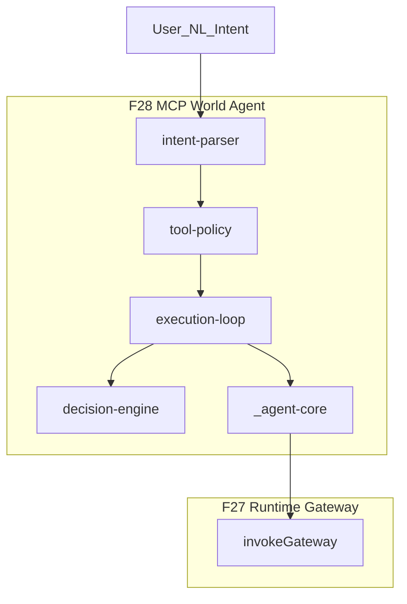

# 28 — MCP World Agent v1 (F28)

> **Principio:** F28 es el **primer consumidor** del stack. Convierte intención en lenguaje natural (determinística, sin LLM) en llamadas a herramientas F26 **exclusivamente vía** F27 `invokeGateway`. No es un sistema — es un decision loop sobre tools.
>
> **Harness:** `cd grafo_emu/prototype/mcp-world-agent && node run-agent-simulation.mjs`  
> **Salida:** [`mcp-world-agent-last-run.json`](prototype/mcp-world-agent/mcp-world-agent-last-run.json)

**Base inmutable:** F19–F27 sin cambios.

---

## §1 — Arquitectura



Superficie pública:

```
User Intent → Agent → Gateway → Tool Contract → World Transaction
```

---

## §2 — Intent parsing

Salida determinista (sin LLM):

```typescript
{ intent_type, target_node, fields?, confidence, transaction_id? }
```

| intent_type | Uso |
|-------------|-----|
| `modify_item` | CASE A — modify + commit loop |
| `modify_npc` | CASE B — blocked blast radius |
| `explain_impact` | CASE D — explain only |
| `rollback` | CASE C — rollback parent txn |
| `commit_transaction` | resume commit when txn known |

NL fijos de simulación en [`intent-parser.mjs`](prototype/mcp-world-agent/intent-parser.mjs).

---

## §3 — Tool policy

`AGENT_DECISION_TOOLS` — exactamente 4:

```
beginTransaction | explainImpact | commitTransaction | rollbackTransaction
```

Roles desde F27 registry: `planner`, `reader`, `operator`, `rollback_operator`.

---

## §4 — Decision engine

Reglas **solo** desde campos `ResponseModel`:

| Condición | Decisión |
|-----------|----------|
| explain-only intent tras explain | `STOP` |
| `validation_verdict === REVIEW` | `STOP` |
| `validation_verdict === BLOCK` + modify intent | `COMMIT` → error F26 normalizado |
| `validation_verdict === APPROVE` | `COMMIT` |
| commit success | `DONE` |
| commit `BLOCKED_BY_BLAST_RADIUS` | `STOP` |
| rollback success | `DONE` ROLLED_BACK |

Sin heurísticas adicionales, sin ML.

---

## §5 — Execution loop

```
1. beginTransaction (skip if explain-only con transaction_id)
2. explainImpact
3. if BLOCK on explain-only → stop
4. if REVIEW → stop
5. if APPROVE or BLOCK+modify → commitTransaction(confirm:true)
6. if commit failure + rollback policy → rollbackTransaction
```

Rollback-only intent (CASE C): una sola llamada `rollbackTransaction`.

---

## §6 — Simulation cases

| Case | NL | Terminal |
|------|-----|----------|
| A | Change item 519 name… | commit success, ROLLBACK_AVAILABLE |
| B | Modify npc 462… | BLOCKED_BY_BLAST_RADIUS |
| C | Rollback item 519 | ROLLED_BACK, parent linked |
| D | Explain impact npc 462 | explain_only, TOPOLOGY_STALE, Phase20+21 |

Evidencia: [`agent-simulation-report.json`](prototype/mcp-world-agent/agent-simulation-report.json).

---

## §7 — Harness TEST 1-8

| Test | Aserción |
|------|----------|
| T1 | Solo `invokeGateway` vía `agentCall` |
| T2 | Tools ⊆ F26 `TOOL_SURFACE`; decision tools ⊆ 4 |
| T3 | CASE A commit success |
| T4 | CASE B BLOCKED_BY_BLAST_RADIUS |
| T5 | CASE C rollback válido |
| T6 | CASE D sin commit; sin F23/F24 directo |
| T7 | Sin imports prohibidos; sin forbidden exposure |
| T8 | Hash determinista estable |

**Última ejecución:** `all_tests_passed: true`, `determinism_hash: 35e5e062c5d9df6e`.

---

## §8 — Non-goals

- Sin MCP server, JSON-RPC, HTTP, LLM/API
- Sin bypass Gateway
- Sin acceso directo F22/F23/F24
- Sin SQL, SSH, Docker, writes, mutación de grafo
- Sin tools nuevas

---

## F28 Readiness

F28 demuestra que un agente (Claude, Cursor, Discord, Web UI) puede consumir el mundo **solo** llamando `agentCall` → `invokeGateway`. Transporte externo (F29+) envuelve el agente sin modificar F28.
